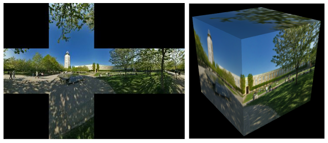

# 5.3 其他功能

**Other Features**

.. tab:: 中文

    我们将以对*three.js*的一些额外功能的审视来结束这一章。在这个过程中，你将了解到一些3D图形的新方面。

.. tab:: 英文

    We will finish this chapter with a look at a few additional features of three.js. In the process, you will learn about some new aspects of 3D graphics.

## 5.3.1 实例化网格

**Instanced Meshes**

.. tab:: 中文

    ***THREE.InstancedMesh*** 类使得能够快速渲染多个对象，可能是大量的对象，这些对象使用相同的几何体，但在应用到它们的变换上有所不同，并且在材质颜色上也可能有所不同。每个对象的副本被称为一个“实例”，创建所有副本的过程称为实例化绘制或实例化。在 WebGL 2.0（以及在 WebGL 1.0 中使用扩展）中，可以使用单个函数调用来绘制所有实例，这非常高效。

    ***InstancedMesh*** 使用起来相当容易。在构造函数中，除了网格的几何体和材质外，还需要指定它支持的最大实例数量：

    ```js
    instances = new THREE.InstancedMesh(geometry, material, count)
    ```

    要为第 *i* 个实例设置变换，可以调用：

    ```js
    instances.setMatrixAt( i, matrix );
    ```

    其中 *matrix* 是类型为 ***THREE.Matrix4*** 的对象，表示建模变换。类似地，可以使用以下方式为第 *i* 个实例设置颜色：

    ```js
    instances.setColorAt( i, color );
    ```

    其中 *color* 是类型为 ***THREE.Color*** 的对象。实例颜色是可选的。如果提供了它们，它们将替换材质的颜色属性。

    ***Matrix4*** 类包括一些方法，可以轻松地创建变换矩阵。构造函数：

    ```js
    matrix = new THREE.Matrix4();
    ```

    创建了一个单位矩阵，然后可以对其进行修改。例如，方法 *matrix.makeTranslation(dx,dy,dz)* 将当前矩阵替换为平移变换矩阵，平移向量为 *(dx,dy,dz)*。有用于制作缩放和旋转矩阵的函数。要制作更复杂的变换，有一个用于矩阵乘法的函数。

    示例程序 [threejs/instanced-mesh.html](../../../en/source/threejs/instanced-mesh.html) 使用单个 ***InstancedMesh*** 创建了 1331 个球体，排列在一个 11x11x11 的立方体中。要将球体移动到位置，对每个实例应用了不同的平移。还为每个实例设置了实例颜色。

    

.. tab:: 英文

    The class ***THREE.InstancedMesh*** makes it possible to quickly render several objects, possibly a large number of objects, that use the same geometry but differ in the transformations that are applied to them and, possibly, in their material color. Each copy of the object is called an "instance," and the process of creating all of the copies is called instanced drawing or instancing. In WebGL 2.0 (and in WebGL 1.0 with an extension), it is possible to draw all of the instances with a single function call, making it very efficient.

    ***InstancedMesh*** is fairly easy to use. Along with the geometry and material for the mesh, the constructor specifies the maximum number of instances that it can support:

    ```js
    instances = new THREE.InstancedMesh(geometry, material, count)
    ```

    To set the transformation for instance number *i*, you can call

    ```js
    instances.setMatrixAt( i, matrix );
    ```

    where *matrix* is an object of type ***THREE.Matrix4*** representing the modeling transformation. Similarly, you can set the color for instance number *i* with

    ```js
    instances.setColorAt( i, color );
    ```

    where *color* is of type ***THREE.Color***. Instance colors are optional. If provided, they replace the color property of material.

    The ***Matrix4*** class includes methods that make it easy to create a transformation matrix. The constructor

    ```js
    matrix = new THREE.Matrix4();
    ```

    creates an identity matrix, which can then be modified. For example, the method *matrix.makeTranslation(dx,dy,dz)* replaces the current matrix with the transformation matrix for a translation by the vector *(dx,dy,dz)*. There are functions for making scaling and rotation matrices. To make more complex transformations, there is a function for multiplying matrices.

    The sample program [threejs/instanced-mesh.html](../../../en/source/threejs/instanced-mesh.html) uses a single ***InstancedMesh*** to make 1331 spheres, arranged in an 11-by-11-by-11 cube. To move the spheres into position, different translations are applied to each instance. An instance color is also set for each instance.

    

## 5.3.2 用户输入

**User Input**

.. tab:: 中文

    大多数实际程序需要某种形式的用户交互。对于Web应用程序，程序当然可以使用HTML小部件（如按钮和文本输入框）获取用户输入。但在许多程序中，直接使用鼠标与3D世界的交互更为自然。

    最基础的例子是使用鼠标旋转场景。在*three.js*中，可以使用***TrackballControls***类或***OrbitControls***类实现旋转。注意，这两个类都支持触摸屏以及鼠标交互。类之间的主要区别在于，使用OrbitControls时，旋转受到限制，使得正y轴始终是视图中的上方。而*TrackballControls*则允许完全自由的旋转。另一个区别是，*TrackballControls*旨在仅与连续动画的场景一起使用。OrbitControls用于大多数示例程序和演示中的旋转。*TrackballControls*仅在[threejs/full-window.html](../../../en/source/threejs/full-window.html)和[threejs/curves-and-surfaces.html](../../../en/source/threejs/curves-and-surfaces.html)中使用。

    这两个控制类不是主要*three.js* JavaScript文件的一部分。它们可以从模块"OrbitControls.js"和"TrackballControls.js"导入，这些模块可以在教科书源文件夹的[threejs/script/controls](https://math.hws.edu/graphicsbook/source/threejs/script/controls)文件夹中找到，或在*three.js*下载包的examples/jsm/loaders文件夹中找到。

    这两个类以类似的方式使用。我将首先讨论***OrbitControls***。在我的示例中，我创建了一个相机并将其从原点移开。我通常向相机对象添加一个灯光对象，以便灯光随着相机移动，为相机可见的任何对象提供一些照明。***OrbitControls***对象用于围绕场景旋转相机。控制对象的构造函数有两个参数，相机和渲染场景的画布。这是一个典型的设置：

    ```js
    camera = new THREE.PerspectiveCamera(45, canvas.width/canvas.height, 0.1, 100);
    camera.position.set(0,15,35);
    camera.lookAt( new THREE.Vector3(0,0,0) ); // 相机朝向原点

    let light = new THREE.PointLight(0xffffff, 0.6);
    camera.add(light);  // 视点灯光随相机移动
    scene.add(camera);

    controls = new OrbitControls( camera, canvas );
    ```

    构造函数在*canvas*上安装了侦听器，以便控件可以响应鼠标事件。如果正在运行动画，你需要做的其他事情就是在渲染场景之前调用：

    ```js
    controls.update();
    ```

    用户将能够通过使用左键点击并拖动来旋转场景。控件还可以通过使用右键点击并拖动来“平移”（在屏幕平面上拖动场景）和使用中键或滚轮来“缩放”（向前和向后移动相机）。要禁用缩放和平移，可以设置：

    ```js
    controls.enablePan = false;
    controls.enableZoom = false;
    ```

    你可以通过调用*controls.reset()*来恢复场景的原始视图。

    如果你的程序没有运行连续的动画，你需要一种方法来响应用户操作重新渲染场景。当用户拖动鼠标时，*controls*对象会生成一个“change”事件。你可以为该事件添加一个侦听器，通过重绘场景来响应事件。要做到这一点，只需调用：

    ```js
    controls.addEventListener( "change", callback );
    ```

    其中*callback()*是在事件发生时应该调用的函数。如果你有一个函数*render()*来渲染你的场景，你可以简单地将render作为callback的值传递。

    遗憾的是，***TrackballControls***对象不发出“change”事件，似乎没有办法在没有运行动画的情况下使用它。有了动画，*TrackballControls*的使用方法与*OrbitControls*相同，只是平移和缩放的属性是*controls.noPan*和*controls.noZoom*；应该将它们设置为*true*以禁用平移和缩放。***TrackballControls***的一个不错的特性是它们实现了惯性：当用户在拖动后释放鼠标时，场景的运动会逐渐停止，而不是突然停止。

    ---

    一种更有趣的鼠标交互形式是让用户通过点击场景中的对象来选择它们。问题在于确定用户点击了哪个对象。一般程序如下：从相机通过用户在屏幕上点击的点发出一条射线，并找到场景中第一条被该射线相交的对象。那就是在用户点击点可见的对象。不幸的是，这个过程涉及大量计算。幸运的是，*three.js*有一个类可以为你完成这项工作：***THREE.Raycaster***。

    ***Raycaster***可以用来找到射线与场景中对象的交点。（射线只是一条线的一半，从某个给定的起始点向给定方向无限延伸。）你可以创建一个射线投射器对象在整个程序中使用：

    ```js
    raycaster = new THREE.Raycaster();
    ```

    要告诉它使用哪个射线，可以调用

    ```js
    raycaster.set( startingPoint, direction );
    ```

    其中两个参数都是***THREE.Vector3***类型。它们的值以世界坐标为准，这是你用于整个场景的坐标系统。*direction*必须是规范化的向量，长度等于一。例如，假设你想要发射激光枪....*startingPoint*是枪的位置，*direction*是枪指向的方向。使用这些参数配置射线投射器，你可以用它来找出哪个对象被激光束击中。

    或者，更方便地处理用户输入，你可以基于相机和屏幕上的点表达射线：

    ```js
    raycaster.setFromCamera( screenCoords, camera );
    ```

    *screenCoords*以***THREE.Vector2***的形式给出，以裁剪坐标表示。这意味着水平坐标从视口左侧的-1到右侧的1，垂直坐标从底部的-1到顶部的1。（在*three.js*中，裁剪坐标称为“规范化设备坐标”。）所以，我们需要将画布上的像素坐标转换为裁剪坐标。这里有一种方法可以做到这一点，给定一个鼠标事件，*evt*：

    ```js
    let r = canvas.getBoundingClientRect();
    let x = evt.clientX - r.left; // 将鼠标位置转换为画布像素坐标
    let y = evt.clientY - r.top;

    let a = 2*x/canvas.width - 1; // 将画布像素坐标转换为裁剪坐标
    let b = 1 - 2*y/canvas.height;

    raycaster.setFromCamera( new THREE.Vector2(a,b), camera );
    ```

    一旦你告诉了射线投射器使用哪个射线，它就准备好找到射线与场景中对象的交点了。这可以通过函数完成：

    ```js
    raycaster.intersectObjects( objectArray, recursive );
    ```

    第一个参数是一个***Object3D***数组。射线投射器将在数组中搜索其当前射线与对象的交点。如果第二个参数是*true*，它还将搜索场景图中那些对象的后代；如果是false或省略，则只搜索数组中的对象。例如，要搜索与场景中所有对象的交点，请使用：

    ```js
    raycaster.intersectObjects( scene.children, true );
    ```

    *intersectObjects*的返回值是一个JavaScript对象数组。数组中的每个项目代表射线与***Object3D***的交点。该函数找到所有这样的交点，而不仅仅是第一个。如果没有找到交点，数组为空。数组按从射线起始点起的距离递增排序。如果你只想要第一个交点，使用数组的第一个元素。

    数组中的每个元素都是一个对象，其属性包含有关交点的信息。假设项目是数组元素之一。那么最有用属性是：item.object，被射线相交的***Object3D***；和item.point，交点，以世界坐标中的***Vector3***给出。这些信息足以实现一些有趣的用户交互。

    下面的演示使用一些基本的鼠标交互，让用户编辑场景。场景显示了一些细口黄色圆柱体站在绿色基座上。用户可以拖动圆柱体，添加和删除圆柱体，以及旋转场景。一组单选按钮让用户选择鼠标执行的操作。

    <iframe src="../../../en/demos/c5/raycaster-input.html" width="620" height="430"></iframe>

    让我们看看这些操作是如何实现的。程序中唯一的对象是基座和圆柱体。在程序中，基座被称为*ground*，所有对象都是一个名为*world*的***Object3D***的子对象。（我使用world对象，可以轻松地旋转所有可见对象的集合，而不需要移动相机或灯光。）对于所有拖动、添加和删除操作，我寻找这些对象与从相机通过鼠标位置的射线的交点：

    ```js
    raycaster.setFromCamera( new THREE.Vector2(a,b), camera );
    let intersects = raycaster.intersectObjects( world.children );
    ```

    如果*intersects.length*为零，则没有交点，没有什么可做的。否则，我查看*intersects[0]*，它表示与鼠标位置可见的对象的交点。所以，*intersects[0].object*是用户点击的对象，*intersects[0].point*是交点。

    删除操作最容易实现：当用户点击一个圆柱体时，圆柱体应该从场景中删除。如果第一个交点是与*ground*，那么什么都不删除。否则，被点击的对象是一个圆柱体，应该被删除：

    ```js
    if ( intersects[0].object != ground ) {
        world.remove( intersects[0].object );
        render();
    }
    ```

    对于添加操作，我们只有在用户点击地面时才应该添加一个圆柱体。在这种情况下，交点告诉了我们应该在哪里添加圆柱体。这里有一个有趣的问题是，我们以世界坐标的形式获得了交点，但为了将圆柱体作为*world*的子对象添加，我需要知道交点在*world*的局部坐标系中的位置。如果world已经旋转了，那么这两个坐标系将会不同。幸运的是，每个***Object3D***都有一个*worldToLocal(v)*方法，可以用来将***Vector3*** v从世界坐标转换为该对象的局部坐标。这个方法不会返回一个值；它修改向量v的坐标。（还有一个*localToWorld*方法。）所以，添加操作可以这样实现：

    ```js
    item = intersects[0];
    if (item.object == ground) {
        let locationX = item.point.x;  // 交点的世界坐标
        let locationZ = item.point.z;
        let coords = new THREE.Vector3(locationX, 0, locationZ); // y总是0
        world.worldToLocal(coords); // 转换为局部坐标
        addCylinder(coords.x, coords.z); // 在校正后的位置添加圆柱体
        render();
    }
    ```

    对于拖动操作，我们可以使用与删除相同的测试来确定哪个圆柱体被点击。然而，随着用户拖动鼠标移动圆柱体的问题引发了一个新问题：我们怎么知道在鼠标移动时要将圆柱体放在哪里？我们不知何故必须将新鼠标位置转换为圆柱体的新位置。为此，我们可以再次使用射线投射器。我最初的想法是从相机通过新鼠标位置创建一条射线，使用该射线找到它与地面的交点，然后将圆柱体移动到那个交点。不幸的是，这会把圆柱体的**底部**放在鼠标位置，当我一开始移动鼠标时，圆柱体就会跳到错误的位置。我意识到我不想追踪与地面的交点；我需要追踪与原始交点高度相同的平面的交点。为了实现这一点，我在拖动期间添加了一个那个高度的不可见平面，并使用与该平面的交点代替与地面的交点。（你可以在*three.js*中拥有不可见的对象——只需将材质的*visible*属性设置为*false*。）

.. tab:: 英文

    Most real programs require some kind of user interaction. For a web application, of course, the program can get user input using HTML widgets such as buttons and text input boxes. But direct mouse interaction with a 3D world is more natural in many programs.

    The most basic example is using the mouse to rotate the scene. In *three.js*, rotation can be implemented using the class ***TrackballControls*** or the class ***OrbitControls***. Note that both classes support touchscreen as well as mouse interaction. The main difference between the classes is that with OrbitControls, the rotation is constrained so that the positive y-axis is always the up direction in the view. *TrackballControls*, on the other hand, allows completely free rotation. Another difference is that *TrackballControls* is meant to be used only with a scene that is continuously animated. OrbitControls is used for rotation in most of my sample programs and demos. *TrackballControls* is used only in [threejs/full-window.html](../../../en/source/threejs/full-window.html) and [threejs/curves-and-surfaces.html](../../../en/source/threejs/curves-and-surfaces.html).

    The two control classes are not part of the main *three.js* JavaScript file. They can be imported from the modules "OrbitControls.js" and "TrackballControls.js", which can be found in the [threejs/script/controls](https://math.hws.edu/graphicsbook/source/threejs/script/controls) folder in the source folder for this textbook, or in the examples/jsm/loaders folder in the *three.js* download.

    The two classes are used in a similar way. I will discuss ***OrbitControls*** first. In my examples, I create a camera and move it away from the origin. I usually add a light object to the camera object, so that the light will move along with the camera, providing some illumination to anything that is visible to the camera. The ***OrbitControls*** object is used to rotate the camera around the scene. The constructor for the control object has two parameters, the camera and the canvas on which the scene is rendered. Here is typical setup:

    ```js
    camera = new THREE.PerspectiveCamera(45, canvas.width/canvas.height, 0.1, 100);
    camera.position.set(0,15,35);
    camera.lookAt( new THREE.Vector3(0,0,0) ); // camera looks toward origin

    let light = new THREE.PointLight(0xffffff, 0.6);
    camera.add(light);  // viewpoint light moves with camera
    scene.add(camera);

    controls = new OrbitControls( camera, canvas );
    ```

    The constructor installs listeners on the *canvas* so that the controls can respond to mouse events. If an animation is running, the only other thing that you need to do is call

    ```js
    controls.update();
    ```

    before rendering the scene. The user will be able to rotate the scene by dragging on it with the left mouse button. The controls will also do "panning" (dragging the scene in the plane of the screen) with the right mouse button and "zooming" (moving the camera forward and backward) with the middle mouse button or scroll wheel. To disable zooming and panning, you can set

    ```js
    controls.enablePan = false;
    controls.enableZoom = false;
    ```

    And you can return the original view of the scene by calling *controls.reset()*.

    If your program is not running a continuous animation, you need a way to re-render the scene in response to user actions. When the user drags the mouse, the *controls* object generates a "change" event. You can add a listener for that event, to respond to the event by redrawing the scene. To do that, just call

    ```js
    controls.addEventListener( "change", callback );
    ```

    Where *callback()* is the function that should be called when the event occurs. If you have a function *render()* that renders your scene, you can simply pass render as the value of callback.

    Unfortunately, a ***TrackballControls*** object does not emit "change" events, and there does not seem to be any way to use it without having an animation running. With an animation, *TrackballControls* are used in the same way as *OrbitControls*, except that the properties for panning and zooming are *controls.noPan* and *controls.noZoom*; they should be set to *true* to disable panning and zooming. One nice feature of ***TrackballControls*** is that they implement inertia: When the user releases the mouse after dragging, the motion of the scene will slow to a stop instead of stopping abruptly.

    ----

    A much more interesting form of mouse interaction is to let the user select objects in the scene by clicking on them. The problem is to determine which object the user is clicking. The general procedure is something like this: Follow a ray from the camera through the point on the screen where the user clicked and find the first object in the scene that is intersected by that ray. That's the object that is visible at the point where the user clicked. Unfortunately, the procedure involves a lot of calculations. Fortunately, *three.js* has a class that can do the work for you: ***THREE.Raycaster***.

    A ***Raycaster*** can be used to find intersections of a ray with objects in a scene. (A ray is just half of a line, stretching from some given starting point in a given direction towards infinity.) You can make one raycaster object to use throughout your program:

    ```js
    raycaster = new THREE.Raycaster();
    ```

    To tell it which ray to use, you can call

    ```js
    raycaster.set( startingPoint, direction );
    ```

    where both of the parameters are of type ***THREE.Vector3***. Their values are in terms of world coordinates, the same coordinate system that you use for the scene as a whole. The *direction* must be a normalized vector, with length equal to one. For example, suppose that you want to fire a laser gun.... The *startingPoint* is the location of the gun, and the *direction* is the direction that the gun is pointing. Configure the raycaster with those parameters, and you can use it to find out what object is struck by the laser beam.

    Alternatively, and more conveniently for processing user input, you can express the ray in terms of the camera and a point on the screen:

    ```js
    raycaster.setFromCamera( screenCoords, camera );
    ```

    The *screenCoords* are given as a ***THREE.Vector2*** expressed in clip coordinates. This means the horizontal coordinate ranges from −1 on the left edge of the viewport to 1 on the right, and the vertical coordinate ranges from −1 at the bottom to 1 on the top. (Clip coordinates are called "normalized device coordinates" in *three.js*.) So, we need to convert from pixel coordinates on a canvas to clip coordinates. Here's one way to do it, given a mouse event, *evt*:

    ```js
    let r = canvas.getBoundingClientRect();
    let x = evt.clientX - r.left; // convert mouse location to canvas pixel coords
    let y = evt.clientY - r.top;

    let a = 2*x/canvas.width - 1; // convert canvas pixel coords to clip coords
    let b = 1 - 2*y/canvas.height;

    raycaster.setFromCamera( new THREE.Vector2(a,b), camera );
    ```

    Once you have told the raycaster which ray to use, it is ready to find intersections of that ray with objects in the scene. This can be done with the function

    ```js
    raycaster.intersectObjects( objectArray, recursive );
    ```

    The first parameter is an array of ***Object3D***. The raycaster will search for intersections of its current ray with objects in the array. If the second parameter is *true*, it will also search descendants of those objects in the scene graph; if it is false or is omitted, then only the objects in the array will be searched. For example, to search for intersections with all objects in the scene, use

    ```js
    raycaster.intersectObjects( scene.children, true );
    ```

    The return value from *intersectObjects* is an array of JavaScript objects. Each item in the array represents an intersection of the ray with an ***Object3D***. The function finds all such intersections, not just the first. If no intersection is found, the array is empty. The array is sorted by increasing distance from the starting point of the ray. If you just want the first intersection, use the first element of the array.

    Each element in the array is an object whose properties contain information about the intersection. Suppose that item is one of the array elements. Then the most useful properties are: item.object, which is the ***Object3D*** that was intersected by the ray; and item.point, which is the point of intersection, given as a ***Vector3*** in world coordinates. That information is enough to implement some interesting user interaction.

    The following demo uses some basic mouse interaction to let the user edit a scene. The scene shows a number of tapered yellow cylinders standing on a green base. The user can drag the cylinders, add and delete cylinders, and rotate the scene. A set of radio buttons lets the user select which action should be performed by the mouse.

    <iframe src="../../../en/demos/c5/raycaster-input.html" width="620" height="430"></iframe>

    Let's look at how the actions are implemented. The only objects are the base and the cylinders. In the program, the base is referred to as *ground*, and all the objects are children of an ***Object3D*** named *world*. (I use the world object to make it easy to rotate the set of all visible objects without moving the camera or lights.) For all drag, add, and delete actions, I look for intersections of these objects with a ray that extends from the camera through the mouse position:

    ```js
    raycaster.setFromCamera( new THREE.Vector2(a,b), camera );
    let intersects = raycaster.intersectObjects( world.children );
    ```

    If *intersects.length* is zero, there are no intersections, and there is nothing to do. Otherwise, I look at *intersects[0]*, which represents an intersection with the object that is visible at the mouse position. So, *intersects[0].object* is the object that the user clicked, and *intersects[0].point* is the point of intersection.

    The Delete action is the simplest to implement: When the user clicks a cylinder, the cylinder should be removed from the scene. If the first intersection is with the *ground*, then nothing is deleted. Otherwise, the clicked object was a cylinder and should be deleted:

    ```js
    if ( intersects[0].object != ground ) {
        world.remove( intersects[0].object );
        render();
    }
    ```

    For an Add action, we should add a cylinder only if the user clicked the ground. In that case, the point of intersection tells where the cylinder should be added. An interesting issue here is that we get the point of intersection in world coordinates, but in order to add the cylinder as a child of *world*, I need to know the point of intersection in the local coordinate system for *world*. The two coordinate systems will be different if the world has been rotated. Fortunately, every ***Object3D*** has a method *worldToLocal(v)* that can be used to transform a ***Vector3***, v, from world coordinates to local coordinates for that object. This method does not return a value; it modifies the coordinates of the vector v. (There is also a *localToWorld* method.) So, the Add action can be implemented like this:

    ```js
    item = intersects[0];
    if (item.object == ground) {
        let locationX = item.point.x;  // world coords of intersection point
        let locationZ = item.point.z;
        let coords = new THREE.Vector3(locationX, 0, locationZ); // y is always 0
        world.worldToLocal(coords); // transform to local coords
        addCylinder(coords.x, coords.z); // adds a cylinder at corrected location
        render();
    }
    ```

    For a Drag action, we can determine which cylinder was clicked using the same test as for delete. However, the problem of moving the cylinder as the user drags the mouse raises a new issue: how do we know where to put the cylinder when the mouse moves? We somehow have to transform a new mouse position into a new position for the cylinder. For that, we can use the raycaster again. My first thought was to create a ray from the camera through the new mouse position, use that ray to find its intersection with the ground, and then to move the cylinder to that point of intersection. Unfortunately, this puts the **base** of the cylinder at the mouse position, and it made the cylinder jump to the wrong position as soon as I started moving the mouse. I realized that I didn't want to track the intersection with the ground; I needed to track the intersection with a plane that lies at the same height as the original point of intersection. To implement this, I add an invisible plane at that height just during dragging, and I use intersections with that plane instead of intersections with the ground. (You can have invisible objects in *three.js*—just set the *visible* property of the material to *false*.)

## 5.3.3 阴影

**Shadows**

.. tab:: 中文

    在我们的3D图像中，有一件事情一直没有出现，那就是阴影。即使你没有意识到缺少了阴影，它也会让许多图像看起来不对劲。阴影可以为场景增添一丝逼真感，但OpenGL，包括WebGL，不能自动生成阴影。有一些计算阴影的方法可以在OpenGL中实现，但它们使用起来很棘手，并且在物理上也不完全真实。一种称为**阴影映射**的方法在*three.js*中得到了实现。在*three.js*中的阴影映射使用起来当然不是微不足道的，但它比从头开始尝试做同样的事情要容易。

    这里有一个演示，展示了使用阴影映射的*three.js*场景。投射阴影的灯光可以被动画化，所以你可以看到随着灯光移动阴影的变化。

    <iframe src="../../../en/demos/c5/shadows.html" width="560" height="520"></iframe>

    阴影映射的基本思想相当直接：要确定场景中哪些部分处于阴影中，你必须从光源的角度来看待场景。从光源的视角可以看到的东西会被该光源照亮。从光源看不到的东西则处于阴影中。（这是忽略了透明度和间接反射光的可能性，阴影映射无法处理。）为了实现这个想法，在光源处放置一个相机并拍照。实际上，你不需要照片本身。你需要的是深度缓冲区。在渲染完照片后，存储在深度缓冲区中某个像素的值本质上是从光源到那个点从光源可见的物体的距离。那个物体被光源照亮。如果一个物体的深度大于存储在深度缓冲区中的值，那么那个物体就在阴影中。深度缓冲区就是阴影映射。现在，回到相机的视角，并考虑在从相机的视角渲染某个物体上的一个点时，那个点是否在阴影中？你只需要将那个点从相机的视图坐标变换到光源的视图坐标，并检查变换点的深度。如果这个深度大于阴影映射中的相应值，那么那个点就在阴影中。请注意，如果有多个光源，每个光源都会投射自己的阴影，你需要为每个光源准备一个阴影映射。

    计算阴影映射并应用它们在计算上是昂贵的，阴影在*three.js*中默认是禁用的。要获得阴影，你需要做几件事情。你需要通过以下方式在WebGL渲染器中启用阴影计算：

    ```js
    renderer.shadowMap.enabled = true;
    ```

    只有***DirectionalLights***和***SpotLights***才能投射阴影。即使在渲染器中启用了阴影，要从一个光源获得阴影，你也必须将光源的*castShadow*属性设置为true：

    ```js
    light.castShadow = true;  // 这个光源将投射阴影。
    ```

    此外，必须为每个将要投射或接收阴影的对象启用阴影。“接收”阴影意味着阴影将显示在该对象上。投射和接收是为对象单独启用的。

    ```js
    object.castShadow = true;     // 这个对象将投射阴影。
    object.receiveShadow = true;  // 阴影将显示在这个对象上。
    ```

    即使这样做了，也可能没有任何阴影显示出来，如果显示出来，它们可能看起来也很糟糕。问题是你通常需要配置用于制作阴影映射的相机。

    每个***DirectionalLight***或***SpotLight**都有自己的阴影相机，用于从该光源的视角创建阴影映射。（***DirectionalLight***有一个名为shadow的属性，类型为***THREE.DirectionalLightShadow***，它又有一个名为camera的属性，类型为***THREE.OrthographicCamera***，保存阴影相机。所以，定向光dl的阴影相机是dl.shadow.camera。）定向光的阴影相机使用正交投影。正交投影由视体积限制*xmin*, *xmax*, *ymin*, *ymax*, *near*, 和 *far*配置（见[3.3.3小节](../c3/s3.md#333-投影变换)）。对于定向光dl，这些限制对应于属性dl.shadow.camera.left, dl.shadow.camera.right, dl.shadow.camera.bottom, dl.shadow.camera.top, dl.shadow.camera.near, 和 dl.shadow.camera.far。这些值在阴影相机的视图中；即，它们相对于dl.position。重要的是确保你场景中的所有对象，或者至少那些投射阴影的对象，都在阴影相机的视体积内。此外，你不希望限制太大：如果场景只占据了相机视体积的一小部分，那么只有一小部分阴影映射包含有用信息——然后由于关于阴影的信息如此之少，你的阴影就不会非常准确。默认值假设了一个非常大的场景。对于一个相对较小的场景，你可能会设置：

    ```js
    dl.shadow.camera.left = -20;
    dl.shadow.camera.right = 20;
    dl.shadow.camera.bottom = -20;
    dl.shadow.camera.top = 20;
    dl.shadow.camera.near = 1;
    dl.shadow.camera.far = 30;
    ```

    聚光灯的阴影相机类型为***THREE.PerspectiveCamera***，使用透视投影。（使用视场有限的相机是你可以有聚光灯的阴影，但没有点光源的阴影的原因。）对于聚光灯sl，阴影相机由属性sl.shadow.camera.near, sl.shadow.camera.far, 和 sl.shadow.camera.fov（其中"fov"是垂直视场角度，以度而不是弧度给出）配置。fov的默认值可能没问题，只是如果你改变了聚光灯的截止角度，你将想要改变fov以匹配。但你应该确保为近和远设置适当的值，以包含你的场景和尽可能少的额外部分。同样，近和远是从sl.position的距离。

    要获得更准确的阴影，你可能想要增加阴影映射的大小。阴影映射是一种纹理图像，默认情况下是512x512像素。你可以通过使用更大的阴影映射来提高阴影的精度。对于一个光源，*light*，设置属性light.shadow.mapSize.width和light.shadow.mapSize.height的值。例如，

    ```js
    light.shadow.mapSize.width = 1024;
    light.shadow.mapSize.height = 1024;
    ```

    我不确定这里是否绝对需要幂次方值，但它们通常用于纹理。

.. tab:: 英文

    One thing that has been missing in our 3D images is shadows. Even if you didn't notice the lack consciously, it made many of the images look wrong. Shadows can add a nice touch of realism to a scene, but OpenGL, including WebGL, cannot generate shadows automatically. There are ways to compute shadows that can be implemented in OpenGL, but they are tricky to use and they are not completely realistic physically. One method, which is called **shadow mapping**, is implemented in *three.js*. Shadow mapping in *three.js* is certainly not trivial to use, but it is easier than trying to do the same thing from scratch.

    Here is a demo that shows a *three.js* scene that uses shadow mapping. The lights that cast the shadows can be animated, so you can watch the shadows change as the lights move.

    <iframe src="../../../en/demos/c5/shadows.html" width="560" height="520"></iframe>

    The basic idea of shadow mapping is fairly straightforward: To tell what parts of a scene are in shadow, you have to look at the scene from the point of view of the light source. Things that are visible from the point of view of the light are illuminated by that light. Things that are not visible from the light are in shadow. (This is ignoring the possibility of transparency and indirect, reflected light, which cannot be handled by shadow mapping.) To implement this idea, place a camera at the light source and take a picture. In fact, you don't need the picture itself. What you need is the depth buffer. After the picture has been rendered, the value stored in the depth buffer for a given pixel contains, essentially, the distance from the light to the object that is visible from the light at that point. That object is illuminated by the light. If an object is at greater depth than the value stored in the depth buffer, then that object is in shadow. The depth buffer is the shadow map. Now, go back to the point of view of the camera, and consider a point on some object as it is rendered from the camera's point of view. Is that point in shadow or not? You just have to transform that point from the camera's viewing coordinates to the light's viewing coordinates and check the depth of the transformed point. If that depth is greater than the corresponding value in the shadow map, then the point is in shadow. Note that if there are several lights, each light casts its own shadows, and you need a shadow map for each light.

    It is computationally expensive to compute shadow maps and to apply them, and shadows are disabled by default in *three.js*. To get shadows, you need to do several things. You need to enable shadow computations in the WebGL renderer by saying

    ```js
    renderer.shadowMap.enabled = true;
    ```

    Only ***DirectionalLights*** and ***SpotLights*** can cast shadows. To get shadows from a light, even after enabling shadows in the renderer, you have to set the light's *castShadow* property to true:

    ```js
    light.castShadow = true;  // This light will cast shadows.
    ```

    Furthermore, shadows have to be enabled for each object that will cast or receive shadows. "Receiving" a shadow means that shadows will be visible on that object. Casting and receiving are enabled separately for an object.

    ```js
    object.castShadow = true;     // This object will cast shadows.
    object.receiveShadow = true;  // Shadows will show up on this object.
    ```

    Even this might not make any shadows show up, and if they do they might look pretty bad. The problem is that you usually have to configure the cameras that are used to make the shadow maps.

    Each ***DirectionalLight*** or ***SpotLight*** has its own shadow camera, which is used to create the shadow map from the point of view of that light. (A ***DirectionalLight*** has a property named shadow of type ***THREE.DirectionalLightShadow***, which in turn has a property named *camera* of type ***THREE.OrthographicCamera*** that holds the shadow camera. So, the shadow camera for a directional light *dl* is *dl.shadow.camera*.) The shadow camera for a directional light uses an orthographic projection. An orthographic projection is configured by view volume limits *xmin*, *xmax*, *ymin*, *ymax*, *near*, and *far* (see [Subsection 3.3.3](../c3/s3.md#333-投影变换)). For a directional light, *dl*, these limits correspond to the properties *dl.shadow.camera.left*, *dl.shadow.camera.right*, *dl.shadow.camera.bottom*, *dl.shadow.camera.top*, *dl.shadow.camera.near*, and *dl.shadow.camera.far*. These values are in view coordinates for the shadow camera; that is, they are relative to *dl.position*. It is important to make sure that all the objects in your scene, or at least those that cast shadows, are within the view volume of the shadow camera. Furthermore, you don't want the limits to be too big: If the scene occupies only a small part of the camera's view volume, then only a small part of the shadow map contains useful information—and then since there is so little information about shadows, your shadows won't be very accurate. The default values assume a very large scene. For a relatively small scene, you might set:

    ```js
    dl.shadow.camera.left = -20;
    dl.shadow.camera.right = 20;
    dl.shadow.camera.bottom = -20;
    dl.shadow.camera.top = 20;
    dl.shadow.camera.near = 1;
    dl.shadow.camera.far = 30;
    ```

    The shadow camera for a spotlight is of type ***THREE.PerspectiveCamera*** and uses a perspective projection. (The use of a camera with a limited view is why you can have shadows from spotlights but not from point lights.) For a spotlight sl, the shadow camera is configured by the properties *sl.shadow.camera.near*, *sl.shadow.camera.far*, and *sl.shadow.camera.fov* (where "fov" is the vertical field of view angle, given in degrees rather than radians). The default value for fov is probably OK, except that if you change the spotlight's cutoff angle, you will want to change the *fov* to match. But you should be sure to set appropriate values for near and far, to include all of your scene and as little extra as is practical. Again, *near* and *far* are distances from *sl.position*.

    To get more accurate shadows, you might want to increase the size of the shadow map. The shadow map is a kind of texture image which by default is 512 by 512 pixels. You can increase the accuracy of the shadows by using a larger shadow map. To do that for a light, *light*, set the values of the properties *light.shadow.mapSize.width* and *light.shadow.mapSize.height*. For example,

    ```js
    light.shadow.mapSize.width = 1024;
    light.shadow.mapSize.height = 1024;
    ```

    I'm not sure whether power-of-two values are absolutely required here, but they are commonly used for textures.

## 5.3.4 立方体贴图纹理和天空盒

**Cubemap Textures and Skyboxes**

.. tab:: 中文

    我们已经创建并查看了简单的场景，它们显示在纯色背景上。如果我们能把场景放在一个“环境”中，比如建筑物内部、自然风光或公共广场，那就太好了。用几何基元构建这样复杂的环境的表示是不切实际的，但我们可以使用纹理获得相当好的效果。在*three.js*中使用的技术被称为**skybox**。Skybox是一个大立方体——实际上是无限大——立方体的每个面都应用了不同的纹理。这些纹理是某些环境的图像。对于立方体内部的观察者来说，立方体上的六张纹理图像拼合在一起，提供了每个方向上环境的完整视图。这六张纹理图像一起构成了所谓的**cubemap texture**。这些图像必须沿着立方体的边缘匹配，形成一个无缝的环境视图。

    可以通过在六个方向：左、右、上、下、前、后拍摄环境的六张照片来制作实际物理环境的立方图。（更现实的做法是拍摄足够多的照片来覆盖所有方向，有重叠，然后使用软件将图像“拼接”成一个完整的立方图。）这六个方向按与坐标轴的关系称为：正x、负x、正y、负y、正z和负z，当你指定立方图时，图像必须按顺序列出。这里有一个例子。第一张图片显示了并排放置的六张立方图图像。正y图像在顶部，负y图像在底部。中间是负x、正z、正x和负z图像排成一行。第二张图片显示了用于对立方体进行纹理处理的图像，从外部查看。你可以看到图像如何沿着立方体的边缘匹配：

    

    （这张立方图和本节中使用的其他立方图是由Emil Persson制作的，他在<http://www.humus.name/index.php?page=Textures> 提供了大量的立方图下载，遵循创意共享许可。）

    对于skybox，从概念上讲，将使用一个非常大的立方体。相机、灯光和任何要成为场景一部分的对象都在立方体内。可以手工构建一个skybox。

    然而，*Three.js*非常容易地使用skybox作为场景的背景。它有类***THREE.CubeTexture***来表示立方图，你可以通过将***CubeTexture***赋值为属性*scene.background*的值来简单地将你的scene封装在一个skybox中。（该属性的值也可以是普通的***Texture***或***Color***。）

    ***CubeTexture***可以通过***CubeTextureLoader***创建，它可以加载构成立方图的六张图像。加载器有一个名为*load()*的方法，它的工作方式与***TextureLoader***的*load()*方法相同（见[5.2.3小节](../c5/s2.md#523-纹理)），除了该方法的第一个参数是一个包含六张立方图图像URL的字符串数组。例如：

    ```js
    let textureURLs = [  // 立方图六个面的URL
            "cubemap-textures/park/posx.jpg",   // 注意：图像列出的顺序
            "cubemap-textures/park/negx.jpg",   // 很重要！
            "cubemap-textures/park/posy.jpg",
            "cubemap-textures/park/negy.jpg",
            "cubemap-textures/park/posz.jpg",
            "cubemap-textures/park/negz.jpg"
    ];
    loader = new THREE.CubeTextureLoader();
    cubeTexture = loader.load( textureURLs, onLoad, undefined, onError );
    ```

    这里，*onLoad*是一个在纹理加载完成后将被调用的函数。该函数可以，例如，将*scene.background*设置为*cubeTexture*，并使用新的背景重新渲染场景。最后一个参数onError是一个函数，如果无法加载纹理，将调用该函数。只有一个参数是必需的。

    示例程序[threejs/skybox.html](../../../en/source/threejs/skybox.html)显示了两个WebGL场景。第一个场景显示了一个立方体，立方图的六张图像作为普通纹理应用到立方体的六个面上。第二个场景使用相同的立方图作为skybox。如果你旋转第二个场景的视图，你可以查看skybox的所有部分，并看到它如何形成一个无缝的环境，完全包围了场景。

.. tab:: 英文

    We have created and viewed simple scenes, shown on a solid-colored background. It would be nice to put our scenes in an "environment" such as the interior of a building, a nature scene, or a public square. It's not practical to build representations of such complex environments out of geometric primitives, but we can get a reasonably good effect using textures. The technique that is used in *three.js* is called a **skybox**. A skybox is a large cube — effectively, infinitely large — where a different texture is applied to each face of the cube. The textures are images of some environment. For a viewer inside the cube, the six texture images on the cube fit together to provide a complete view of the environment in every direction. The six texture images together make up what is called a **cubemap texture**. The images must match up along the edges of the cube to form a seamless view of the environment.

    A cube map of an actual physical environment can be made by taking six pictures of the environment in six directions: left, right, up, down, forward, and back. (More realistically, it is made by taking enough photographs to cover all directions, with overlaps, and then using software to "stitch" the images together into a complete cube map.) The six directions are referred to by their relation to the coordinate axes as: positive x, negative x, positive y, negative y, positive z, and negative z, and the images must be listed in that order when you specify the cube map. Here is an example. The first picture shows the six images of a cube map laid out next to each other. The positive y image is at the top, the negative y image is at the bottom. In between are the negative x, positive z, positive x, and negative z images laid out in a row. The second picture shows the images used to texture a cube, viewed here from the outside. You can see how the images match up along the edges of the cube:

    

    (This cube map, and others used in this section, are by Emil Persson, who has made a large number of cube maps available for download at <http://www.humus.name/index.php?page=Textures> under a creative commons license.)

    For a skybox, conceptually, a very large cube would be used. The camera, lights, and any objects that are to be part of the scene would be inside the cube. It is possible to construct a skybox by hand in just this way.

    However, *Three.js* makes it very easy to use a skybox as the background for a scene. It has the class ***THREE.CubeTexture*** to represent cube maps, and you can enclose your scene in a skybox simply by assigning a ***CubeTexture*** as the value of the property *scene.background*. (The value of that property could also be a normal ***Texture*** or a ***Color***.)

    A ***CubeTexture*** can be created by a ***CubeTextureLoader***, which can load the six images that make up the cube map. The loader has a method named *load()* that works in the same way as the *load()* method of a ***TextureLoader*** ([Subsection 5.2.3](../c5/s2.md#523-纹理)), except that the first parameter to the method is an array of six strings giving the URLs of the six images for the cube map. For example:

    ```js
    let textureURLs = [  // URLs of the six faces of the cube map
            "cubemap-textures/park/posx.jpg",   // Note:  The order in which
            "cubemap-textures/park/negx.jpg",   //   the images are listed is
            "cubemap-textures/park/posy.jpg",   //   important!
            "cubemap-textures/park/negy.jpg",  
            "cubemap-textures/park/posz.jpg",
            "cubemap-textures/park/negz.jpg"
    ];
    loader = new THREE.CubeTextureLoader();
    cubeTexture = loader.load( textureURLs, onLoad, undefined, onError );
    ```

    Here, *onLoad* is a function that will be called after the texture has finished loading. The function could, for example, set *scene.background* equal to *cubeTexture* and re-render the scene with the new background. The last parameter onError is a function that will be called if the texture cannot be loaded. Only the first parameter is required.

    The sample program [threejs/skybox.html](../../../en/source/threejs/skybox.html) shows two WebGL scenes. The first scene shows a cube with the six images from a cube map applied as normal textures to the six faces of a cube. The second scene uses the same cube map as a skybox. If you rotate the view of the second scene, you can look at all parts of the skybox and see how it forms a seamless environment that completely encloses the scene.

## 5.3.5 反射和折射

**Reflection and Refraction**

.. tab:: 中文

    反射面不应该仅仅反射光线——它应该反射其环境。*Three.js*可以使用**环境映射**来模拟反射。（环境映射也称为“反射映射。”）环境映射使用立方体贴图。给定表面上的一个点，从相机位置向该点投射一条射线，然后射线从表面反射。反射射线击中立方体的点决定了应该将纹理中的哪个点映射到表面上的点。对于完美镜面反射的模拟，表面点简单地用来自纹理的颜色绘制。注意，表面并不会字面意义上反射场景中的其他对象。它反射的是立方体贴图中的内容。然而，如果相同的立方体贴图在skybox中使用，并且skybox是场景中唯一的其他对象，那么看起来表面就像是一个完美反射其环境的镜子。

    这种类型的反射在three.js中非常容易实现。你只需要制作一个网格材质，并将其envMap属性设置为立方体贴图对象。例如，如果cubeTexture是使用***THREE.CubeTextureLoader***获得的纹理对象，就像上面的skybox示例一样，我们可以通过以下方式制作一个完美反射纹理的球体：

    ```js
    let geometry = new THREE.SphereGeometry(1,32,16);
    let material = new THREE.MeshBasicMaterial( { 
            color: "white",  // 颜色将乘以环境贴图。
            envMap: cubeTexture  // 用作环境贴图的CubeTexture。
        } );
    let mirrorSphere = new THREE.Mesh( geometry, material );
    ```

    为了使效果看起来好，你会想使用与场景背景相同的纹理。注意，场景中不需要照明，因为球体使用***MeshBasicMaterial***。在球体上看到的颜色完全来自环境贴图和球体材质的基本颜色。环境贴图颜色乘以基本颜色。在这个例子中，材质的基本*颜色*是白色的，球体的颜色与纹理中的颜色完全相同。使用不同的基础颜色，环境贴图纹理将被该颜色“染色”。你甚至可以给球体应用一个常规的纹理映射，以代替颜色，以便skybox的反射与纹理结合。

    示例程序[threejs/reflection.html](../../../en/source/threejs/reflection.html)演示了环境映射。它可以显示各种环境映射的对象，具有各种skybox纹理，并且它有几个选项用于对象的基本颜色。这里有两个来自该程序的图像。左边的一个显示了一个白色基础颜色的反射箭头形状。右边的对象是一匹马的模型（来自*three.js*下载），其基础颜色是粉色：

    

    这里有一个与示例程序非常相似的演示。在演示中，你可以选择只查看skybox或只查看反射对象，你可以看到对象似乎只反射其实际环境。使用鼠标旋转场景，以查看随着对象方向变化反射如何变化。

    <iframe src="../../../en/demos/c5/reflection-demo.html" width="600" height="525"></iframe>

    *Three.js*也可以进行**折射**。折射发生在光线通过透明或半透明物体时。当光线在物体内部和外部之间通过时，光线会被弯曲。弯曲的程度取决于所谓物体外部和内部材料的“折射率”。更准确地说，它取决于两个折射率之间的比率。即使是完全透明的物体也会因为这种弯曲引起的畸变而可见（除非比率是1，这意味着光线根本没有弯曲）。

    在*three.js*中，折射使用环境映射来实现。与反射一样，折射物体不会显示其实际环境；它折射用作环境映射的立方体贴图。对于折射，必须为环境贴图纹理使用特殊的“映射”。纹理的*mapping*属性告诉如何将该纹理映射到表面上。对于用于折射的立方体贴图，它应该设置为*THREE.CubeRefractionMapping*。（立方体贴图的这个属性的默认值适用于反射而不是折射。）以下是一个加载立方体贴图并为其折射使用设置映射属性的示例：

    ```js
    cubeTexture = new THREE.CubeTextureLoader().load( textureURLs );
    cubeTexture.mapping = THREE.CubeRefractionMapping;
    ```

    除此之外，应用于折射物体的材质的*refractionRatio*属性还应该设置。该值是一个介于0和1之间的数字；越接近1，光线的弯曲就越少。默认值非常接近1，以至于物体几乎看不见。这个示例使用0.6的值：

    ```js
    let material = new THREE.MeshBasicMaterial( { 
            color: "white",
            envMap: cubeTexture,
            refractionRatio: 0.6
        } );
    ```

    这会产生强烈的折射效果。如果你将材质颜色设置为白色以外的其他颜色，你将得到看起来像有色玻璃的东西。另一个可能设置的属性是*reflectivity*。对于一个折射物体，这个值告诉有多少光线通过物体传输而不是从其表面反射。默认值1使光线传输达到100%；较小的值使物体看起来像是用“多云”的玻璃制成的，这种玻璃会阻挡一些光线。

    示例程序[threejs/refraction.html](../../../en/source/threejs/refraction.html)是*reflection.html*的副本，已修改为进行折射而不是反射。物体看起来像是用玻璃而不是镜子制成的。该程序有一个复选框，使玻璃看起来多云，还有一个将*refractionRatio*从0.6增加到0.9的复选框。以下图像来自该程序。第一张图像显示了一个完全透明的箭头，第二张是一个多云的球体。注意球体如何显示它背后的物体的倒像：

    

    在我的反射和折射示例中，环境是一个skybox，有一个单一的物体反射或折射该环境。但是，如果一个场景包括多个对象怎么办？物体不会出现在立方体贴图中。如果你在物体上使用立方体贴图，它们就不会相互反射或折射。WebGL中这个问题没有完整的解决方案。然而，你可以通过制作包括这些物体的环境贴图来使一个物体反射或折射其他物体。如果物体在移动，这意味着你必须为每一帧制作一个新的环境贴图。回想一下，环境贴图可以通过从不同方向拍摄环境的六张照片来制作。Three.js有一种可以这样做的相机，***THREE.CubeCamera***。我不会详细介绍，但CubeCamera可以从给定的视角拍摄场景的六重图像，并从这些图像中制作立方体贴图。要使用相机，你必须将其放置在物体的位置——并使物体看不见，这样它就不会出现在图片中。拍照，并将其作为环境贴图应用于物体。对于动画场景，你必须在每一帧都这样做，你需要为场景中的每个反射/折射物体都这样做。显然，这可能会变得非常计算密集！并且结果仍然不是完美的。首先，你不会看到多重反射，物体彼此之间来回反射几次。为此，你需要使用OpenGL使用的不同类型的渲染。我们将在[7.4.4小节](../c7/s4.md#744-动态立方体贴图纹理)中回到动态立方体贴图的话题，并在[第8章](../c8/index.md)中回到替代渲染技术的话题。

.. tab:: 英文

    A reflective surface shouldn't just reflect light—it should reflect its environment. *Three.js* can use **environment mapping** to simulate reflection. (Environment mapping is also called "reflection mapping.") Environment mapping uses a cube map texture. Given a point on a surface, a ray is cast from the camera position to that point, and then the ray is reflected off the surface. The point where the reflected ray hits the cube determines which point from the texture should be mapped to the point on the surface. For a simulation of perfect, mirror-like reflection, the surface point is simply painted with the color from the texture. Note that the surface does not literally reflect other objects in the scene. It reflects the contents of the cube map texture. However, if the same cube map texture is used on a skybox, and if the skybox is the only other object in the scene, then it will look like the surface is a mirror that perfectly reflects its environment.

    This type of reflection is very easy to do in three.js. You only need to make a mesh material and set its envMap property equal to the cubemap texture object. For example, if cubeTexture is the texture object obtained using a ***THREE.CubeTextureLoader***, as in the skybox example above, we can make a sphere that perfectly reflects the texture by saying:

    ```js
    let geometry = new THREE.SphereGeometry(1,32,16);
    let material = new THREE.MeshBasicMaterial( { 
            color: "white",  // Color will be multiplied by the environment map. 
            envMap: cubeTexture  // CubeTexture to be used as an environment map.
        } );
    let mirrorSphere = new THREE.Mesh( geometry, material );
    ```

    For the effect to look good, you would want to use the same texture as the scene background. Note that no lighting would be necessary in the scene, since the sphere uses a ***MeshBasicMaterial***. The colors seen on the sphere come entirely from the environment map and the basic color of the sphere material. The environment map color is multiplied by the basic color. In this example, the basic *color* of the material is white, and the sphere color is exactly equal to the color from the texture. With a different base color, the environment map texture would be "tinted" with that color. You could even apply a regular texture map to the sphere, to be used in place of the color, so that the reflection of the skybox would be combined with the texture.

    The sample program [threejs/reflection.html](../../../en/source/threejs/reflection.html) demonstrates environment mapping. It can show a variety of environment-mapped objects, with a variety of skybox textures, and it has several options for the base color of the object. Here are two images from that program. The one on the left shows a reflective arrowhead shape with a white base color. On the right, the object is a model of a horse (taken from the *three.js* download) whose base color is pink:

    

    Here is a demo that is very similar to the sample program. In the demo, you can choose to view just the skybox or just the reflective object, and you can see that the object only seems to be reflecting its actual environment. Use your mouse to rotate the scene to see how the reflection changes as the orientation of the object changes.

    <iframe src="../../../en/demos/c5/reflection-demo.html" width="600" height="525"></iframe>

    *Three.js* can also do **refraction**. Refraction occurs when light passes through a transparent or translucent object. A ray of light will be bent as it passes between the inside of the object and the outside. The amount of bending depends on the so-called "indices of refraction" of the material outside and the material inside the object. More exactly, it depends on the ratio between the two indices. Even a perfectly transparent object will be visible because of the distortion induced by this bending (unless the ratio is 1, meaning that there is no bending of light at all).

    In *three.js*, refraction is implemented using environment maps. As with reflection, a refracting object does not show its actual environment; it refracts the cubemap texture that is used as the environment map. For refraction, a special "mapping" must be used for the environment map texture. The *mapping* property of a texture tells how that texture will be mapped to a surface. For a cubemap texture being used for refraction, it should be set to *THREE.CubeRefractionMapping*. (The default value of this property in a cubemap texture is appropriate for reflection rather than refraction.) Here is an example of loading a cubemap texture and setting its mapping property for use with refraction:

    ```js
    cubeTexture = new THREE.CubeTextureLoader().load( textureURLs );
    cubeTexture.mapping = THREE.CubeRefractionMapping;
    ```

    In addition to this, the *refractionRatio* property of the material that is applied to the refracting object should be set. The value is a number between 0 and 1; the closer to 1, the less bending of light. The default value is so close to 1 that the object will be almost invisible. This example uses a value of 0.6:

    ```js
    let material = new THREE.MeshBasicMaterial( { 
            color: "white",
            envMap: cubeTexture,
            refractionRatio: 0.6
        } );
    ```

    This gives a strong refractive effect. If you set the material color to something other than white, you will get something that looks like tinted glass. Another property that you might set is the *reflectivity*. For a refractive object, this value tells how much light is transmitted through the object rather than reflected from its surface. The default value, 1, gives 100% transmission of light; smaller values make objects look like they are made out of "cloudy" glass that blocks some of the light.

    The sample program [threejs/refraction.html](../../../en/source/threejs/refraction.html) is a copy of *reflection.html* that has been modified to do refraction instead of reflection. The objects look like they are made of glass instead of mirrors. The program has a checkbox that makes the glass look cloudy and one that increases the *refractionRatio* from 0.6 to 0.9. The following images are from that program. A perfectly transmissive arrowhead is shown in the first image, and a cloudy sphere in the second. Notice how the sphere shows an inverted image of the objects behind it:

    

    In my reflection and refraction examples, the environment is a skybox, and there is a single object that reflects or refracts that environment. But what if a scene includes more than one object? The objects won't be in the cubemap texture. If you use the cubemap texture on the objects, they won't reflect or refract **each other**. There is no complete solution to this problem in WebGL. However, you can make an object reflect or refract other objects by making an environment map that includes those objects. If the objects are moving, this means that you have to make a new environment map for every frame. Recall that an environment map can be made by taking six pictures of the environment from different directions. Three.js has a kind of camera that can do just that, ***THREE.CubeCamera***. I won't go into the full details, but a CubeCamera can take a six-fold picture of a scene from a given point of view and make a cubemap texture from those images. To use the camera, you have to place it at the location of an object—and make the object invisible so it doesn't show up in the pictures. Snap the picture, and apply it as an environment map on the object. For animated scenes, you have to do this in every frame, and you need to do it for every reflective/refractive object in the scene. Obviously, this can get very computationally expensive! And the result still isn't perfect. For one thing, you won't see multiple reflections, where objects reflect back and forth on each other several times. For that, you need a different kind of rendering from the one used by OpenGL. We will return to the topic of dynamic cubemaps in [Subsection 7.4.4](../c7/s4.md#744-动态立方体贴图纹理) and to alternative rendering techniques in [Chapter 8](../c8/index.md).
