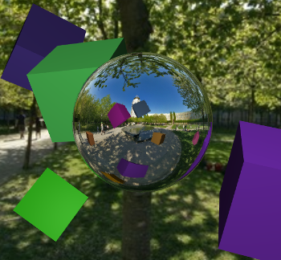
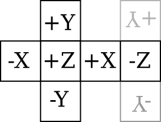

# 7.4 帧缓冲区

**Framebuffers**

.. tab:: 中文

    "帧缓冲区"这个术语传统上指的是内存中的一个区域，它保存了在计算机屏幕上显示的图像的颜色数据。在 WebGL 中，一个 **帧缓冲区** 是一个数据结构，它组织了渲染图像所需的内存资源。WebGL 图形上下文有一个默认的帧缓冲区，用于屏幕上出现的图像。默认帧缓冲区是由创建图形上下文的 canvas.getContext() 调用创建的。它的属性取决于传递给该函数的选项，并且在创建后不能更改。然而，可以创建额外的帧缓冲区，其属性由 WebGL 程序控制。它们可以用于离屏渲染，并且对于某些高级渲染算法是必需的。

    帧缓冲区可以使用颜色缓冲区来保存图像的颜色数据，使用深度缓冲区来保存每个像素的深度值，以及使用所谓的模板缓冲区（本教科书中不涉及）。这些缓冲区被称为“附加”到帧缓冲区。对于非默认帧缓冲区，WebGL 程序可以随时附加和分离缓冲区。帧缓冲区不需要完整的三套缓冲区，但你需要一个颜色缓冲区、深度缓冲区或两者兼有才能使用帧缓冲区进行渲染。如果在渲染到帧缓冲区时没有启用深度测试，那么不需要深度缓冲区。一些渲染算法，如阴影映射([5.3.3小节](../c5/s3.md#533-阴影))，使用一个只有深度缓冲区而没有颜色缓冲区的帧缓冲区。在 WebGL 2.0 中，还可以将多个颜色缓冲区附加到同一个帧缓冲区，这对于某些高级算法和计算应用非常有用。（另见[7.5.4小节](../c7/s5.md#754-延迟着色)。）

    渲染函数 gl.drawArrays() 和 gl.drawElements() 会影响当前帧缓冲区，最初是默认帧缓冲区。当前帧缓冲区可以通过调用以下代码更改：

    ```js
    gl.bindFramebuffer(gl.FRAMEBUFFER, frameBufferObject);
    ```

    这个函数的第一个参数始终是 gl.FRAMEBUFFER。第二个参数可以是 null，以选择默认帧缓冲区进行绘制，或者是通过函数 gl.createFramebuffer() 创建的非默认帧缓冲区，下面将讨论这个函数。

.. tab:: 英文

    The term "frame buffer" traditionally refers to the region of memory that holds the color data for the image displayed on a computer screen. In WebGL, a **framebuffer** is a data structure that organizes the memory resources that are needed to render an image. A WebGL graphics context has a default framebuffer, which is used for the image that appears on the screen. The default framebuffer is created by the call to canvas.getContext() that creates the graphics context. Its properties depend on the options that are passed to that function and cannot be changed after it is created. However, additional framebuffers can be created, with properties controlled by the WebGL program. They can be used for off-screen rendering, and they are required for certain advanced rendering algorithms.

    A framebuffer can use a color buffer to hold the color data for an image, a depth buffer to hold a depth value for each pixel, and something called a stencil buffer (which is not covered in this textbook). The buffers are said to be "attached" to the framebuffer. For a non-default framebuffer, buffers can be attached and detached by the WebGL program at any time. A framebuffer doesn't need a full set of three buffers, but you need a color buffer, a depth buffer, or both to be able to use the framebuffer for rendering. If the depth test is not enabled when rendering to the framebuffer, then no depth buffer is needed. And some rendering algorithms, such as shadow mapping ([Subsection 5.3.3](../c5/s3.md#533-阴影)) use a framebuffer with a depth buffer but no color buffer. In WebGL 2.0, it is also possible to attach several color buffers to the same framebuffer, which can be useful for certain advanced algorithms and computational applications. (Also, see [Subsection 7.5.4](../c7/s5.md#754-延迟着色).)

    The rendering functions gl.drawArrays() and gl.drawElements() affect the current framebuffer, which is initially the default framebuffer. The current framebuffer can be changed by calling

    ```js
    gl.bindFramebuffer( gl.FRAMEBUFFER, frameBufferObject );
    ```

    The first parameter to this function is always gl.FRAMEBUFFER. The second parameter can be null to select the default framebuffer for drawing, or it can be a non-default framebuffer created by the function gl.createFramebuffer(), which will be discussed below.

## 7.4.1 帧缓冲区操作

**Framebuffer Operations**

.. tab:: 中文

    在我们讨论使用非默认帧缓冲区的示例之前，我们先看看一些影响当前活动帧缓冲区渲染的 WebGL 设置。我们已经看到的例子包括用于填充颜色缓冲区的清除颜色，当调用 gl.clear() 时使用，以及启用深度测试的状态。

    另一个影响深度缓冲区使用的例子是 **深度掩码**，这是一个布尔值，控制是否在渲染期间向深度缓冲区写入值。（深度测试的启用状态决定是否在渲染期间 **使用** 深度缓冲区中的值；深度掩码决定是否向深度缓冲区 **写入** 新值。）可以使用以下命令关闭向深度缓冲区写入：

    ```js
    gl.depthMask(false);
    ```

    通过调用 `gl.depthMask(true)` 可以重新打开写入。默认值是 true。

    使用深度掩码的一个例子是渲染半透明几何体。当场景中的一些对象是半透明的时，应该首先渲染所有的不透明对象，然后是半透明对象。假设你先渲染了一个半透明对象，然后又渲染了一个位于半透明对象后面的不透明对象。深度测试会导致不透明对象被半透明对象隐藏。但是“半透明”意味着不透明对象应该能够通过半透明对象看到。因此，首先渲染所有不透明对象非常重要。在渲染半透明对象时，通过调用 `gl.depthMask(false)` 关闭向深度缓冲区写入也很重要。原因是一个在另一个半透明对象后面绘制的半透明对象应该能够通过前面的对象看到。但请注意，在渲染半透明对象时，深度测试仍然必须启用，因为半透明对象可能被不透明对象隐藏。此外，在渲染半透明对象时，必须启用 alpha 混合。

    要正确渲染半透明对象，应该在渲染之前将半透明原语按从后到前的顺序排序，如画家算法 ([3.1.4小节](../c3/s1.md#314-深度测试)) 中所述。然而，这可能难以实现，有时可以通过按任意顺序（但仍在不透明原语之后）渲染半透明原语获得可接受的结果。实际上，这在演示 [c3/rotation-axis.html](../../../en/demos/c3/rotation-axis.html) 从 [3.2.2小节](../c3/s2.md#322-基本-3d-变换) 和 [c3/transform-equivalence-3d.html](../../../en/demos/c3/transform-equivalence-3d.html) 从 [3.3.4小节](../c3/s3.md#334-模型视图转换) 中就是这样做的。

    ----

    也可以使用 **颜色掩码** 控制向颜色缓冲区的写入。颜色缓冲区有四个“通道”，分别对应颜色的红色、绿色、蓝色和 alpha 分量。每个通道可以单独控制。例如，你可以允许向红色和 alpha 颜色通道写入，同时阻止向绿色和蓝色通道写入。这可以通过以下命令完成：

    ```js
    gl.colorMask(true, false, false, true);
    ```

    `gl.colorMask` 函数接受四个参数，每个颜色通道一个。true 值允许向通道写入；false 值阻止写入。在渲染期间，如果某个通道的写入被阻止，相应颜色分量的值将被忽略。

    使用颜色掩码的一个用途是用于红蓝立体渲染 ([5.3.1小节](../c5/s3.md#531-实例化网格))。红蓝立体图像包含场景的两张图像，一张用于左眼，一张用于右眼。一张图像仅使用红色阴影绘制，而另一张仅使用绿色和蓝色的组合。两张图像从略微不同的视点绘制，对应于左眼和右眼的视图。因此，红蓝立体的算法形式如下：

    ```js
    gl.clearColor(0,0,0,1);
    gl.clear( gl.COLOR_BUFFER_BIT | gl.DEPTH_BUFFER_BIT );
    gl.colorMask( true, false, false, false ); // 仅向红色通道写入
    ... // 设置左眼的视图
    ... // 渲染场景
    gl.clear( gl.DEPTH_BUFFER_BIT ); // 仅清除深度缓冲区
    gl.colorMask( false, true, true, false );  // 向绿色和蓝色通道写入
    ... // 设置右眼的视图
    ... // 渲染场景
    ```

    设置左眼和右眼视图的一种方法是简单地围绕 y 轴旋转几度。请注意，在绘制第二张图像之前，必须清除深度缓冲区而不是颜色缓冲区，因为否则深度测试将阻止第二张图像的某些部分被写入。

    ----

    最后，我想更详细地看看混合（Blending）。混合指的是片段着色器中的片段颜色与颜色缓冲区中片段的当前颜色如何结合。默认情况下，假设片段通过了深度测试，是用片段颜色替换当前颜色。当启用混合时，当前颜色可以被替换为当前颜色和片段颜色的某种组合。之前，我只讨论了使用以下命令启用用于透明度的 alpha 混合：

    ```js
    gl.enable(gl.BLEND);
    gl.blendFunc(gl.SRC_ALPHA, gl.ONE_MINUS_SRC_ALPHA);
    ```

    `gl.blendFunc()` 函数决定了如何从当前颜色和片段颜色计算新颜色。在这里显示的参数下，使用 GLSL 语法的公式为新颜色：

    ```js
    (src * src.a) + (dest * (1-src.a))
    ```

    其中 *src* 是“源”颜色（即正在写入的颜色，片段颜色），*dest* 是“目标”颜色（即当前在颜色缓冲区中的颜色，是渲染操作的目标）。*src.a* 是源颜色的 alpha 分量。`gl.blendFunc()` 的参数决定了公式中的系数 —— *src.a* 和 (1−*src.a*)。混合函数的默认系数由以下给出：

    ```js
    gl.blendFunc(gl.ONE, gl.ZERO);
    ```

    这指定了公式：

    ```js
    (src * 1) + (dest * 0)
    ```

    也就是说，新颜色等于源颜色；没有混合。

    请注意，混合同时适用于颜色的 alpha 分量和 RGB 分量，这可能不是你想要的。当使用半透明颜色绘制时，意味着写入颜色缓冲区的颜色将有一个小于 1 的 alpha 分量。当在网页上的画布上渲染时，这将使画布本身半透明，允许画布的背景透过。（这假设 WebGL 上下文是使用 alpha 通道创建的，这是默认设置。）为了避免这种情况，你可以使用替代命令设置混合函数：

    ```js
    gl.blendFuncSeparate(gl.SRC_ALPHA, gl.ONE_MINUS_SRC_ALPHA, gl.ZERO, gl.ONE);
    ```

    两个额外的参数指定了用于公式中 alpha 分量的独立系数，而前两个参数仅用于 RGB 分量。也就是说，使用以下公式计算颜色缓冲区的新颜色：

    ```js
    vec4((src.rgb * src.a) + (dest.rgb * (1 - src.a)), src.a * 0 + dest.a * 1);
    ```

    使用这个公式，目标（颜色缓冲区）中的 alpha 分量保持其原始值不变。

    由 `gl.blendFunc(gl.ONE,gl.ONE)` 设置的混合函数有时可以用于 **多遍算法**。在多遍算法中，场景被渲染多次，结果以某种方式组合以产生最终图像。（红蓝立体渲染是一个例子。）如果你想简单地将各个遍历的结果加起来，那么你可以填充颜色缓冲区为零，启用混合，并在渲染期间将混合函数设置为 (*gl.ONE,gl.ONE*)。

    作为一个简单的例子，示例程序 [webgl/image-blur.html](../../../en/source/webgl/image-blur.html) 使用多遍算法来实现模糊效果。示例中的场景只是一个应用到矩形的纹理图像，所以效果是模糊纹理图像。该技术涉及将场景绘制九次。在片段着色器中，颜色被除以九。混合用于将九次遍历的片段颜色相加，以便颜色缓冲区中的最终颜色是九次遍历的颜色平均值。对于九次中的八次，场景从原始位置稍微偏移，以便最终图像中像素的颜色是该像素以及原始场景中周围像素的颜色的平均值。

.. tab:: 英文

    Before we get to examples of using non-default framebuffers, we look at some WebGL settings that affect rendering into whichever framebuffer is current. Examples that we have already seen include the clear color, which is used to fill the color buffer when gl.clear() is called, and the enabled state of the depth test.

    Another example that affects the use of the depth buffer is the **depth mask**, a boolean value that controls whether values are written to the depth buffer during rendering. (The enabled state of the depth test determines whether values from the depth buffer are **used** during rendering; the depth mask determines whether new values are **written** to the depth buffer.) Writing to the depth buffer can be turned off with the command

    ```js
    gl.depthMask( false );
    ```

    and can be turned back on by calling *gl.depthMask(true)*. The default value is true.

    One example of using the depth mask is for rendering translucent geometry. When some of the objects in a scene are translucent, then all of the opaque objects should be rendered first, followed by the translucent objects. Suppose that you rendered a translucent object, and then rendered an opaque object that lies behind the translucent object. The depth test would cause the opaque object to be hidden by the translucent object. But "translucent" means that the opaque object should be visible through the translucent object. So it's important to render all the opaque objects first. And it's important to turn off writing to the depth buffer, by calling *gl.depthMask(false)*, while rendering the translucent objects. The reason is that a translucent object that is drawn behind another translucent object should be visible through the front object. Note, however, that the depth test must still be enabled while the translucent objects are being rendered, since a translucent object can be hidden by an opaque object. Also, alpha blending must be on while rendering the translucent objects.

    For fully correct rendering of translucent objects, the translucent primitives should be sorted into back-to-front order before rendering, as in the painter's algorithm ([Subsection 3.1.4](../c3/s1.md#314--深度测试)). However, that can be difficult to implement, and acceptable results can sometimes be obtained by rendering the translucent primitives in arbitrary order (but still after the opaque primitives). In fact that was done in the demos [c3/rotation-axis.html](../../../en/demos/c3/rotation-axis.html) from [Subsection 3.2.2](../c3/s2.md#322-基本-3d-变换) and [c3/transform-equivalence-3d.html](../../../en/demos/c3/transform-equivalence-3d.html) from [Subsection 3.3.4](../c3/s3.md#334-模型视图转换).

    ----

    It is also possible to control writing to the color buffer, using the **color mask**. The color buffer has four "channels" corresponding to the red, green, blue, and alpha components of the color. Each channel can be controlled separately. You could, for example, allow writing to the red and alpha color channels, while blocking writing to the green and blue channels. That would be done with the command

    ```js
    gl.colorMask( true, false, false, true );
    ```

    The **colorMask** function takes four parameters, one for each color channel. A true value allows writing to the channel; a *false* value blocks writing. When writing is blocked for a channel during rendering, the value of the corresponding color component is simply ignored.

    One use of the color mask is for anaglyph stereo rendering ([Subsection 5.3.1](../c5/s3.md#531-实例化网格)). An anaglyph stereo image contains two images of the scene, one intended for the left eye and one for the right eye. One image is drawn using only shades of red, while the other uses only combinations of green and blue. The two images are drawn from slightly different viewpoints, corresponding to the views from the left and the right eye. So the algorithm for anaglyph stereo has the form

    ```js
    gl.clearColor(0,0,0,1);
    gl.clear( gl.COLOR_BUFFER_BIT | gl.DEPTH_BUFFER_BIT );
    gl.colorMask( true, false, false, false ); // write to red channel only
    ... // set up view from left eye
    ... // render the scene
    gl.clear( gl.DEPTH_BUFFER_BIT ); // clear only the depth buffer
    gl.colorMask( false, true, true, false );  // write to green and blue channels
    ... // set up view from right eye
    ... // render the scene
    ```

    One way to set up the views from the left and right eyes is simply to rotate the view by a few degrees about the y-axis. Note that the depth buffer, but not the color buffer, must be cleared before drawing the second image, since otherwise the depth test would prevent some parts of the second image from being written.

    ----

    Finally, I would like to look at blending in more detail. Blending refers to how the fragment color from the fragment shader is combined with the current color of the fragment in the color buffer. The default, assuming that the fragment passes the depth test, is to replace the current color with the fragment color. When blending is enabled, the current color can be replaced with some combination of the current color and the fragment color. Previously, I have only discussed turning on alpha blending for transparency with the commands

    ```js
    gl.enable( gl.BLEND );
    gl.blendFunc( gl.SRC_ALPHA, gl.ONE_MINUS_SRC_ALPHA );
    ```

    The function *gl.blendFunc()* determines how the new color is computed from the current color and the fragment color. With the parameters shown here, the formula for the new color, using GLSL syntax, is

    ```js
    (src * src.a) + (dest * (1-src.a))
    ```

    where *src* is the "source" color (that is, the color that is being written, the fragment color) and *dest* is the "destination" color (that is, the color currently in the color buffer, which is the destination of the rendering operation). And *src.a* is the alpha component of the source color. The parameters to *gl.blendFunc()* determine the coefficients— *src.a* and (1−*src.a*)—in the formula. The default coefficients for the blend function are given by

    ```js
    gl.blendFunc( gl.ONE, gl.ZERO );
    ```

    which specifies the formula

    ```js
    (src * 1) + (dest * 0)
    ```

    That is, the new color is equal to the source color; there is no blending.

    Note that blending applies to the alpha component as well as the RGB components of the color, which is probably not what you want. When drawing with a translucent color, it means that the color that is written to the color buffer will have an alpha component less than 1. When rendering to a canvas on a web page, this will make the canvas itself translucent, allowing the background of the canvas to show through. (This assumes that the WebGL context was created with an alpha channel, which is the default.) To avoid that, you can set the blend function with the alternative command

    ```js
    gl.blendFuncSeparate( gl.SRC_ALPHA, gl.ONE_MINUS_SRC_ALPHA, 
                                                        gl.ZERO, gl.ONE );
    ```

    The two extra parameters specify separate coefficients to be used for the alpha component in the formula, while the first two parameters are used only for the RGB components. That is, the new color for the color buffer is computed using the formula

    ```js
    vec4( (src.rgb*src.a) + (dest.rgb*(1-src.a)), src.a*0 + dest.a*1  );
    ```

    With this formula, the alpha component in the destination (the color buffer) remains the same as its original value.

    The blend function set by *gl.blendFunc(gl.ONE,gl.ONE)* can sometimes be used in **multi-pass algorithms**. In a multi-pass algorithm, a scene is rendered several times, and the results are combined somehow to produce the final image. (Anaglyph stereo rendering is an example.) If you simply want to add up the results of the various passes, then you can fill the color buffer with zeros, enable blending, and set the blend function to (*gl.ONE,gl.ONE*) during rendering.

    As a simple example, the sample program [webgl/image-blur.html](../../../en/source/webgl/image-blur.html) uses a multi-pass algorithm to implement blurring. The scene in the example is just a texture image applied to a rectangle, so the effect is to blur the texture image. The technique involves drawing the scene nine times. In the fragment shader, the color is divided by nine. Blending is used to add the fragment colors from the nine passes, so that the final color in the color buffer is the average of the colors from the nine passes. For eight of the nine passes, the scene is offset slightly from its original position, so that the color of a pixel in the final image is the average of the colors of that pixel and the surrounding pixels from the original scene.

## 7.4.2 渲染到纹理

**Render To Texture**

.. tab:: 中文

    前一节适用于任何帧缓冲区。但我们还没有使用过非默认的帧缓冲区。我们现在转向那个话题。

    非默认帧缓冲区的一个用途是直接将内容渲染到纹理中。也就是说，纹理图像所占的内存可以附加到帧缓冲区作为其颜色缓冲区，以便渲染操作将它们的输出发送到纹理图像中。这种技术被称为**渲染到纹理**，在示例程序 [webgl/render-to-texture.html](../../../en/source/webgl/render-to-texture.html) 中使用了此技术。

    通常在加载图像到纹理时分配纹理内存，使用的函数是 *gl.texImage2D* 或 *gl.copyTexImage2D*。（见 [第6.4节](../c6/s4.md#64-图像纹理)。）然而，有一个版本的 *gl.texImage2D* 可以用来在不加载图像到该内存的情况下分配内存。以下是一个示例，来自示例程序：

    ```js
    texture = gl.createTexture();
    gl.bindTexture(gl.TEXTURE_2D, texture);
    gl.texImage2D(gl.TEXTURE_2D, 0, gl.RGBA, 512, 512, 
                                0, gl.RGBA, gl.UNSIGNED_BYTE, null);
    ```

    最后一行的 *null* 参数告诉 *gl.texImage2D* 分配新内存，而不加载现有的图像数据来填充该内存。相反，新内存用零填充。*gl.texImage2D* 的第一个参数是纹理目标。对于普通纹理，目标是 *gl.TEXTURE_2D*，但其他值用于处理立方体贴图。第四和第五个参数指定图像的高度和宽度；它们应该是2的幂。其他参数通常具有这里显示的值；它们的含义与 [6.4.3小节](../c6/s4.md#643-更多制作纹理的方法) 中讨论的 *gl.texImage2D* 版本相同。请注意，必须首先创建并绑定纹理对象；*gl.texImage2D* 适用于当前绑定到活动纹理单元的纹理。（在 WebGL 2.0 中，也可以使用 [6.4.6小节](../c6/s4.md#646-webgl-20-中的纹理) 中讨论的 *gl.texStorage2D()* 函数来完成相同的操作。）

    要将纹理附加到帧缓冲区，你需要创建一个帧缓冲区对象，并通过绑定使其成为当前帧缓冲区。例如，

    ```js
    framebuffer = gl.createFramebuffer();
    gl.bindFramebuffer(gl.FRAMEBUFFER, framebuffer);
    ```

    然后可以使用 *gl.framebufferTexture2D* 函数将纹理附加到帧缓冲区：

    ```js
    gl.framebufferTexture2D( gl.FRAMEBUFFER, gl.COLOR_ATTACHMENT0, 
                                                    gl.TEXTURE_2D, texture, 0 );
    ```

    第一个参数始终是 *gl.FRAMEBUFFER*。第二个参数表示正在附加颜色缓冲区。*gl.COLOR_ATTACHMENT0* 中的最后一个字符是零，这允许有多个颜色缓冲区附加到帧缓冲区（尽管在标准 WebGL 1.0 中，只允许一个颜色缓冲区）。第三个参数与 *gl.texImage2D* 中使用的相同的纹理目标，第四个是纹理对象。最后一个参数是 mipmap 级别；它通常是零，这意味着渲染到纹理图像本身，而不是其 mipmap 图像之一。

    有了这个设置，你准备好绑定帧缓冲区并绘制到纹理了。绘制纹理后，调用

    ```js
    gl.bindFramebuffer( gl.FRAMEBUFFER, null );
    ```

    以重新开始绘制到默认帧缓冲区。此时，纹理已准备好在后续的渲染操作中使用。纹理对象可以绑定到纹理单元，并且在着色器程序中可以使用 *sampler2D* 变量从纹理中读取。

    你很可能会在绘制到纹理和绘制到屏幕上使用不同的着色器程序。回想一下，函数 *gl.useProgram()* 用于指定着色器程序。

    在 [示例程序](../../../en/source/webgl/render-to-texture.html) 中，纹理可以动画化。在动画过程中，每个动画帧都会将新图像绘制到纹理中。纹理图像是 2D 的，所以在渲染它时禁用了深度测试。这意味着帧缓冲区不需要深度缓冲区。示例程序中的渲染函数大致形式如下

    ```js
    function draw() {

        /* 将 2D 图像绘制到附加到帧缓冲区的纹理中。 */

        gl.bindFramebuffer(gl.FRAMEBUFFER, framebuffer);
        gl.useProgram(prog_texture);  // 用于纹理的着色器程序
        
        gl.clearColor(1,1,1,1);
        gl.clear(gl.COLOR_BUFFER_BIT);  // 将纹理清除为白色

        gl.enable(gl.BLEND);  // 在绘制 2D 图像时使用透明度。    
        gl.disable(gl.DEPTH_TEST); // 帧缓冲区甚至没有深度缓冲区！
        gl.viewport(0,0,512,512);  // 视口不会自动设置！

        .
        .  // 绘制每个帧都会变化的纹理图像
        .
        
        gl.disable(gl.BLEND);

        /* 现在使用纹理绘制主场景，它是 3D 的。 */
        
        gl.bindFramebuffer(gl.FRAMEBUFFER, null); // 绘制到默认帧缓冲区。
        gl.useProgram(prog);  // 用于屏幕上图像的着色器程序
        gl.clearColor(0,0,0,1);
        gl.clear(gl.COLOR_BUFFER_BIT | gl.DEPTH_BUFFER_BIT);
        gl.enable(gl.DEPTH_TEST);
        gl.viewport(0,0,canvas.width,canvas.height);  // 重置视口！

        .
        .   // 绘制场景
        .
        
    }
    ```

    请注意，当绘制到非默认帧缓冲区时，必须手动设置视口。然后在绘制屏幕上的图像时，必须重置视口以匹配渲染屏幕上图像的画布大小。我还应该指出，此程序中只使用了一个纹理对象，所以它可以在初始化期间一次性绑定。在这种情况下，在 *draw()* 函数中不需要调用 *gl.bindTexture()*。

    这个示例可以不使用帧缓冲区来实现，就像 [4.3.6小节](../c4/s3.md#435-从内存加载纹理) 中的示例那样。在那个示例中，纹理图像被绘制到默认帧缓冲区，然后复制到纹理对象。然而，本节中的版本更有效，因为它不需要在渲染图像后复制图像。

.. tab:: 英文

    The previous subsection applies to any framebuffer. But we haven't yet used a non-default framebuffer. We turn to that topic now.

    One use for a non-default framebuffer is to render directly into a texture. That is, the memory occupied by a texture image can be attached to the framebuffer as its color buffer, so that rendering operations will send their output to the texture image. This technique, which is called **render-to-texture**, is used in the sample program [webgl/render-to-texture.html](../../../en/source/webgl/render-to-texture.html).

    Texture memory is normally allocated when an image is loaded into the texture using the function *gl.texImage2D* or *gl.copyTexImage2D*. (See [Section 6.4](../c6/s4.md#64-图像纹理).) However, there is a version of *gl.texImage2D* that can be used to allocate memory without loading an image into that memory. Here is an example, from the sample program:

    ```js
    texture = gl.createTexture();
    gl.bindTexture(gl.TEXTURE_2D, texture);
    gl.texImage2D(gl.TEXTURE_2D, 0, gl.RGBA, 512, 512, 
                                0, gl.RGBA, gl.UNSIGNED_BYTE, null);
    ```

    It is the *null* parameter at the end of the last line that tells *gl.texImage2D* to allocate new memory without loading existing image data to fill that memory. Instead, the new memory is filled with zeros. The first parameter to *gl.texImage2D* is the texture target. The target is *gl.TEXTURE_2D* for normal textures, but other values are used for working with cubemap textures. The fourth and fifth parameters specify the height and width of the image; they should be powers of two. The other parameters usually have the values shown here; their meanings are the same as for the version of *gl.texImage2D* discussed in [Subsection 6.4.3](../c6/s4.md#643-更多制作纹理的方法). Note that the texture object must first be created and bound; *gl.texImage2D* applies to the texture that is currently bound to the active texture unit. (In WebGL 2.0, the same thing can also be accomplished using the *gl.texStorage2D()* function discussed in [Subsection 6.4.6](../c6/s4.md#646-webgl-20-中的纹理).)

    To attach the texture to a framebuffer, you need to create a framebuffer object and make that object the current framebuffer by binding it. For example,

    ```js
    framebuffer = gl.createFramebuffer();
    gl.bindFramebuffer(gl.FRAMEBUFFER, framebuffer);
    ```

    Then the function *gl.framebufferTexture2D* can be used to attach the texture to the framebuffer:

    ```js
    gl.framebufferTexture2D( gl.FRAMEBUFFER, gl.COLOR_ATTACHMENT0, 
                                                    gl.TEXTURE_2D, texture, 0 );
    ```

    The first parameter is always *gl.FRAMEBUFFER*. The second parameter says a color buffer is being attached. The last character in *gl.COLOR_ATTACHMENT0* is a zero, which allows the possibility of having more than one color buffer attached to a framebuffer (although in standard WebGL 1.0, only one color buffer is allowed). The third parameter is the same texture target that was used in *gl.texImage2D*, and the fourth is the texture object. The last parameter is the mipmap level; it will usually be zero, which means rendering to the texture image itself rather than to one of its mipmap images.

    With this setup, you are ready to bind the framebuffer and draw to the texture. After drawing the texture, call

    ```js
    gl.bindFramebuffer( gl.FRAMEBUFFER, null );
    ```

    to start drawing again to the default framebuffer. At that point, the texture is ready for use in subsequent rendering operations. The texture object can be bound to a texture unit, and a *sampler2D* variable can be used in the shader program to read from the texture.

    You are very likely to use different shader programs for drawing to the texture and drawing to the screen. Recall that the function *gl.useProgram()* is used to specify the shader program.

    In the [sample program](../../../en/source/webgl/render-to-texture.html), the texture can be animated. During the animation, a new image is drawn to the texture for each frame of the animation. The texture image is 2D, so the depth test is disabled while rendering it. This means that the framebuffer doesn't need a depth buffer. In outline form, the rendering function in the sample program has the form

    ```js
    function draw() {

        /* Draw the 2D image into a texture attached to a framebuffer. */

        gl.bindFramebuffer(gl.FRAMEBUFFER,framebuffer);
        gl.useProgram(prog_texture);  // shader program for the texture
        
        gl.clearColor(1,1,1,1);
        gl.clear(gl.COLOR_BUFFER_BIT);  // clear the texture to white

        gl.enable(gl.BLEND);  // Use transparency while drawing 2D image.    
        gl.disable(gl.DEPTH_TEST); // framebuffer doesn't even have a depth buffer!
        gl.viewport(0,0,512,512);  // Viewport is not set automatically!
        
        .
        .  // draw the texture image, which changes in each frame
        .
        
        gl.disable(gl.BLEND);

        /*  Now draw the main scene, which is 3D, using the texture. */
        
        gl.bindFramebuffer(gl.FRAMEBUFFER,null); // Draw to default framebuffer.
        gl.useProgram(prog);  // shader program for the on-screen image
        gl.clearColor(0,0,0,1);
        gl.clear(gl.COLOR_BUFFER_BIT | gl.DEPTH_BUFFER_BIT);
        gl.enable(gl.DEPTH_TEST);
        gl.viewport(0,0,canvas.width,canvas.height);  // Reset the viewport!
        
        .
        .   // draw the scene
        .
        
    }
    ```

    Note that the viewport has to be set by hand when drawing to a non-default frame buffer. It then has to be reset when drawing the on-screen image to match the size of the canvas where the on-screen image is rendered. I should also note that only one texture object is used in this program, so it can be bound once and for all during initialization. In this case, it is not necessary to call *gl.bindTexture()* in the *draw()* function.

    This example could be implemented without using a framebuffer, as was done for the example in [Subsection 4.3.6](../c4/s3.md#435-从内存加载纹理). In that example, the texture image was drawn to the default framebuffer, then copied to the texture object. However, the version in this section is more efficient because it does not need to copy the image after rendering it.

## 7.4.3 渲染缓冲区

**Renderbuffers**

.. tab:: 中文

    通常使用纹理对象的内存作为帧缓冲区的颜色缓冲区是很方便的。然而，有时更适合为缓冲区创建单独的内存，与任何纹理无关。对于深度缓冲区来说，这是典型情况。在这种情况下，可以创建一个 **renderbuffer** 来作为内存。Renderbuffer 代表可以附加到帧缓冲区的内存，用作颜色缓冲区、深度缓冲区或模板缓冲区。要使用它，你需要创建 renderbuffer 并为它分配内存。内存是通过函数 *gl.renderbufferStorage()* 分配的。在分配内存之前，必须通过调用 *gl.bindRenderbuffer()* 绑定 renderbuffer。以下是一个创建用作深度缓冲区的 renderbuffer 的示例：

    ```js
    let depthBuffer = gl.createRenderbuffer();
    gl.bindRenderbuffer(gl.RENDERBUFFER, depthBuffer);
    gl.renderbufferStorage(gl.RENDERBUFFER, gl.DEPTH_COMPONENT16, 512, 512);
    ```

    *gl.bindRenderbuffer* 和 *gl.renderbufferStorage* 的第一个参数都必须是 *gl.RENDERBUFFER*。*gl.renderbufferStorage* 的第二个参数指定了 renderbuffer 的用途。值 gl.DEPTH_COMPONENT16 是每个像素16位的深度缓冲区。（在 WebGL 1.0 中，16位是唯一的选项。）对于包含 RGBA 颜色的彩色缓冲区，每个像素有四个八位值，第二个参数将是 gl.RGBA8。其他值也是可能的，例如 *gl.RGB565*，它使用每个像素16位，红色通道5位，绿色通道6位，蓝色通道5位。对于模板缓冲区，值将是 gl.STENCIL_INDEX8。*gl.renderbufferStorage* 的最后两个参数是缓冲区的宽度和高度。

    函数 *gl.framebufferRenderbuffer()* 用于将 renderbuffer 附加为帧缓冲区中的一个缓冲区。它的形式如下：

    ```js
    gl.framebufferRenderbuffer(gl.FRAMEBUFFER, gl.DEPTH_ATTACHMENT, 
                                            gl.RENDERBUFFER, renderbuffer);
    ```

    在此函数调用之前，必须通过调用 *gl.bindFramebuffer* 绑定帧缓冲区。gl.framebufferRenderbuffer 的第一个和第三个参数必须如上所示。最后一个参数是 renderbuffer。第二个参数指定了 renderbuffer 的用途。它可以是，例如，*gl.COLOR_ATTACHMENT0*，*gl.DEPTH_ATTACHMENT* 或 *gl.STENCIL_ATTACHMENT*。

.. tab:: 英文

    It is often convenient to use memory from a texture object as the color buffer for a framebuffer. However, sometimes its more appropriate to create separate memory for the buffer, not associated with any texture. For the depth buffer, that is the typical case. For such cases, the memory can be created as a **renderbuffer**. A renderbuffer represents memory that can be attached to a framebuffer for use as a color buffer, depth buffer, or stencil buffer. To use one, you need to create the renderbuffer and allocate memory for it. Memory is allocated using the function *gl.renderbufferStorage()*. The renderbuffer must be bound by calling *gl.bindRenderbuffer()* before allocating the memory. Here is an example that creates a renderbuffer for use as a depth buffer:

    ```js
    let depthBuffer = gl.createRenderbuffer();
    gl.bindRenderbuffer(gl.RENDERBUFFER, depthBuffer);
    gl.renderbufferStorage(gl.RENDERBUFFER, gl.DEPTH_COMPONENT16, 512, 512);
    ```

    The first parameter to both *gl.bindRenderbuffer* and *gl.renderbufferStorage* must be *gl.RENDERBUFFER*. The second parameter to *gl.renderbufferStorage* specifies how the renderbuffer will be used. The value gl.DEPTH_COMPONENT16 is for a depth buffer with 16 bits for each pixel. (Sixteen bits is the only option in WebGL 1.0.) For a color buffer holding RGBA colors with four eight-bit values per pixel, the second parameter would be gl.RGBA8. Other values are possible, such as *gl.RGB565*, which uses 16 bits per pixel with 5 bits for the red color channel, 6 bits for green, and 5 bits for blue. For a stencil buffer, the value would be gl.STENCIL_INDEX8. The last two parameters to *gl.renderbufferStorage* are the width and height of the buffer.

    The function *gl.framebufferRenderbuffer()* is used to attach a renderbufffer to be used as one of the buffers in a framebuffer. It takes the form

    ```js
    gl.framebufferRenderbuffer(gl.FRAMEBUFFER, gl.DEPTH_ATTACHMENT, 
                                            gl.RENDERBUFFER, renderbuffer);
    ```

    The framebuffer must be bound by calling *gl.bindFramebuffer* before this function is called. The first and third parameters to gl.framebufferRenderbuffer must be as shown. The last parameter is the renderbuffer. The second parameter specifies how the renderbuffer will be used. It can be, for example, *gl.COLOR_ATTACHMENT0*, *gl.DEPTH_ATTACHMENT*, or *gl.STENCIL_ATTACHMENT*.

## 7.4.4 动态立方体贴图纹理

**Dynamic Cubemap Textures**

.. tab:: 中文

    要将 3D 场景渲染到帧缓冲区，我们需要一个颜色缓冲区和一个深度缓冲区。示例程序 [webgl/cube-camera.html](../../../en/source/webgl/cube-camera.html) 展示了这个过程。此示例对立方体贴图纹理使用渲染到纹理技术。然后，立方体贴图纹理被用作反射表面上的环境贴图。除了环境贴图，程序还使用另一个立方体贴图作为天空盒。（见 [6.3.5小节](../c6/s3.md#635-函数定义)。）以下是程序中的图像：

    

    在这种情况下，环境包括背景天空盒，还包括几个不属于天空盒纹理的彩色立方体。图像中心的反射球体反射了立方体以及天空盒，这意味着环境贴图纹理不能与天空盒纹理相同——它必须包括立方体。此外，场景可以动画化，立方体可以移动。球体上的反射必须随着立方体的移动而变化。这意味着环境贴图纹理必须在每一帧重新创建。为此，我们可以使用帧缓冲区将立方体贴图纹理渲染。

    立方体贴图由六幅图像组成，分别对应于 x、y 和 z 轴的正负方向。每个图像与不同的纹理目标相关联（类似于 *gl.TEXTURE_2D*）。要渲染立方体贴图，我们需要为所有六个面分配存储空间。以下是示例程序中的代码：

    ```js
    cubemapTargets = [  
        // 为了方便起见，将纹理目标存储在数组中 
        gl.TEXTURE_CUBE_MAP_POSITIVE_X, gl.TEXTURE_CUBE_MAP_NEGATIVE_X, 
        gl.TEXTURE_CUBE_MAP_POSITIVE_Y, gl.TEXTURE_CUBE_MAP_NEGATIVE_Y, 
        gl.TEXTURE_CUBE_MAP_POSITIVE_Z, gl.TEXTURE_CUBE_MAP_NEGATIVE_Z 
    ];

    dynamicCubemap = gl.createTexture(); // 创建纹理对象。
    gl.bindTexture(gl.TEXTURE_CUBE_MAP, dynamicCubemap);  // 将其绑定为立方体贴图
    for (i = 0; i < 6; i++) {
        gl.texImage2D(cubemapTargets[i], 0, gl.RGBA, 512, 512, 
                                    0, gl.RGBA, gl.UNSIGNED_BYTE, null);
    }
    ```

    我们还需要创建一个帧缓冲区，以及一个用作深度缓冲区的 renderbuffer，并需要将深度缓冲区附加到帧缓冲区。可以使用同一个帧缓冲区来渲染纹理的所有六幅图像，根据需要更改帧缓冲区的颜色缓冲区附件。要将六幅立方体贴图图像之一附加为颜色缓冲区，我们只需在调用 *gl.framebufferTexture2D()* 时指定相应的立方体贴图纹理目标。例如，以下命令

    ```js
    gl.framebufferTexture2D(gl.FRAMEBUFFER, gl.COLOR_ATTACHMENT0, 
                            gl.TEXTURE_CUBE_MAP_NEGATIVE_Z, dynamicCubemap, 0);
    ```

    将纹理对象 *dynamicCubemap* 的负 z 图像附加为当前绑定帧缓冲区的颜色缓冲区。

    六幅纹理图像渲染完成后，立方体贴图纹理就准备好使用了。除了渲染了六个 3D 图像而不是一个 2D 图像之外，这与本节前面环境贴图的渲染到纹理示例非常相似。

    ----

    要渲染立方体贴图所需的六个场景图像，我们需要考虑如何为反射物体制作环境贴图。我们希望获得围绕该物体的环境图像。可以通过将相机放置在物体中心来制作这些图像。基本思想是将相机指向正负坐标轴的六个方向，并在每个方向上拍摄一张照片，但要正确处理细节却很棘手。（请注意，当我们将结果应用到表面上的某一点时，我们只能获得正确反射的近似值。对于表面上某点的几何正确反射，我们需要从那个点的视角来看，而不是从物体中心的视角来看，但我们不能现实地为表面上的每个点制作不同的环境贴图。只要场景中的其他物体不太靠近反射表面，近似效果看起来就会不错。）

    “相机”实际上意味着投影变换和观察变换。投影需要一个九十度的视野，以覆盖立方体的一面，其纵横比将是1，因为立方体的面是正方形。我们可以使用如下的 *glMatrix* 命令来制作投影矩阵：

    ```js
    mat4.projection(projection, Math.PI/2, 1, 1, 100);
    ```

    这里的最后两个参数，近裁剪面和远裁剪面的距离，应该选择以包含场景中的所有物体。如果我们不应用观察变换，相机将位于原点，指向负z轴方向。如果反射物体位于原点，就像示例程序中那样，我们可以使用没有观察变换的相机来拍摄立方体贴图的负z图像。

    但是，由于图像存储为立方体贴图的方式的细节，我们发现我们需要应用一个变换。让我们看看立方体贴图的图像布局：

    

    立方体的六个面以黑色显示，好像立方体的面已经被打开并铺平了。每个面都标有相应的坐标轴方向。正负y面的副本以灰色显示，以展示这些面如何连接到负z面。我们为立方体贴图制作的图像必须像布局中的面一样拼接在一起。然而，布局中的面是从立方体的**外部**观看的，而相机将从立方体的**内部**拍摄照片。要获得正确的视图，我们需要水平翻转相机拍摄的照片。经过一些尝试，我发现我还需要垂直翻转它，也许是因为网络图像相对于OpenGL约定是倒置存储的。我们可以通过(−1,−1,1)的缩放变换来实现两次翻转。综合起来，制作立方体贴图的负z图像的代码是：

    ```js
    gl.bindFramebuffer(gl.FRAMEBUFFER, framebuffer); // 绘制到离屏缓冲区。
    gl.viewport(0,0,512,512);  // 匹配纹理图像的大小。

    /* 设置虚拟相机的投影和模型视图矩阵

    mat4.perspective(projection, Math.PI/2, 1, 1, 100);
    mat4.identity(modelview);
    mat4.scale(modelview,modelview,[-1,-1,1]);

    /* 将立方体贴图的负z图像附加为帧缓冲区的颜色缓冲区，
    并通过渲染图像“拍照”。

    gl.framebufferTexture2D(gl.FRAMEBUFFER, gl.COLOR_ATTACHMENT0, 
                            gl.TEXTURE_CUBE_MAP_NEGATIVE_Z, dynamicCubemap, 0);
    renderSkyboxAndCubes();
    ```

    最后一行的函数渲染场景，除了中心的反射物体本身，并负责将投影和模型视图矩阵发送到着色器程序。

    对于其他五幅图像，我们需要在拍照前将相机指向不同的方向。这可以通过向观察变换添加适当的旋转来完成。例如，对于正x图像，我们需要围绕y轴旋转相机−90度。作为观察变换，我们需要命令：

    ```js
    mat4.rotateY(modelview, modelview, Math.PI/2);
    ```

    可能更容易将其视为一个建模变换，将立方体的正x面旋转到相机前方的视野中。

    在 [示例程序](../../../en/source/webgl/cube-camera.html) 中，六个立方体贴图图像是在函数 *createDynamicCubemap()* 中创建的。阅读该函数的源代码以获取全部细节。

    这个动态立方体贴图程序是一个很好的例子，因为它使用了我们所涵盖的许多概念和技术。花一点时间思考这个示例程序中发生的一切，以及它们是如何实现的。（您可能还会注意到茶壶没有反射**它自己**的任何部分。）

    <iframe src="../../../en/demos/c7/cube-camera-demo.html" width="550" height="565"></iframe>

.. tab:: 英文

    To render a 3D scene to a framebuffer, we need both a color buffer and a depth buffer. An example can be found in the sample program [webgl/cube-camera.html](../../../en/source/webgl/cube-camera.html). This example uses render-to-texture for a cubemap texture. The cubemap texture is then used as an environment map on a reflective surface. In addition to the environment map, the program uses another cubemap texture for a skybox. (See [Subsection 6.3.5](../c6/s3.md#635-函数定义).) Here's an image from the program:

    

    The environment in this case includes the background skybox, but also includes several colored cubes that are not part of the skybox texture. The reflective sphere in the center of the image reflects the cubes as well as the skybox, which means that the environment map texture can't be the same as the skybox texture—it has to include the cubes. Furthermore, the scene can be animated and the cubes can move. The reflection in the sphere has to change as the cubes move. This means that the environment map texture has to be recreated in each frame. For that, we can use a framebuffer to render to the cubemap texture.

    A cubemap texture consists of six images, one each for the positive and negative direction of the x, y, and z axes. Each image is associated with a different texture target (similar to *gl.TEXTURE_2D*). To render a cubemap, we need to allocate storage for all six sides. Here's the code from the sample program:

    ```js
    cubemapTargets = [  
            // store texture targets in an array for convenience 
    gl.TEXTURE_CUBE_MAP_POSITIVE_X, gl.TEXTURE_CUBE_MAP_NEGATIVE_X, 
    gl.TEXTURE_CUBE_MAP_POSITIVE_Y, gl.TEXTURE_CUBE_MAP_NEGATIVE_Y, 
    gl.TEXTURE_CUBE_MAP_POSITIVE_Z, gl.TEXTURE_CUBE_MAP_NEGATIVE_Z 
    ];

    dynamicCubemap = gl.createTexture(); // Create the texture object.
    gl.bindTexture(gl.TEXTURE_CUBE_MAP, dynamicCubemap);  // bind it as a cubemap
    for (i = 0; i < 6; i++) {
    gl.texImage2D(cubemapTargets[i], 0, gl.RGBA, 512, 512, 
                                        0, gl.RGBA, gl.UNSIGNED_BYTE, null);
    }
    ```

    We also need to create a framebuffer, as well as a renderbuffer for use as a depth buffer, and we need to attach the depth buffer to the framebuffer. The same framebuffer can be used to render all six images for the texture, changing the color buffer attachment of the framebuffer as needed. To attach one of the six cubemap images as the color buffer, we just specify the corresponding cubemap texture target in the call to *gl.framebufferTexture2D()*. For example, the command

    ```js
    gl.framebufferTexture2D(gl.FRAMEBUFFER, gl.COLOR_ATTACHMENT0, 
                            gl.TEXTURE_CUBE_MAP_NEGATIVE_Z, dynamicCubemap, 0);
    ```

    attaches the negative z image from the texture object *dynamicCubemap* to be used as the color buffer in the currently bound framebuffer.

    After the six texture images have been rendered, the cubemap texture is ready to be used. Aside from the fact that six 3D images are rendered instead of one 2D image, this is all very similar to the render-to-texture example from earlier in this section.

    ----

    The question remains of how to render the six images of the scene that are needed for the cubemap texture. To make an environment map for a reflective object, we want images of the environment that surrounds that object. The images can be made with a camera placed at the center of the object. The basic idea is to point the camera in the six directions of the positive and negative coordinate axes and snap a picture in each direction, but it's tricky to get the details correct. (And note that when we apply the result to a point on the surface, we will only have an approximation of the correct reflection. For a geometrically correct reflection at the point, we would need the view from that very point, not the view from the center of the object, but we can't realistically make a different environment map for each point on the surface. The approximation will look OK as long as other objects in the scene are not too close to the reflective surface.)

    A "camera" really means a projection transformation and a viewing transformation. The projection needs a ninety-degree field of view, to cover one side of the cube, and its aspect ratio will be 1, since the sides of the cube are squares. We can make the projection matrix with a *glMatrix* command such as

    ```js
    mat4.projection( projection, Math.PI/2, 1, 1, 100 );
    ```

    where the last two parameters, the near and far clipping distances, should be chosen to include all the objects in the scene. If we apply no viewing transformation, the camera will be at the origin, pointing in the direction of the negative z-axis. If the reflective object is at the origin, as it is in the sample program, we can use the camera with no viewing transformation to take the negative-z image for the cubemap texture.

    But, because of the details of how the images must be stored for cubemap textures, it turns out that we need to apply one transformation. Let's look at the layout of images for a cubemap texture:

    

    The six sides of the cube are shown in black, as if the sides of the cube have been opened up and laid out flat. Each side is marked with the corresponding coordinate axis direction. Duplicate copies of the plus and minus y sides are shown in gray, to show how those sides attach to the negative z side. The images that we make for the cubemap must fit together in the same way as the sides in this layout. However, the sides in the layout are viewed from the **outside** of the cube, while the camera will be taking a picture from the **inside** of the cube. To get the correct view, we need to flip the picture from the camera horizontally. After some experimentation, I found that I also need to flip it vertically, perhaps because web images are stored upside down with respect to the OpenGL convention. We can do both flips with a scaling transformation by (−1,−1,1). Putting this together, the code for making the cubemap's negative z image is

    ```js
    gl.bindFramebuffer(gl.FRAMEBUFFER, framebuffer); // Draw to offscreen buffer.
    gl.viewport(0,0,512,512);  // Match size of the texture images.

    /* Set up projection and modelview matrices for the virtual camera

    mat4.perspective(projection, Math.PI/2, 1, 1, 100);
    mat4.identity(modelview);
    mat4.scale(modelview,modelview,[-1,-1,1]);

    /* Attach the cubemap negative z image as the color buffer in the framebuffer,
    and "take the picture" by rendering the image. */

    gl.framebufferTexture2D(gl.FRAMEBUFFER, gl.COLOR_ATTACHMENT0, 
                            gl.TEXTURE_CUBE_MAP_NEGATIVE_Z, dynamicCubemap, 0);
    renderSkyboxAndCubes();
    ```

    The function in the last line renders the scene, except for the central reflective object itself, and is responsible for sending the projection and modelview matrices to the shader programs.

    For the other five images, we need to aim the camera in a different direction before taking the picture. That can be done by adding an appropriate rotation to the viewing transformation. For example, for the positive x image, we need to rotate the camera by −90 degrees about the y-axis. As a viewing transform, we need the command

    ```js
    mat4.rotateY(modelview, modelview, Math.PI/2);
    ```

    It might be easier to think of this as a modeling transformation that rotates the positive x side of the cube into view in front of the camera.

    In the [sample program](../../../en/source/webgl/cube-camera.html), the six cubemap images are created in the function *createDynamicCubemap()*. Read the source code of that function for the full details.

    This dynamic cubemap program is a nice example, since it makes use of so many of the concepts and techniques that we have covered. Take a minute to think about everything that is going on in this demo version of the sample program, and how it was all implemented. (You might also notice that the teapot does not reflect any part of **itself**.)

    <iframe src="../../../en/demos/c7/cube-camera-demo.html" width="550" height="565"></iframe>
