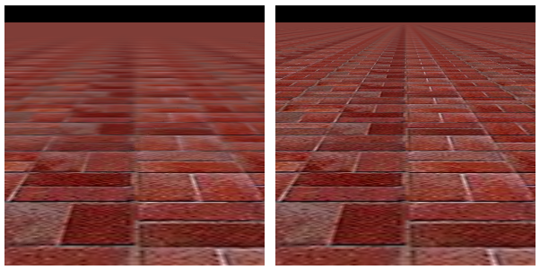

# 7.5 WebGL 扩展

**WebGL Extensions**

.. tab:: 中文

    WebGL 设计用于在各种设备上运行，包括图形能力相对有限的移动设备。因此，所有 WebGL 实现只要求有一组最小的功能集。然而，WebGL 拥有一种激活额外可选特性的机制，这些可选特性定义在 **WebGL 扩展** 中。需要 WebGL 扩展的网页并不能保证在每个 WebGL 实现中都能工作。然而，在许多情况下，编写一个有或没有扩展都能工作的页面相对容易，尽管在没有扩展的情况下可能缺少某些特性。已有几十个扩展的定义被标准化。这些标准扩展在 <https://www.khronos.org/registry/webgl/extensions/> 有文档记录。

    标准 OpenGL 也有一个扩展机制。历史上，许多 OpenGL 一个版本中的扩展特性在后续版本中成为了必需特性。对于 WebGL 扩展来说也是如此：一些 WebGL 1.0 的扩展已经被纳入为 WebGL 2.0 的必需特性。

    本节将介绍 WebGL 扩展机制，并讨论一些标准扩展。

.. tab:: 英文

    WebGL is designed to run on a wide variety of devices, including mobile devices that have relatively limited graphical capabilities. Because of this, only a minimal set of features is required of all WebGL implementations. However, WebGL has a mechanism for activating additional, optional features. The optional features are defined in **WebGL extensions**. A web page that requires a WebGL extension is not guaranteed to work in every implementation of WebGL. However, in many cases, it is fairly easy to write a page that can work with or without the extension, though perhaps with some missing feature when the extension is not available. There are several dozen extensions whose definitions have been standardized. These standard extensions are documented at <https://www.khronos.org/registry/webgl/extensions/>.

    Standard OpenGL also has an extension mechanism. Historically, many features from extensions in one version of OpenGL have become required features in later versions. The same is true for WebGL extensions: Some of the WebGL 1.0 extensions have been incorporated as required features in WebGL 2.0.

    This section covers the WebGL extension mechanism, and it discusses a few of the standard extensions.

## 7.5.1 各向异性过滤

**Anisotropic Filtering**

.. tab:: 中文

    我们从一个可以改善一些场景中纹理外观的简单扩展开始。标准的图像纹理采样过滤方法在以斜角视角观察纹理时会产生较差的结果。在这种情况下，表面上的一个像素对应于纹理中的一个梯形区域，而标准的缩放和放大过滤规则，如 *gl.LINEAR*，并不太能很好地处理这种情况。（过滤在 [4.3.2小节](../c4/s3.md#432-mipmap-和过滤) 中有介绍。）使用称为**各向异性过滤**的技术可以获得更好的结果，这需要额外的计算，它在采样纹理时考虑了梯形的形状。许多 GPU 都可以进行各向异性过滤。这不是 WebGL 实现中的必需特性，但通常作为扩展提供。各向异性过滤扩展可以以相同的方式用于 WebGL 1.0 和 WebGL 2.0。

    示例程序 [webgl/anisotropic-filtering.html](../../../en/source/webgl/anisotropic-filtering.html) 展示了如何使用各向异性过滤扩展。它展示了一个用砖块图像纹理的大型平面，可以从尖锐的斜角观察。如果扩展可用，用户可以开启和关闭各向异性过滤。如果不可用，程序仍然会绘制场景，但只使用标准过滤。以下是程序中的两张图像。右侧的图像使用了各向异性过滤。左侧没有使用各向异性过滤时，即使在离观察者适中的距离，纹理也会模糊：

    

    每个 WebGL 扩展都有一个名称。函数 *gl.getExtension(name)* 用于激活扩展，其中名称是一个包含扩展名称的字符串。如果扩展不可用，该函数的返回值为 null，你应该总是在尝试使用扩展之前检查返回值。如果返回值不是 null，那么它是一个 JavaScript 对象。该对象可能包含，例如，为了利用扩展的功能而需要传递给 WebGL 函数的常量。它还可以包含全新的函数。

    各向异性过滤扩展的名称是 "EXT_texture_filter_anisotropic." 要测试扩展的可用性并激活它，程序可以使用如下语句：

    ```js
    anisotropyExtension = gl.getExtension("EXT_texture_filter_anisotropic");
    ```

    如果 *anisotropyExtension* 是 *null*，则扩展不可用。如果它不是 null，那么该对象有一个名为 *TEXTURE_MAX_ANISOTROPY_EXT* 的属性，可以作为参数传递给 *gl.texParameteri* 来设置将应用于纹理的各向异性过滤的级别或量。例如，在创建并绑定纹理之后，程序可能会说：

    ```js
    gl.texParameteri(gl.TEXTURE_2D, 
                anisotropyExtension.TEXTURE_MAX_ANISOTROPY_EXT, 16);
    ```

    第三个参数是各向异性过滤级别。将级别设置为 1 将关闭各向异性过滤。更高的值会产生更好的结果。有一个依赖于实现的最大级别，但是请求一个大于最大值的级别并不会产生错误——你只会得到最大级别。要找出最大值，可以使用：

    ```js
    max = gl.getParameter(anisotropyExtension.MAX_TEXTURE_MAX_ANISOTROPY_EXT);
    ```

    建议在使用各向异性过滤时，将缩放过滤设置为 *gl.LINEAR_MIPMAP_LINEAR*，将放大过滤设置为 *gl.LINEAR*。一个纹理通常使用以下类似的代码进行配置：

    ```js
    gl.bindTexture(gl.TEXTURE_2D);
    gl.generateMipmap(gl.TEXTURE_2D); // 需要 mipmap 来使用缩放过滤！
    gl.texParameteri(gl.TEXTURE_2D,gl.TEXTURE_MIN_FILTER,gl.LINEAR_MIPMAP_LINEAR);
    gl.texParameteri(gl.TEXTURE_2D,gl.TEXTURE_MAG_FILTER,gl.LINEAR);
    if (anisotropyExtension != null) {
        // 只有在可用时才开启各向异性过滤。
        max = gl.getParameter(anisotropyExtension.MAX_TEXTURE_MAX_ANISOTROPY_EXT);
        gl.texParameteri(gl.TEXTURE_2D,
                anisotropyExtension.TEXTURE_MAX_ANISOTROPY_EXT, max);
    }
    ```

    如果扩展不可用，纹理可能看起来不如它本可以的那么好，但它仍然可以工作（而且只有非常细心的用户才可能注意到）。

.. tab:: 英文

    We start with a simple extension that can improve the appearance of textures in some scenes. The standard filtering methods for sampling an image texture give poor results when the texture is viewed at an oblique angle. In that case, a pixel on the surface corresponds to a trapezoidal region in the texture, and the standard minification and magnification filter rules such as *gl.LINEAR* don't handle that case very well. (Filtering was covered in [Subsection 4.3.2](../c4/s3.md#432-mipmap-和过滤).) A better result can be obtained, at the cost of additional computation, using something called **anisotropic filtering**, which samples the texture taking the trapezoidal shape into account. Many GPUs can do anisotropic filtering. It is not a required feature in WebGL implementations, but it is commonly available as an extension. The anisotropic filtering extension can be used with both WebGL 1.0 and WebGL 2.0, in the same way.

    The sample program [webgl/anisotropic-filtering.html](../../../en/source/webgl/anisotropic-filtering.html) shows how to use the anisotropic filtering extension. It shows a large plane textured with a brick image that can be viewed from a sharp, oblique angle. If the extension is available, then the user can turn anisotropic filtering on and off. If it is not available, the program will still draw the scene, but only using standard filtering. Here are two images from the program. Anisotropic filtering is used in the image on the right. On the left, without anisotropic filtering, the texture is blurred even at moderate distanced from the viewer:

    

    Each WebGL extension has a name. The function *gl.getExtension(name)* is used to activate an extension, where name is a string containing the name of the extension. The return value of the function is null if the extension is not available, and you should always check the return value before attempting to use the extension. If the return value is not null, then it is a JavaScript object. The object might contain, for example, constants that are meant to be passed to WebGL functions in order to make use of the capabilities of the extension. It can also contain completely new functions.

    The name of the anisotropic filtering extension is "EXT_texture_filter_anisotropic." To test for the availability of the extension and to activate it, a program can use a statement such as

    ```js
    anisotropyExtension = gl.getExtension("EXT_texture_filter_anisotropic");
    ```

    If *anisotropyExtension* is *null*, then the extension is not available. If it is not null, then the object has a property named *TEXTURE_MAX_ANISOTROPY_EXT* that can be used as a parameter to *gl.texParameteri* to set the level, or amount, of anisotropic filtering that will be applied to the texture. For example, after creating and binding a texture, a program might say

    ```js
    gl.texParameteri(gl.TEXTURE_2D, 
                anisotropyExtension.TEXTURE_MAX_ANISOTROPY_EXT, 16);
    ```

    The third parameter is the anisotropic filtering level. Setting the level to 1 will turn off anisotropic filtering. Higher values give better results. There is an implementation-dependent maximum level, but asking for a level greater than the maximum is not an error—you will simply get the maximum level. To find out the maximum, you can use

    ```js
    max = gl.getParameter( anisotropyExtension.MAX_TEXTURE_MAX_ANISOTROPY_EXT );
    ```

    It is recommended to use *gl.LINEAR_MIPMAP_LINEAR* as the minification filter and *gl.LINEAR* as the magnification filter when using anisotropic filtering. A texture would typically be configured using code similar to the following:

    ```js
    gl.bindTexture(gl.TEXTURE_2D);
    gl.generateMipmap(gl.TEXTURE_2D); // Need mipmaps for the minification filter!
    gl.texParameteri(gl.TEXTURE_2D,gl.TEXTURE_MIN_FILTER,gl.LINEAR_MIPMAP_LINEAR);
    gl.texParameteri(gl.TEXTURE_2D,gl.TEXTURE_MAG_FILTER,gl.LINEAR);
    if (anisotropyExtension != null) {
        // turn on anisotropic filtering only if it is available.
        max = gl.getParameter(anisotropyExtension.MAX_TEXTURE_MAX_ANISOTROPY_EXT);
        gl.texParameteri(gl.TEXTURE_2D,
                anisotropyExtension.TEXTURE_MAX_ANISOTROPY_EXT, max);
    }
    ```

    If the extension is not available, the texture might not look as good as it might have, but it will still work (and only a very observant user is likely to notice).

## 7.5.2 浮点颜色

**Floating-Point Colors**

.. tab:: 中文

    作为第二个例子，我们考虑一对名为 "OES_texture_float" 和 "WEBGL_color_buffer_float" 的扩展。第一个扩展使得可以使用颜色分量值为浮点数的纹理，而不是八位整数。第二个扩展使得可以通过将这样的纹理用作帧缓冲区的颜色缓冲区来渲染。（这些扩展仅适用于 WebGL 1.0，但是有一个类似的 WebGL 2.0 扩展，EXT_color_buffer_float。）

    为什么有人想这样做呢？八位整数对于视觉上表示颜色是足够的，但它们没有足够的精度来进行准确的计算。对于使用颜色分量进行大量数值处理的应用，浮点值是必不可少的。

    以找到图像的平均颜色值为例，这需要将大量像素的颜色值相加。这是可以通过利用 GPU 的并行处理能力来加速的。我使用两个帧缓冲区和两个纹理作为颜色缓冲区的技术来进行操作。我假设图像的宽度和高度是 2 的幂。首先将图像绘制到第一个纹理上。将图像想象成水平和垂直分成两半，得到四个等大小的矩形。作为第一步，计算一个半大小的图像，这是那四个矩形的平均值。也就是说，半大小图像中的一个像素的颜色是原始图像中四个像素颜色的平均值。这个平均图像可以通过绘制一个半大小的矩形到第二个帧缓冲区来计算，使用第一个纹理中的图像的多个样本。以下是完成这项工作的片段着色器：

    ```js
    #ifdef GL_FRAGMENT_PRECISION_HIGH
    precision highp float;
    #else
    precision mediump float;
    #endif
    varying vec2 v_coords;  // 纹理坐标，与对象坐标相同。
    uniform sampler2D texture;  // 包含原始图像的纹理。
    uniform float offset;  // 纹理坐标空间中的正方形大小。
    void main() {
        vec4 a = texture2D(texture, v_coords);
        vec4 b = texture2D(texture, v_coords + vec2(offset,0));
        vec4 c = texture2D(texture, v_coords + vec2(0,offset));
        vec4 d = texture2D(texture, v_coords + vec2(offset,offset));
        gl_FragColor = (a + b + c + d)/4.0;  // 颜色是四个样本的平均值。
    }
    ```

    在这第一步中，绘制了顶点在 (0,0) 和 (0.5,0.5) 的正方形，*offset* 是 0.5。绘制是在坐标系统中完成的，其中顶点为 (0,0) 和 (1,1) 的正方形覆盖了整个绘图区域。在那个坐标系统中，顶点在 (0,0) 和 (0.5,0.5) 的正方形覆盖了绘图区域的左下四分之一。片段着色器中的第一个样本来自纹理图像的那个四分之一，另外三个样本来自图像其他三个四分之一中的对应点。

    在第二步中，两个帧缓冲区的角色被交换，绘制了顶点在 (0,0) 和 (0.25,0.25) 的正方形，使用相同的片段着色器，*offset* 等于 0.25。由于帧缓冲区被交换了，第二步是采样第一步产生的半大小图像。结果是四分之一大小的图像，它是覆盖半大小图像的四个矩形的平均值——因此也是覆盖原始图像的 16 个矩形的平均值。这可以重复进行，使用越来越小的正方形，直到结果图像足够小，其颜色可以有效地读回到 CPU 并在其中平均。得到的是一个颜色值，它是原始图像中所有像素颜色的平均值。我们期望，由于 GPU 并行完成了大量的工作，使用这种技术我们可以得到比在 CPU 上完成所有计算更快的答案。

    这里的关键是，为了获得准确的结果，我们希望颜色分量在 GPU 中以浮点值表示，而不是八位整数。

    ----

    我在示例程序 [webgl/image-evolver.html](../../../en/source/webgl/image-evolver.html) 中使用了这种技术。在这个程序中，问题是找到两幅图像之间平均*差异*的颜色。我首先将两幅图像绘制到两个纹理上。然后，我渲染一个差异图像，其中像素的颜色是两个纹理中相同像素颜色差异的绝对值。这是用另一个特殊用途的着色器程序完成的。然后，我将上述平均过程应用于差异图像。

    示例程序的实际目的是尝试使用“遗传算法”“进化”出一个给定图像的近似值。（它的灵感来自我2015年秋季课程的两位学生，Felix Taschbach 和 Pieter Schaap，他们为他们的项目做了一个类似的程序，尽管他们没有使用 GPU。）在程序中，原始图像与近似值之间的平均差异被用作衡量近似值有多好的指标。我使用了一个非常简单的灰度图像作为目标，用小方块制作近似值。您不需要知道任何关于遗传算法的信息，特别是因为该程序没有实际用途。然而，如果您想尝试理解它，源代码有大量的注释。这是程序在一个特别成功的运行中的截图，显示了原始图像和在运行遗传算法7500代后产生的最好近似值：

    

    但我们在这里感兴趣的是程序如何使用 WebGL 浮点颜色扩展。程序在初始化期间尝试激活扩展，使用以下代码：

    ```js
    let EXTcbf = gl.getExtension("WEBGL_color_buffer_float");
    let EXTtf = gl.getExtension("OES_texture_float");
    if (!EXTcbf || !EXTtf) {
        throw new Error("This program requires the WebGL extension" + 
                "WEBGL_color_buffer_float, which is not available in this browser.");
    }
    ```

    程序需要这些扩展，所以如果无法激活它们，就会抛出异常。扩展对象 *EXTcbf* 和 *EXTtf* 在这个程序中没有需要的属性；然而，调用 *gl.getExtension* 来激活扩展仍然是必要的。

    程序创建了两个浮点纹理，它们附加到帧缓冲区用作颜色缓冲区。（见 [7.4.2小节](../c7/s4.md#742-渲染到纹理)。）以下是创建其中一个纹理的代码：

    ```js
    tex1 = gl.createTexture();
    gl.bindTexture(gl.TEXTURE_2D, tex1);
    gl.texImage2D(gl.TEXTURE_2D, 0, gl.RGBA, 256, 256, 0, gl.RGBA, gl.FLOAT, null);
    ```

    最后一行的参数 *gl.FLOAT* 指定了纹理中颜色分量的数据类型为 ***float***。如果扩展没有被激活，该数据类型将是错误的。

    当 GPU 使用这些纹理进行平均计算时，它正在进行浮点计算。程序计算了一系列越来越小的平均图像，最后以一个 4x4 像素的图像结束。然后，它使用以下代码将 16 个像素颜色从纹理中读回：

    ```js
    let data = new Float32Array( 4*4*4 ); // 16 个像素，每个像素 4 个数字
    gl.readPixels(0,0,4,4,gl.RGBA,gl.FLOAT,data)
    ```

    *gl.readPixels* 调用将 16 个像素的颜色数据读入数组 *data* 中。同样，*gl.FLOAT* 参数指定了数据类型，只有在激活了扩展之后，该参数值在 *gl.readPixels* 中才是合法的。

.. tab:: 英文

    As a second example, we consider a pair of extensions named "OES_texture_float" and "WEBGL_color_buffer_float". The first of these makes it possible to use textures in which color component values are floating-point numbers, instead of eight-bit integers. The second makes it possible to render to such a texture by using it as the color buffer in a framebuffer. (These extensions are only for WebGL 1.0, but there is a similar WebGL 2.0 extension, EXT_color_buffer_float.)

    Why would someone want to do this? Eight-bit integers are fine for representing colors visually, but they don't have enough precision for doing accurate calculations. For applications that do significant numerical processing with color components, floating-point values are essential.

    As an example, consider finding the average color value of an image, which requires adding up the color values from a large number of pixels. This is something that can be speeded up by using the parallel processing power of a GPU. My technique for doing so uses two framebuffers, with two textures serving as color buffers. I assume that the image width and height are powers of two. Start by drawing the image to the first texture. Think of the image as divided in half, horizontally and vertically, giving four equal-sizes rectangles. As a first step, compute a half-size image that is the average of those four rectangles. That is, the color of a pixel in the half-size image is the average of the colors of four pixels in the original. The averaged image can be computed by drawing a half-size rectangle to the second framebuffer, using multiple samples from the image in the first texture. Here is a fragment shader that does the work:

    ```js
    #ifdef GL_FRAGMENT_PRECISION_HIGH
    precision highp float;
    #else
    precision mediump float;
    #endif
    varying vec2 v_coords;  // Texture coordinates, same as object coords.
    uniform sampler2D texture;  // A texture containing the original image.
    uniform float offset;  // Size of square in texture coordinate space.
    void main() {
        vec4 a = texture2D(texture, v_coords);
        vec4 b = texture2D(texture, v_coords + vec2(offset,0));
        vec4 c = texture2D(texture, v_coords + vec2(0,offset));
        vec4 d = texture2D(texture, v_coords + vec2(offset,offset));
        gl_FragColor = (a + b + c + d)/4.0;  // Color is average of four samples.
    }
    ```

    In this first pass, the square with vertices at (0,0) and (0.5,0.5) is rendered, and *offset* is 0.5. The drawing is done in a coordinate system in which the square with vertices (0,0) and (1,1) covers the entire drawing area. In that coordinate system, the square with vertices at (0,0) and (0.5,0.5) covers the lower left quarter of the drawing area. The first sample in the fragment shader comes from that quarter of the texture image, and the other three samples come from corresponding points in the other three quarters of the image.

    In a second pass, the roles of the two framebuffers are swapped, and a square with vertices at (0,0) and (0.25,0.25) is drawn, using the same fragment shader with *offset* equal to 0.25. Since the framebuffers were swapped, the second pass is sampling the half-sized image that was produced in the first pass. The result is a quarter-sized image that is the average of four rectangles that cover the half-sized image—and therefore of 16 rectangles that cover the original image. This can be repeated, with smaller and smaller squares, until the resulting image is small enough that its colors can be efficiently read back into the CPU and averaged there. The result is a color value that is the average of all the pixels from the original image. We expect that, because a lot of the work is done in parallel by the GPU, we can get the answer much faster using this technique than if we had simply done all the computations on the CPU.

    The point here is that for an accurate result, we want the color components to be represented as floating point values in the GPU, not as eight-bit integers.

    ----

    I use this technique in the sample program [webgl/image-evolver.html](../../../en/source/webgl/image-evolver.html). In that program, the problem is to find the average *difference* in color between two images. I start by drawing the two images to two textures. I then render a difference image, in which the color of a pixel is the absolute value of the difference between the colors of the same pixel in the two textures. This is done with another special-purpose shader program. I then apply the above averaging process to the difference image.

    The actual point of the sample program is to try to "evolve" an approximation to a given image, using a "genetic algorithm." (It was inspired by two students from my Fall, 2015 class, Felix Taschbach and Pieter Schaap, who worked on a similar program for their final project, though they didn't use the GPU.) In the program, the average difference between the original image and an approximation is used as a measure of how good the approximation is. I used a very simple grayscale image as the goal, with approximations made from small squares. You don't need to know anything about the genetic algorithm, especially since the program has no practical purpose. However, the source code is heavily commented if you want to try to understand it. Here is a screenshot from one particularly successful run of the program, showing the original image and the best approximation produced after running the genetic algorithm for 7500 generations:

    

    But what interests us here is how the program uses the WebGL floating-point color extensions. The program attempts to activate the extensions during initialization using the following code:

    ```js
    let EXTcbf = gl.getExtension("WEBGL_color_buffer_float");
    let EXTtf = gl.getExtension("OES_texture_float");
    if (!EXTcbf || !EXTtf) {
    throw new Error("This program requires the WebGL extension" + 
            "WEBGL_color_buffer_float, which is not available in this browser.");
    }
    ```

    The program requires the extensions, so an exception is thrown if they can't be activated. The extension objects, *EXTcbf* and *EXTtf*, don't have any properties that are needed in this program; however, it is still necessary to call *gl.getExtension* to activate the extensions.

    The program creates two floating-point textures that are attached to framebuffers for use as color buffers. (See [Subsection 7.4.2](../c7/s4.md#742-渲染到纹理).) Here is the code that creates one of those textures:

    ```js
    tex1 = gl.createTexture();
    gl.bindTexture(gl.TEXTURE_2D, tex1);
    gl.texImage2D(gl.TEXTURE_2D, 0, gl.RGBA, 256, 256, 0, gl.RGBA, gl.FLOAT, null);
    ```

    The parameter *gl.FLOAT* in the last line specifies that the data type for the color components in the texture is ***float***. That data type would be an error if the extensions had not been activated.

    When the GPU does the averaging computation with these textures, it is doing floating-point calculations. The program computes a series of smaller and smaller averaged images, stopping with a 4-by-4 pixel image. It then reads the 16 pixel colors back from the texture using the following code:

    ```js
    let data = new Float32Array( 4*4*4 ); // 16 pixels, 4 numbers per pixels
    gl.readPixels(0,0,4,4,gl.RGBA,gl.FLOAT,data)
    ```

    The call to *gl.readPixels* reads the color data for the 16 pixels into the array, *data*. Again, the *gl.FLOAT* parameter specifies the data type, and that parameter value is legal in *gl.readPixels* only because the extensions have been activated.

## 7.5.3 WebGL 1.0 中的实例化绘图

**Instanced Drawing in WebGL 1.0**

.. tab:: 中文

    [6.1.7小节](../c6/s1.md#617-webgl-20顶点数组对象) 和 [6.1.8小节](../c6/s1.md#618-webgl-20实例化绘图) 讨论了 WebGL 2.0 的两个特性：顶点数组对象（Vertex Array Objects，VAOs）和实例化绘图。尽管这些特性不是 WebGL 1.0 的标准部分，但两者都可以作为可选的 WebGL 1.0 扩展来使用。VAOs 由扩展 "OES_vertex_array_object" 启用，而实例化绘图由 "ANGLE_instanced_arrays" 启用。作为示例，我们简要地看一下 WebGL 1.0 中的实例化绘图。

    示例 WebGL 1.0 程序 [webgl/instancing-test-webgl1.html](../../../en/source/webgl/instancing-test-webgl1.html) 使用了实例化绘图扩展。它是从 [6.1.8小节](../c6/s1.md#618-webgl-20实例化绘图) 中的示例 WebGL 2.0 程序修改而来的，修改为使用版本 1.0，但功能完全相同。要在 WebGL 1.0 中使用实例化绘图，必须启用相应的扩展：

    ```js
    instancedDrawExt = gl.getExtension("ANGLE_instanced_arrays");
    if (!instancedDrawExt) {
        throw new Error("WebGL 1.0 Instanced Arrays extension is required.");
    }
    ```

    扩展对象 *instancedDrawExt* 包含与 WebGL 2.0 中实例化绘图功能等价的函数：*gl.vertexAttribDivisor()*、*gl.drawArraysInstanced()* 和 *gl.drawElementsInstanced()*。然而，这些函数是扩展对象的属性，而不是图形上下文 gl 的属性，它们的名字中附加了 "ANGLE" 这个词。因此，原始 WebGL 2.0 程序中的命令

    ```js
    gl.drawArraysInstanced(gl.TRIANGLE_FAN, 0, 64, DISK_COUNT);
    ```

    在 WebGL 1.0 程序中被替换为

    ```js
    instancedDrawExt.drawArraysInstancedANGLE(gl.TRIANGLE_FAN, 0, 64, DISK_COUNT);
    ```

    同样地，

    ```js
    gl.vertexAttribDivisor(a_color_loc,1);
    ```

    变为

    ```js
    instancedDrawExt.vertexAttribDivisorANGLE(a_color_loc,1);
    ```

    请注意，通常情况下，一个不使用任何扩展的 WebGL 1.0 程序将无需任何修改即可作为 WebGL 2.0 程序工作。然而，如果 WebGL 1.0 程序使用了在 WebGL 2.0 中不再可用或不再需要的扩展，那么将需要一些工作来将程序转换为 WebGL 2.0。

.. tab:: 英文

    [Subsection 6.1.7](../c6/s1.md#617-webgl-20顶点数组对象) and [Subsection 6.1.8](../c6/s1.md#618-webgl-20实例化绘图) discussed two features of WebGL 2.0, Vertex Array Objects and instanced drawing. Although these features are not a standard part of WebGL 1.0, both are available as optional WebGL 1.0 extensions. VAOs are enabled by the extension "OES_vertex_array_object", while instanced drawing is enabled by "ANGLE_instanced_arrays". As an example, we look briefly at instanced drawing in WebGL 1.0.

    The sample WebGL 1.0 program [webgl/instancing-test-webgl1.html](../../../en/source/webgl/instancing-test-webgl1.html) uses the instanced drawing extension. It is a copy of the sample WebGL 2.0 program from [Subsection 6.1.8](../c6/s1.md#618-webgl-20实例化绘图), modified to use version 1.0, but with exactly the same functionality. To use instanced drawing in WebGL 1.0, the appropriate extension has to be enabled:

    ```js
    instancedDrawExt = gl.getExtension("ANGLE_instanced_arrays");
    if (!instancedDrawExt) {
        throw new Error("WebGL 1.0 Instanced Arrays extension is required.");
    }
    ```

    The extension object, *instancedDrawExt*, contains functions that are equivalent to the WebGL 2.0 functions for instanced drawing: *gl.vertexAttribDivisor()*. *gl.drawArraysInstanced()*, and *gl.drawElementsInstanced()*. However, the functions are properties of the extension object, not of the graphics context gl, and their names have the word "ANGLE" appended. So, the command

    ```js
    gl.drawArraysInstanced(gl.TRIANGLE_FAN, 0, 64, DISK_COUNT);
    ```

    from the original WebGL 2.0 program is replaced by

    ```js
    instancedDrawExt.drawArraysInstancedANGLE(gl.TRIANGLE_FAN, 0, 64, DISK_COUNT);
    ```

    in the WebGL 1.0 program. And

    ```js
    gl.vertexAttribDivisor(a_color_loc,1);
    ```

    becomes

    ```js
    instancedDrawExt.vertexAttribDivisorANGLE(a_color_loc,1);
    ```

    Note that, in general, a WebGL 1.0 program that does **not** use any extensions will work as a WebGL 2.0 program without any modifications. However, if the WebGL 1.0 program uses extensions that are no longer available or no longer needed in WebGL 2.0, some work will be required to convert the program to WebGL 2.0.

## 7.5.4 延迟着色

**Deferred Shading**

.. tab:: 中文

    我们将讨论一个 WebGL 1.0 的扩展，这个扩展对于一种称为**延迟着色**的重要渲染技术非常有用。我没有延迟渲染的示例程序，而且我只会在一般术语中讨论它。

    延迟着色被用作渲染复杂场景时的优化，并且经常用于加速视频游戏中的渲染。它与光照最密切相关，因为它可以用来渲染具有大量光源的场景，但对其他效果也有用。

    回想一下，在 OpenGL 或 WebGL 着色器中可以表示的光源数量是有限的。但是，可以使用多遍算法来渲染具有许多光源的场景：每个遍历计算一个光源或少数几个光源的贡献，并将遍历的结果相加以给出完整的场景。问题是，如果每个遍历的渲染都以正常方式完成，那么有很多必须重新计算的事情，以完全相同的方式，在每个遍历中。例如，假设使用逐像素光照，包括计算每个像素的材质属性和单位法线向量。延迟着色旨在避免重复的工作。

    在延迟着色中，第一个遍历用于计算图像中每个像素的材质属性、法线向量以及所需的其他数据。所有这些数据都被保存起来，以便在额外的遍历中用于计算光照和其他可能的效果。对于给定的像素，只保存在像素处实际可见的对象的数据，因为隐藏表面的数据不需要渲染场景。第一个遍历使用场景中对象的几何体和属性。后续遍历需要了解的关于几何体和属性的所有信息都在保存的数据中。

    保存的数据可以存储在纹理对象中。（浮点纹理对象非常适合此目的，因为数据将用于进一步的计算。）在这种情况下，纹理中的值并不一定代表图像。例如，一个纹理中的 RGB 颜色分量可能表示法线向量的 x、y 和 z 坐标。如果后续遍历中需要深度值，它可能存储在同一纹理的 alpha 颜色分量中。另一个纹理可能保存漫反射颜色，而第三个纹理在其 RGB 分量中保存镜面颜色，并在其 alpha 分量中保存光泽度值。着色器程序可以自由地以它们喜欢的方式解释纹理中的数据。

    ---

    WebGL 着色器可以写入纹理数据，使用帧缓冲区。但是标准的 WebGL 1.0 一次只能写入一个帧缓冲区。现在，我们可以使用每个需要计算的纹理的单独遍历来完成，但这将涉及到大量的冗余计算，这正是我们试图避免的。我们需要一个 WebGL 扩展，使得着色器可以同时写入多个帧缓冲区。我们需要的扩展名为 "WEBGL_draw_buffers"。当激活该扩展时，可以将多个纹理（或渲染缓冲区）附加到帧缓冲区，并且使得着色器可以同时将数据写入所有附加的着色器。这个扩展使用起来相对复杂。它必须像通常一样通过以下形式的语句激活：

    ```js
    EXTdb = gl.getExtension("WEBGL_draw_buffers");
    ```

    假设扩展可用，着色器中可以使用的最大颜色缓冲区数量由 *EXTdb.MAX_DRAW_BUFFERS_WEBGL* 给出，至少为四个。有了这个扩展，你可以使用以下形式的代码将多个纹理作为颜色缓冲区附加到帧缓冲区：

    ```js
    gl.bindFramebuffer(gl.FRAMEBUFFER, framebuffer);
    gl.framebufferTexture2D(gl.FRAMEBUFFER, 
        EXTdb.COLOR_ATTACHMENT0_WEBGL, gl.TEXTURE_2D, texture1, 0);
    gl.framebufferTexture2D(gl.FRAMEBUFFER, 
        EXTdb.COLOR_ATTACHMENT1_WEBGL, gl.TEXTURE_2D, texture2, 0);
    ```

    以此类推，使用扩展对象中的常量如 *EXTdb.COLOR_ATTACHMENT1_WEBGL* 来指定附加点。

    通常在片段着色器中，输出到颜色缓冲区的颜色是通过给特殊变量 *gl_FragColor* 分配一个值来指定的。当使用多个颜色缓冲区时，情况会发生变化。在这种情况下，片段着色器有一个特殊的变量 gl_FragData，它是一个 vec4 数组，每个可能的颜色缓冲区一个。通过给 *gl_FragData[0], gl_FragData[1], ....* 分配值，将颜色输出到颜色缓冲区。因为这是着色器合法语法的一个变化，所以还必须通过在代码开头添加以下行来在片段着色器源代码中激活扩展：

    ```js
    #extension GL_EXT_draw_buffers : require
    ```

    假设我们想要在颜色缓冲区中存储法线向量、漫反射颜色、镜面颜色和对象坐标。假设这些值作为变化变量或 uniform 变量输入到着色器中，除了漫反射颜色，它是从纹理中采样的。那么片段着色器可能采用以下形式：

    ```js
    #extension GL_EXT_draw_buffers : require
    precision highp float;
    varying vec3 v_normal, v_objectCoords;
    varying vec2 v_texCoords;
    uniform vec3 u_specular;
    uniform float u_shininess;
    uniform sampler2D texture;
    void main() {
        gl_FragData[0] = vec4( normalize(v_normal), 0 );
        gl_FragData[1] = vec4( v_object_coords, 1 );
        gl_FragData[2] = texture2D( texture, v_texCoords );
        gl_fragData[3] = vec4( u_specular, u_shininess );
    }
    ```

    使用扩展的最后一个要求是指定在 gl_FragData 中使用的索引与附加到帧缓冲区的颜色缓冲区之间的对应关系。似乎这种对应关系应该是自动的，但实际上不是。你必须使用扩展对象中的 JavaScript 函数 *EXTdb.drawBuffersWEBGL* 来指定它。这个函数接受一个数组作为参数，数组中的值从常量 *EXTdb.COLOR_ATTACHMENT0_WEBGL*, *EXTdb.COLOR_ATTACHMENT1_WEBGL*, .... 中选择。这些与在帧缓冲区中指定颜色缓冲区附加点时使用的常量相同。例如，如果你出于某种原因想要片段着色器输出到附加在 2 和 3 附件点的颜色缓冲区，你会调用：

    ```js
    EXTdb.drawBuffersWEBGL( [
        EXTdb.COLOR_ATTACHMENT2_WEBGL,
        EXTdb.COLOR_ATTACHMENT3_WEBGL
    ] );
    ```

    经过所有这些设置之后，你就可以进行延迟着色的第一个遍历了。对于后续的遍历，你会使用一个不同的着色器，只有一个颜色缓冲区。对于这些遍历，你希望在图像中的每个像素上运行一次片段着色器。片段着色器将使用在第一个遍历中保存的像素数据以及其他信息（如光源属性）来计算像素的输出颜色。你可以通过绘制一个覆盖图像的单个矩形来简单地触发对每个像素的片段着色器的调用。

    延迟着色背后的理论并不复杂，但在实现中有很多细节需要正确处理。延迟着色只是视频游戏程序员用来提高他们游戏渲染速度的众多技巧之一。

.. tab:: 英文

    I will discuss one more WebGL 1.0 extension, one that is useful for an important rendering technique called **deferred shading**. I don't have a sample program for deferred rendering, and I will only discuss it in general terms.

    Deferred shading is used as an optimization when rendering complex scenes, and it is often used to speed up rendering in video games. It is most closely associated with lighting, since it can be used to render scenes with large numbers of light sources, but it can also be useful for other effects.

    Recall that the number of lights that can be represented in OpenGL or in a WebGL shader is limited. But scenes with many lights can be rendered using a multi-pass algorithm: Each pass computes the contribution of one light, or a small number of lights, and the results of the passes are added together to give the complete scene. The problem is that, if the rendering in each pass is done in the normal way, then there are a lot of things that have to be recomputed, in exactly the same way, in each pass. For example, assuming that per-pixel lighting is used, that includes computing material properties and a unit normal vector for each pixel in the image. Deferred shading aims to avoid the duplicated effort.

    In deferred shading, a first pass is used to compute material properties, normal vectors, and whatever other data is needed, for each pixel in the image. All of that data is saved, to be used in additional passes that will compute lighting and possibly other effects. For a given pixel, only the data for the object that is actually visible at the pixel is saved, since data for hidden surfaces is not needed to render the scene. The first pass uses the geometry and attributes of objects in the scene. Everything that the later passes need to know about geometry and attributes is in the saved data.

    The saved data can be stored in texture objects. (Floating point textures are ideal for this, since the data will be used in further calculations.) In this case, the values in the textures don't necessarily represent images. For example, the RGB color components in one texture might represent the x, y, and z coordinates of a normal vector. And if a depth value is needed in later passes, it might be stored in the alpha color component of the same texture. Another texture might hold a diffuse color, while a third holds a specular color in its RGB components and a shininess value in its alpha component. Shader programs are free to interpret data in a texture however they like.

    ----

    A WebGL shader can write data to a texture, using a framebuffer. But standard WebGL 1.0 can only write to one framebuffer at a time. Now, it would be possible to use a separate pass for each texture that we need to compute, but that would involve a lot of redundant calculations, which is what we are trying to avoid. What we need is a WebGL extension that makes it possible for a shader to write to several framebuffers simultaneously. The extension that we need is named "WEBGL_draw_buffers". When that extension is activated, it becomes possible to attach several textures (or renderbuffers) to a framebuffer, and it becomes possible for a shader to write data to all of the attached shaders simultaneously. The extension is relatively complicated to use. It must be activated, as usual, with a statement of the form

    ```js
    EXTdb = gl.getExtension("WEBGL_draw_buffers");
    ```

    Assuming that the extension is available, the maximum number of color buffers that can be used in a shader is given by *EXTdb.MAX_DRAW_BUFFERS_WEBGL*, which will be at least four. With the extension in place, you can attach multiple textures as color buffers for a framebuffer, using code of the form

    ```js
    gl.bindFramebuffer(gl.FRAMEBUFFER, framebuffer);
    gl.framebufferTexture2D(gl.FRAMEBUFFER, 
        EXTdb.COLOR_ATTACHMENT0_WEBGL, gl.TEXTURE_2D, texture1, 0);
    gl.framebufferTexture2D(gl.FRAMEBUFFER, 
        EXTdb.COLOR_ATTACHMENT1_WEBGL, gl.TEXTURE_2D, texture2, 0);
    ```

    and so on, using constants such as *EXTdb.COLOR_ATTACHMENT1_WEBGL* from the extension object to specify the attachment points.

    Usually in a fragment shader, the color that is output to the color buffer is specified by assigning a value to the special variable *gl_FragColor*. That changes when multiple color buffers are used. In that case, instead of *gl_FragColor*, the fragment shader has a special variable gl_FragData which is an array of vec4, one for each possible color buffer. Colors are output to the color buffers by assigning values to *gl_FragData[0], gl_FragData[1], ....* Because this is a change in the legal syntax of the shader, the extension must also be activated in the fragment shader source code by adding the line

    ```js
    #extension GL_EXT_draw_buffers : require
    ```

    to the beginning of the code. Suppose, for example, that we want to store a normal vector, a diffuse color, a specular color, and object coordinates in the color buffers. Let's say that these values are input to the fragment shader as varying variables or uniform variables, except for the diffuse color, which is sampled from a texture. Then the fragment shader might take the form

    ```js
    #extension GL_EXT_draw_buffers : require
    precision highp float;
    varying vec3 v_normal, v_objectCoords;
    varying vec2 v_texCoords;
    uniform vec3 u_specular;
    uniform float u_shininess;
    uniform sampler2D texture;
    void main() {
        gl_FragData[0] = vec4( normalize(v_normal), 0 );
        gl_FragData[1] = vec4( v_object_coords, 1 );
        gl_FragData[2] = texture2D( texture, v_texCoords );
        gl_fragData[3] = vec4( u_specular, u_shininess );
    }
    ```

    The final requirement for using the extension is to specify the correspondence between the indices that are used in gl_FragData and the color buffers that have been attached to the framebuffer. It seems like the correspondence should be automatic, but it's not. You have to specify it using the JavaScript function, *EXTdb.drawBuffersWEBGL* from the extension object. This function takes an array as parameter, and the values in the array are chosen from the constants *EXTdb.COLOR_ATTACHMENT0_WEBGL*, *EXTdb.COLOR_ATTACHMENT1_WEBGL*, .... These are the same constants that are used to specify the color buffer attachment points in a framebuffer. For example, if for some reason you wanted a fragment shader to output to the color buffers that are attached at attachment points 2 and 3, you would call

    ```js
    EXTdb.drawBuffersWEBGL( [
        EXTdb.COLOR_ATTACHMENT2_WEBGL,
        EXTdb.COLOR_ATTACHMENT3_WEBGL
    ] );
    ```

    After all that setup, you are ready to do the first pass for deferred shading. For the subsequent passes, you would use a different shader, with a single color buffer. For those passes, you want to run the fragment shader once for each pixel in the image. The fragment shader will use the pixel data that was saved in the first pass, together with other information such as light properties, to compute the output color for the pixel. You can trigger a call to the fragment shader for each pixel simply by drawing a single rectangle that covers the image.

    The theory behind deferred shading is not all that complicated, but there are a lot of details to get right in the implementation. Deferred shading is just one of many tricks that are used by video game programmers to improve the rendering speed for their games.

## 7.5.5 WebGL 2.0 中的多个绘制缓冲区

**Multiple Draw Buffers in WebGL 2.0**

.. tab:: 中文

    能够写入多个绘制缓冲区是 WebGL 2.0 的标准部分。示例程序 [webgl/multiple-draw-buffers-webgl2.html](../../../en/source/webgl/multiple-draw-buffers-webgl2.html) 是一个简单的演示。该程序获取一个示例图像，并通过附加三个纹理到帧缓冲区，并将每种颜色分量写入其中一个纹理，将其分解为显示原始图像的红色、绿色和蓝色颜色分量的三个独立图像。然后，每个纹理的图像被复制到屏幕上，作为灰度图像显示。

    程序必须创建并为三个纹理对象分配存储，并将它们绑定到帧缓冲区作为颜色缓冲区。以下是执行此操作的代码：

    ```js
    framebuffer = gl.createFramebuffer();
    gl.bindFramebuffer(gl.FRAMEBUFFER, framebuffer);
    texture0 = gl.createTexture();
    gl.bindTexture(gl.TEXTURE_2D, texture0);
    gl.texStorage2D(gl.TEXTURE_2D, 1, gl.R8, 320, 399);
    gl.framebufferTexture2D(gl.FRAMEBUFFER, 
            gl.COLOR_ATTACHMENT0, gl.TEXTURE_2D, texture0, 0);
    texture1 = gl.createTexture();
    gl.bindTexture(gl.TEXTURE_2D, texture1);
    gl.texStorage2D(gl.TEXTURE_2D, 1, gl.R8, 320, 399);
    gl.framebufferTexture2D(gl.FRAMEBUFFER, 
            gl.COLOR_ATTACHMENT1, gl.TEXTURE_2D, texture1, 0);
    texture2 = gl.createTexture();
    gl.bindTexture(gl.TEXTURE_2D, texture2);
    gl.texStorage2D(gl.TEXTURE_2D, 1, gl.R8, 320, 399);
    gl.framebufferTexture2D(gl.FRAMEBUFFER, 
            gl.COLOR_ATTACHMENT2, gl.TEXTURE_2D, texture2, 0);
    ```

    纹理以格式 *gl.R8* 创建，每个像素存储一个八位无符号整数；这对于灰度图像是足够的。（对于此格式，一个 8 位整数被考虑为被缩放以表示范围在 0.0 到 1.0 内的颜色值。）

    必须调用函数 *gl.drawBuffers()* 以启用写入多个绘制缓冲区，并指定输出目标。目标被指定为帧缓冲区上的附件点数组：

    ```js
    gl.drawBuffers([
        gl.COLOR_ATTACHMENT0, gl.COLOR_ATTACHMENT1, gl.COLOR_ATTACHMENT2
    ]);
    ```

    此示例的着色器程序使用 GLSL ES 3.00 编写，在片段着色器中使用 out 变量将输出发送到绘制缓冲区。当有一个 out 变量时，它自动将输出发送到第一个绘制缓冲区（绘制缓冲区编号零）。当有多个 out 变量时，必须使用布局限定符为每个 out 变量指定目标编号。在片段着色器中为 out 变量指定的 *location* 是传递给 *gl.drawBuffers()* 的附件点数组的索引。以下是一个示例，来自示例程序的片段着色器：

    ```js
    #version 300 es
    precision mediump float;
    uniform sampler2D u_picture; // 包含原始图像的纹理
    in vec2 v_coords;
    layout(location = 0) out float red;   // 写入绘制缓冲区 0
    layout(location = 1) out float green; // 写入绘制缓冲区 1
    layout(location = 2) out float blue;  // 写入绘制缓冲区 2
    void main() {
        vec4 color = texture(u_picture, v_coords);
        red = color.r;
        green = color.g;
        blue = color.b;
    }
    ```

    这个片段着色器将原始图像中单独的 RGB 颜色分量发送到附加到帧缓冲区的三个纹理。

    这是一个相当简单且不太有用的使用多个绘制缓冲区的示例，但它确实展示了这样做所需的所有步骤。

.. tab:: 英文

    The ability to write to multiple draw buffers is a standard part of WebGL 2.0. The sample program [webgl/multiple-draw-buffers-webgl2.html](../../../en/source/webgl/multiple-draw-buffers-webgl2.html) is a simple demonstration. This program takes a sample image and breaks it up into three separate images that show the red, green, and blue color components from the original image. It does that by attaching three textures to a framebuffer, and writing each color component to one of the textures. The image from each texture is then copied to the screen as a grayscale image.

    The program has to create and allocate storage for three texture objects, and bind them to a frame buffer as color buffers. Here is the code that does this:

    ```js
    framebuffer = gl.createFramebuffer();
    gl.bindFramebuffer(gl.FRAMEBUFFER,framebuffer);
    texture0 = gl.createTexture();
    gl.bindTexture(gl.TEXTURE_2D, texture0);
    gl.texStorage2D(gl.TEXTURE_2D, 1, gl.R8, 320, 399);
    gl.framebufferTexture2D(gl.FRAMEBUFFER, 
                gl.COLOR_ATTACHMENT0, gl.TEXTURE_2D, texture0, 0);
    texture1 = gl.createTexture();
    gl.bindTexture(gl.TEXTURE_2D, texture1);
    gl.texStorage2D(gl.TEXTURE_2D, 1, gl.R8, 320, 399);
    gl.framebufferTexture2D(gl.FRAMEBUFFER, 
                gl.COLOR_ATTACHMENT1, gl.TEXTURE_2D, texture1, 0);
    texture2 = gl.createTexture();
    gl.bindTexture(gl.TEXTURE_2D, texture2);
    gl.texStorage2D(gl.TEXTURE_2D, 1, gl.R8, 320, 399);
    gl.framebufferTexture2D(gl.FRAMEBUFFER, 
                gl.COLOR_ATTACHMENT2, gl.TEXTURE_2D, texture2, 0);
    ```

    The textures are created with format *gl.R8*, which stores one eight-bit unsigned integer per pixel; that is sufficient for a grayscale image. (For this format, an 8-bit integer is considered to be scaled to represent a color value in the range 0.0 to 1.0.)

    The function *gl.drawBuffers()* must be called to enable writing to multiple draw buffers and to specify the output destinations. The destinations are specified as an array of attachment points on the framebuffer:

    ```js
    gl.drawBuffers( [
        gl.COLOR_ATTACHMENT0, gl.COLOR_ATTACHMENT1, gl.COLOR_ATTACHMENT2
    ] );
    ```

    The shader programs for this example are written in GLSL ES 3.00, which uses out variables in the fragment shader to send output to draw buffers. When there is a single out variable, it automatically sends output to the first draw buffer (draw buffer number zero). When there is more than one out variable, the destination number must be specified for every out variable using a layout qualifier. The *location* specified for an out variable in the fragment shader is an index into the array of attachment points that was passed to *gl.drawBuffers()*. As an example, here is the fragment shader from the sample program:

    ```js
    #version 300 es
    precision mediump float;
    uniform sampler2D u_picture; // texture containing original image
    in vec2 v_coords;
    layout(location = 0) out float red;   // write to draw buffer 0
    layout(location = 1) out float green; // write to draw buffer 1
    layout(location = 2) out float blue;  // write to draw buffer 2
    void main() {
        vec4 color = texture(u_picture, v_coords);
        red = color.r;
        green = color.g;
        blue = color.b;
    }
    ```

    This fragment shader sends the separate RGB color components from the original image to the three textures that are attached to the framebuffer.

    This is a fairly simple and not-very-useful example of using multiple draw buffers, but it does illustrate all the steps that are required to do so.
