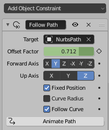
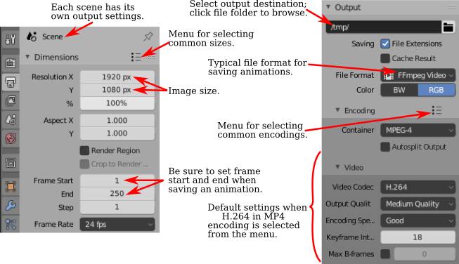

# B.3 节  [Blender 动画](./a2/s3.md)

**Section B.3  Blender Animation**

=== "中文"

    Blender 可以用来创建动画和视频。我们将在 Blender 中探讨基本的关键帧动画以及几种无法通过简单关键帧完成的动画类型。在本节的最后，我将解释如何在 Blender 中渲染动画。

=== "英文"

    Blender can be used to create animations and videos. We will look at basic keyframe animation in Blender as well as a couple kinds of animation that can't be done with simple keyframes. At the end of the section, I will explain how to render an animation in Blender.

## B.3.1  关键帧动画和函数曲线

**B.3.1  Keyframe Animation and F-Curves**

=== "中文"

    Blender 使用“关键帧动画”。也就是说，在动画中的几个“关键”帧上设置属性值，例如位置或比例，Blender 将通过在关键帧的值之间进行插值来计算其他帧的值。插值的确切方式由一组“F-曲线”决定，您可以编辑这些曲线以完全控制插值（以及关键帧之外的外推）。

    在默认 Blender 窗口的底部有一个时间轴区域，其中包含有关动画的一些信息，并允许您控制它们：

    

    时间轴显示了动画的起始帧号、结束帧和当前帧（在图片中分别为 1、250 和 12）。当前帧号指定了在 3D 视图中显示的帧。这些是您可以编辑的数字输入按钮。在帧号输入按钮的左侧是一组播放控件，可以在 3D 视图窗口中运行动画。您也可以通过按空格键开始和停止播放动画。开始和结束帧确定了播放动画时显示的帧范围。它们还决定了在渲染动画时将包含哪些帧。请注意，默认的 250 帧在以大约每秒 30 帧的典型帧率观看时，制作出的动画相当短。

    在帧号输入和播放控件下方是时间轴本身，帧号沿从左到右的轴运行。蓝色标签标记了时间轴上当前帧。您可以拖动蓝色标签或单击时间轴来设置当前帧。橙色和白色菱形标记了已设为当前在 3D 视图中选择的对象（如果有）的关键帧。您可以拖动菱形以将关键移动到不同的帧，并且您可以选择一组菱形。（橙色的是被选中的）。如果您右键单击时间轴，会得到一个弹出菜单；“插值模式”子菜单可用于设置如何计算所选（橙色）关键之间的插值。（试试“弹性”动态效果。）

    要为对象制作动画，您需要在至少两个关键帧上为其一个或多个属性输入值。通过单击时间轴或在当前帧输入中输入值来选择要输入关键值的帧号。选择对象并按“I”键在当前帧插入该对象的关键值。（鼠标光标必须在 3D 视图中才能使用。）弹出菜单将允许您选择要插入关键值的属性或属性。例如，要存储对象当前位置和当前旋转的值，请从菜单中选择“位置旋转”。

    插入一个关键帧后，更改当前帧号，移动或旋转或缩放对象到您想要的新关键帧的值，并再次使用 I 键。然后，当您在时间轴上来回拖动蓝色标签时，您可以看到对象是如何动画的。

    要从对象中删除关键，转到您要删除值的帧，选择对象，并按 ALT-I。系统会要求您确认是否要删除关键。

    您也可以在属性编辑器面板中为许多属性制作动画。例如，要为对象的颜色制作动画，设置帧号，将鼠标指向材料属性中的“基础颜色”，并按 I 键。更改当前帧号并重复，依此类推。您也可以通过右键单击属性编辑器中的属性并从弹出菜单中选择“插入关键帧”来插入关键帧；如果已经存在关键帧，则弹出菜单中有用于删除它的条目。


    ----

    当您开始进行关键帧动画时，可能需要更多的控制。您可以使用时间轴弹出菜单获得一些控制。但是关键帧之间的插值最终由称为 F-曲线的函数控制。您可以在默认不显示的图表编辑器中查看和编辑 F-曲线。使用它的一种方式是通过点击 Blender 窗口顶部的“动画”按钮进入动画屏幕。该屏幕底部有一个“Dope Sheet”，显示所有动画属性的关键帧标记。在 Dope Sheet 的“视图”菜单中，有一个“切换图表编辑器”命令，可以将 Dope Sheet 替换为图表编辑器。或者，您可以通过选择区域左上角弹出菜单中的图表编辑器，将任何区域的编辑器更改为图表编辑器。

    图表编辑器显示在 3D 视图中选择的对象的 F-曲线。这是图表编辑器显示具有位置和旋转关键帧值的动画对象的一些 F-曲线：

    

    每条曲线控制一个动画属性，将属性的值在垂直轴上与水平轴上的画面编号绘制对比。曲线默认为贝塞尔曲线。在图片中，旋转曲线已被隐藏（通过点击曲线名称旁边的“眼睛”），并且三个可见的曲线及其所有贝塞尔手柄已被选中（通过在图表上方按“A”键）。曲线上的点标记关键帧值。您可以使用“G”键选择并移动它们；在“G”键之后按“Y”键可以强制点保持在同一帧。您所做的任何更改将立即影响 3D 视图。您可以选择并移动贝塞尔曲线手柄上的控制点以改变曲线的形状。

    您可以使用鼠标滚轮更改图表上的缩放。或者，您可以控制鼠标中键拖动图表；垂直拖动可更改垂直缩放，水平拖动可更改水平缩放。不按 Control 键时，中键鼠标拖动将平移图表。一个简单的方式来很好地适应图表的缩放是按“Home”键，鼠标在图表上方。

    ---

    假设您希望一个对象在画面编号从 1 到 60 时绕 y 轴旋转一整圈 360 度。您可以从第 1 帧的未旋转对象开始，并使用 I 键插入旋转关键帧。然后移动到第 60 帧。您希望第 60 帧的旋转是绕 y 轴的 360 度，但这意味着对象看起来和开始时完全一样！您如何为第 60 帧的旋转关键帧设置值？按 3D 视图中的“N”键以显示变换控件，包括应用于对象的位置、旋转和缩放的数值输入。您可以使用这些输入以数值方式设置值。将 Y 旋转值更改为 360，然后使用 I 键插入关键帧。

    现在，随着画面从 1 变为 60，您应该看到对象完成一次旋转。如果您从第 0 帧开始点击播放按钮，您会注意到旋转开始时慢，然后加速，最后又慢下来。这可能对一个开始时静止，然后完成一次旋转并在最后停止的对象来说是合理的。但假设您真的想要一个恒定的旋转速度呢？这是一个关键帧之间插值的问题。还有一个问题是第一个关键帧之前和最后一个关键帧之后会发生什么。这是一个外推的问题。

    要获得恒定速度的旋转，您需要线性插值。要做到这一点，您可以在 F-曲线上、在 Dope Sheet 中或在时间轴上选择开始和结束的关键，并选择“线性”插值模式，您可以在“关键”菜单或通过右键单击获得的弹出菜单中找到它。

    要在 Dope Sheet 或图表编辑器中控制选定属性的外推，您可以使用“通道”菜单的“外推模式”子菜单。“常量”外推是默认设置，意味着属性在最后一个关键帧之后不会改变。“线性”外推意味着属性在最后一个关键帧之后以相同的变化速率继续变化。“制成循环”意味着整个动画将在最后一个关键帧之后无限循环。

    对于我们的旋转示例，“制成循环”外推将使完整的 360 度旋转永远重复。这是使用“线性”插值和“制成循环”外推的 y 旋转的 F-曲线的样子：

    

    您应该有恒定速度的永久旋转。诚然，这比它应该是更复杂。但希望如果您完成这个练习，它将给您一些关于如何使用 F-曲线的想法。


=== "英文"

    Blender uses "keyframe animation." That is, you set the value of a property, such as location or scale, in several "key" frames in the animation, and Blender will compute a value for other frames by interpolating between the values for the key frames. Exactly how the interpolation is done is determined by a set of "F-curves," which you can edit to completely control the interpolation (and extrapolation beyond the key frames).

    There is Timeline area at the bottom of the default Blender window that contains some information about animations and lets you control them:

    

    The timeline shows the starting frame number, the end frame, and the current frame of the animation (1, 250, and 12 in the picture). The current frame number specifies the frame that is displayed in the 3D View. These are numerical input buttons that you can edit. To the left of the frame number inputs is a set of playback controls, which run the animation in the 3D View window. You can also start and stop playing the animation by pressing the spacebar. The start and end frames determine the range of frames that are displayed when the animation is played. They also determine what frames will be included when you render an animation. Note that the default 250 frames make a rather short animation when viewed at a typical frame rate of about 30 frames per second.

    Below the frame number inputs and playback controls is the timeline itself, with the frame number running along an axis from left to right. The blue tab marks the current frame on the timeline. You can drag the blue tab or click on the timeline to set the current frame. The orange and white diamond shapes mark frames that have been set as key frames for the object that is currently selected in the 3D View (if any). You can drag a diamond to move the key to a different frame, and you can select groups of diamonds. (The orange ones are the ones that are selected). If you right-click the timeline, you get a popup menu; the "Interpolation Mode" submenu can be used to set how interpolation between the selected (orange) keys is computed. (Try the "Elastic" Dynamic Effect.)

    To animate an object, you need to enter values for one or more of its properties for at least two key frames. Select the frame number for which you want to enter a key value, by clicking in the timeline or entering the value in the current frame input. Select the object and hit the "I" key to insert a key value for that object in the current frame. (The mouse cursor must be in the 3D View for this to work.) A popup menu will allow you to select the property or properties for which you want to insert key values. For example, to store values for both the current location and the current rotation of the object, select "Location Rotation" from the menu.

    After inserting one key frame, change the current frame number, move or rotate or scale the object to the values that you want for the new keyframe, and use the I key again. Then, when you drag the blue tab in the timeline back and forth, you can see how the object animates.

    To delete a key from an object, go to the frame from which you want to delete the value, select the object, and hit ALT-I. You will asked to confirm that you want to delete the key.

    You can also animate many properties in the Properties Editor panel. For example, to animate the color of the object, set the frame number, point the mouse at the Base Color in the Material Properties, and hit the I key. Change the current frame number and repeat, and so on. You can also insert a key frame by right-clicking a property in the Properties Editor and selecting "Insert Keyframe" from the popup; if a key frame already exists, the popup has an entry for deleting it.

    ----

    As you get into keyframe animation, you might find that you need more control. You get some control using the Timeline popup menu. But interpolation between keyframes is ultimately controlled by functions called F-curves. You can see the F-curves and edit them in the Graph Editor, which is not shown by default. One way to use it is in the animation screen that you get by clicking the "Animation" button at the top of the Blender window. The bottom of that screen has a "Dope Sheet" that shows keyframe markers for all animated properties. In the Dope Sheet "View" menu, there is a "Toggle Graph Editor" command that will replace the Dope Sheet with a Graph Editor. Alternatively, you can change the editor in any area of the window to a Graph Editor by selecting it from the popup menu in the top-left corner of the area.

    The Graph Editor shows F-curves for the object that is selected in the 3D View. Here is the Graph editor showing some F-curves for an animated object that has key frame values for the location and rotation:

    

    Each curve controls one animated property, plotting the value of the property on the vertical axis against the frame number on the horizontal axis. The curves are Bezier curves by default. In the picture, the Rotation curves have been hidden (by clicking the "eyes" next to the curve names), and the three visible curves and all their Bezier handles have been selected (by hitting the "A" key while the mouse is over the graphs). The dots on the curves mark key frame values. You can select and move them using the "G" Key; hit the "Y" key after the "G" key to force the dot to stay in the same frame. Any changes that you make will immediately affect the 3D View. You can select and move the control points on the Bezier curve handles to change the shape of the curve.

    You can change the scale on the graphs using the scroll wheel on the mouse. Or you can control-middle-mouse drag on the graphs; drag vertically to change the vertical scale, horizontally to change the horizontal scale. Without the Control key, dragging the middle mouse button will translate the graphs. An easy way to nicely fit the scale to the graphs is to hit the "Home" key, with the mouse over the graphs.

    ----

    Let's say that you want an object to rotate through one complete 360-degree rotation about the y-axis as the frame number goes from 1 to 60. You can start with an unrotated object in frame 1 and insert a Rotation keyframe using the I Key. Then move to frame 60. You want the rotation in frame 60 to be 360 degrees about the y-axis, but that means that object will look exactly the same as it did at the beginning! How do you set the value for the rotation keyframe at frame 60? Hit the "N" key with the mouse in the 3D View to reveal the Transform controls, including numerical inputs for the Location, Rotation, and Scale that are applied to the object. You can use those inputs to set the value numerically. Change the Y-rotation value to 360, and then use the I Key to insert the keyframe.

    Now, as the frame changes from 1 to 60, you should see the object go through a complete rotation. If you click the playback button starting in frame 0, you will notice that the rotation starts out slow, speeds up, then slows down again at the end. This might be reasonable for an object that starts out at rest, then goes through one rotation, and stops at the end. But suppose you really want a constant speed of rotation? This is a question of interpolation between keyframes. There is also the issue of what happens before the first keyframe and after the last keyframe. That is a question of extrapolation.

    To get a constant speed of rotation, you want linear interpolation. To get that, you can select the start and end keys — either on an F-curve, in the Dope Sheet, or in a Timeline — and then choose "Linear" Interpolation Mode, which you can find in the "Key" menu or in the popup menu that you get by right-clicking.

    To control extrapolation of the selected properties in the Dope Sheet or Graph Editor, you can use the "Extrapolation Mode" submenu of the "Channel" menu. "Constant" extrapolation, which is the default, means that the property does not change after the last keyframe. "Linear" extrapolation means that the property continues to change after the last keyframe with the same rate of change. "Make Cyclic" means that the entire animation will loop forever after the last keyframe.

    For our rotation example, "Make Cyclic" extrapolation will make the full 360-degree rotation repeat forever. Here's what the F-curve for the y-rotation looks like with "Linear"" interpolation and "Make Cyclic" extrapolation:

    

    You should have perpetual rotation at a constant speed. Admittedly, this is more complicated than it should be. But hopefully if you work through this exercise, it will give you some idea of how F-curves can be used.

## B.3.2  追踪

**B.3.2  Tracking**

=== "中文"

    回想一下，你可以将一个对象“父子级”到另一个对象（见 [B.1.6 小节](./s1.md#b16--更多功能)）。“跟踪”是一种父子级的方式。当一个对象跟踪另一个对象时，第一个对象的旋转总是被设置为使其面向它正在跟踪的对象。要设置跟踪关系，点击你想要进行跟踪的对象，然后 shift-点击你想要它跟踪的对象。转到 3D 视图中的“对象”菜单下的“跟踪”子菜单，并选择“阻尼跟踪约束”或“跟踪到约束”。第一个，“阻尼跟踪约束”通常工作得很好，但当进行跟踪的是相机时，“跟踪到约束”似乎效果更好。（你可以通过选择正在跟踪的对象并使用同一菜单中的“清除跟踪”命令来清除跟踪。）

    实际上，跟踪是一种“约束”，在设置完成后，当你选择跟踪对象时，你会在属性编辑器中的“约束属性”中找到它。在约束属性中，你可以设置跟踪对象指向被跟踪对象的哪个轴。（跟踪只是“约束”的一种类型。你可以使用属性编辑器面板中的约束控件来设置和清除各种约束，除了跟踪外。“拉伸到”很有趣，我们将在本节后面看到“跟随路径”。）

    跟踪对相机和聚光灯尤其有效。你可以让它们跟踪移动的对象，这样相机或灯光总是指向对象。在这种情况下，使用“空”对象是有意义的：你可以通过让相机或聚光灯跟踪一个空对象来指向一个位置，而不需要在那里有实际的对象。你可以通过移动空对象来控制聚光灯的方向，并且通过为它制作动画，你可以让相机或聚光灯扫过场景。或者，如果相机或灯光被制作了动画，你可以让它跟踪一个静止的空对象，以保持它指向同一位置，即使它在移动。


=== "英文"

    Recall that you can "parent" one object to another ([Subsection B.1.6](./s1.md#b16--更多功能)). "Tracking"" is a kind of parenting. When one object tracks another, the rotation of the first object is always set so that it faces the object that it is tracking. To set up a tracking relation, click the object that you want to do the tracking, then shift-click the object that you want it to track. Go to the "Track" submenu of the "Object" menu in the 3D View, and select "Damped Track Constraint" or "Track To Constraint." The first, "Damped Track Constraint" seems to work well in general, but "Track To Constraint" seems to work better when it's a camera that's doing the tracking. (You can clear tracking by selecting the object that is doing the tracking and using the "Clear Track" command in the same menu.)

    Tracking is in fact a "constraint", and after you set it up you will find it listed in the "Constraint Properties" in the Properties Editor when the tracking object is selected. In the Constraint Properties, you can set which axis of the tracking object points towards the object that is being tracked. (Tracking is only one kind of "constraint." You can use the Constraint controls in the properties editor panel to set and clear various constraints in addition to tracking. "Stretch To" is interesting, and we will look at "Follow Path" later in this section.)

    Tracking works especially well for cameras and spotlights. You can make them track moving objects, so that the camera or light is always pointed at the object. This is a place where using an "Empty" object can make sense: You can point the camera or spotlight at a location without having an actual object there, by making it track an Empty. You can move the Empty to direct the spotlight, and by animating the Empty, you can make the camera or spotlight pan across the scene. Or if the camera or light is animated, you can set it to track a stationary Empty to keep it pointed at the same location even as it moves around.

## B.3.3  路径动画

**B.3.3  Path Animation**

=== "中文"

    路径动画可以用来沿着一条曲线移动一个对象。任何贝塞尔曲线或 NURBS 曲线都可以工作。例如，你可以通过让一个对象沿着贝塞尔圆移动来获得圆周运动。对于路径动画，如果你想将运动限制在二维空间内，请记得将曲线设置为 2D（见 [B.2.2 小节](./s2.md#b22--曲线)）。

    “路径”类型的曲线通常用于路径动画。在 Blender 中，“路径”是一种 NURBS 曲线，其端点被限制在曲线的第一个和最后一个控制点上，这使得控制曲线的起始和结束位置变得更加容易。要向场景中添加路径，使用“添加 / 曲线 / 路径”。（路径可能几乎看不见，因为它是一条直线。我建议立即通过按 Tab 键进入编辑模式，这样你可以更好地看到它。无论如何你可能都需要进入编辑模式。）最初，路径是一条带有四个控制点的直线。回想一下，你可以通过进入编辑模式，选择一个端点，并使用控制右键单击来添加点来延长非闭合路径。你还可以通过对控制点对进行选择并在 3D 视图的弹出菜单中点击“细分”来在曲线中间添加点。你可以通过在编辑模式下按 ALT-C 键来关闭路径。当然，你可以选择控制点并移动、缩放或旋转它们。

    有两种方法可以让一个对象沿着曲线移动。最简单的方法将路径动画视为一种父子级关系：点击对象，shift-点击曲线，按 Control-P，并从弹出菜单中选择“跟随路径”。你会注意到对象实际上并没有跳到曲线上。要让它这样做，选择跟随路径的对象，转到“对象”菜单下的“清除”子菜单，并选择“清除原点”命令。现在你应该有一个路径动画，对象在帧号 0 和帧号 100 之间沿着路径移动，帧号 100 之后进行线性外推。要更改帧数，请转到属性编辑器中曲线的对象属性，并更改“路径动画”下的“帧数”值。记住，100 帧只是大约 4 秒！另外，请确保在那里选中了路径动画选项，否则你将看不到任何动画。选中“夹具”复选框将把外推模式更改为常数，以便对象在路径末端停止。“跟随”复选框使对象在沿着曲线移动时旋转，以保持恒定的前进方向。

    

    在许多情况下，这是你需要的全部控制。但是，要获得更多的控制，你可以使用“跟随路径”约束来进行路径动画。要做到这一点，请确保你知道你想要使用的曲线的名称。选择你想要沿着曲线移动的对象，然后转到属性编辑器中的约束属性。点击“添加对象约束”按钮，并在弹出菜单的“关系”部分下选择“跟随路径”。这将添加约束并为你提供一组控件来配置它：

    

    你需要使用“目标”菜单来选择你希望对象跟随的曲线的名称。要让对象真正跳到曲线上，你需要清除它的位置，而不是它的原点。（选择对象并使用 ALT-G，或者使用“对象”菜单下“清除”子菜单中的“位置”命令。）

    在约束控件中使用“前进轴”设置来指定对象的哪个轴沿着曲线指向。你需要选中“跟随曲线”复选框才能实现这一点。确保“上轴”与“前进轴”不同，否则你会遇到奇怪的行为。现在，如果你不选中“固定位置”并点击“动画路径”，你将得到与前面讨论过的那种路径动画完全相同的效果。然而，如果你选中“固定位置”，你将能够通过制作“偏移因子”控件的动画，也许编辑偏移因子的 F-曲线，完全控制动画。偏移因子的值在 0.0 和 1.0 之间指定了沿着曲线的移动距离，作为曲线长度的分数。小于 0.0 或大于 1.0 的值对应于曲线之外的外推位置，或者如果曲线是闭合的，沿着曲线进一步的位置。

    例如，在帧 0 处插入偏移因子值为 0.0 的关键帧，在帧 100 处插入关键帧值为 2.0。对象将在前 50 帧内遍历整个曲线，但在接下来的 50 帧内继续移动，偏移因子的值大于 1.0。

    好处是你可以开始和结束动画的任何时间。你可以选择插值和外推模式。你可以编辑 F-曲线以完全控制沿路径的动画。例如，你可以改变它的速度，甚至让它向后移动。

    请注意，路径动画不仅适用于可见对象！你可以沿着路径移动相机或灯光。你可以将路径动画与跟踪结合起来。例如，设置聚光灯跟踪一个空对象，并移动空对象沿着路径来告诉聚光灯指向哪里。或者对相机做同样的事情。


=== "英文"

    Path animation can be used to move an object along a curve. Any Bezier or NURBS curve will work. For example, you can get circular motion by moving an object along a Bezier circle. For path animation, if you want the motion to be restricted to two dimensions, remember to set the curve to be 2D ([Subsection B.2.2](./s2.md#b22--曲线)).

    Curves of type "Path" are often used for path animation. A "Path" in Blender is a kind of NURBS curve for which the endpoints of the curve are constrained to lie at the first and last control point of the curve, which makes it easier to control where the curve begins and ends. To add a path to a scene, use Add / Curve / Path. (The path might be almost invisible, since it is a straight line. I suggest going immediately into Edit Mode by hitting the Tab key, so that you can see it better. You will probably want to be in Edit Mode in any case.) Initially, the path is a straight line with four control points. Recall that you can extend a non-closed path by going into Edit Mode, selecting one of the endpoints, and using control-right-click to add points. You can also add points in the middle of the curve by selecting a pair of consecutive control points and hitting "Subdivide" in the 3D View popup menu. You can close the path by hitting ALT-C key while in Edit Mode. And, of course, you can select control points and move, scale, or rotate them.

    There are two ways to make an object follow a curve. The easiest way treats path animation as a kind of parenting: Click the object, shift-click the curve, hit Control-P, and select "Follow Path" from the popup menu. You will notice that the object does not actually jump onto the curve. To make it do that, select the object that is following the path, go to the "Clear" submenu in the "Object" menu, and select the "Clear Origin" command. You should now have a path animation in which the object moves along the path between frame number 0 and frame number 100, with linear extrapolation after frame 100. To change the number of frames, go to the Object Properties for the curve, in the Properties Editor, and change the value of "Frames" under "Path Animation." Remember that 100 frames is only about 4 seconds! Also, make sure Path Animation is checked there, or you won't see any animation. Checking the "Clamp" checkbox will change the extrapolation mode to constant, so that the object will stop at the end of the path. The "Follow" checkbox makes the object rotate to keep a constant heading as it moves along the curve.

    

    In many cases, this is as much control as you need. But for more control, you can do path animation by using a "Follow Path" constraint. To do that, make sure that you know the name of the curve that you want to use. Select the object that you want to move along the curve, and go to the Constraint Properties in the Properties Editor. Click the "Add Object Constraint" button and select "Follow Path" under the "Relationship" section of the popup menu. This will add the constraint and give you a set of controls for configuring it:

    

    You will need to use the "Target" menu to select the name of the curve that you want the object to follow. To get the object to actually jump onto the curve, you will need to clear it's Location, not its Origin. (Select the object and use ALT-G, or use the "Location" command in the "Clear" submenu of the "Object" menu.)

    Use the "Forward Axis" setting in the constraint controls to say which axis of the object points along the curve. You need to check the "Follow Curve" checkbox for that to actually happen. Make sure "Up Axis" is different from "Forward Axis," or you will get strange behavior. Now, if you leave "Fixed Position" unchecked and click "Animate Path," you will get exactly the same kind of path animation that was discussed previously. If instead, however, you check "Fixed Position," you will be able to completely control the animation by animating the "Offset Factor" control, and maybe editing the F-curve for the Offset Factor. A value of the Offset factor between 0.0 and 1.0 specifies distance traveled along the curve as a fraction of the length of the curve. Values less than 0.0 or greater than 1.0 correspond to extrapolated positions beyond the curve or further along the curve if the curve is closed.

    For example, insert a keyframe for Offset Factor with value 0.0 at frame 0, and a keyframe value 2.0 at frame 100. The object will traverse the entire curve for the first 50 frames, but then continue moving for the next 50, with values for "Offset Factor" that are greater than 1.0.

    The nice thing is that you can start and end the animation at any time. You can choose the interpolation and extrapolation modes. And you can edit the F-curve for full control of the animation along the path. For example, you can vary its speed and even make it move backwards

    Note that path animation is not just for visible objects! You can move a Camera or Light along a path. You can combine path animation with tracking. For example, set up a spotlight to track an Empty and move the Empty along a path to tell the spotlight where to point. Or do the same thing with a camera.

## B.3.4  渲染动画

**B.3.4  Rendering an Animation**

=== "中文"

    在 Blender 的“渲染”菜单中有一个用于渲染动画的命令，但你不应该直接使用它——如果你这么做了，它可能会在硬盘上的某个位置生成数百个单独的图像文件，文件名类似于 0001.png、0002.png、...。在渲染动画之前，你应该使用属性编辑器中的输出属性来设置渲染动画的图像大小、文件格式和输出位置。请注意，渲染动画时不可能不保存结果，但当你使用渲染动画命令时，没有任何对话框——它只是自动使用输出属性中的设置。以下是相关属性：

    

    输出属性控制单独图像的渲染以及动画的渲染。“分辨率”部分控制将要生成的图像的大小。你可以指定 X 和 Y 尺寸（以像素为单位），也可以指定百分比；声明的尺寸乘以百分比得到实际图像大小（可能是为了便于进行小尺寸的测试运行）。“帧范围”部分复制了 Blender 窗口底部时间轴上的动画开始和结束帧。请注意，“帧步骤”可以让你只渲染帧的一个子集。例如，设置为 2 可以渲染每隔一帧；同样，这可以用于加快测试运行的速度。

    同样重要的是，在上述图片中右侧显示的输出属性底部附近有一个标记为“输出”的部分。这个部分用于控制动画的输出目标和文件格式。（它还为单个图像设置了默认文件格式，但你在保存渲染后的图像时也可以选择文件类型。）当你渲染一个动画时，你会看到每一帧都在屏幕上被渲染。每一帧渲染完成后，就会被保存到磁盘上。在渲染动画之前，你必须设置输出目标和格式。

    要设置输出目标，请在“输出”字样下方的框中输入文件路径。如果目标是一个以斜杠结尾的目录名称，Blender 会编造文件名，使用帧编号和适当的文件扩展名。如果最后没有斜杠，那么最后一个斜杠后的部分是文件名，如果需要的话，可能还会加上文件扩展名。

    输出的默认格式是 PNG，这对于单个图像很好，也可以用来制作动画。当你为动画使用单一图像格式时，Blender 会为每一帧单独保存一个文件。文件名将包括帧编号。这通常是为了方便进一步处理，但你可能更想使用视频文件格式，如 AVI、JPEG 或 H.264。我建议使用“MP4 中的 H.264”，因为它得到了广泛支持，并且可以在几乎所有网络浏览器中的网页上使用。为此，你必须将文件格式设置为 FFMpeg 视频。这将在输出属性中添加一个“编码”部分，你可以从菜单中选择“MP4 中的 H.264”。如果你编写自己的网页，这里有一个 HTML 代码示例，你可以包含它来在网页上嵌入你的动画：

    ```html
    <video width="640" height="480" controls>
        <source src="myAnimation.mp4" type="video/mp4">
        <b style="color:red">Sorry, but your browser can't show this video.</b>
    </video>
    ```

    渲染动画可能需要一些时间，因为每一帧都必须作为单独的图像进行渲染。对于实验，我建议使用短动画、小图像尺寸和 Eevee 渲染器。Cycles 渲染器通常需要更长的时间。你会看到每一帧在渲染时的样子。你可以按 Esc 键中止渲染。

    ----

    还有一些其他控件会影响渲染。你可以使用“添加”菜单向场景中添加额外的相机，就像你添加其他对象一样。在场景属性中，你可以选择用于渲染图像的相机。当你渲染图像时，场景会从当前在场景属性中选择的相机的视角进行渲染。这在制作从几个不同视角展示同一场景的图像和动画时非常有用。你还可以通过在 3D 视图中选择相机并按 Control-Numpad-0 来更改渲染相机。

    最后，我将指出，你可以在相机的对象数据属性中设置剪辑范围、投影类型和其他属性。像 OpenGL 一样，Blender 只会渲染在相机一定距离范围内的对象。限制由相机属性中的“剪辑开始”和“结束”给出，默认值为 0.1 和 100。如果一个对象距离相机比相机的“结束”剪辑值更远，或者比“开始”剪辑值更近，那么该对象不会被相机看到。如果你有远处的对象消失的问题，请检查相机的剪辑范围。


=== "英文"

    There is a command for rendering an animation in Blender's "Render" menu, but you shouldn't simply jump into using it—if you do, it will dump several hundred individual image files with names like 0001.png, 0002.png, ..., somewhere on your hard drive. Before rendering an animation, you should use the Output Properties in the Property Editor to set up the image size, file format, and output location of the rendered animation. Note that's it's not possible to render an animation without saving the result, but you don't get any kind of dialog box when you use the Render Animation command — it just automatically uses the settings in the Output Properties. Here are the relevant properties:

    

    The Output Properties control rendering of individual images as well as animations. The "Resolution" section controls the size of the image that will be produced. You can specify the X and Y dimensions, in pixels, and also a percentage; the stated dimensions are multiplied by the percentage to get the actual image size (presumably to make it easy to make small size test runs). The "Frame Range" duplicates the animation start and end frames from the timeline at the bottom of the Blender window. Note that the "Frame Step" lets you render just a subset of the frames. For example, set it to 2 to render every other frame; again, this can be used to speed things up for test runs.

    Also important is a section labeled "Output" near the bottom of the Output Properties, shown on the right in the above image. This section is for controlling the output destination and file format of animations. (It also sets the default file format for single images, but you can also select the file type when you save the rendered image.) When you render an animation, you will see each frame being rendered on the screen. As each frame is rendered, it is saved to disk. You have to set the output destination and format **before** rendering the animation.

    To set the output destination, enter a file path in the box just below the word "Output". If the destination is a directory name ending in a slash, blender will make up the file name, using frame numbers and an appropriate file extension. If there is no slash at the end, then the part after the last slash is the file name, possibly with an added file extension if needed.

    The default format for the output is PNG, which is good for single images and could also be used for animations. When you use a single-image format for an animation, Blender will save each frame in a separate file. The file names will include the frame numbers. This is something that is often done to allow further processing, but you probably want to use a video file format such as AVI JPEG or H.264. I suggest using "H.264 in MP4," since it is widely supported and can be used on web pages in almost all web browsers. For that, you have to set the file format to FFMpeg Video. This will add an "Encoding" section to the output properties, and you can select "H.264 in MP4" from the menu. If you write your own web pages, here is an example of the HTML code that you can include to embed your animation on a web page:

    ```html
    <video width="640" height="480" controls>
        <source src="myAnimation.mp4" type="video/mp4">
        <b style="color:red">Sorry, but your browser can't show this video.</b>
    </video>
    ```

    It can take some time to render an animation, since each frame must be rendered as a separate image. For experimentation, I suggest using a short animation, a small image size, and the Eevee renderer. The Cycles renderer will generally take much longer. You will see each frame as it is being rendered. You can abort the rendering with the Escape key.

    ----

    There are a few more controls that affect rendering. You can use the "Add" menu to add extra cameras to a scene, just like you add other objects. In the Scene Properties, you can select the camera that is used for rendering images. When you render an image, the scene is rendered from the point of view of the camera that is currently selected in the Scene Properties. This is useful for making images and animations that show the same scene from several different points of view. You can also change the rendering camera by selecting the camera in the 3D View and hitting Control-Numpad-0.

    Finally, I'll note that you can set the clip range, projection type, and other properties of a camera in the Object Data Properties for the camera. Like OpenGL, Blender will only render objects that are within a certain range of distances from the camera. The limits are given by "Clip Start" and "End" in the camera properties, with defaults of 0.1 and 100. If an object is farther from the camera than the camera's "End" clipping value, or closer than the "Start" clipping value, then the object is not seen by the camera. If you have a problem with faraway objects disappearing, check the camera clipping range.