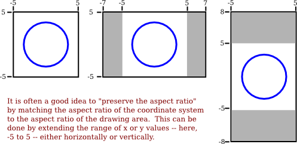
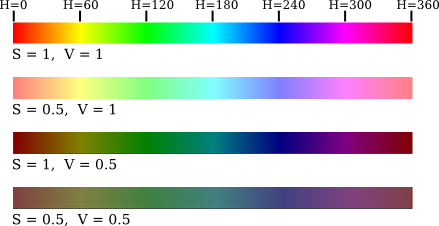

# 第1节: 像素、坐标和颜色

**Pixels, Coordinates, and Colors**

=== "中文"

    为了创建一个二维图像，图像中的每个点都被分配了一种颜色。二维空间中的一个点可以由一对数字坐标来确定。颜色也可以用数字来指定。然而，将数字分配给点或颜色有一定的任意性。因此，我们需要花一些时间来研究**坐标系(coordinate systems)**，将数字与点相关联，并且**颜色模型(color model)**，将数字与颜色相关联。

=== "英文"

    To create a two-dimensional image, each point in the image is assigned a color. A point in 2D can be identified by a pair of numerical coordinates. Colors can also be specified numerically. However, the assignment of numbers to points or colors is somewhat arbitrary. So we need to spend some time studying coordinate systems, which associate numbers to points, and color models, which associate numbers to colors.

## 2.1.1 像素坐标

**Pixel Coordinates**

=== "中文"

=== "英文"

    A digital image is made up of rows and columns of pixels. A pixel in such an image can be specified by saying which column and which row contains it. In terms of coordinates, a pixel can be identified by a pair of integers giving the column number and the row number. For example, the pixel with coordinates (3,5) would lie in column number 3 and row number 5. Conventionally, columns are numbered from left to right, starting with zero. Most graphics systems, including the ones we will study in this chapter, number rows from top to bottom, starting from zero. Some, including OpenGL, number the rows from bottom to top instead.

    <figure markdown="span">
        
        <figcaption>pixel coordinates</figcaption>
    </figure>

    Note in particular that the pixel that is identified by a pair of coordinates (x,y) depends on the choice of coordinate system. You always need to know what coordinate system is in use before you know what point you are talking about.

    Row and column numbers identify a pixel, not a point. A pixel contains many points; mathematically, it contains an infinite number of points. The goal of computer graphics is not really to color pixels—it is to create and manipulate images. In some ideal sense, an image should be defined by specifying a color for each point, not just for each pixel. Pixels are an approximation. If we imagine that there is a true, ideal image that we want to display, then any image that we display by coloring pixels is an approximation. This has many implications.

    Suppose, for example, that we want to draw a line segment. A mathematical line has no thickness and would be invisible. So we really want to draw a thick line segment, with some specified width. Let's say that the line should be one pixel wide. The problem is that, unless the line is horizontal or vertical, we can't actually draw the line by coloring pixels. A diagonal geometric line will cover some pixels only partially. It is not possible to make part of a pixel black and part of it white. When you try to draw a line with black and white pixels only, the result is a jagged staircase effect. This effect is an example of something called "aliasing." Aliasing can also be seen in the outlines of characters drawn on the screen and in diagonal or curved boundaries between any two regions of different color. (The term aliasing likely comes from the fact that ideal images are naturally described in real-number coordinates. When you try to represent the image using pixels, many real-number coordinates will map to the same integer pixel coordinates; they can all be considered as different names or "aliases" for the same pixel.)

    Antialiasing is a term for techniques that are designed to mitigate the effects of aliasing. The idea is that when a pixel is only partially covered by a shape, the color of the pixel should be a mixture of the color of the shape and the color of the background. When drawing a black line on a white background, the color of a partially covered pixel would be gray, with the shade of gray depending on the fraction of the pixel that is covered by the line. (In practice, calculating this area exactly for each pixel would be too difficult, so some approximate method is used.) Here, for example, is a geometric line, shown on the left, along with two approximations of that line made by coloring pixels. The lines are greatly magnified so that you can see the individual pixels. The line on the right is drawn using antialiasing, while the one in the middle is not:

    <figure markdown="span">
        
        <figcaption>antialiased line</figcaption>
    </figure>

    Note that antialiasing does not give a perfect image, but it can reduce the "jaggies" that are caused by aliasing (at least when it is viewed on a normal scale).

    There are other issues involved in mapping real-number coordinates to pixels. For example, which point in a pixel should correspond to integer-valued coordinates such as (3,5)? The center of the pixel? One of the corners of the pixel? In general, we think of the numbers as referring to the top-left corner of the pixel. Another way of thinking about this is to say that integer coordinates refer to the lines between pixels, rather than to the pixels themselves. But that still doesn't determine exactly which pixels are affected when a geometric shape is drawn. For example, here are two lines drawn using HTML canvas graphics, shown greatly magnified. The lines were specified to be colored black with a one-pixel line width:

    <figure markdown="span">
        
        <figcaption>horizontal lines from canvas</figcaption>
    </figure>

    The top line was drawn from the point (100,100) to the point (120,100). In canvas graphics, integer coordinates correspond to the lines between pixels, but when a one-pixel line is drawn, it extends one-half pixel on either side of the infinitely thin geometric line. So for the top line, the line as it is drawn lies half in one row of pixels and half in another row. The graphics system, which uses antialiasing, rendered the line by coloring both rows of pixels gray. The bottom line was drawn from the point (100.5,100.5) to (120.5,100.5). In this case, the line lies exactly along one line of pixels, which gets colored black. The gray pixels at the ends of the bottom line have to do with the fact that the line only extends halfway into the pixels at its endpoints. Other graphics systems might render the same lines differently.

    The following interactive demo lets you experiment with pixels and antialiasing. (Note that in any of the interactive demos that accompany this book, you can click the question mark icon in the upper left for more information about how to use it.)

    <iframe src="../../../en/demos/c2/pixel-magnifier.html" width="530" height="380"></iframe>

    All this is complicated further by the fact that pixels aren't what they used to be. Pixels today are smaller! The resolution of a display device can be measured in terms of the number of pixels per inch on the display, a quantity referred to as PPI (pixels per inch) or sometimes DPI (dots per inch). Early screens tended to have resolutions of somewhere close to 72 PPI. At that resolution, and at a typical viewing distance, individual pixels are clearly visible. For a while, it seemed like most displays had about 100 pixels per inch, but high resolution displays today can have 200, 300 or even 400 pixels per inch. At the highest resolutions, individual pixels can no longer be distinguished.

    The fact that pixels come in such a range of sizes is a problem if we use coordinate systems based on pixels. An image created assuming that there are 100 pixels per inch will look tiny on a 400 PPI display. A one-pixel-wide line looks good at 100 PPI, but at 400 PPI, a one-pixel-wide line is probably too thin.

    In fact, in many graphics systems, "pixel" doesn't really refer to the size of a physical pixel. Instead, it is just another unit of measure, which is set by the system to be something appropriate. (On a desktop system, a pixel is usually about one one-hundredth of an inch. On a smart phone, which is usually viewed from a closer distance, the value might be closer to 1/160 inch. Furthermore, the meaning of a pixel as a unit of measure can change when, for example, the user applies a magnification to a web page.)

    Pixels cause problems that have not been completely solved. Fortunately, they are less of a problem for vector graphics, which is mostly what we will use in this book. For vector graphics, pixels only become an issue during rasterization, the step in which a vector image is converted into pixels for display. The vector image itself can be created using any convenient coordinate system. It represents an idealized, resolution-independent image. A rasterized image is an approximation of that ideal image, but how to do the approximation can be left to the display hardware.

## 2.1.2  实数坐标系

**Real-number Coordinate Systems**

=== "中文"

=== "英文"

    When doing 2D graphics, you are given a rectangle in which you want to draw some graphics primitives. Primitives are specified using some coordinate system on the rectangle. It should be possible to select a coordinate system that is appropriate for the application. For example, if the rectangle represents a floor plan for a 15 foot by 12 foot room, then you might want to use a coordinate system in which the unit of measure is one foot and the coordinates range from 0 to 15 in the horizontal direction and 0 to 12 in the vertical direction. The unit of measure in this case is feet rather than pixels, and one foot can correspond to many pixels in the image. The coordinates for a pixel will, in general, be real numbers rather than integers. In fact, it's better to forget about pixels and just think about points in the image. A point will have a pair of coordinates given by real numbers.

    To specify the coordinate system on a rectangle, you just have to specify the horizontal coordinates for the left and right edges of the rectangle and the vertical coordinates for the top and bottom. Let's call these values left, right, top, and bottom. Often, they are thought of as xmin, xmax, ymin, and ymax, but there is no reason to assume that, for example, top is less than bottom. We might want a coordinate system in which the vertical coordinate increases from bottom to top instead of from top to bottom. In that case, top will correspond to the maximum y-value instead of the minimum value.

    To allow programmers to specify the coordinate system that they would like to use, it would be good to have a subroutine such as

    ```python
    setCoordinateSystem(left,right,bottom,top)
    ```

    The graphics system would then be responsible for automatically transforming the coordinates from the specified coordinate system into pixel coordinates. Such a subroutine might not be available, so it's useful to see how the transformation is done by hand. Let's consider the general case. Given coordinates for a point in one coordinate system, we want to find the coordinates for the same point in a second coordinate system. (Remember that a coordinate system is just a way of assigning numbers to points. It's the points that are real!) Suppose that the horizontal and vertical limits are oldLeft, oldRight, oldTop, and oldBottom for the first coordinate system, and are newLeft, newRight, newTop, and newBottom for the second. Suppose that a point has coordinates (oldX,oldY) in the first coordinate system. We want to find the coordinates (newX,newY) of the point in the second coordinate system


    <figure markdown="span">
        
        <figcaption>old to new coords</figcaption>
    </figure>

    Formulas for newX and newY are then given by

    ```python
    newX = newLeft + 
          ((oldX - oldLeft) / (oldRight - oldLeft)) * (newRight - newLeft))
    newY = newTop + 
            ((oldY - oldTop) / (oldBottom - oldTop)) * (newBottom - newTop)
    ```

    The logic here is that oldX is located at a certain fraction of the distance from *oldLeft* to *oldRight*. That fraction is given by

    ```python
    ((oldX - oldLeft) / (oldRight - oldLeft))
    ```

    The formula for *newX* just says that *newX* should lie at the same fraction of the distance from *newLeft* to *newRight*. You can also check the formulas by testing that they work when *oldX* is equal to *oldLeft* or to *oldRight*, and when *oldY* is equal to *oldBottom* or to *oldTop*.

    As an example, suppose that we want to transform some real-number coordinate system with limits left, right, top, and bottom into pixel coordinates that range from 0 at left to 800 at the right and from 0 at the top 600 at the bottom. In that case, newLeft and newTop are zero, and the formulas become simply

    ```python
    newX = ((oldX - left) / (right - left)) * 800
    newY = ((oldY - top) / (bottom - top)) * 600
    ```

    Of course, this gives newX and newY as real numbers, and they will have to be rounded or truncated to integer values if we need integer coordinates for pixels. The reverse transformation—going from pixel coordinates to real number coordinates—is also useful. For example, if the image is displayed on a computer screen, and you want to react to mouse clicks on the image, you will probably get the mouse coordinates in terms of integer pixel coordinates, but you will want to transform those pixel coordinates into your own chosen coordinate system.

    In practice, though, you won't usually have to do the transformations yourself, since most graphics APIs provide some higher level way to specify transforms. We will talk more about this in [Section 2.3](./s3.md).

## 2.1.3  纵横比

**Aspect Ratio**

=== "中文"

=== "英文"

    The aspect ratio of a rectangle is the ratio of its width to its height. For example an aspect ratio of 2:1 means that a rectangle is twice as wide as it is tall, and an aspect ratio of 4:3 means that the width is 4/3 times the height. Although aspect ratios are often written in the form *width:height*, I will use the term to refer to the fraction *width/height*. A square has aspect ratio equal to 1. A rectangle with aspect ratio 5/4 and height 600 has a width equal to 600*(5/4), or 750.

    A coordinate system also has an aspect ratio. If the horizontal and vertical limits for the coordinate system are left, right, bottom, and top, as above, then the aspect ratio is the absolute value of

    ```python
    (right - left) / (top - bottom)
    ```

    If the coordinate system is used on a rectangle with the same aspect ratio, then when viewed in that rectangle, one unit in the horizontal direction will have the same apparent length as a unit in the vertical direction. If the aspect ratios don't match, then there will be some distortion. For example, the shape defined by the equation x2 +y2 = 9 should be a circle, but that will only be true if the aspect ratio of the (x,y) coordinate system matches the aspect ratio of the drawing area.

    <figure markdown="span">
        
        <figcaption>aspect ratio 1</figcaption>
    </figure>

    It is not always a bad thing to use different units of length in the vertical and horizontal directions. However, suppose that you want to use coordinates with limits left, right, bottom, and top, and that you do want to preserve the aspect ratio. In that case, depending on the shape of the display rectangle, you might have to adjust the values either of left and right or of bottom and top to make the aspect ratios match:

    <figure markdown="span">
        
    </figure>

    We will look more deeply into geometric transforms later in the chapter, and at that time, we'll see some program code for setting up coordinate systems.

## 2.1.4  颜色模型

**Color Models**

=== "中文"

=== "英文"

    We are talking about the most basic foundations of computer graphics. One of those is coordinate systems. The other is color. Color is actually a surprisingly complex topic. We will look at some parts of the topic that are most relevant to computer graphics applications.

    The colors on a computer screen are produced as combinations of red, green, and blue light. Different colors are produced by varying the intensity of each type of light. A color can be specified by three numbers giving the intensity of red, green, and blue in the color. Intensity can be specified as a number in the range zero, for minimum intensity, to one, for maximum intensity. This method of specifying color is called the RGB color model, where RGB stands for Red/Green/Blue. For example, in the RGB color model, the number triple (1, 0.5, 0.5) represents the color obtained by setting red to full intensity, while green and blue are set to half intensity. The red, green, and blue values for a color are called the color components of that color in the RGB color model.

    Light is made up of waves with a variety of wavelengths. A pure color is one for which all the light has the same wavelength, but in general, a color can contain many wavelengths—mathematically, an infinite number. How then can we represent all colors by combining just red, green, and blue light? In fact, we can't quite do that.

    You might have heard that combinations of the three basic, or "primary," colors are sufficient to represent all colors, because the human eye has three kinds of color sensors that detect red, green, and blue light. However, that is only an approximation. The eye does contain three kinds of color sensors. The sensors are called "cone cells." However, cone cells do not respond exclusively to red, green, and blue light. Each kind of cone cell responds, to a varying degree, to wavelengths of light in a wide range. A given mix of wavelengths will stimulate each type of cell to a certain degree, and the intensity of stimulation determines the color that we see. A different mixture of wavelengths that stimulates each type of cone cell to the same extent will be perceived as the same color. So a perceived color can, in fact, be specified by three numbers giving the intensity of stimulation of the three types of cone cell. However, it is not possible to produce all possible patterns of stimulation by combining just three basic colors, no matter how those colors are chosen. This is just a fact about the way our eyes actually work; it might have been different. Three basic colors can produce a reasonably large fraction of the set of perceivable colors, but there are colors that you can see in the world that you will never see on your computer screen. (This whole discussion only applies to people who actually have three kinds of cone cell. Color blindness, where someone is missing one or more kinds of cone cell, is surprisingly common.)

    The range of colors that can be produced by a device such as a computer screen is called the color gamut of that device. Different computer screens can have different color gamuts, and the same RGB values can produce somewhat different colors on different screens. The color gamut of a color printer is noticeably different—and probably smaller—than the color gamut of a screen, which explains why a printed image probably doesn't look exactly the same as it did on the screen. (Printers, by the way, make colors differently from the way a screen does it. Whereas a screen combines light to make a color, a printer combines inks or dyes. Because of this difference, colors meant for printers are often expressed using a different set of basic colors. A common color model for printer colors is CMYK, using the colors cyan, magenta, yellow, and black.)

    In any case, the most common color model for computer graphics is RGB. RGB colors are most often represented using 8 bits per color component, a total of 24 bits to represent a color. This representation is sometimes called "24-bit color." An 8-bit number can represent 28, or 256, different values, which we can take to be the positive integers from 0 to 255. A color is then specified as a triple of integers (r,g,b) in that range.

    This representation works well because 256 shades of red, green, and blue are about as many as the eye can distinguish. In applications where images are processed by computing with color components, it is common to use additional bits per color component to avoid visual effects that might occur due to rounding errors in the computations. Such applications might use a 16-bit integer or even a 32-bit floating point value for each color component. On the other hand, sometimes fewer bits are used. For example, one common color scheme uses 5 bits for the red and blue components and 6 bits for the green component, for a total of 16 bits for a color. (Green gets an extra bit because the eye is more sensitive to green light than to red or blue.) This "16-bit color" saves memory compared to 24-bit color and was more common when memory was more expensive.

    There are many other color models besides RGB. RGB is sometimes criticized as being unintuitive. For example, it's not obvious to most people that yellow is made of a combination of red and green. The closely related color models HSV and HSL describe the same set of colors as RGB, but attempt to do it in a more intuitive way. (HSV is sometimes called HSB, with the "B" standing for "brightness." HSV and HSB are exactly the same model.)

    The "H" in these models stands for "hue," a basic spectral color. As H increases, the color changes from red to yellow to green to cyan to blue to magenta, and then back to red. The value of H is often taken to range from 0 to 360, since the colors can be thought of as arranged around a circle with red at both 0 and 360 degrees.

    The "S" in HSV and HSL stands for "saturation," and is taken to range from 0 to 1. A saturation of 0 gives a shade of gray (the shade depending on the value of V or L). A saturation of 1 gives a "pure color," and decreasing the saturation is like adding more gray to the color. "V" stands for "value," and "L" stands for "lightness." They determine how bright or dark the color is. The main difference is that in the HSV model, the pure spectral colors occur for V=1, while in HSL, they occur for L=0.5.

    Let's look at some colors in the HSV color model. The illustration below shows colors with a full range of H-values, for S and V equal to 1 and to 0.5. Note that for S=V=1, you get bright, pure colors. S=0.5 gives paler, less saturated colors. V=0.5 gives darker colors.

    <figure markdown="span">
        
    </figure>

    It's probably easier to understand color models by looking at some actual colors and how they are represented. Here is an interactive demo that let's you do that for the RGB and HSV color models:

    <iframe src="../../../en/demos/c2/rgb-hsv.html" width="600" height="370"></iframe>

    ----

    Often, a fourth component is added to color models. The fourth component is called alpha, and color models that use it are referred to by names such as RGBA and HSLA. Alpha is not a color as such. It is usually used to represent transparency. A color with maximal alpha value is fully opaque; that is, it is not at all transparent. A color with alpha equal to zero is completely transparent and therefore invisible. Intermediate values give translucent, or partly transparent, colors. Transparency determines what happens when you draw with one color (the foreground color) on top of another color (the background color). If the foreground color is fully opaque, it simply replaces the background color. If the foreground color is partly transparent, then it is blended with the background color. Assuming that the alpha component ranges from 0 to 1, the color that you get can be computed as

    ```python
    new_color = (alpha)*(foreground_color) + (1 - alpha)*(background_color)
    ```

    This computation is done separately for the red, blue, and green color components. This is called alpha blending. The effect is like viewing the background through colored glass; the color of the glass adds a tint to the background color. This type of blending is not the only possible use of the alpha component, but it is the most common.

    An RGBA color model with 8 bits per component uses a total of 32 bits to represent a color. This is a convenient number because integer values are often represented using 32-bit values. A 32-bit integer value can be interpreted as a 32-bit RGBA color. How the color components are arranged within a 32-bit integer is somewhat arbitrary. The most common layout is to store the alpha component in the eight high-order bits, followed by red, green, and blue. (This should probably be called ARGB color.) However, other layouts are also in use.
