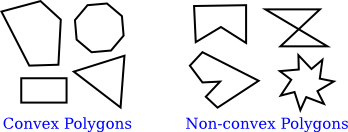

# 第2节: 形状

**Shapes**

=== "中文"

=== "英文"

    We have been talking about low-level graphics concepts like pixels and coordinates, but fortunately we don't usually have to work on the lowest levels. Most graphics systems let you work with higher-level shapes, such as triangles and circles, rather than individual pixels. And a lot of the hard work with coordinates is done using transforms rather than by working with coordinates directly. In this section and the next, we will look at some of the higher-level capabilities that are typically provided by 2D graphics APIs.

## 2.2.1  Basic Shapes

**Basic Shapes**

=== "中文"

=== "英文"

    In a graphics API, there will be certain basic shapes that can be drawn with one command, whereas more complex shapes will require multiple commands. Exactly what qualifies as a basic shape varies from one API to another. In the WebGL API, for example, the only basic shapes are points, lines, and triangles. In this subsection, I consider lines, rectangles, and ovals to be basic.

    By "line," I really mean line segment, that is a straight line segment connecting two given points in the plane. A simple one-pixel-wide line segment, without antialiasing, is the most basic shape. It can be drawn by coloring pixels that lie along the infinitely thin geometric line segment. An algorithm for drawing the line has to decide exactly which pixels to color. One of the first computer graphics algorithms, Bresenham's algorithm for line drawing, implements a very efficient procedure for doing so. I won't discuss such low-level details here, but it's worth looking them up if you want to start learning about what graphics hardware actually has to do on a low level. In any case, lines are typically more complicated. Antialiasing is one complication. Line width is another. A wide line might actually be drawn as a rectangle.

    Lines can have other attributes, or properties, that affect their appearance. One question is, what should happen at the end of a wide line? Appearance might be improved by adding a rounded "cap" on the ends of the line. A square cap—that is, extending the line by half of the line width—might also make sense. Another question is, when two lines meet as part of a larger shape, how should the lines be joined? And many graphics systems support lines that are patterns of dashes and dots. This illustration shows some of the possibilities:

    <figure markdown="span">
        
        <figcaption>pixel coordinates</figcaption>
    </figure>

    On the left are three wide lines with no cap, a round cap, and a square cap. The geometric line segment is shown as a dotted line. (The no-cap style is called "butt.") To the right are four lines with different patterns of dots and dashes. In the middle are three different styles of line joins: mitered, rounded, and beveled.


    ----

    The basic rectangular shape has sides that are vertical and horizontal. (A tilted rectangle generally has to be made by applying a rotation.) Such a rectangle can be specified with two points, (x1,y1) and (x2,y2), that give the endpoints of one of the diagonals of the rectangle. Alternatively, the width and the height can be given, along with a single base point, (x,y). In that case, the width and height have to be positive, or the rectangle is empty. The base point (x,y) will be the upper left corner of the rectangle if y increases from top to bottom, and it will be the lower left corner of the rectangle if y increases from bottom to top.

    <figure markdown="span">
        
        <figcaption>pixel coordinates</figcaption>
    </figure>

    Suppose that you are given points (x1,y1) and (x2,y2), and that you want to draw the rectangle that they determine. And suppose that the only rectangle-drawing command that you have available is one that requires a point (x,y), a width, and a height. For that command, x must be the smaller of x1 and x2, and the width can be computed as the absolute value of x1 minus x2. And similarly for y and the height. In pseudocode,

    ```text
    DrawRectangle from points (x1,y1) and (x2,y2):
        x = min( x1, x2 )
        y = min( y1, y2 )
        width = abs( x1 - x2 )
        height = abs( y1 - y2 )
        DrawRectangle( x, y, width, height )
    ```

    A common variation on rectangles is to allow rounded corners. For a "round rect," the corners are replaced by elliptical arcs. The degree of rounding can be specified by giving the horizontal radius and vertical radius of the ellipse. Here are some examples of round rects. For the shape at the right, the two radii of the ellipse are shown:

    <figure markdown="span">
        
        <figcaption>pixel coordinates</figcaption>
    </figure>

    My final basic shape is the oval. (An oval is also called an ellipse.) An oval is a closed curve that has two radii. For a basic oval, we assume that the radii are vertical and horizontal. An oval with this property can be specified by giving the rectangle that just contains it. Or it can be specified by giving its center point and the lengths of its vertical radius and its horizontal radius. In this illustration, the oval on the left is shown with its containing rectangle and with its center point and radii:

    <figure markdown="span">
        
        <figcaption>pixel coordinates</figcaption>
    </figure>

    The oval on the right is a circle. A circle is just an oval in which the two radii have the same length.

    If ovals are not available as basic shapes, they can be approximated by drawing a large number of line segments. The number of lines that is needed for a good approximation depends on the size of the oval. It's useful to know how to do this. Suppose that an oval has center point (x,y), horizontal radius r1, and vertical radius r2. Mathematically, the points on the oval are given by


    ```text
    ( x + r1*cos(angle), y + r2*sin(angle) )
    ```

    where *angle* takes on values from 0 to 360 if angles are measured in degrees or from 0 to 2π if they are measured in radians. Here sin and cos are the standard sine and cosine functions. To get an approximation for an oval, we can use this formula to generate some number of points and then connect those points with line segments. In pseudocode, assuming that angles are measured in radians and that *pi* represents the mathematical constant π,

    ```text
    Draw Oval with center (x,y), horizontal radius r1, and vertical radius r2:
        for i = 0 to numberOfLines:
            angle1 = i * (2*pi/numberOfLines)
            angle2 = (i+1) * (2*pi/numberOfLines)
            a1 = x + r1*cos(angle1)
            b1 = y + r2*sin(angle1)
            a2 = x + r1*cos(angle2)
            b2 = y + r2*sin(angle2)
            Draw Line from (a1,b1) to (a2,b2)
    ```

    For a circle, of course, you would just have r1 = r2. This is the first time we have used the sine and cosine functions, but it won't be the last. These functions play an important role in computer graphics because of their association with circles, circular motion, and rotation. We will meet them again when we talk about transforms in the [next section](./s3.md).

    Here's a little demo that you can use to experiment with using line segments to approximate ovals:

    <iframe src="../../../en/demos/c2/approximating-ovals.html" width="630" height="375"></iframe>

## 2.2.2  Stroke and Fill

**Stroke and Fill**

=== "中文"

=== "英文"

    There are two ways to make a shape visible in a drawing. You can stroke it. Or, if it is a closed shape such as a rectangle or an oval, you can fill it. Stroking a line is like dragging a pen along the line. Stroking a rectangle or oval is like dragging a pen along its boundary. Filling a shape means coloring all the points that are contained inside that shape. It's possible to both stroke and fill the same shape; in that case, the interior of the shape and the outline of the shape can have a different appearance.

    When a shape intersects itself, like the two shapes in the illustration below, it's not entirely clear what should count as the interior of the shape. In fact, there are at least two different rules for filling such a shape. Both are based on something called the winding number. The winding number of a shape about a point is, roughly, how many times the shape winds around the point in the positive direction, which I take here to be counterclockwise. Winding number can be negative when the winding is in the opposite direction. In the illustration, the shapes on the left are traced in the direction shown, and the winding number about each region is shown as a number inside the region.

    <figure markdown="span">
        
    </figure>

    The shapes are also shown filled using the two fill rules. For the shapes in the center, the fill rule is to color any region that has a non-zero winding number. For the shapes shown on the right, the rule is to color any region whose winding number is odd; regions with even winding number are not filled.

    There is still the question of what a shape should be filled with. Of course, it can be filled with a color, but other types of fill are possible, including patterns and gradients. A pattern is an image, usually a small image. When used to fill a shape, a pattern can be repeated horizontally and vertically as necessary to cover the entire shape. A gradient is similar in that it is a way for color to vary from point to point, but instead of taking the colors from an image, they are computed. There are a lot of variations to the basic idea, but there is always a line segment along which the color varies. The color is specified at the endpoints of the line segment, and possibly at additional points; between those points, the color is interpolated. The color can also be extrapolated to other points on the line that contains the line segment but lying outside the line segment; this can be done either by repeating the pattern from the line segment or by simply extending the color from the nearest endpoint. For a linear gradient, the color is constant along lines perpendicular to the basic line segment, so you get lines of solid color going in that direction. In a radial gradient, the color is constant along circles centered at one of the endpoints of the line segment. And that doesn't exhaust the possibilities. To give you an idea what patterns and gradients can look like, here is a shape, filled with two gradients and two patterns:

    <figure markdown="span">
        
    </figure>

    The first shape is filled with a simple linear gradient defined by just two colors, while the second shape uses a radial gradient.

    Patterns and gradients are not necessarily restricted to filling shapes. Stroking a shape is, after all, the same as filling a band of pixels along the boundary of the shape, and that can be done with a gradient or a pattern, instead of with a solid color.

    Finally, I will mention that a string of text can be considered to be a shape for the purpose of drawing it. The boundary of the shape is the outline of the characters. The text is drawn by filling that shape. In some graphics systems, it is also possible to stroke the outline of the shape that defines the text. In the following illustration, the string "Graphics" is shown, on top, filled with a pattern and, below that, filled with a gradient and stroked with solid black:

    <figure markdown="span">
        
    </figure>

## 2.2.3  Polygons, Curves, and Paths

**Polygons, Curves, and Paths**

=== "中文"

=== "英文"

    It is impossible for a graphics API to include every possible shape as a basic shape, but there is usually some way to create more complex shapes. For example, consider polygons. A polygon is a closed shape consisting of a sequence of line segments. Each line segment is joined to the next at its endpoint, and the last line segment connects back to the first. The endpoints are called the vertices of the polygon, and a polygon can be defined by listing its vertices.

    In a regular polygon, all the sides are the same length and all the angles between sides are equal. Squares and equilateral triangles are examples of regular polygons. A convex polygon has the property that whenever two points are inside or on the polygon, then the entire line segment between those points is also inside or on the polygon. Intuitively, a convex polygon has no "indentations" along its boundary. (Concavity can be a property of any shape, not just of polygons.)

    <figure markdown="span">
        
    </figure>

    Sometimes, polygons are required to be "simple," meaning that the polygon has no self-intersections. That is, all the vertices are different, and a side can only intersect another side at its endpoints. And polygons are usually required to be "planar," meaning that all the vertices lie in the same plane. (Of course, in 2D graphics, everything lies in the same plane, so this is not an issue. However, it does become an issue in 3D.)

    How then should we draw polygons? That is, what capabilities would we like to have in a graphics API for drawing them. One possibility is to have commands for stroking and for filling polygons, where the vertices of the polygon are given as an array of points or as an array of x-coordinates plus an array of y-coordinates. In fact, that is sometimes done; for example, the Java graphics API includes such commands. Another, more flexible, approach is to introduce the idea of a "path." Java, SVG, and the HTML canvas API all support this idea. A path is a general shape that can include both line segments and curved segments. Segments can, but don't have to be, connected to other segments at their endpoints. A path is created by giving a series of commands that tell, essentially, how a pen would be moved to draw the path. While a path is being created, there is a point that represents the pen's current location. There will be a command for moving the pen without drawing, and commands for drawing various kinds of segments. For drawing polygons, we need commands such as

    - `createPath()` — start a new, empty path
    - `moveTo(x,y)` — move the pen to the point (x,y), without adding a segment to the path; that is, without drawing anything
    - `lineTo(x,y)` — add a line segment to the path that starts at the current pen location and ends at the point (x,y), and move the pen to (x,y)
    - `closePath()` — add a line segment from the current pen location back to the starting point, unless the pen is already there, producing a closed path.

    (For closePath, I need to define "starting point." A path can be made up of "subpaths" A subpath consists of a series of connected segments. A moveTo always starts a new subpath. A closePath ends the current segment and implicitly starts a new one. So "starting point" means the position of the pen after the most recent moveTo or closePath.)

    Suppose that we want a path that represents the triangle with vertices at (100,100), (300,100), and (200, 200). We can do that with the commands

    ```text
    createPath()
    moveTo( 100, 100 )
    lineTo( 300, 100 )
    lineTo( 200, 200 )
    closePath()
    ```

    The closePath command at the end could be replaced by lineTo(100,100), to move the pen back to the first vertex.

    A path represents an abstract geometric object. Creating one does not make it visible on the screen. Once we have a path, to make it visible we need additional commands for stroking and filling the path.

    Earlier in this section, we saw how to approximate an oval by drawing, in effect, a polygon with a large number of sides. In that example, I drew each side as a separate line segment, so we really had a bunch of separate lines rather than a polygon. There is no way to fill such a thing. It would be better to approximate the oval with a polygonal path. For an oval with center (x,y) and radii r1 and r2:

    ```text
    createPath()
    moveTo( x + r1, y )
    for i = 1 to numberOfPoints-1
        angle = i * (2*pi/numberOfLines)
        lineTo( x + r1*cos(angle), y + r2*sin(angle) )
    closePath()
    ```

    Using this path, we could draw a filled oval as well as stroke it. Even if we just want to draw the outline of a polygon, it's still better to create the polygon as a path rather than to draw the line segments as separate sides. With a path, the computer knows that the sides are part of single shape. This makes it possible to control the appearance of the "join" between consecutive sides, as noted earlier in this section.

    ----

    I noted above that a path can contain other kinds of segments besides lines. For example, it might be possible to include an arc of a circle as a segment. Another type of curve is a Bezier curve. Bezier curves can be used to create very general curved shapes. They are fairly intuitive, so that they are often used in programs that allow users to design curves interactively. Mathematically, Bezier curves are defined by parametric polynomial equations, but you don't need to understand what that means to use them. There are two kinds of Bezier curve in common use, cubic Bezier curves and quadratic Bezier curves; they are defined by cubic and quadratic polynomials respectively. When the general term "Bezier curve" is used, it usually refers to cubic Bezier curves.

    A cubic Bezier curve segment is defined by the two endpoints of the segment together with two control points. To understand how it works, it's best to think about how a pen would draw the curve segment. The pen starts at the first endpoint, headed in the direction of the first control point. The distance of the control point from the endpoint controls the speed of the pen as it starts drawing the curve. The second control point controls the direction and speed of the pen as it gets to the second endpoint of the curve. There is a unique cubic curve that satisfies these conditions.

    <figure markdown="span">
        
    </figure>

    The illustration above shows three cubic Bezier curve segments. The two curve segments on the right are connected at an endpoint to form a longer curve. The curves are drawn as thick black lines. The endpoints are shown as black dots and the control points as blue squares, with a thin red line connecting each control point to the corresponding endpoint. (Ordinarily, only the curve would be drawn, except in an interface that lets the user edit the curve by hand.) Note that at an endpoint, the curve segment is tangent to the line that connects the endpoint to the control point. Note also that there can be a sharp point or corner where two curve segments meet. However, one segment will merge smoothly into the next if control points are properly chosen.

    This will all be easier to understand with some hands-on experience. This interactive demo lets you edit cubic Bezier curve segments by dragging their endpoints and control points:

    <iframe src="../../../en/demos/c2/cubic-bezier.html" width="550" height="500"></iframe>

    When a cubic Bezier curve segment is added to a path, the path's current pen location acts as the first endpoint of the segment. The command for adding the segment to the path must specify the two control points and the second endpoint. A typical command might look like

    ```text
    cubicCurveTo( cx1, cy1, cx2, cy2, x, y )
    ```

    This would add a curve from the current location to point (x,y), using (cx1,cy1) and (cx2,cy2) as the control points. That is, the pen leaves the current location heading towards (cx1,cy1), and it ends at the point (x,y), arriving there from the direction of (cx2,cy2).

    Quadratic Bezier curve segments are similar to the cubic version, but in the quadratic case, there is only one control point for the segment. The curve leaves the first endpoint heading in the direction of the control point, and it arrives at the second endpoint coming from the direction of the control point. The curve in this case will be an arc of a parabola.

    Again, this is easier to understand this with some hands-on experience. Try this interactive demo:

    <iframe src="../../../en/demos/c2/quadratic-bezier.html" width="550" height="500"></iframe>
