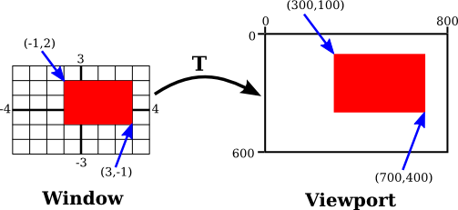
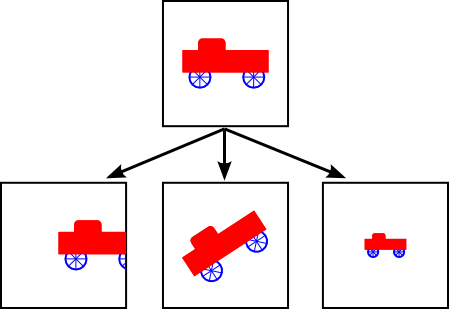
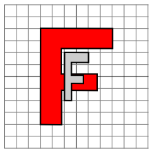

# 第3节: 变换

**Transforms**

=== "中文"

=== "英文"

    In [Section 2.1](./s1.md), we discussed coordinate systems and how it is possible to transform coordinates from one coordinate system to another. In this section, we'll look at that idea a little more closely, and also look at how geometric transformations can be used to place graphics objects into a coordinate system.

## 2.3.1  Viewing and Modeling

**Viewing and Modeling**

=== "中文"

=== "英文"

    In a typical application, we have a rectangle made of pixels, with its natural pixel coordinates, where an image will be displayed. This rectangle will be called the **viewport**. We also have a set of geometric objects that are defined in a possibly different coordinate system, generally one that uses real-number coordinates rather than integers. These objects make up the "scene" or "world" that we want to view, and the coordinates that we use to define the scene are called **world coordinates**.

    For 2D graphics, the world lies in a plane. It's not possible to show a picture of the entire infinite plane. We need to pick some rectangular area in the plane to display in the image. Let's call that rectangular area the window, or view **window**. A coordinate transform is used to map the window to the viewport.


    <figure markdown="span">
        
    </figure>

    In this illustration, **T** represents the coordinate transformation. **T** is a function that takes world coordinates (x,y) in some window and maps them to pixel coordinates **T**(x,y) in the viewport. (I've drawn the viewport and window with different sizes to emphasize that they are not the same thing, even though they show the same objects, but in fact they don't even exist in the same space, so it doesn't really make sense to compare their sizes.) In this example, as you can check,

    ```text
    T(x,y) = ( 800*(x+4)/8, 600*(3-y)/6 )
    ```

    Look at the rectangle with corners at (-1,2) and (3,-1) in the window. When this rectangle is displayed in the viewport, it is displayed as the rectangle with corners **T**(-1,2) and **T**(3,-1). In this example, **T**(-1,2) = (300,100) and **T**(3,-1) = (700,400).

    We use coordinate transformations in this way because it allows us to choose a world coordinate system that is natural for describing the scene that we want to display, and it is easier to do that than to work directly with viewport coordinates. Along the same lines, suppose that we want to define some complex object, and suppose that there will be several copies of that object in our scene. Or maybe we are making an animation, and we would like the object to have different positions in different frames. We would like to choose some convenient coordinate system and use it to define the object once and for all. The coordinates that we use to define an object are called object coordinates for the object. When we want to place the object into a scene, we need to transform the object coordinates that we used to define the object into the world coordinate system that we are using for the scene. The transformation that we need is called a modeling transformation. This picture illustrates an object defined in its own object coordinate system and then mapped by three different modeling transformations into the world coordinate system:


    <figure markdown="span">
        
    </figure>

    Remember that in order to view the scene, there will be another transformation that maps the object from a view window in world coordinates into the viewport.

    Now, keep in mind that the choice of a view window tells which part of the scene is shown in the image. Moving, resizing, or even rotating the window will give a different view of the scene. Suppose we make several images of the same car:


    <figure markdown="span">
        
    </figure>

    What happened between making the top image in this illustration and making the image on the bottom left? In fact, there are two possibilities: Either the car was moved to the right, or the view window that defines the scene was moved to the left. This is important, so be sure you understand it. (Try it with your cell phone camera. Aim it at some objects, take a step to the left, and notice what happens to the objects in the camera's viewfinder: They move to the right in the picture!) Similarly, what happens between the top picture and the middle picture on the bottom? Either the car rotated counterclockwise, or the window was rotated clockwise. (Again, try it with a camera—you might want to take two actual photos so that you can compare them.) Finally, the change from the top picture to the one on the bottom right could happen because the car got smaller or because the window got larger. (On your camera, a bigger window means that you are seeing a larger field of view, and you can get that by applying a zoom to the camera or by backing up away from the objects that you are viewing.)

    There is an important general idea here. When we modify the view window, we change the coordinate system that is applied to the viewport. But in fact, this is the same as leaving that coordinate system in place and moving the objects in the scene instead. Except that to get the same effect in the final image, you have to apply the opposite transformation to the objects (for example, moving the window to the left is equivalent to moving the objects to the right). So, there is no essential distinction between transforming the window and transforming the object. Mathematically, you specify a geometric primitive by giving coordinates in some natural coordinate system, and the computer applies a sequence of transformations to those coordinates to produce, in the end, the coordinates that are used to actually draw the primitive in the image. You will think of some of those transformations as modeling transforms and some as coordinate transforms, but to the computer, it's all the same.

    Here is a live demo that can help you to understand the equivalence between modeling transformations and viewport transformations. The sliders control transformations that are applied to the objects in the picture. In the lower section of the demo, you see a larger view in which the viewport for the upper image is represented as a translucent black rectangle. Read the help text in the demo for more information.

    <iframe src="../../../en/demos/c2/transform-equivalence-2d.html" width="700" height="750"></iframe>

    We will return to this idea several times later in the book, but in any case, you can see that geometric transforms are a central concept in computer graphics. Let's look at some basic types of transformation in more detail. The transforms we will use in 2D graphics can be written in the form

    ```text
    x1 = a*x + b*y + e
    y1 = c*x + d*y + f
    ```

    where (x,y) represents the coordinates of some point before the transformation is applied, and (x1,y1) are the transformed coordinates. The transform is defined by the six constants a, b, c, d, e, and f. Note that this can be written as a function **T**, where

    ```text
    T(x,y) = ( a*x + b*y + e, c*x + d*y + f )
    ```

    A transformation of this form is called an **affine transform**. An affine transform has the property that, when it is applied to two parallel lines, the transformed lines will also be parallel. Also, if you follow one affine transform by another affine transform, the result is again an affine transform.

## 2.3.2  Translation

**Translation**

=== "中文"

=== "英文"

    A translation transform simply moves every point by a certain amount horizontally and a certain amount vertically. If (x,y) is the original point and (x1,y1) is the transformed point, then the formula for a translation is

    ```text
    x1 = x + e
    y1 = y + f
    ‵‵‵

    where e is the number of units by which the point is moved horizontally and f is the amount by which it is moved vertically. (Thus for a translation, a = d = 1, and b = c = 0 in the general formula for an affine transform.) A 2D graphics system will typically have a function such as

    ```text
    translate( e, f )
    ```

    to apply a translate transformation. The translation would apply to everything that is drawn after the command is given. That is, for all subsequent drawing operations, e would be added to the x-coordinate and f would be added to the y-coordinate. Let's look at an example. Suppose that you draw an "F" using coordinates in which the "F" is centered at (0,0). If you say translate(4,2) before drawing the "F", then every point of the "F" will be moved horizontally by 4 units and vertically by 2 units before the coordinates are actually used, so that after the translation, the "F" will be centered at (4,2):

    <figure markdown="span">
        
    </figure>

    The light gray "F" in this picture shows what would be drawn without the translation; the dark red "F" shows the same "F" drawn after applying a translation by (4,2). The top arrow shows that the upper left corner of the "F" has been moved over 4 units and up 2 units. Every point in the "F" is subjected to the same displacement. Note that in my examples, I am assuming that the y-coordinate increases from bottom to top. That is, the y-axis points up.

    Remember that when you give the command translate(e,f), the translation applies to all the drawing that you do after that, not just to the next shape that you draw. If you apply another transformation after the translation, the second transform will not replace the translation. It will be combined with the translation, so that subsequent drawing will be affected by the combined transformation. For example, if you combine translate(4,2) with translate(-1,5), the result is the same as a single translation, translate(3,7). This is an important point, and there will be a lot more to say about it later.

    Also remember that you don't compute coordinate transformations yourself. You just specify the original coordinates for the object (that is, the object coordinates), and you specify the transform or transforms that are to be applied. The computer takes care of applying the transformation to the coordinates. You don't even need to know the equations that are used for the transformation; you just need to understand what it does geometrically.

## 2.3.3  Rotation

**Rotation**

=== "中文"

=== "英文"

    A rotation transform, for our purposes here, rotates each point about the origin, (0,0). Every point is rotated through the same angle, called the angle of rotation. For this purpose, angles can be measured either in degrees or in radians. (The 2D graphics APIs for Java and JavaScript that we will look at later in this chapter use radians, but OpenGL and SVG use degrees.) A rotation with a positive angle rotates objects in the direction from the positive x-axis towards the positive y-axis. This is counterclockwise in a coordinate system where the y-axis points up, as it does in my examples here, but it is clockwise in the usual pixel coordinates, where the y-axis points down rather than up. Although it is not obvious, when rotation through an angle of r radians about the origin is applied to the point (x,y), then the resulting point (x1,y1) is given by

    ```text
    x1 = cos(r) * x - sin(r) * y
    y1 = sin(r) * x + cos(r) * y
    ‵‵‵

    That is, in the general formula for an affine transform, e = f = 0, a = d = cos(r), b = -sin(r), and c = sin(r). Here is a picture that illustrates a rotation about the origin by the angle negative 135 degrees:

    <figure markdown="span">
        
    </figure>

    Again, the light gray "F" is the original shape, and the dark red "F" is the shape that results if you apply the rotation. The arrow shows how the upper left corner of the original "F" has been moved.

    A 2D graphics API would typically have a command rotate(r) to apply a rotation. The command is used before drawing the objects to which the rotation applies.

## 2.3.4  Combining Transformations

=== "中文"

=== "英文"

    We are now in a position to see what can happen when you combine two transformations. Suppose that before drawing some object, you say

    ```text
    translate(4,0)
    rotate(90)
    ‵‵‵

    Assume that angles are measured in degrees. The translation will then apply to all subsequent drawing. But, because of the rotation command, the things that you draw after the translation are rotated objects. That is, the translation applies to objects that have already been rotated. An example is shown on the left in the illustration below, where the light gray "F" is the original shape, and red "F" shows the result of applying the two transforms to the original. The original "F" was first rotated through a 90 degree angle, and then moved 4 units to the right.

    <figure markdown="span">
        
    </figure>

    Note that transforms are applied to objects in the reverse of the order in which they are given in the code (because the first transform in the code is applied to an object that has already been affected by the second transform). And note that the order in which the transforms are applied is important. If we reverse the order in which the two transforms are applied in this example, by saying

    ```text
    rotate(90)
    translate(4,0)
    ‵‵‵

    then the result is as shown on the right in the above illustration. In that picture, the original "F" is first moved 4 units to the right and the resulting shape is then rotated through an angle of 90 degrees about the origin to give the shape that actually appears on the screen.

    For another example of applying several transformations, suppose that we want to rotate a shape through an angle r about a point (p,q) instead of about the point (0,0). We can do this by first moving the point (p,q) to the origin, using translate(-p,-q). Then we can do a standard rotation about the origin by calling rotate(r). Finally, we can move the origin back to the point (p,q) by applying translate(p,q). Keeping in mind that we have to write the code for the transformations in the reverse order, we need to say

    ```text
    translate(p,q)
    rotate(r)
    translate(-p,-q)
    ```

    before drawing the shape. (In fact, some graphics APIs let us accomplish this transform with a single command such as rotate(r,p,q). This would apply a rotation through the angle r about the point (p,q).)

## 2.3.5  Scaling

**Scaling**

=== "中文"

=== "英文"

    A scaling transform can be used to make objects bigger or smaller. Mathematically, a scaling transform simply multiplies each x-coordinate by a given amount and each y-coordinate by a given amount. That is, if a point (x,y) is scaled by a factor of a in the x direction and by a factor of d in the y direction, then the resulting point (x1,y1) is given by

    ```text
    x1 = a * x
    y1 = d * y
    ```

    If you apply this transform to a shape that is centered at the origin, it will stretch the shape by a factor of a horizontally and d vertically. Here is an example, in which the original light gray "F" is scaled by a factor of 3 horizontally and 2 vertically to give the final dark red "F":

    <figure markdown="span">
        
    </figure>

    The common case where the horizontal and vertical scaling factors are the same is called **uniform scaling**. Uniform scaling stretches or shrinks a shape without distorting it.

    When scaling is applied to a shape that is not centered at (0,0), then in addition to being stretched or shrunk, the shape will be moved away from 0 or towards 0. In fact, the true description of a scaling operation is that it pushes every point away from (0,0) or pulls every point towards (0,0). If you want to scale about a point other than (0,0), you can use a sequence of three transforms, similar to what was done in the case of rotation.

    A 2D graphics API can provide a function scale(a,d) for applying scaling transformations. As usual, the transform applies to all x and y coordinates in subsequent drawing operations. Note that negative scaling factors are allowed and will result in reflecting the shape as well as possibly stretching or shrinking it. For example, scale(1,-1) will reflect objects vertically, through the x-axis.

    It is a fact that every affine transform can be created by combining translations, rotations about the origin, and scalings about the origin. I won't try to prove that, but here is an interactive demo that will let you experiment with translations, rotations, and scalings, and with the transformations that can be made by combining them.

    <iframe src="../../../en/demos/c2/transforms-2d.html" width="725" height="550"></iframe>

    I also note that a transform that is made from translations and rotations, with no scaling, will preserve length and angles in the objects to which it is applied. It will also preserve aspect ratios of rectangles. Transforms with this property are called "**Euclidean**." If you also allow **uniform** scaling, the resulting transformation will preserve angles and aspect ratio, but not lengths.

## 2.3.6  Shear

**Shear**

=== "中文"

=== "英文"

    We will look at one more type of basic transform, a shearing transform. Although shears can in fact be built up out of rotations and scalings if necessary, it is not really obvious how to do so. A shear will "tilt" objects. A horizontal shear will tilt things towards the left (for negative shear) or right (for positive shear). A vertical shear tilts them up or down. Here is an example of horizontal shear:

    <figure markdown="span">
        
    </figure>

    A horizontal shear does not move the x-axis. Every other horizontal line is moved to the left or to the right by an amount that is proportional to the y-value along that line. When a horizontal shear is applied to a point (x,y), the resulting point (x1,y1) is given by

    ```text
    x1 = x + b * y
    y1 = y
    ```

    for some constant shearing factor b. Similarly, a vertical shear with shearing factor c is given by the equations

    ```text
    x1 = x
    y1 = c * x + y
    ```

    Shear is occasionally called "skew," but skew is usually specified as an angle rather than as a shear factor.

## 2.3.7  Window-to-Viewport

**Window-to-Viewport**

=== "中文"

=== "英文"

    The last transformation that is applied to an object before it is displayed in an image is the window-to-viewport transformation, which maps the rectangular view window in the xy-plane that contains the scene to the rectangular grid of pixels where the image will be displayed. I'll assume here that the view window is not rotated; that it, its sides are parallel to the x- and y-axes. In that case, the window-to-viewport transformation can be expressed in terms of translation and scaling transforms. Let's look at the typical case where the viewport has pixel coordinates ranging from 0 on the left to width on the right and from 0 at the top to height at the bottom. And assume that the limits on the view window are left, right, bottom, and top. In that case, the window-to-viewport transformation can be programmed as:

    ```text
    scale( width / (right-left), height / (bottom-top) );
    translate( -left, -top )
    ```

    These should be the last transforms that are applied to a point. Since transforms are applied to points in the reverse of the order in which they are specified in the program, they should be the first transforms that are specified in the program. To see how this works, consider a point (x,y) in the view window. (This point comes from some object in the scene. Several modeling transforms might have already been applied to the object to produce the point (x,y), and that point is now ready for its final transformation into viewport coordinates.) The coordinates (x,y) are first translated by (-left,-top) to give (x-left,y-top). These coordinates are then multiplied by the scaling factors shown above, giving the final coordinates

    ```text
    x1 = width / (right-left) * (x-left)
    y1 = height / (bottom-top) * (y-top)
    ```

    Note that the point (left,top) is mapped to (0,0), while the point (right,bottom) is mapped to (width,height), which is just what we want.

    There is still the question of aspect ratio. As noted in [Subsection 2.1.3](./s1.md#213-纵横比), if we want to force the aspect ratio of the window to match the aspect ratio of the viewport, it might be necessary to adjust the limits on the window. Here is pseudocode for a subroutine that will do that, again assuming that the top-left corner of the viewport has pixel coordinates (0,0):

    ```text
    subroutine applyWindowToViewportTransformation (
            left, right,   // horizontal limits on view window
            bottom, top,   // vertical limits on view window
            width, height, // width and height of viewport
            preserveAspect // should window be forced to match viewport aspect?
        )

    if preserveAspect :
        // Adjust the limits to match the aspect ratio of the drawing area.
        displayAspect = abs(height / width);
        windowAspect = abs(( top-bottom ) / ( right-left ));
        if displayAspect > windowAspect :
            // Expand the viewport vertically.
            excess = (top-bottom) * (displayAspect/windowAspect - 1)
            top = top + excess/2
            bottom = bottom - excess/2
        else if displayAspect < windowAspect :
            // Expand the viewport horizontally.
            excess = (right-left) * (windowAspect/displayAspect - 1)
            right = right + excess/2
            left = left - excess/2 

        scale( width / (right-left), height / (bottom-top) )
        translate( -left, -top )
    ```

## 2.3.8  Matrices and Vectors

**Matrices and Vectors**

=== "中文"

=== "英文"

    The transforms that are used in computer graphics can be represented as matrices, and the points on which they operate are represented as vectors. Recall that a **matrix**, from the point of view of a computer scientist, is a two-dimensional array of numbers, while a **vector** is a one-dimensional array. Matrices and vectors are studied in the field of mathematics called **linear algebra**. Linear algebra is fundamental to computer graphics. In fact, matrix and vector math is built into GPUs. You won't need to know a great deal about linear algebra for this textbook, but a few basic ideas are essential.

    The vectors that we need are lists of two, three, or four numbers. They are often written as (x,y), (x,y,z), and (x,y,z,w). A matrix with N rows and M columns is called an "N-by-M matrix." For the most part, the matrices that we need are N-by-N matrices, where N is 2, 3, or 4. That is, they have 2, 3, or 4 rows and columns, and the number of rows is equal to the number of columns.

    If A and B are two N-by-N matrices, then they can be multiplied to give a product matrix C = AB. If A is an N-by-N matrix, and v is a vector of length N, then v can be multiplied by A to give another vector w = Av. The function that takes v to Av is a transformation; it transforms any given vector of size N into another vector of size N. A transformation of this form is called a **linear transformation**.

    Now, suppose that A and B are N-by-N matrices and v is a vector of length N. Then, we can form two different products: A(Bv) and (AB)v. It is a central fact that these two operations have the same effect. That is, we can multiply v by B and then multiply the result by A, or we can multiply the matrices A and B to get the matrix product AB and then multiply v by AB. The result is the same.

    Rotation and scaling, as it turns out, are linear transformations. That is, the operation of rotating (x,y) through an angle d about the origin can be done by multiplying (x,y) by a 2-by-2 matrix. Let's call that matrix Rd. Similarly, scaling by a factor a in the horizontal direction and b in the vertical direction can be given as a matrix Sa,b. If we want to apply a scaling followed by a rotation to the point v = (x,y), we can compute **either** Rd(Sa,b^v) or (RdSa,b)v.

    So what? Well, suppose that we want to apply the same two operations, scale then rotate, to thousands of points, as we typically do when transforming objects for computer graphics. The point is that we could compute the product matrix RdSa,b once and for all, and then apply the combined transform to each point with a single multiplication. This means that if a program says

    ```text
    rotate(d)
    scale(a,b)
    .
    .  // draw a complex object
    .
    ```

    the computer doesn't have to keep track of two separate operations. It combines the operations into a single matrix and just keeps track of that. Even if you apply, say, 50 transformations to the object, the computer can just combine them all into one matrix. By using matrix algebra, multiple transformations can be handled as efficiently as a single transformation!

    This is really nice, but there is a gaping problem: **Translation is not a linear transformation**. To bring translation into this framework, we do something that looks a little strange at first: Instead of representing a point in 2D as a pair of numbers (x,y), we represent it as the triple of numbers (x,y,1). That is, we add a one as the third coordinate. It then turns out that we can then represent rotation, scaling, and translation—and hence any affine transformation—on 2D space as multiplication by a 3-by-3 matrix. The matrices that we need have a bottom row containing (0,0,1). Multiplying (x,y,1) by such a matrix gives a new vector (x1,y1,1). We ignore the extra coordinate and consider this to be a transformation of (x,y) into (x1,y1). For the record, the 3-by-3 matrices for translation (Ta,b), scaling (Sa,b), and rotation (Rd) in 2D are

    <figure markdown="span">
        
    </figure>

    You can compare multiplication by these matrices to the formulas given above for translation, scaling, and rotation. But when doing graphics programming, you won't need to do the multiplication yourself. For now, the important idea that you should take away from this discussion is that a sequence of transformations can be combined into a single transformation. The computer only needs to keep track of a single matrix, which we can call the "current matrix" or "current transformation." To implement transform commands such as translate(a,b) or rotate(d), the computer simply multiplies the current matrix by the matrix that represents the transform.
