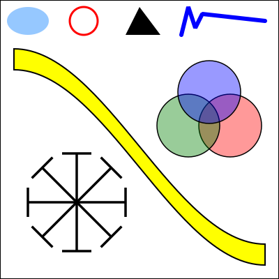
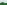

# 第7节: SVG：一种场景描述语言

**SVG: A Scene Description Language**

=== "中文"

=== "英文"

    We finish this chapter with a look at one more 2D graphics system: **SVG**, or Scalable Vector Graphics. So far, we have been considering graphics programming APIs. SVG, on the other hand is a **scene description language** rather than a programming language. Where a programming language creates a scene by generating its contents procedurally, a scene description language specifies a scene "declaratively," by listing its content. Since SVG is a vector graphics language, the content of a scene includes shapes, attributes such as color and line width, and geometric transforms. Most of this should be familiar to you, but it should be interesting to see it in a new context.

    SVG is an XML language, which means it has a very strict and somewhat verbose syntax. This can make it a little annoying to write, but on the other hand, it makes it possible to read and understand SVG documents even if you are not familiar with the syntax. It's possible that SVG originally stood for "Simple" Vector Graphics, but it is by no means a simple language at this point. I will cover only a part of it here, and there are many parts of the language and many options that I will not mention. My goal is to introduce the idea of a scene description language and to show how such a language can use the same basic ideas that are used in the rest of this chapter.

    SVG can be used as a file format for storing vector graphics images, in much the same way that PNG and JPEG are file formats for storing pixel-based images. That means that you can open an SVG file with almost any web browser to view the image. An SVG image can be included in a web page by using it as the src of an  element. That's how the SVG examples on this page are displayed. Since SVG documents are written in plain text, you can create SVG images using a regular text editor, and you can read the source for an SVG image by opening it in a text editor or by viewing the source of the image when it is displayed in a web browser.

## 2.7.1  SVG Document Structure

**SVG Document Structure**

=== "中文"

=== "英文"

    An SVG file, like any XML document, starts with some standard code that almost no one memorizes. It should just be copied into a new document. Here is some code that can be copied as a starting point for SVG documents of the type discussed in this section (which, remember use only a subset of the full SVG specification):

    ```xml
    <?xml version="1.0"?>
    <!DOCTYPE svg PUBLIC "-//W3C//DTD SVG 1.1//EN" 
    "http://www.w3.org/Graphics/SVG/1.1/DTD/svg11.dtd">
    <svg version="1.1" xmlns="http://www.w3.org/2000/svg" 
            xmlns:xlink="http://www.w3.org/1999/xlink"
            width="4in" height="4in" 
            viewBox="0 0 400 400"
            preserveAspectRatio="xMidYMid">

        <!-- The scene description goes here!  -->   
        
    </svg>
    ```

    The first three lines say that this is an XML SVG document. The rest of the document is an `<svg>` element that acts as a container for the entire scene description. You'll need to know a little about XML syntax. First, an XML "element" in its general form looks like this:

    ```xml
    <elementname attrib1="value1" attrib2="value2">
        ...content... 
    </elementname>
    ```

    The element starts with a "start tag," which begins with a "`<`" followed by an identifier that is the name of the tag, and ending with a "`>`". The start tag can include "attributes," which have the form `name="value"`. The name is an identifier; the value is a string. The value must be enclosed in single or double quotation marks. The element ends with an "end tag," which has an element name that matches the element name in the start tag and has the form `</elementname>`. Element names and attribute names are case-sensitive. Between the start and end tags comes the "content" of the element. The content can consist of text and nested elements. If an element has no content, you can replace the "`>`" at the end of the start tag with "`/>`", and leave out the end tag. This is called a "self-closing tag." For example,

    ```xml
    <circle cx="5" cy="5" r="4" fill="red"/>
    ```

    This is an actual SVG element that specifies a circle. It's easy to forget the "/" at the end of a self-closing tag, but it has to be there to have a legal XML document.

    Looking back at the SVG document, the five lines starting with `<svg` are just a long start tag. You can use the tag as shown, and customize the values of the width, height, viewBox, and preserveAspectRatio attributes. The next line is a comment; comments in XML start with `"<!--"` and end with `"-->"`.

    The *width* and height attributes of the `<svg>` tag specify a natural or preferred size for the image. It can be forced into a different size, for example if it is used in an `` element on a web page that specifies a different width and height. The size can be specified using units of measure such as *in* for inches, cm for centimeters, and px, for pixels, with 90 pixels to the inch. If no unit of measure is specified, pixels are used. There cannot be any space between the number and the unit of measure.

    The *viewBox* attribute sets up the coordinate system that will be used for drawing the image. It is what I called the view window in [Subsection 2.3.1](../c2/s3.md#231--视口和建模). The value for viewBox is a list of four numbers, giving the minimum x-value, the minimum y-value, the width, and the height of the view window. The width and the height must be positive, so x increases from left-to-right, and y increases from top-to-bottom. The four numbers in the list can be separated either by spaces or by commas; this is typical for lists of numbers in SVG.

    Finally, the preserveAspectRatio attribute tells what happens when the aspect ratio of the viewBox does not match the aspect ratio of the rectangle in which the image is displayed. The default value, "xMidYMid", will extend the limts on the viewBox either horizontally or vertically to preserve the aspect ratio, and the viewBox will appear in the center of the display rectangle. If you would like your image to stretch to fill the display rectangle, ignoring the aspect ratio, set the value of preserveAspectRatio to "none". (The aspect ratio issue was discussed in [Subsection 2.3.7](../c2/s3.md#237--视窗到视口).)

    Let's look at a complete SVG document that draws a few simple shapes. Here's the document. You could probably figure out what it draws even without knowing any more about SVG:

    ```xml
    <?xml version="1.0"?>
    <!DOCTYPE svg PUBLIC "-//W3C//DTD SVG 1.1//EN" 
    "http://www.w3.org/Graphics/SVG/1.1/DTD/svg11.dtd">
    <svg version="1.1" xmlns="http://www.w3.org/2000/svg" 
        xmlns:xlink="http://www.w3.org/1999/xlink"
        width="300px" height="200px" 
        viewBox="0 0 3 2"
        preserveAspectRatio="xMidYMid">

    <rect x="0" y="0" width="3" height="2" 
                                stroke="blue" fill="none" stroke-width="0.05"/>
    <text x="0.2" y="0.5" font-size="0.4" fill="red">Hello World!</text>
    <line x1="0.1" y1="0.7" x2="2.9" y2="0.7" stroke-width="0.05" stroke="blue"/>
    <ellipse cx="1.5" cy="1.4" rx=".6" ry=".4" fill="rgb(0,255,180)"/>
    <circle cx="0.4" cy="1.4" r="0.3" 
                        fill="magenta" stroke="black" stroke-width="0.03"/>
    <polygon points="2.2,1.7 2.4,1 2.9,1.7" 
                        fill="none" stroke="green" stroke-width="0.02"/>
    
    </svg>
    ```

    and here's the image that is produced by this example:

    <figure markdown="span">
        
    </figure>

    In the drawing coordinate system for this example, x ranges from 0 to 3, and y ranges from 0 to 2. All values used for drawing, including stroke width and font size, are given in terms of this coordinate system. Remember that you can use any coordinate system that you find convenient! Note, by the way, that parts of the image that are not covered by the shapes that are drawn will be transparent.

    Here's another example, with a larger variety of shapes. The source code for this example has a lot of comments. It uses features that we will discuss in the remainer of this section.

    <figure markdown="span">
        
    </figure>

    You can take a look at the source code, [svg/svg-starter.svg](../../../en/source/svg/svg-starter.svg). (For example, open it in a text editor, or open it in a web browser and use the browser's "view source" command.)

## 2.7.2  Shapes, Styles, and Transforms

**Shapes, Styles, and Transforms**

=== "中文"

    In SVG, a basic shape is specified by an element in which the tag name gives the shape, and attributes give the properties of the shape. There are attributes to specify the geometry, such as the endpoints of a line or the radius of a circle. Other attributes specify style properties, such as fill color and line width. (The style properties are what I call attributes elsewhere in this book; in this section, I am using the term "attribute" in its XML sense.) And there is a *transform* attribute that can be used to apply a geometric transform to the shape.

    For a detailed example, consider the rect element, which specifies a rectangle. The geometry of the rectangle is given by attributes named x, y, width and height in the usual way. The default value for x and y is zero; that is, they are optional, and leaving them out is the same as setting their value to zero. The *width* and the height are required attributes. Their values must be non-negative. For example, the element

    ```xml
    <rect width="3" height="2"/>
    ```

    specifies a rectangle with corner at (0,0), width 3, and height 2, while

    ```xml
    <rect x="100" y="200" height="480" width="640"/>
    ```

    gives a rectangle with corner at (100,200), width 640, and height 480. (Note, by the way, that the attributes in an XML element can be given in any order.) The *rect* element also has optional attributes *rx* and *ry* that can be used to make "roundRects," with their corners replaced by elliptical arcs. The values of *rx* and *ry* give the horizontal and vertical radii of the elliptical arcs.

    Style attributes can be added to say how the shape should be stroked and filled. The default is to use a black fill and no stroke. (More precisely, as we will see later, the default is for a shape to inherit the values of style attributes from its environment. Black fill and no stroke is the initial environment.) Here are some common style attributes:

    - `fill` — specifies how to fill the shape. The value can be "none" to indicate that the shape is not filled. It can be a color, in the same format as the CSS colors that are used in the HTML canvas API. For example, it can be a common color name such as "black" or "red", or an RGB color such as "rgb(255,200,180)". There are also gradient and pattern fills, though I will not discuss them here.
    - `stroke` — specifies how to stroke the shape, with the same possible values as "fill".
    stroke-opacity and fill-opacity — are numbers between 0.0 and 1.0 that specify the opacity of the stroke and fill. Values less than 1.0 give a translucent stroke or fill. The default value, 1.0, means fully opaque.
    - `stroke-width` — is a number that sets the line width to use for the stroke. Note that the line width is subject to transforms. The default value is "1", which is fine if the coordinate system is using pixels as the unit of measure, but often too wide in custom coordinate systems.
    - `stroke-linecap` — determines the appearance of the endpoints of a stroke. The value can be "square", "round", or "butt". The default is "butt". (See [Subsection 2.2.1](./s2.md#221--基本形状) for a discussion of line caps and joins.)
    - `stroke-linejoin` — determines the appearance of points where two segments of a stroke meet. The values can be "miter", "round", or "bevel". The default is "miter".

    As an example that uses many of these options, let's make a square that is rounded rather than pointed at the corners, with size 1, centered at the origin, and using a translucent red fill and a gray stroke:

    ```xml
    <rect x="-0.5" y="-0.5" width="1" height="1" 
            rx="0.1" ry="0.1"
            fill="red" fill-opacity="0.5"
            stroke="gray" stroke-width="0.05" stroke-linejoin="round"/>
    ```

    and a simple outline of a rectangle with no fill:

    ```xml
    <rect width="200" height="100" stroke="black" fill="none"/>
    ```

    ----

    The *transform* attribute can be used to apply a transform or a series of transforms to a shape. As an example, we can make a rectangle tilted 30 degrees from the horizontal:

    ```xml
    <rect width="100" height="50" transform="rotate(30)"/>
    ```

    The value "rotate(30)" represents a rotation of 30 degrees (not radians!) about the origin, (0,0). The positive direction of rotation, as usual, rotates the positive x-axis in the direction of the positive y-axis. You can specify a different center of rotation by adding arguments to rotate. For example, to rotate the same rectangle about its center

    ```xml
    <rect width="100" height="50" transform="rotate(30,50,25)"/>
    ```

    Translation and scaling work as you probably expect, with transform values of the form "translate(dx,dy)" and "scale(sx,sy)". There are also shear transforms, but they go by the names *skewX* and *skewY*, and the argument is a skew angle rather than a shear amount. For example, the transform "skewX(45)" tilts the y-axis by 45 degrees and is equivalent to an x-shear with shear factor 1. (The function that tilts the y-axis is called *skewX* because it modifies, or skews, the x-coordinates of points while leaving their y-coordinates unchanged.) For example, we can use *skewX* to tilt a rectangle and make it into a parallelogram:

    ```xml
    <rect width="100" height="50" transform="skewX(-30)"/>
    ```

    I used an angle of -30 degrees to make the rectangle tilt to the right in the usual pixel coordinate system.

    The value of the *transform* attribute can be a list of transforms, separated by spaces or commas. The transforms are applied to the object, as usual, in the opposite of the order in which they are listed. So,

    ```xml
    <rect width="100" height="50" 
            transform="translate(0,50) rotate(45) skewX(-30)"/>
    ```

    would first skew the rectangle into a parallelogram, then rotate the parallelogram by 45 degrees about the origin, then translate it by 50 units in the y-direction.

    ----

    In addition to rectangles, SVG has lines, circles, ellipses, and text as basic shapes. Here are some details. A `<line>` element represents a line segement and has geometric attributes x1, y1, x2, and y2 to specify the coordinates of the endpoints of the line segment. These four attributes have zero as default value, which makes it easier to specify horizontal and vertical lines. For example,

    ```xml
    <line x1="100" x2="300" stroke="black"/>
    ```

    Without the *stroke* attribute, you wouldn't see the line, since the default value for *stoke* is "none".

    For a `<circle>` element, the geometric attributes are cx, cy, and r giving the coordinates of the center of the circle and the radius. The center coordinates have default values equal to zero. For an `<ellipse>` element, the attributes are cx, cy, rx, and ry, where rx and ry give the radii of the ellipse in the x- and y-directions.

    A `<text>` element is a little different. It has attributes x and y, with default values zero, to specify the location of the basepoint of the text. However, the text itself is given as the content of the element rather than as an attribute. That is, the element is divided into a start tag and an end tag, and the text that will appear in the drawing comes between the start and end tags. For example,

    ```xml
    <text x="10" y="30">This text will appear in the image </text>
    ```

    The usual stroke and fill attributes apply to text, but text has additional style attributes. The *font-family* attribute specifies the font itself. Its value can be one of the generic font names "serif", "sans-serif", "monospace", or the name of a specific font that is available on the system. The *font-size* can be a number giving the (approximate) height of the characters in the coordinate system. (Font size is subject to coordinate and modeling transforms like any other length.) You can get bold and italic text by setting *font-weight* equal to "bold" and *font-style* equal to "italic". Here is an example that uses all of these options, and applies some additional styles and a transform for good measure:

    ```xml
    <text x="10" y="30" 
        font-family="sans-serif" font-size="50" 
        font-style="italic" font-weight="bold"
        stroke="black" stroke-width="1" fill="rgb(255,200,0)"
        transform="rotate(20)">Hello World</text>
    ```

=== "英文"

    In SVG, a basic shape is specified by an element in which the tag name gives the shape, and attributes give the properties of the shape. There are attributes to specify the geometry, such as the endpoints of a line or the radius of a circle. Other attributes specify style properties, such as fill color and line width. (The style properties are what I call attributes elsewhere in this book; in this section, I am using the term "attribute" in its XML sense.) And there is a *transform* attribute that can be used to apply a geometric transform to the shape.

    For a detailed example, consider the rect element, which specifies a rectangle. The geometry of the rectangle is given by attributes named x, y, width and height in the usual way. The default value for x and y is zero; that is, they are optional, and leaving them out is the same as setting their value to zero. The *width* and the height are required attributes. Their values must be non-negative. For example, the element

    ```xml
    <rect width="3" height="2"/>
    ```

    specifies a rectangle with corner at (0,0), width 3, and height 2, while

    ```xml
    <rect x="100" y="200" height="480" width="640"/>
    ```

    gives a rectangle with corner at (100,200), width 640, and height 480. (Note, by the way, that the attributes in an XML element can be given in any order.) The *rect* element also has optional attributes *rx* and *ry* that can be used to make "roundRects," with their corners replaced by elliptical arcs. The values of *rx* and *ry* give the horizontal and vertical radii of the elliptical arcs.

    Style attributes can be added to say how the shape should be stroked and filled. The default is to use a black fill and no stroke. (More precisely, as we will see later, the default is for a shape to inherit the values of style attributes from its environment. Black fill and no stroke is the initial environment.) Here are some common style attributes:

    - `fill` — specifies how to fill the shape. The value can be "none" to indicate that the shape is not filled. It can be a color, in the same format as the CSS colors that are used in the HTML canvas API. For example, it can be a common color name such as "black" or "red", or an RGB color such as "rgb(255,200,180)". There are also gradient and pattern fills, though I will not discuss them here.
    - `stroke` — specifies how to stroke the shape, with the same possible values as "fill".
    stroke-opacity and fill-opacity — are numbers between 0.0 and 1.0 that specify the opacity of the stroke and fill. Values less than 1.0 give a translucent stroke or fill. The default value, 1.0, means fully opaque.
    - `stroke-width` — is a number that sets the line width to use for the stroke. Note that the line width is subject to transforms. The default value is "1", which is fine if the coordinate system is using pixels as the unit of measure, but often too wide in custom coordinate systems.
    - `stroke-linecap` — determines the appearance of the endpoints of a stroke. The value can be "square", "round", or "butt". The default is "butt". (See [Subsection 2.2.1](./s2.md#221--基本形状) for a discussion of line caps and joins.)
    - `stroke-linejoin` — determines the appearance of points where two segments of a stroke meet. The values can be "miter", "round", or "bevel". The default is "miter".

    As an example that uses many of these options, let's make a square that is rounded rather than pointed at the corners, with size 1, centered at the origin, and using a translucent red fill and a gray stroke:

    ```xml
    <rect x="-0.5" y="-0.5" width="1" height="1" 
            rx="0.1" ry="0.1"
            fill="red" fill-opacity="0.5"
            stroke="gray" stroke-width="0.05" stroke-linejoin="round"/>
    ```

    and a simple outline of a rectangle with no fill:

    ```xml
    <rect width="200" height="100" stroke="black" fill="none"/>
    ```

    ----

    The *transform* attribute can be used to apply a transform or a series of transforms to a shape. As an example, we can make a rectangle tilted 30 degrees from the horizontal:

    ```xml
    <rect width="100" height="50" transform="rotate(30)"/>
    ```

    The value "rotate(30)" represents a rotation of 30 degrees (not radians!) about the origin, (0,0). The positive direction of rotation, as usual, rotates the positive x-axis in the direction of the positive y-axis. You can specify a different center of rotation by adding arguments to rotate. For example, to rotate the same rectangle about its center

    ```xml
    <rect width="100" height="50" transform="rotate(30,50,25)"/>
    ```

    Translation and scaling work as you probably expect, with transform values of the form "translate(dx,dy)" and "scale(sx,sy)". There are also shear transforms, but they go by the names *skewX* and *skewY*, and the argument is a skew angle rather than a shear amount. For example, the transform "skewX(45)" tilts the y-axis by 45 degrees and is equivalent to an x-shear with shear factor 1. (The function that tilts the y-axis is called *skewX* because it modifies, or skews, the x-coordinates of points while leaving their y-coordinates unchanged.) For example, we can use *skewX* to tilt a rectangle and make it into a parallelogram:

    ```xml
    <rect width="100" height="50" transform="skewX(-30)"/>
    ```

    I used an angle of -30 degrees to make the rectangle tilt to the right in the usual pixel coordinate system.

    The value of the *transform* attribute can be a list of transforms, separated by spaces or commas. The transforms are applied to the object, as usual, in the opposite of the order in which they are listed. So,

    ```xml
    <rect width="100" height="50" 
            transform="translate(0,50) rotate(45) skewX(-30)"/>
    ```

    would first skew the rectangle into a parallelogram, then rotate the parallelogram by 45 degrees about the origin, then translate it by 50 units in the y-direction.

    ----

    In addition to rectangles, SVG has lines, circles, ellipses, and text as basic shapes. Here are some details. A `<line>` element represents a line segement and has geometric attributes x1, y1, x2, and y2 to specify the coordinates of the endpoints of the line segment. These four attributes have zero as default value, which makes it easier to specify horizontal and vertical lines. For example,

    ```xml
    <line x1="100" x2="300" stroke="black"/>
    ```

    Without the *stroke* attribute, you wouldn't see the line, since the default value for *stoke* is "none".

    For a `<circle>` element, the geometric attributes are cx, cy, and r giving the coordinates of the center of the circle and the radius. The center coordinates have default values equal to zero. For an `<ellipse>` element, the attributes are cx, cy, rx, and ry, where rx and ry give the radii of the ellipse in the x- and y-directions.

    A `<text>` element is a little different. It has attributes x and y, with default values zero, to specify the location of the basepoint of the text. However, the text itself is given as the content of the element rather than as an attribute. That is, the element is divided into a start tag and an end tag, and the text that will appear in the drawing comes between the start and end tags. For example,

    ```xml
    <text x="10" y="30">This text will appear in the image </text>
    ```

    The usual stroke and fill attributes apply to text, but text has additional style attributes. The *font-family* attribute specifies the font itself. Its value can be one of the generic font names "serif", "sans-serif", "monospace", or the name of a specific font that is available on the system. The *font-size* can be a number giving the (approximate) height of the characters in the coordinate system. (Font size is subject to coordinate and modeling transforms like any other length.) You can get bold and italic text by setting *font-weight* equal to "bold" and *font-style* equal to "italic". Here is an example that uses all of these options, and applies some additional styles and a transform for good measure:

    ```xml
    <text x="10" y="30" 
        font-family="sans-serif" font-size="50" 
        font-style="italic" font-weight="bold"
        stroke="black" stroke-width="1" fill="rgb(255,200,0)"
        transform="rotate(20)">Hello World</text>
    ```

## 2.7.3  Polygons and Paths

**Polygons and Paths**

=== "中文"

    SVG has some nice features for making more complex shapes. The `<polygon>` element makes it easy to create a polygon from a list of coordinate pairs. For example,

    ```xml
    <polygon points="0,0 100,0 100,75 50,100 0,75"/>
    ```

    creates a five-sided polygon with vertices at (0,0), (100,0), (100,75), (50,100), and (0,75). Every pair of numbers in the *points* attribute specifies a vertex. The numbers can be separated by either spaces or commas. I've used a mixture of spaces and commas here to make it clear how the numbers pair up. Of course, you can add the usual style attributes for stroke and fill to the polygon element. A `<polyline>` is similar to a `<polygon>`, except that it leaves out the last line from the final vertex back to the starting vertex. The difference only shows up when a polyline is stroked; a polyline is filled as if the missing side were added.

    The `<path>` element is much more interesting. In fact, all of the other basic shapes, except text, could be made using path elements. A path can consist of line segments, Bezier curves, and elliptical arcs (although I won't discuss elliptical arcs here). The syntax for specifying a path is very succinct, and it has some features that we have not seen before. A path element has an attribute named d that contains the data for the path. The data consists of one or more commands, where each command consists of a single letter followed by any data necessary for the command. The moveTo, lineTo, cubic Bezier, and quadratic Bezier commands that you are already familiar with are coded by the letters M, L, C, and Q. The command for closing a path segment is Z, and it requires no data. For example the path data "M 10 20 L 100 200" would draw a line segment from the point (10,20) to the point (100,200). You can combine several connected line segments into one L command. For example, the `<polygon>` example given above could be created using the `<path>` element

    ```xml
    <path d="M 0,0 L 100,0 100,75 50,100 0,75 Z"/>
    ```

    The Z at the end of the data closes the path by adding the final side to the polygon. (Note that, as usual, you can use either commas or spaces in the data.)

    The C command takes six numbers as data, to specify the two control points and the final endpoint of the cubic Bezier curve segment. You can also give a multiple of six values to get a connected sequence of curve segements. Similarly, the Q command uses four data values to specify the control point and final endpoint of the quadratic Bezier curve segment. The large, curvy, yellow shape shown in the picture earlier in this section was created as a path with two line segments and two Bezier curve segments:

    ```xml
    <path 
    d="M 20,70 C 150,70 250,350 380,350 L 380,380 C 250,380 150,100 20,100 Z"
    fill="yellow" stroke-width="2" stroke="black"/>
    ```

    SVG paths add flexibility by defining "relative" versions of the path commands, where the data for the command is given relative to the current position. A relative move command, for example, instead of telling where to move, tells how far to move from the current position. The names of the relative versions of the path commands are lower case letters instead of upper case. "M 10,20" means to move to the point with coordinates (10,20), while "m 10,20" means to move 10 units horizontally and 20 units vertically from the current position. Similarly, if the current position is (x,y), then the command "l 3,5", where the first character is a lower case L, draws a line from (x,y) to (x+3,y+5).

=== "英文"

    SVG has some nice features for making more complex shapes. The `<polygon>` element makes it easy to create a polygon from a list of coordinate pairs. For example,

    ```xml
    <polygon points="0,0 100,0 100,75 50,100 0,75"/>
    ```

    creates a five-sided polygon with vertices at (0,0), (100,0), (100,75), (50,100), and (0,75). Every pair of numbers in the *points* attribute specifies a vertex. The numbers can be separated by either spaces or commas. I've used a mixture of spaces and commas here to make it clear how the numbers pair up. Of course, you can add the usual style attributes for stroke and fill to the polygon element. A `<polyline>` is similar to a `<polygon>`, except that it leaves out the last line from the final vertex back to the starting vertex. The difference only shows up when a polyline is stroked; a polyline is filled as if the missing side were added.

    The `<path>` element is much more interesting. In fact, all of the other basic shapes, except text, could be made using path elements. A path can consist of line segments, Bezier curves, and elliptical arcs (although I won't discuss elliptical arcs here). The syntax for specifying a path is very succinct, and it has some features that we have not seen before. A path element has an attribute named d that contains the data for the path. The data consists of one or more commands, where each command consists of a single letter followed by any data necessary for the command. The moveTo, lineTo, cubic Bezier, and quadratic Bezier commands that you are already familiar with are coded by the letters M, L, C, and Q. The command for closing a path segment is Z, and it requires no data. For example the path data "M 10 20 L 100 200" would draw a line segment from the point (10,20) to the point (100,200). You can combine several connected line segments into one L command. For example, the `<polygon>` example given above could be created using the `<path>` element

    ```xml
    <path d="M 0,0 L 100,0 100,75 50,100 0,75 Z"/>
    ```

    The Z at the end of the data closes the path by adding the final side to the polygon. (Note that, as usual, you can use either commas or spaces in the data.)

    The C command takes six numbers as data, to specify the two control points and the final endpoint of the cubic Bezier curve segment. You can also give a multiple of six values to get a connected sequence of curve segements. Similarly, the Q command uses four data values to specify the control point and final endpoint of the quadratic Bezier curve segment. The large, curvy, yellow shape shown in the picture earlier in this section was created as a path with two line segments and two Bezier curve segments:

    ```xml
    <path 
    d="M 20,70 C 150,70 250,350 380,350 L 380,380 C 250,380 150,100 20,100 Z"
    fill="yellow" stroke-width="2" stroke="black"/>
    ```

    SVG paths add flexibility by defining "relative" versions of the path commands, where the data for the command is given relative to the current position. A relative move command, for example, instead of telling where to move, tells how far to move from the current position. The names of the relative versions of the path commands are lower case letters instead of upper case. "M 10,20" means to move to the point with coordinates (10,20), while "m 10,20" means to move 10 units horizontally and 20 units vertically from the current position. Similarly, if the current position is (x,y), then the command "l 3,5", where the first character is a lower case L, draws a line from (x,y) to (x+3,y+5).

## 2.7.4  Hierarchical Models

**Hierarchical Models**

=== "中文"

    SVG would not be a very interesting language if it could only work with individual simple shapes. For complex scenes, we want to be able to do hierarchical modeling, where objects can be constructed from sub-objects, and a transform can be applied to an entire complex object. We need a way to group objects so that they can be treated as a unit. For that, SVG has the `<g>` element. The content of a `<g>` element is a list of shape elements, which can be simple shapes or nested `<g>` elements.

    You can add style and transform attributes to a `<g>` element. The main point of grouping is that a group can be treated as a single object. A transform attribute in a `<g>` will transform the entire group as a whole. A style attribute, such as fill or font-family, on a `<g>` element will set a default value for the group, replacing the current default. Here is an example:

    ```xml
    <g fill="none" stroke="black" stroke-width="2" transform="scale(1,-1)">
        <circle r="98"/>
        <ellipse cx="40" cy="40" rx="20" ry="7"/>
        <ellipse cx="-40" cy="40" rx="20" ry="7"/>
        <line y1="20" y2="-10"/>
        <path d="M -40,-40 C -30,-50 30,-50 40,-40" stroke-width="4"/>
    </g>

    The nested shapes use fill="none" stroke="black" stroke-width="2" for the default values of the attributes. The default can be overridden by specifying a different value for the element, as is done for the stroke-width of the <path> element in this example. Setting transform="scale(1,−1)" for the group flips the entire image vertically. I do this only because I am more comfortable working in a coordinate system in which y increases from bottom-to-top rather than top-to-bottom. Here is the simple line drawing of a face that is produced by this group:

    <figure markdown="span">
        
    </figure>

    Now, suppose that we want to include multiple copies of an object in a scene. It shouldn't be necessary to repeat the code for drawing the object. It would be nice to have something like reusable subroutines. In fact, SVG has something very similar: You can define reusable objects inside a `<defs>` element. An object that is defined inside `<defs>` is not added to the scene, but copies of the object can be added to the scene with a single command. For this to work, the object must have an id attribute to identify it. For example, we could define an object that looks like a plus sign:

    ```xml
    <defs>
    <g id="plus" stroke="black">
        <line x1="-20" y1="0" x2="20" y2="0"/>
        <line x1="0" y1="-20" x2="0" y2="20"/>
    </g>
    </defs>
    ```

    A `<use>` element can then be used to add a copy of the plus sign object to the scene. The syntax is

    ```xml
    <use xlink:href="#plus"/>
    ```

    The value of the xlink:href attribute must be the id of the object, with a "#" character added at the beginning. (Don't forget the #. If you leave it out, the `<use>` element will simply be ignored.) You can add a transform attribute to the `<use>` element to apply a transformation to the copy of the object. You can also apply style attributes, which will be used as default values for the attributes in the copy. For example, we can draw several plus signs with different transforms and stroke widths:

    ```xml
    <use xlink:href="#plus" transform="translate(50,20)" stroke-width="5"/>
    <use xlink:href="#plus" transform="translate(0,30) rotate(45)"/>
    ```

    Note that we can't change the color of the plus sign, since it already specifies its own stroke color.

    An object that has been defined in the `<defs>` section can also be used as a sub-object in other object definitions. This makes it possible to create a hierarchy with multiple levels. Here is an example from [svg/svg-hierarchy.svg](../../../en/source/svg/svg-hierarchy.svg) that defines a "wheel" object, then uses two copies of the wheel as sub-objects in a "cart" object:

    ```xml
    <defs>

    <!-- Define an object that represents a wheel centered at (0,0) and with
        radius 1.  The wheel is made out of several filled circles, with
        thin rectangles for the spokes. -->

    <g id="wheel">
        <circle cx="0" cy="0" r="1" fill="black"/>
        <circle cx="0" cy="0" r="0.8" fill="lightGray"/>
        <rect x="-0.9" y="-0.05" width="1.8" height=".1" fill="black"/>
        <rect x="-0.9" y="-0.05" width="1.8" height=".1" fill="black" 
                                                transform="rotate(120)"/>
        <rect x="-0.9" y="-0.05" width="1.8" height=".1" fill="black" 
                                                transform="rotate(240)"/>
        <circle cx="0" cy="0" r="0.2" fill="black"/>
    </g>

    <!-- Define an object that represents a cart made out of two wheels,
        with two rectangles for the body of the cart. -->
        
    <g id="cart">
    <use xlink:href="#wheel" transform="translate(-1.5,-0.1) scale(0.8,0.8)"/>
    <use xlink:href="#wheel" transform="translate(1.5,-0.1) scale(0.8,0.8)"/>
    <rect x="-3" y="0" width="6" height="2"/>
    <rect x="-2.3" y="1.9" width="2.6" height="1"/>
    </g>

    </defs>
    ```

    The SVG file goes on to add one copy of the wheel and four copies of the cart to the image. The four carts have different colors and transforms. Here is the image:

    <figure markdown="span">
        
    </figure>

=== "英文"

    SVG would not be a very interesting language if it could only work with individual simple shapes. For complex scenes, we want to be able to do hierarchical modeling, where objects can be constructed from sub-objects, and a transform can be applied to an entire complex object. We need a way to group objects so that they can be treated as a unit. For that, SVG has the `<g>` element. The content of a `<g>` element is a list of shape elements, which can be simple shapes or nested `<g>` elements.

    You can add style and transform attributes to a `<g>` element. The main point of grouping is that a group can be treated as a single object. A transform attribute in a `<g>` will transform the entire group as a whole. A style attribute, such as fill or font-family, on a `<g>` element will set a default value for the group, replacing the current default. Here is an example:

    ```xml
    <g fill="none" stroke="black" stroke-width="2" transform="scale(1,-1)">
        <circle r="98"/>
        <ellipse cx="40" cy="40" rx="20" ry="7"/>
        <ellipse cx="-40" cy="40" rx="20" ry="7"/>
        <line y1="20" y2="-10"/>
        <path d="M -40,-40 C -30,-50 30,-50 40,-40" stroke-width="4"/>
    </g>

    The nested shapes use fill="none" stroke="black" stroke-width="2" for the default values of the attributes. The default can be overridden by specifying a different value for the element, as is done for the stroke-width of the <path> element in this example. Setting transform="scale(1,−1)" for the group flips the entire image vertically. I do this only because I am more comfortable working in a coordinate system in which y increases from bottom-to-top rather than top-to-bottom. Here is the simple line drawing of a face that is produced by this group:

    <figure markdown="span">
        
    </figure>

    Now, suppose that we want to include multiple copies of an object in a scene. It shouldn't be necessary to repeat the code for drawing the object. It would be nice to have something like reusable subroutines. In fact, SVG has something very similar: You can define reusable objects inside a `<defs>` element. An object that is defined inside `<defs>` is not added to the scene, but copies of the object can be added to the scene with a single command. For this to work, the object must have an id attribute to identify it. For example, we could define an object that looks like a plus sign:

    ```xml
    <defs>
    <g id="plus" stroke="black">
        <line x1="-20" y1="0" x2="20" y2="0"/>
        <line x1="0" y1="-20" x2="0" y2="20"/>
    </g>
    </defs>
    ```

    A `<use>` element can then be used to add a copy of the plus sign object to the scene. The syntax is

    ```xml
    <use xlink:href="#plus"/>
    ```

    The value of the xlink:href attribute must be the id of the object, with a "#" character added at the beginning. (Don't forget the #. If you leave it out, the `<use>` element will simply be ignored.) You can add a transform attribute to the `<use>` element to apply a transformation to the copy of the object. You can also apply style attributes, which will be used as default values for the attributes in the copy. For example, we can draw several plus signs with different transforms and stroke widths:

    ```xml
    <use xlink:href="#plus" transform="translate(50,20)" stroke-width="5"/>
    <use xlink:href="#plus" transform="translate(0,30) rotate(45)"/>
    ```

    Note that we can't change the color of the plus sign, since it already specifies its own stroke color.

    An object that has been defined in the `<defs>` section can also be used as a sub-object in other object definitions. This makes it possible to create a hierarchy with multiple levels. Here is an example from [svg/svg-hierarchy.svg](../../../en/source/svg/svg-hierarchy.svg) that defines a "wheel" object, then uses two copies of the wheel as sub-objects in a "cart" object:

    ```xml
    <defs>

    <!-- Define an object that represents a wheel centered at (0,0) and with
        radius 1.  The wheel is made out of several filled circles, with
        thin rectangles for the spokes. -->

    <g id="wheel">
        <circle cx="0" cy="0" r="1" fill="black"/>
        <circle cx="0" cy="0" r="0.8" fill="lightGray"/>
        <rect x="-0.9" y="-0.05" width="1.8" height=".1" fill="black"/>
        <rect x="-0.9" y="-0.05" width="1.8" height=".1" fill="black" 
                                                transform="rotate(120)"/>
        <rect x="-0.9" y="-0.05" width="1.8" height=".1" fill="black" 
                                                transform="rotate(240)"/>
        <circle cx="0" cy="0" r="0.2" fill="black"/>
    </g>

    <!-- Define an object that represents a cart made out of two wheels,
        with two rectangles for the body of the cart. -->
        
    <g id="cart">
    <use xlink:href="#wheel" transform="translate(-1.5,-0.1) scale(0.8,0.8)"/>
    <use xlink:href="#wheel" transform="translate(1.5,-0.1) scale(0.8,0.8)"/>
    <rect x="-3" y="0" width="6" height="2"/>
    <rect x="-2.3" y="1.9" width="2.6" height="1"/>
    </g>

    </defs>
    ```

    The SVG file goes on to add one copy of the wheel and four copies of the cart to the image. The four carts have different colors and transforms. Here is the image:

    <figure markdown="span">
        
    </figure>

## 2.7.5  Animation

**Animation**

=== "中文"

    SVG has a number of advanced features that I won't discuss here, but I do want to mention one: animation. It is possible to animate almost any property of an SVG object, including geometry, style, and transforms. The syntax for animation is itself fairly complex, and I will only do a few examples. But I will tell you enough to produce a fairly complex hierarchical animation like the "cart-and-windmills" example that was discussed and used as a demo in [Subsection 2.4.1](./s4.md#241--构建复杂对象). An SVG version of that animation can be found in [svg/cart-and-windmills.svg](../../../en/source/svg/cart-and-windmills.svg). Here is what it looks like, although some web browsers might not show the animation, since some browsers do not implement SVG animations correctly or at all:

    <figure markdown="span">
        
    </figure>

    Many attributes of a shape element can be animated by adding an <animate> element to the content of the shape element. Here is an example that makes a rectangle move across the image from left to right:

    ```xml
    <rect x="0" y="210" wid th="40" height="40">
        <animate attributeName="x"
        from="0" to="430" dur="7s"
        repeatCount="indefinite"/>
    </rect>
    ```

    Note that the `<animate>` is nested inside the `<rect>`. The *attributeName* attribute tells which attribute of the `<rect>` is being animated, in this case, x. The *from* and *to* attributes say that x will take on values from 0 to 430. The *dur* attribute is the "duration", that is, how long the animation lasts; the value "7s" means "7 seconds." The attribute *repeatCount*="indefinite" means that after the animation completes, it will start over, and it will repeat indefinitely, that is, as long as the image is displayed. If the *repeatCount* attribute is omitted, then after the animation runs once, the rectangle will jump back to its original position and remain there. If repeatCount is replaced by *fill*="freeze", then after the animation runs, the rectangle will be frozen in its final position, instead of jumping back to the starting position. The animation begins when the image first loads. If you want the animation to start at a later time, you can add a *begin* attribute whose value gives the time when the animation should start, as a number of seconds after the image loads.

    What if we want the rectangle to move back and forth between its initial and final position? For that, we need something called **keyframe animation**, which is an important idea in its own right. The *from* and *to* attributes allow you to specify values only for the beginning and end of the animation. In a keyframe animation, values are specified at additional times in the middle of the animation. For a keyframe animation in SVG, the *from* and *to* attributes are replaced by keyTimes and values. Here is our moving rectangle example, modified to use keyframes:

    ```xml
    <rect x="0" y="210" width="40" height="40">
        <animate attributeName="x"
        keyTimes="0;0.5;1" values="0;430;0" dur="7s"
        repeatCount="indefinite"/>
    </rect>
    ```

    The *keyTimes* attribute is a list of numbers, separated by semicolons. The numbers are in the range 0 to 1, and should be in increasing order. The first number should be 0 and the last number should be 1. A number specifies a time during the animation, as a fraction of the complete animation. For example, 0.5 is a point half-way through the animation, and 0.75 is three-quarters of the way. The *values* attribute is a list of values, with one value for each key time. In this case, the value for x is 0 at the start of the animation, 430 half-way through the animation, and 0 again at the end of the animation. Between the key times, the value for x is obtained by interpolating between the values specified for the key times. The result in this case is that the rectangle moves from left to right during the first half of the animation and then back from right to left in the second half.

    Transforms can also be animated, but you need to use the `<animateTransform>` tag instead of `<animate>`, and you need to add a *type* attribute to specify which transform you are animating, such as "rotate" or "translate". Here, for example, is a transform animation applied to a group:

    ```xml
    <g transform="scale(0,0)">
        <animateTransform attributeName="transform" type="scale"
            from="0,0" to="0.4,0.7"
            begin="3s" dur="15s" fill="freeze"/>
        <rect x="-15" y="0" width="30" height="40" fill="rgb(150,100,0)"/>
        <polygon points="-60,40 60,40 0,200" fill="green"/>
    </g>
    ```

    The animation shows a growing "tree" made from a green triangle and a brown rectangle. In the animation, the transform goes from *scale*(0,0) to *scale*(0.4,0.7). The animation starts 3 seconds after the image loads and lasts 15 seconds. At the end of the animation, the tree freezes at its final scale. The *transform* attribute on the `<g>` element specifies the scale that is in effect until the animation starts. (A scale factor of 0 collapses the object to size zero, so that it is invisible.) You can find this example, along with a moving rectangle and a keyframe animation, in the sample file [svg/first-svg-animation.svg](../../../en/source/svg/first-svg-animation.svg). Here is the animation itself. To see the growing trees, you might have to reload this page or view the image in a separate window:

    <figure markdown="span">
        
    </figure>

    You can create animated objects in the `<defs>` section of an SVG file, and you can apply animation to `<use>` elements. This makes it possible to create hierarchical animations. Here is a simple example:

    <figure markdown="span">
        
    </figure>

    The example shows a rotating hexagon with a rotating square at each vertex of the hexagon. The hexagon is constructed from six copies of one object, with a different rotation applied to each copy. (A copy of the basic object is shown in the image to the right of the hexagon.) The square is defined as an animated object with its own rotation. It is used as a sub-object in the hexagon. The rotation that is applied to the hexagon applies to the square, on top of its own built-in rotation. That's what makes this an example of hierarchical animation.

    If you look back at the [cart-and-windmills](../../../en/source/svg/cart-and-windmills.svg) example now, you can probably see how to do the animation. Don't forget to check out the source code, which is surprisingly short!

=== "英文"

    SVG has a number of advanced features that I won't discuss here, but I do want to mention one: animation. It is possible to animate almost any property of an SVG object, including geometry, style, and transforms. The syntax for animation is itself fairly complex, and I will only do a few examples. But I will tell you enough to produce a fairly complex hierarchical animation like the "cart-and-windmills" example that was discussed and used as a demo in [Subsection 2.4.1](./s4.md#241--构建复杂对象). An SVG version of that animation can be found in [svg/cart-and-windmills.svg](../../../en/source/svg/cart-and-windmills.svg). Here is what it looks like, although some web browsers might not show the animation, since some browsers do not implement SVG animations correctly or at all:

    <figure markdown="span">
        
    </figure>

    Many attributes of a shape element can be animated by adding an <animate> element to the content of the shape element. Here is an example that makes a rectangle move across the image from left to right:

    ```xml
    <rect x="0" y="210" wid th="40" height="40">
        <animate attributeName="x"
        from="0" to="430" dur="7s"
        repeatCount="indefinite"/>
    </rect>
    ```

    Note that the `<animate>` is nested inside the `<rect>`. The *attributeName* attribute tells which attribute of the `<rect>` is being animated, in this case, x. The *from* and *to* attributes say that x will take on values from 0 to 430. The *dur* attribute is the "duration", that is, how long the animation lasts; the value "7s" means "7 seconds." The attribute *repeatCount*="indefinite" means that after the animation completes, it will start over, and it will repeat indefinitely, that is, as long as the image is displayed. If the *repeatCount* attribute is omitted, then after the animation runs once, the rectangle will jump back to its original position and remain there. If repeatCount is replaced by *fill*="freeze", then after the animation runs, the rectangle will be frozen in its final position, instead of jumping back to the starting position. The animation begins when the image first loads. If you want the animation to start at a later time, you can add a *begin* attribute whose value gives the time when the animation should start, as a number of seconds after the image loads.

    What if we want the rectangle to move back and forth between its initial and final position? For that, we need something called **keyframe animation**, which is an important idea in its own right. The *from* and *to* attributes allow you to specify values only for the beginning and end of the animation. In a keyframe animation, values are specified at additional times in the middle of the animation. For a keyframe animation in SVG, the *from* and *to* attributes are replaced by keyTimes and values. Here is our moving rectangle example, modified to use keyframes:

    ```xml
    <rect x="0" y="210" width="40" height="40">
        <animate attributeName="x"
        keyTimes="0;0.5;1" values="0;430;0" dur="7s"
        repeatCount="indefinite"/>
    </rect>
    ```

    The *keyTimes* attribute is a list of numbers, separated by semicolons. The numbers are in the range 0 to 1, and should be in increasing order. The first number should be 0 and the last number should be 1. A number specifies a time during the animation, as a fraction of the complete animation. For example, 0.5 is a point half-way through the animation, and 0.75 is three-quarters of the way. The *values* attribute is a list of values, with one value for each key time. In this case, the value for x is 0 at the start of the animation, 430 half-way through the animation, and 0 again at the end of the animation. Between the key times, the value for x is obtained by interpolating between the values specified for the key times. The result in this case is that the rectangle moves from left to right during the first half of the animation and then back from right to left in the second half.

    Transforms can also be animated, but you need to use the `<animateTransform>` tag instead of `<animate>`, and you need to add a *type* attribute to specify which transform you are animating, such as "rotate" or "translate". Here, for example, is a transform animation applied to a group:

    ```xml
    <g transform="scale(0,0)">
        <animateTransform attributeName="transform" type="scale"
            from="0,0" to="0.4,0.7"
            begin="3s" dur="15s" fill="freeze"/>
        <rect x="-15" y="0" width="30" height="40" fill="rgb(150,100,0)"/>
        <polygon points="-60,40 60,40 0,200" fill="green"/>
    </g>
    ```

    The animation shows a growing "tree" made from a green triangle and a brown rectangle. In the animation, the transform goes from *scale*(0,0) to *scale*(0.4,0.7). The animation starts 3 seconds after the image loads and lasts 15 seconds. At the end of the animation, the tree freezes at its final scale. The *transform* attribute on the `<g>` element specifies the scale that is in effect until the animation starts. (A scale factor of 0 collapses the object to size zero, so that it is invisible.) You can find this example, along with a moving rectangle and a keyframe animation, in the sample file [svg/first-svg-animation.svg](../../../en/source/svg/first-svg-animation.svg). Here is the animation itself. To see the growing trees, you might have to reload this page or view the image in a separate window:

    <figure markdown="span">
        
    </figure>

    You can create animated objects in the `<defs>` section of an SVG file, and you can apply animation to `<use>` elements. This makes it possible to create hierarchical animations. Here is a simple example:

    <figure markdown="span">
        
    </figure>

    The example shows a rotating hexagon with a rotating square at each vertex of the hexagon. The hexagon is constructed from six copies of one object, with a different rotation applied to each copy. (A copy of the basic object is shown in the image to the right of the hexagon.) The square is defined as an animated object with its own rotation. It is used as a sub-object in the hexagon. The rotation that is applied to the hexagon applies to the square, on top of its own built-in rotation. That's what makes this an example of hierarchical animation.

    If you look back at the [cart-and-windmills](../../../en/source/svg/cart-and-windmills.svg) example now, you can probably see how to do the animation. Don't forget to check out the source code, which is surprisingly short!
