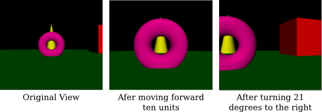

# 4.4 灯光、相机、动作

**灯光，摄影机，开拍**

=== "中文"

    计算机图形学中的一个场景可能是一个复杂的对象集合，每个对象都有自己的属性。在[小节2.4.2](../c2/s4.md#242--场景图)中，我们看到了如何使用场景图来组织2D场景中的所有对象。渲染一个场景意味着遍历场景图，在遍历过程中渲染图中的每个对象。对于3D图形，场景图必须处理更多种类的对象、属性和变换。例如，通常将灯光和摄像机视为对象，并能够将它们包含在场景图中是有用的。在本节中，我们考虑3D中的场景图，以及如何将摄像机和灯光作为对象处理。

    在设计场景图时，有很多选项需要考虑。例如，变换应该是对象节点的属性，还是应该有单独的节点来表示变换？关于属性，也可以提出同样的问题。另一个问题是，属性值应该只适用于它是属性的节点，还是应该由该节点的子节点继承？

    一个基本的选择是图的形状。一般来说，场景图可以是一个有向无环图，或者称为“dag”，它是一种类似树的结构，只不过图中的一个节点可以有多个父节点。[小节2.4.2](../c2/s4.md#242--场景图)中的场景图是dag。这的优点是图中的一个节点可以表示场景中的多个对象，因为在dag中，节点可以在遍历图时被遇到多次。另一方面，用一个场景图节点表示多个对象可能会导致缺乏灵活性，因为这些对象将具有节点中编码的任何属性的相同值。所以，在某些应用中，场景图被要求是树。在树中，每个节点都有一个唯一的父节点，并且节点在遍历树时只会被遇到一次。树和dag之间的区别将在我们讨论场景图中的摄像机节点时显现出来。

=== "英文"

    A scene in computer graphics can be a complex collection of objects, each with its own attributes. In [Subsection 2.4.2](../c2/s4.md#242--场景图), we saw how a scene graph can be used to organize all the objects in a 2D scene. Rendering a scene means traversing the scene graph, rendering each object in the graph as it is encountered. For 3D graphics, scene graphs must deal with a larger variety of objects, attributes, and transforms. For example, it is often useful to consider lights and cameras to be objects and to be able to include them in scene graphs. In this section, we consider scene graphs in 3D, and how to treat cameras and lights as objects.

    When designing scene graphs, there are many options to consider. For example, should transforms be properties of object nodes, or should there be separate nodes to represent transforms? The same question can be asked about attributes. Another question is whether an attribute value should apply only to the node of which it is a property, or should it be inherited by the children of that node?

    A fundamental choice is the shape of the graph. In general, a scene graph can be a directed acyclic graph, or "dag," which is a tree-like structure except that a node can have several parents in the graph. The scene graphs in [Subsection 2.4.2](../c2/s4.md#242--场景图) were dags. This has the advantage that a single node in the graph can represent several objects in the scene, since in a dag, a node can be encountered several times as the graph is traversed. On the other hand, representing several objects with one scene graph node can lead to a lack of flexibility, since those objects will all have the same value for any property encoded in the node. So, in some applications, scene graphs are required to be trees. In a tree, each node has a unique parent, and the node will be encountered only once as the tree in traversed. The distinction between trees and dags will show up when we discuss camera nodes in scene graphs.

## 4.4.1 属性栈

**Attribute Stack**

=== "中文"

    我们已经看到了函数 *glPushMatrix* 和 *glPopMatrix* 如何被用来操作变换堆栈。当在遍历场景图时遇到包含变换的节点，可以在应用变换之前调用 *glPushMatrix*。然后，在节点及其子节点被渲染后，调用 *glPopMatrix* 来恢复之前的模型视图变换。

    如果假设场景图中节点的属性值应该作为该属性的默认值被节点的子节点继承，那么对于颜色和材质等属性，也可以做类似的事情。OpenGL 1.1 维护了一个属性堆栈，使用函数 *glPushAttrib* 和 *glPopAttrib* 进行操作。除了对象属性如当前颜色外，属性堆栈还可以存储全局属性，如全局环境光颜色和深度测试的启用状态。由于可能的属性非常多，*glPushAttrib* 并不是简单地保存每个属性的值。相反，它只保存可能属性的一个子集。要保存的子集是作为函数的参数指定的。例如，命令

    ```c
    glPushAttrib(GL_ENABLED_BIT);
    ```

    将保存每个可以启用或禁用的 OpenGL 状态变量的副本。这包括 *GL_DEPTH_TEST*、*GL_LIGHTING*、*GL_NORMALIZE* 等的当前状态。类似地，

    ```c
    glPushAttrib(GL_CURRENT_BIT);
    ```

    保存当前颜色、法向量和纹理坐标的副本。而

    ```c
    glPushAttrib(GL_LIGHTING_BIT);
    ```

    保存与照明相关的属性，如材质属性和灯光属性的值、全局环境光颜色、颜色材质设置，以及照明和每个单独灯光的启用状态。其他常量可以用来保存其他属性集；详情请参阅 OpenGL 文档。可以将几个常量进行 OR 运算来组合属性集。例如，

    ```c
    glPushAttrib(GL_LIGHTING_BIT | GL_ENABLED_BIT)
    ```

    将保存 *GL_LIGHTING_BIT* 集和 *GL_ENABLED_BIT* 集中的属性。

    调用 *glPopAttrib()* 将恢复由相应调用 *glPushAttrib* 保存的所有值。*glPopAttrib* 不需要参数，因为要恢复的属性集由传递给 *glPushAttrib* 的参数决定。

    很容易看出如何在遍历场景图时使用 *glPushAttrib* 和 *glPopAttrib*：在处理节点时，在更改属性值之前，调用 *glPushAttrib* 保存相关属性集或多组属性集的副本。渲染节点及其子节点。然后调用 *glPopAttrib* 来恢复保存的值。这限制了更改的效果，使它们只适用于节点及其子节点。

    ----

    有另一种保存和恢复值的方法。OpenGL 有多种 "get" 函数来读取各种状态变量的值。我这里只讨论其中的一些。例如，

    ```c
    glGetFloatv(GL_CURRENT_COLOR, floatArray);
    ```

    检索由 *glColor** 设置的当前颜色值。*floatArray* 参数应该是至少长度为四的 **float** 数组。当前颜色的 RGBA 颜色分量将被存储在数组中。注意，稍后你可以简单地调用 *glColor4fv(colorArray)* 来恢复颜色。相同的函数可以用不同的第一个参数来读取不同浮点状态变量的值。要找到当前视口的值，请使用

    ```c
    glGetIntegerv(GL_VIEWPORT, intArray);
    ```

    这将设置 *intArray[0]* 和 *intArray[1]* 为当前视口左下角的 x 和 y 坐标，*intArray[2]* 为其宽度，*intArray[3]* 为其高度。要读取材质属性的当前值，请使用

    ```c
    glGetMaterialfv(face, property, floatArray);
    ```

    *face* 必须是 *GL_FRONT* 或 *GL_BACK*。属性必须是 *GL_AMBIENT*、*GL_DIFFUSE*、*GL_SPECULAR*、*GL_EMISSION* 或 *GL_SHININESS*。属性的当前值将被存储在 *floatArray* 中，对于颜色属性，它必须至少长度为四，对于 *GL_SHININESS*，至少长度为一。有一个类似的命令，*glGetLightfv*，用于读取灯光属性。

    最后，我将提到 *glIsEnabled(name)*，它可以用来检查如 *GL_LIGHTING* 和 *GL_DEPTH_TEST* 等状态变量的启用/禁用状态。参数应该是标识状态变量的常量。如果状态变量被禁用，函数返回 0；如果被启用，返回 1。例如，*glIsEnabled(GL_LIGHTING)* 测试照明是否被启用。假设场景图中的节点有一个属性 *lit* 来告诉是否应该启用照明来渲染该节点（及其子节点）。那么渲染节点的代码可能包括类似这样的东西：

    ```java
    int saveLit = glIsEnabled(GL_LIGHTING);
    if (lit)
        glEnable(GL_LIGHTING);
    else
        glDisable(GL_LIGHTING);
    .
    .  // 渲染节点及其子节点
    .
    if (saveLit)
        glEnable(GL_LIGHTING);
    else
        glDisable(GL_LIGHTING);
    ```

    由于 *glPushAttrib* 可以用来推送大组属性值，你可能会认为使用 *glIsEnabled* 和 *glGet\** 命令族来读取你计划修改的状态变量的值会更有效。然而，请记住，OpenGL 可以将一系列命令排队到批处理中，发送到显卡，并且这些命令可以由 GPU 在你的程序继续运行的同时执行。*glGet* 命令可能需要你的程序与显卡通信并等待响应。这意味着任何待处理的 OpenGL 命令都必须发送到显卡并执行后，*glGet* 命令才能完成。这是可能影响性能的事情。相比之下，*glPushAttrib* 和 *glPopAttrib* 的调用可以与其他 OpenGL 命令一起排队，并以批处理的方式发送到显卡，由图形硬件高效执行。实际上，当你可能的时候，通常最好优先使用 *glPushAttrib/glPopAttrib* 而不是 *glGet* 命令。

=== "英文"

    We have seen how the functions *glPushMatrix* and *glPopMatrix* are used to manipulate the transform stack. These functions are useful when traversing a scene graph: When a node that contains a transform is encountered during a traversal of the graph, *glPushMatrix* can be called before applying the transform. Then, after the node and its descendants have been rendered, glPopMatrix is called to restore the previous modelview transformation.

    Something similar can be done for attributes such as color and material, if it is assumed that an attribute value in a scene graph node should be inherited as the default value of that attribute for children of the node. OpenGL 1.1 maintains an attribute stack, which is manipulated using the functions *glPushAttrib* and *glPopAttrib*. In addition to object attributes like the current color, the attribute stack can store global attributes like the global ambient color and the enabled state of the depth test. Since there are so many possible attributes, *glPushAttrib* does not simply save the value of every attribute. Instead, it saves a subset of the possible attributes. The subset that is to be saved is specified as a parameter to the function. For example, the command

    ```c
    glPushAttrib(GL_ENABLED_BIT);
    ```

    will save a copy of each of the OpenGL state variables that can be enabled or disabled. This includes the current state of *GL_DEPTH_TEST*, *GL_LIGHTING*, *GL_NORMALIZE*, and others. Similarly,

    ```c
    glPushAttrib(GL_CURRENT_BIT);
    ```

    saves a copy of the current color, normal vector, and texture coordinates. And

    ```c
    glPushAttrib(GL_LIGHTING_BIT);
    ```

    saves attributes relevant to lighting such as the values of material properties and light properties, the global ambient color, color material settings, and the enabled state for lighting and each of the individual lights. Other constants can be used to save other sets of attributes; see the OpenGL documentation for details. It is possible to OR together several constants to combine sets of attributes. For example,

    ```c
    glPushAttrib(GL_LIGHTING_BIT | GL_ENABLED_BIT)
    ```

    will save the attributes in both the *GL_LIGHTING_BIT* set and in the *GL_ENABLED_BIT* set.

    Calling *glPopAttrib()* will restore all the values that were saved by the corresponding call to *glPushAttrib*. There is no need for a parameter to *glPopAttrib*, since the set of attributes that are restored is determined by the parameter that was passed to *glPushAttrib*.

    It should be easy to see how *glPushAttrib* and *glPopAttrib* can be used while traversing a scene graph: When processing a node, before changing attribute values, call *glPushAttrib* to save a copy of the relevant set or sets of attributes. Render the node and its descendants. Then call *glPopAttrib* to restore the saved values. This limits the effect of the changes so that they apply only to the node and its descendants.

    ----

    There is an alternative way to save and restore values. OpenGL has a variety of "get" functions for reading the values of various state variables. I will discuss just some of them here. For example,

    ```c
    glGetFloatv( GL_CURRENT_COLOR, floatArray );
    ```

    retrieves the current color value, as set by *glColor\**. The *floatArray* parameter should be an array of **float**, whose length is at least four. The RGBA color components of the current color will be stored in the array. Note that, later, you can simply call *glColor4fv(colorArray)* to restore the color. The same function can be used with different first parameters to read the values of different floating-point state variables. To find the current value of the viewport, use

    ```c
    glGetIntegerv( GL_VIEWPORT, intArray );
    ```

    This will set *intArray[0]* and *intArray[1]* to be the x and y coordinates of the lower left corner of the current viewport, *intArray[2]* to be its width, and *intArray[3]* to be its height. To read the current values of material properties, use

    ```c
    glGetMaterialfv( face, property, floatArray );
    ```

    The *face* must be *GL_FRONT* or *GL_BACK*. The property must be *GL_AMBIENT*, *GL_DIFFUSE*, *GL_SPECULAR*, *GL_EMISSION*, or *GL_SHININESS*. The current value of the property will be stored in *floatArray*, which must be of length at least four for the color properties, or length at least one for *GL_SHININESS*. There is a similar command, *glGetLightfv*, for reading properties of lights.

    Finally, I will mention *glIsEnabled(name)*, which can be used to check the enabled/disabled status of state variables such as *GL_LIGHTING* and *GL_DEPTH_TEST*. The parameter should be the constant that identifies the state variable. The function returns 0 if the state variable is disabled and 1 if it is enabled. For example, *glIsEnabled(GL_LIGHTING)* tests whether lighting is enabled. Suppose that a node in a scene graph has an attribute *lit* to tell whether that node (and its descendants) should be rendered with lighting enabled. Then the code for rendering a node might include something like this:

    ```java
    int saveLit = glIsEnabled(GL_LIGHTING);
    if (lit)
        glEnable(GL_LIGHTING);
    else
        glDisable(GL_LIGHTING);
    .
    .  // Render the node and its descendants
    .
    if (saveLit)
    glEnable(GL_LIGHTING);
    else
    glDisable(GL_LIGHTING);
    ```

    Since *glPushAttrib* can be used to push large groups of attribute values, you might think that it would be more efficient to use *glIsEnabled* and the *glGet\** family of commands to read the values of just those state variables that you are planning to modify. However, recall that OpenGL can queue a number of commands into a batch to be sent to the graphics card, and those commands can be executed by the GPU at the same time that your program continues to run. A *glGet* command can require your program to communicate with the graphics card and wait for the response. This means that any pending OpenGL commands will have to be sent to the graphics card and executed before the *glGet* command can complete. This is the kind of thing that can hurt performance. In contrast, calls to *glPushAttrib* and *glPopAttrib* can be queued with other OpenGL commands and sent to the graphics card in batches, where they can be executed efficiently by the graphics hardware. In fact, you should generally prefer using *glPushAttrib/glPopAttrib* instead of a *glGet* command when possible.

## 4.4.2 移动相机

**Moving Camera**

=== "中文"

    让我们转向建模的另一个方面。假设我们想要实现一个可以像其他对象一样在世界中移动的观察者。有时，这样的观察者被视为移动的摄像机。摄像机用于拍摄场景的照片。我们希望能够像对其他对象应用变换一样对摄像机应用变换。摄像机的位置和方向决定了场景渲染时应该看到什么。而摄像机的“大小”，可能会受到缩放变换的影响，决定了它的视野范围。但摄像机不仅仅是另一个对象。摄像机实际上代表我们想要使用的视图变换。回想一下，建模和视图变换具有相反的效果：使用建模变换将对象向右移动等同于使用视图变换将观察者向左移动。（见[小节3.3.4](../c3/s3.md#334-模型视图转换)。）要对摄像机应用建模变换，我们实际上想要对整个场景应用视图变换，而这个视图变换是摄像机建模变换的逆变换。

    下面的插图显示了从移动摄像机视角观察的场景。摄像机从默认的视图位置开始，位于原点，朝向负 z 轴方向。这相当于使用恒等变换作为视图变换。在第二张图像中，摄像机向前移动了十个单位。这相当于对摄像机应用建模变换 *glTranslatef(0,0,−10)*（因为它是沿着负 z 方向移动的）。但是要将这种移动实现为视图的变化，我们想要作为视图变换应用逆操作。所以，我们实际应用的视图变换是 *glTranslatef(0,0,10)*。如果你愿意，这可以被视为应用于场景中所有**其他**对象的建模变换：将摄像机朝一个方向移动十个单位等同于将所有其他对象朝相反方向移动十个单位。

    

    对于第三张图像，摄像机在平移后原地向右旋转了 21 度——围绕 y 轴顺时针旋转 21 度——**之后**。这可以通过变换 *glRotatef(21,0,1,0)* 实现——围绕 y 轴逆时针旋转 21 度——在平移**之前**应用。记住，一系列变换的逆变换是它们逆变换的组合，顺序相反。数学上，使用 T<sup>−1</sup> 表示变换 T 的逆变换，我们有 (RS)<sup>−1</sup> = S<sup>−1</sup> R<sup>−1</sup> 对于两个变换 *R* 和 *S*。

    插图中的图像来自下面的演示。该演示允许你在场景中移动。更准确地说，它当然让你改变视图变换，从不同的视点看场景。

    <iframe src="../../../en/demos/c4/walkthrough.html" width="800" height="440"></iframe>

    当使用场景图时，将摄像机对象包含在图中可能是有用的。也就是说，我们希望能够在图中包含一个代表摄像机的节点，我们希望能够使用摄像机来查看场景。甚至可能有多个摄像机在场景中，提供不同的视点。为了实现这一点，我们需要能够从给定摄像机的视角渲染场景。根据前面的讨论，我们知道为了做到这一点，我们需要使用视图变换，它是应用于摄像机对象的建模变换的逆变换。在渲染场景中的任何对象之前，必须应用视图变换。

    当遍历场景图时，可以在任何节点应用建模变换。在遇到给定节点时有效的建模变换是沿到达该节点的路径上的所有节点应用的所有变换的组合。然而，如果节点是摄像机节点，我们不想应用那个建模变换；我们想将其逆变换作为视图变换应用。要获得逆变换，我们可以从摄像机节点开始，向后沿着路径应用每个节点的建模变换的逆变换。

    

    !!! tip "译注"

        一个包含摄像机节点的场景图，实际上是一个树，R、S 和 T 代表应用于图中节点的建模变换。应用于摄像机的建模变换是 RST。视图变换是逆变换，T<sup>−1</sup> S<sup>−1</sup> R<sup>−1</sup>，可以通过从摄像机节点跟随父指针获得。

    为了轻松实现这一点，我们可以向场景图数据结构添加“父指针”。节点的父指针是指向图中该节点父节点的链接。请注意，这只在树中有效；在树中，每个节点都有一个唯一的父节点，但在一般的有向无环图中并非如此。可以通过跟随父指针向上移动树。

    考虑到这一点，从摄像机视角渲染场景的算法如下：通过调用 *glLoadIdentity()* 将模型视图变换设置为恒等。从摄像机节点开始，跟随父指针直到到达树的根。在每个节点上，应用该节点中任何建模变换的逆变换。（例如，如果建模变换是按 (a,b,c) 平移，调用 *glTranslatef(−a,−b,−c)*。）到达根节点时，已经建立了对应于摄像机的视图变换。现在，遍历场景图以通常的方式渲染场景。在遍历过程中，应该忽略摄像机节点。

    注意，摄像机可以附加到对象上，从建模的角度来看，摄像机和对象都受到相同的建模变换的影响，因此作为一个单元一起移动。例如，摄像机可能附加到汽车上，以显示通过汽车挡风玻璃的视图。如果汽车移动了，因为它的建模变换发生了变化，摄像机也会随之移动。

=== "英文"

    Let's turn to another aspect of modeling. Suppose that we want to implement a viewer that can be moved around in the world like other objects. Sometimes, such a viewer is thought of as a moving camera. The camera is used to take pictures of the scene. We want to be able to apply transformations to a camera just as we apply transformations to other objects. The position and orientation of the camera determine what should be visible when the scene is rendered. And the "size" of the camera, which can be affected by a scaling transformation, determines how large a field of view it has. But a camera is not just another object. A camera really represents the viewing transformation that we want to use. Recall that modeling and viewing transformations have opposite effects: Moving objects to the right with a modeling transform is equivalent to moving the viewer to the left with a viewing transformation. (See [Subsection 3.3.4](../c3/s3.md#334-模型视图转换).) To apply a modeling transformation to the camera, we really want to apply a viewing transformation to the scene as a whole, and that viewing transformation is the inverse of the camera's modeling transformation.

    The following illustration shows a scene viewed from a moving camera. The camera starts in the default viewing position, at the origin, looking in the direction of the negative z-axis. This corresponds to using the identity as the viewing transform. For the second image, the camera has moved forward by ten units. This would correspond to applying the modeling transformation *glTranslatef(0,0,−10)* to the camera (since it is moving in the negative z-direction). But to implement this movement as a change of view, we want to apply the inverse operation as a viewing transformation. So, the viewing transform that we actually apply is *glTranslatef(0,0,10)*. This can be seen, if you like, as a modeling transformation that is applied to all the **other** objects in the scene: Moving the camera ten units in one direction is equivalent to moving all the other objects 10 units in the opposite direction.

    

    For the third image, the camera has rotated in place by 21 degrees to the right—a 21-degree clockwise rotation about the y-axis—**after** it has been translated. This can be implemented by the transformation *glRotatef(21,0,1,0)*—a 21-degree counterclockwise rotation about the y-axis—applied **before** the translation. Remember that the inverse of a composition of transformations is the composition of their inverses, in the opposite order. Mathematically, using T<sup>−1</sup> to represent the inverse of a transformation T, we have that (RS)<sup>−1</sup> = S<sup>−1</sup>R<sup>−1</sup> for two transformations *R* and *S*.

    The images in the illustration are from the following demo. The demo lets you move around in a scene. More accurately, of course, it lets you change the viewing transformation to see the scene from different viewpoints.

    <iframe src="../../../en/demos/c4/walkthrough.html" width="800" height="440"></iframe>

    When using scene graphs, it can be useful to include a camera object in the graph. That is, we want to be able to include a node in the graph that represents the camera, and we want to be able to use the camera to view the scene. It can even be useful to have several cameras in the scene, providing alternative points of view. To implement this, we need to be able to render a scene from the point of view of a given camera. From the previous discussion, we know that in order to do that, we need to use a viewing transformation that is the inverse of the modeling transformation that is applied to the camera object. The viewing transform must be applied before any of the objects in the scene are rendered.

    When a scene graph is traversed, a modeling transformation can be applied at any node. The modeling transform that is in effect when a given node is encountered is the composition of all the transforms that were applied at nodes along the path that led to given node. However, if the node is a camera node, we don't want to apply that modeling transform; we want to apply its inverse as a viewing transform. To get the inverse, we can start at the camera node and follow the path backwards, applying the inverse of the modeling transform at each node.

    

    To easily implement this, we can add "parent pointers" to the scene graph data structure. A parent pointer for a node is a link to the parent of that node in the graph. Note that this only works if the graph is a tree; in a tree, each node has a unique parent, but that is not true in a general directed acyclic graph. It is possible to move up the tree by following parent pointers.

    We this in mind, the algorithm for rendering the scene from the point of view of a camera goes as follows: Set the modelview transform to be the identity, by calling *glLoadIdentity()*. Start at the camera node, and follow parent pointers until you reach the root of the tree. At each node, apply the inverse of any modeling transformation in that node. (For example, if the modeling transform is translation by (a,b,c), call *glTranslatef(−a,−b,−c)*.) Upon reaching the root, the viewing transform corresponding to the camera has been established. Now, traverse the scene graph to render the scene as usual. During this traversal, camera nodes should be ignored.

    Note that a camera can be attached to an object, in the sense that the camera and the object are both subject to the same modeling transformation and so move together as a unit. In modeling terms, the camera and the object are sub-objects in a complex object. For example, a camera might be attached to a car to show the view through the windshield of that car. If the car moves, because its modeling transformation changes, the camera will move along with it.

## 4.4.3 移动光源

**Moving Light**

=== "中文"

    将灯光视为对象，甚至作为复杂对象的一部分，也是非常有用的。假设一个场景包括一个灯具模型。灯具模型将包括一些几何形状以使其可见，但如果它要照亮场景中的其他对象，它还必须包含光源。这意味着灯具是一个由 OpenGL 光源加一些几何对象组成的复杂对象。应用于灯具的任何建模变换也应该影响光源和几何形状。就场景图而言，光由图中的一个节点表示，并且像场景图中的其他对象一样受到建模变换的影响。你甚至可以拥有动画灯光——或者包含灯光作为子对象的动画对象，例如汽车的前灯。

    回想一下，在 [小节4.2.3](../c4/s2.md#423-应用灯光) 中提到的，光源会受到设置光源位置时有效的模型视图变换的影响。如果光在场景图中表示为一个节点，那么我们需要的模型视图变换就是在遍历场景图时遇到该节点时有效的变换。所以，看起来我们应该只是遍历图并在遇到它时设置光的位置。

    但存在一个问题：在渲染任何几何形状之前，所有可能影响该几何形状的光源都必须已经被配置和启用。特别是，在渲染任何几何形状之前，必须设置灯光的位置。这意味着你不能简单地按通常的方式遍历场景图来设置场景图中光源的位置。如果你这样做，那么在遇到光之前绘制的对象将不会被光正确照亮。类似地，如果光节点包含任何其他光属性的值，包括光的启用/禁用状态，那么这些属性也必须在渲染任何几何形状之前设置。

    一个解决方案是对场景图进行两次遍历，第一次设置灯光，第二次绘制几何形状。由于灯光受到模型视图变换的影响，你必须在第一次遍历中以与第二次遍历完全相同的方式设置建模变换。在第一次遍历中遇到灯光时，你需要设置光的位置，因为设置位置就是触发将当前模型视图变换应用于光的操作。你还需要设置光的其他属性。在第一次遍历中，场景图中的几何对象被忽略。在第二次遍历中，当几何形状被渲染时，可以忽略光节点。

=== "英文"

    It can also be useful to think of lights as objects, even as part of a complex object. Suppose that a scene includes a model of a lamp. The lamp model would include some geometry to make it visible, but if it is going to cast light on other objects in the scene, it also has to include a source of light. This means that the lamp is a complex object made up of an OpenGL light source plus some geometric objects. Any modeling transformation that is applied to the lamp should affect the light source as well as the geometry. In terms of the scene graph, the light is represented by a node in the graph, and it is affected by modeling transformations in the same way as other objects in the scene graph. You can even have animated lights—or animated objects that include lights as sub-objects, such as the headlights on a car.

    Recall from [Subsection 4.2.3](../c4/s2.md#423-应用灯光) that a light source is subject to the modelview transform that is in effect at the time the position of the light source is set by glLightfv. If the light is represented as a node in a scene graph, then the modelview transform that we need is the one that is in effect when that node is encountered during a traversal of the scene graph. So, it seems like we should just traverse the graph and set the position of the light when we encounter it during the traversal.

    But there is a problem: Before any geometry is rendered, all the light sources that might affect that geometry must already be configured and enabled. In particular, the lights' positions must be set before rendering any geometry. This means that you can't simply set the position of light sources in the scene graph as you traverse the graph in the usual way. If you do that, objects that are drawn before the light is encountered won't be properly illuminated by the light. Similarly, if the light node contains values for any other properties of the light, including the enabled/disabled state of the light, those properties must be set before rendering any geometry.

    One solution is to do two traversals of the scene graph, the first to set up the lights and the second to draw the geometry. Since lights are affected by the modelview transformation, you have to set up the modeling transform during the first traversal in exactly the same way that you do in the second traversal. When you encounter the lights during the first traversal, you need to set the position of the light, since setting the position is what triggers the application of the current modelview transformation to the light. You also need to set any other properties of the light. During the first traversal, geometric objects in the scene graph are ignored. During the second traversal, when geometry is being rendered, light nodes can be ignored.
