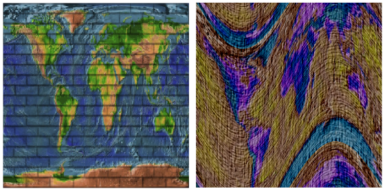

# 6.4 图像纹理

**Image Textures**

=== "中文"

    Textures play an essential role in 3D graphics, and support for image textures is built into modern GPUs on the hardware level. In this section, we look at the WebGL API for image textures. Image textures in OpenGL 1.1 were covered in [Section 4.3](../c4/s3.md). Much of that section is still relevant in modern OpenGL, including WebGL. So, as we cover image textures in WebGL, much of the material will not be new to you. However, there is one feature that is new since OpenGL 1.1: **texture units**.

    One of the significant differences between WebGL 1.0 and WebGL 2.0 is an increase in support for different types of textures and for different ways of using textures. Access to most of the new features requires using GLSL ES 3.00 for the shader programs. We will stick to WebGL 1.0 for most of this section, but will discuss some of the new WebGL 2.0 features in the 

=== "英文"

    Textures play an essential role in 3D graphics, and support for image textures is built into modern GPUs on the hardware level. In this section, we look at the WebGL API for image textures. Image textures in OpenGL 1.1 were covered in [Section 4.3](../c4/s3.md). Much of that section is still relevant in modern OpenGL, including WebGL. So, as we cover image textures in WebGL, much of the material will not be new to you. However, there is one feature that is new since OpenGL 1.1: **texture units**.

    One of the significant differences between WebGL 1.0 and WebGL 2.0 is an increase in support for different types of textures and for different ways of using textures. Access to most of the new features requires using GLSL ES 3.00 for the shader programs. We will stick to WebGL 1.0 for most of this section, but will discuss some of the new WebGL 2.0 features in the 

## 6.4.1 纹理单元和纹理对象

**Texture Units and Texture Objects**

=== "中文"

    A texture unit, also called a texture mapping unit (**TMU**) or a texture processing unit (TPU), is a hardware component in a GPU that does sampling. **Sampling** is the process of computing a color from an image texture and texture coordinates. Mapping a texture image to a surface is a fairly complex operation, since it requires more than just returning the color of the texel that contains some given texture coordinates. It also requires applying the appropriate minification or magnification filter, possibly using mipmaps if available. Fast texture sampling is one of the key requirements for good GPU performance.

    Texture units are not to be confused with texture objects. We encountered texture objects in [Subsection 4.3.7](../c4/s3.md#437-纹理对象). A texture object is a data structure that contains the color data for an image texture, and possibly for a set of mipmaps for the texture, as well as the values of texture properties such as the minification and magnification filters and the texture repeat mode. A texture unit must access a texture object to do its work. The texture unit is the processor; the texture object holds the data that is processed.

    (By the way, I should really be more careful about throwing around the terms "GPU" and "hardware." Although a texture unit probably does use an actual hardware component in the GPU, it could also be emulated, more slowly, in software. And even if there is hardware involved, having eight texture units does not necessarily mean that there are eight hardware components; the texture units might share time on a smaller number of hardware components. Similarly, I said previously that texture objects are stored in memory in the GPU, which might or might not be literally true in a given case. Nevertheless, you will probably find it conceptually easier to think of a texture unit as a piece of hardware and a texture object as a data structure in the GPU.)final subsection.

    ----

    In GLSL, texture lookup is done using **sampler variables**. A sampler variable is a variable in a shader program. In GLSL ES 1.00, the only sampler types are *sampler2D* and *samplerCube*. A *sampler2D* is used to do lookup in a standard texture image; a *samplerCube* is used to do lookup in a cubemap texture ([Subsection 5.3.4](../c5/s3.md#534-立方体贴图纹理和天空盒)). The value of a sampler variable is a reference to a texture unit. The value tells which texture unit is invoked when the sampler variable is used to do texture lookup. Sampler variables must be declared as global uniform variables. It is not legal for a shader program to assign a value to a sampler variable. The value must come from the JavaScript side.

    On the JavaScript side, the available texture units are numbered 0, 1, 2, ..., where the maximum value is implementation dependent. The number of units can be determined as the value of the expression

    ```js
    gl.getParameter( gl.MAX_COMBINED_TEXTURE_IMAGE_UNITS )
    ```

    (Please remember, again, that gl here is the name of a JavaScript variable that refers to the WebGL context, and that the name is up to the programmer.)

    As far as JavaScript is concerned, the value of a sampler variable is an integer. If you want a sampler variable to use texture unit number 2, then you set the value of the sampler variable to 2. This can be done using the function *gl.uniform1i* ([Subsection 6.1.4](../c6/s1.md#614-统一变量的值)). For example, suppose a shader program declares a sampler variable

    ```js
    uniform sampler2D u_texture;
    ```

    To set its value from JavaScript, you need the location of the variable in the shader program. If *prog* is the shader program, the location is obtained by calling

    ```js
    u_texture_location = gl.getUniformLocation( prog, "u_texture" );
    ```

    Then, you can tell the sampler variable to use texture unit number 2 by calling

    ```js
    gl.uniform1i( u_texture_location, 2 );
    ```

    Note that the integer value is not accessible in GLSL. The integer tells the sampler which texture unit to use, but there is no way for the shader program to find out the number of the unit that is being used.

    ----

    To use an image texture, you also need to create a texture object, and you need to load an image into the texture object. You might want to set some properties of the texture object, and you might want to create a set of mipmaps for the texture. And you will have to associate the texture object with a texture unit. All this is done on the JavaScript side.

    The command for creating a texture object is *gl.createTexture()*. The command in OpenGL 1.1 was *glGenTextures*. The WebGL command is easier to use. It creates a single texture object and returns a reference to it. For example,

    ```js
    textureObj = gl.createTexture();
    ```

    This just allocates some memory for the object. In order to use it, you must first "bind" the texture object by calling gl.bindTexture. For example,

    ```js
    gl.bindTexture( gl.TEXTURE_2D, textureObj );
    ```

    The first parameter, *gl.TEXTURE_2D*, is the texture target. This target is used for working with an ordinary texture image. There is a different target for cubemap textures.

    The function gl.texImage2D is used to load an image into the currently bound texture object. We will come back to that in the next subsection. But remember that this command and other commands always apply to the currently bound texture object. The texture object is not mentioned in the command; instead, the texture object must be bound before the command is called.

    You also need to tell a texture unit to use the texture object. Before you can do that, you need to make the texture unit "active," which is done by calling the function *gl.activeTexture*. The parameter is one of the constants *gl.TEXTURE0*, *gl.TEXTURE1*, *gl.TEXTURE2*, ..., which represent the available texture units. (The values of these constants are **not** 0, 1, 2, ....) Initially, texture unit number 0 is active. To make texture unit number 2 active, for example, use

    ```js
    gl.activeTexture( gl.TEXTURE2 );
    ```

    (This function should really have been called ***activeTextureUnit***, or maybe bindTextureUnit, since it works similarly to the various WebGL "bind" functions.) If you then call

    ```js
    gl.bindTexture( gl.TEXTURE_2D, textureObj );
    ```

    to bind a texture object, while texture unit 2 is active, then the texture object *textureObj* is bound to texture unit number 2 for *gl.TEXTURE_2D* operations. The binding just tells the texture unit which texture object to use. That is, when texture unit 2 does *TEXTURE_2D* lookups, it will do so using the image and the settings that are stored in *textureObj*. A texture object can be bound to several texture units at the same time. However, a given texture unit can have only one bound *TEXTURE_2D* at a time.

    So, working with texture images in WebGL involves working with texture objects, texture units, and sampler variables. The relationship among the three is illustrated in this picture:

    

    A sampler variable uses a texture unit, which uses a texture object, which holds a texture image. The JavaScript commands for setting up this chain are shown in the illustration. To apply a texture image to a primitive, you have to set up the entire chain. Of course, you also have to provide texture coordinates for the primitive, and you need to use the sampler variable in the shader program to access the texture.

    Suppose that you have several images that you would like to use on several different primitives. Between drawing primitives, you need to change the texture image that will be used. There are at least three different ways to manage the images in WebGL:

    1. You could use a single texture object and a single texture unit. The bound texture object, the active texture unit, and the value of the sampler variable can be set once and never changed. To change to a new image, you would use *gl.texImage2D* to load the image into the texture object. This is essentially how things were done in OpenGL 1.0. It's very inefficient, except when you are going to use each image just once. That's why texture objects were introduced.
    2. You could use a different texture object for each image, but use just a single texture unit. The active texture and the value of the sampler variable will never have to be changed. You would switch to a new texture image using *gl.bindTexture* to bind the texture object that contains the desired image.
    3. You could use a different texture unit for each image. You would load each image into its own texture object and bind that object to one of the texture units. You would switch to a new texture image by changing the value of the sampler variable.

    I don't know how options 2 and 3 compare in terms of efficiency. Note that you are only **forced** to use more than one texture unit if you want to apply more than one texture image to the same primitive. To do that, you will need several sampler variables in the shader program. They will have different values so that they refer to different texture units, and the color of a pixel will somehow depend on samples from both images. This picture shows two textures being combined in simple ways to compute the colors of pixels in a textured square:

    

    In the image on the left, a grayscale "brick" image is multiplied by an "Earth" image; that is, the red component of a pixel is computed by multiplying the red component from the brick texture by the red component from the Earth texture, and same for green and blue. On the right, the same Earth texture is subtracted from a "cloth" texture. Furthermore, the pattern is distorted because the texture coordinates were modified before being used to sample the textures, using the formula `texCoords.y += 0.25*sin(6.28*texCoords.x)`. That's the kind of thing that could only be done with programmable shaders! The images are taken from the following demo. Try it out!

    <iframe src="../../../en/demos/c6/multi-texture.html" width="625" height="475"></iframe>

    You might want to view the [source code](../../../en/demos/c6/multi-texture.html) to see how the textures are programmed. Two texture units are used. The values of two uniform sampler variables, *u_texture1* and *u_texture2*, are set during initialization with the code

    ```js
    u_texture1_location = gl.getUniformLocation(prog, "u_texture1");
    u_texture2_location = gl.getUniformLocation(prog, "u_texture2");
    gl.uniform1i(u_texture1_location, 0);
    gl.uniform1i(u_texture2_location, 1);
    ```

    The values are never changed. The program uses several texture images. There is a texture object for each image. On the JavaScript side, the IDs for the texture objects are stored in an array, *textureObjects*. Two popup menus allow the user to select which texture images are applied to the primitive. This is implemented in the drawing routine by binding the two selected texture objects to texture units 0 and 1, which are the units used by the two sampler variables. The code for that is:

    ```js
    let tex1Num = Number(document.getElementById("textureChoice1").value);
    gl.activeTexture( gl.TEXTURE0 );
    gl.bindTexture( gl.TEXTURE_2D, textureObjects[tex1Num] );

    let tex2Num = Number(document.getElementById("textureChoice2").value);
    gl.activeTexture( gl.TEXTURE1 );
    gl.bindTexture( gl.TEXTURE_2D, textureObjects[tex2Num] );
    ```

    Getting images into the texture objects is another question, which we turn to next.

=== "英文"

    A texture unit, also called a texture mapping unit (**TMU**) or a texture processing unit (TPU), is a hardware component in a GPU that does sampling. **Sampling** is the process of computing a color from an image texture and texture coordinates. Mapping a texture image to a surface is a fairly complex operation, since it requires more than just returning the color of the texel that contains some given texture coordinates. It also requires applying the appropriate minification or magnification filter, possibly using mipmaps if available. Fast texture sampling is one of the key requirements for good GPU performance.

    Texture units are not to be confused with texture objects. We encountered texture objects in [Subsection 4.3.7](../c4/s3.md#437-纹理对象). A texture object is a data structure that contains the color data for an image texture, and possibly for a set of mipmaps for the texture, as well as the values of texture properties such as the minification and magnification filters and the texture repeat mode. A texture unit must access a texture object to do its work. The texture unit is the processor; the texture object holds the data that is processed.

    (By the way, I should really be more careful about throwing around the terms "GPU" and "hardware." Although a texture unit probably does use an actual hardware component in the GPU, it could also be emulated, more slowly, in software. And even if there is hardware involved, having eight texture units does not necessarily mean that there are eight hardware components; the texture units might share time on a smaller number of hardware components. Similarly, I said previously that texture objects are stored in memory in the GPU, which might or might not be literally true in a given case. Nevertheless, you will probably find it conceptually easier to think of a texture unit as a piece of hardware and a texture object as a data structure in the GPU.)final subsection.

    ----

    In GLSL, texture lookup is done using **sampler variables**. A sampler variable is a variable in a shader program. In GLSL ES 1.00, the only sampler types are *sampler2D* and *samplerCube*. A *sampler2D* is used to do lookup in a standard texture image; a *samplerCube* is used to do lookup in a cubemap texture ([Subsection 5.3.4](../c5/s3.md#534-立方体贴图纹理和天空盒)). The value of a sampler variable is a reference to a texture unit. The value tells which texture unit is invoked when the sampler variable is used to do texture lookup. Sampler variables must be declared as global uniform variables. It is not legal for a shader program to assign a value to a sampler variable. The value must come from the JavaScript side.

    On the JavaScript side, the available texture units are numbered 0, 1, 2, ..., where the maximum value is implementation dependent. The number of units can be determined as the value of the expression

    ```js
    gl.getParameter( gl.MAX_COMBINED_TEXTURE_IMAGE_UNITS )
    ```

    (Please remember, again, that gl here is the name of a JavaScript variable that refers to the WebGL context, and that the name is up to the programmer.)

    As far as JavaScript is concerned, the value of a sampler variable is an integer. If you want a sampler variable to use texture unit number 2, then you set the value of the sampler variable to 2. This can be done using the function *gl.uniform1i* ([Subsection 6.1.4](../c6/s1.md#614-统一变量的值)). For example, suppose a shader program declares a sampler variable

    ```js
    uniform sampler2D u_texture;
    ```

    To set its value from JavaScript, you need the location of the variable in the shader program. If *prog* is the shader program, the location is obtained by calling

    ```js
    u_texture_location = gl.getUniformLocation( prog, "u_texture" );
    ```

    Then, you can tell the sampler variable to use texture unit number 2 by calling

    ```js
    gl.uniform1i( u_texture_location, 2 );
    ```

    Note that the integer value is not accessible in GLSL. The integer tells the sampler which texture unit to use, but there is no way for the shader program to find out the number of the unit that is being used.

    ----

    To use an image texture, you also need to create a texture object, and you need to load an image into the texture object. You might want to set some properties of the texture object, and you might want to create a set of mipmaps for the texture. And you will have to associate the texture object with a texture unit. All this is done on the JavaScript side.

    The command for creating a texture object is *gl.createTexture()*. The command in OpenGL 1.1 was *glGenTextures*. The WebGL command is easier to use. It creates a single texture object and returns a reference to it. For example,

    ```js
    textureObj = gl.createTexture();
    ```

    This just allocates some memory for the object. In order to use it, you must first "bind" the texture object by calling gl.bindTexture. For example,

    ```js
    gl.bindTexture( gl.TEXTURE_2D, textureObj );
    ```

    The first parameter, *gl.TEXTURE_2D*, is the texture target. This target is used for working with an ordinary texture image. There is a different target for cubemap textures.

    The function gl.texImage2D is used to load an image into the currently bound texture object. We will come back to that in the next subsection. But remember that this command and other commands always apply to the currently bound texture object. The texture object is not mentioned in the command; instead, the texture object must be bound before the command is called.

    You also need to tell a texture unit to use the texture object. Before you can do that, you need to make the texture unit "active," which is done by calling the function *gl.activeTexture*. The parameter is one of the constants *gl.TEXTURE0*, *gl.TEXTURE1*, *gl.TEXTURE2*, ..., which represent the available texture units. (The values of these constants are **not** 0, 1, 2, ....) Initially, texture unit number 0 is active. To make texture unit number 2 active, for example, use

    ```js
    gl.activeTexture( gl.TEXTURE2 );
    ```

    (This function should really have been called ***activeTextureUnit***, or maybe bindTextureUnit, since it works similarly to the various WebGL "bind" functions.) If you then call

    ```js
    gl.bindTexture( gl.TEXTURE_2D, textureObj );
    ```

    to bind a texture object, while texture unit 2 is active, then the texture object *textureObj* is bound to texture unit number 2 for *gl.TEXTURE_2D* operations. The binding just tells the texture unit which texture object to use. That is, when texture unit 2 does *TEXTURE_2D* lookups, it will do so using the image and the settings that are stored in *textureObj*. A texture object can be bound to several texture units at the same time. However, a given texture unit can have only one bound *TEXTURE_2D* at a time.

    So, working with texture images in WebGL involves working with texture objects, texture units, and sampler variables. The relationship among the three is illustrated in this picture:

    

    A sampler variable uses a texture unit, which uses a texture object, which holds a texture image. The JavaScript commands for setting up this chain are shown in the illustration. To apply a texture image to a primitive, you have to set up the entire chain. Of course, you also have to provide texture coordinates for the primitive, and you need to use the sampler variable in the shader program to access the texture.

    Suppose that you have several images that you would like to use on several different primitives. Between drawing primitives, you need to change the texture image that will be used. There are at least three different ways to manage the images in WebGL:

    1. You could use a single texture object and a single texture unit. The bound texture object, the active texture unit, and the value of the sampler variable can be set once and never changed. To change to a new image, you would use *gl.texImage2D* to load the image into the texture object. This is essentially how things were done in OpenGL 1.0. It's very inefficient, except when you are going to use each image just once. That's why texture objects were introduced.
    2. You could use a different texture object for each image, but use just a single texture unit. The active texture and the value of the sampler variable will never have to be changed. You would switch to a new texture image using *gl.bindTexture* to bind the texture object that contains the desired image.
    3. You could use a different texture unit for each image. You would load each image into its own texture object and bind that object to one of the texture units. You would switch to a new texture image by changing the value of the sampler variable.

    I don't know how options 2 and 3 compare in terms of efficiency. Note that you are only **forced** to use more than one texture unit if you want to apply more than one texture image to the same primitive. To do that, you will need several sampler variables in the shader program. They will have different values so that they refer to different texture units, and the color of a pixel will somehow depend on samples from both images. This picture shows two textures being combined in simple ways to compute the colors of pixels in a textured square:

    

    In the image on the left, a grayscale "brick" image is multiplied by an "Earth" image; that is, the red component of a pixel is computed by multiplying the red component from the brick texture by the red component from the Earth texture, and same for green and blue. On the right, the same Earth texture is subtracted from a "cloth" texture. Furthermore, the pattern is distorted because the texture coordinates were modified before being used to sample the textures, using the formula `texCoords.y += 0.25*sin(6.28*texCoords.x)`. That's the kind of thing that could only be done with programmable shaders! The images are taken from the following demo. Try it out!

    <iframe src="../../../en/demos/c6/multi-texture.html" width="625" height="475"></iframe>

    You might want to view the [source code](../../../en/demos/c6/multi-texture.html) to see how the textures are programmed. Two texture units are used. The values of two uniform sampler variables, *u_texture1* and *u_texture2*, are set during initialization with the code

    ```js
    u_texture1_location = gl.getUniformLocation(prog, "u_texture1");
    u_texture2_location = gl.getUniformLocation(prog, "u_texture2");
    gl.uniform1i(u_texture1_location, 0);
    gl.uniform1i(u_texture2_location, 1);
    ```

    The values are never changed. The program uses several texture images. There is a texture object for each image. On the JavaScript side, the IDs for the texture objects are stored in an array, *textureObjects*. Two popup menus allow the user to select which texture images are applied to the primitive. This is implemented in the drawing routine by binding the two selected texture objects to texture units 0 and 1, which are the units used by the two sampler variables. The code for that is:

    ```js
    let tex1Num = Number(document.getElementById("textureChoice1").value);
    gl.activeTexture( gl.TEXTURE0 );
    gl.bindTexture( gl.TEXTURE_2D, textureObjects[tex1Num] );

    let tex2Num = Number(document.getElementById("textureChoice2").value);
    gl.activeTexture( gl.TEXTURE1 );
    gl.bindTexture( gl.TEXTURE_2D, textureObjects[tex2Num] );
    ```

    Getting images into the texture objects is another question, which we turn to next.

## 6.4.2 处理图像

**Working with Images**

=== "中文"

    An image can be loaded into a texture object using the function gl.texImage2D. For use with WebGL, this function usually has the form

    ```js
    gl.texImage2D( target, 0, gl.RGBA, gl.RGBA, gl.UNSIGNED_BYTE, image );
    ```

    The target is *gl.TEXTURE_2D* for ordinary textures; there are other targets for loading cubemap textures. The second parameter is the mipmap level, which is 0 for the main image. Although it is possible to load individual mipmaps, that is rarely done. The next two parameters give the format of the texture inside the texture object and in the original image. In WebGL 1.0, the two format parameters should have the same value. Since web images are stored in RGBA format, *gl.RGBA* is probably the most efficient choice, and there is rarely a need to use anything else. But you can use *gl.RGB* if you don't need the alpha component. And by using *gl.LUMINANCE* or *gl.LUMINANCE_ALPHA*, you can convert the image to grayscale. (Luminance is a weighted average of red, green, and blue that approximates the perceived brightness of a color.) The fourth parameter is always going to be *gl.UNSIGNED_BYTE*, indicating that the colors in the image are stored using one byte for each color component. Although other values are possible, they don't really make sense for web images.

    The last parameter in the call to *gl.texImage2D* is the image. Ordinarily, *image* will be a DOM image element that has been loaded asynchronously by JavaScript. The *image* can also be a `<canvas>` element. This means that you can draw on a canvas, using the HTML canvas 2D graphics API, and then use the canvas as the source for a texture image. You can even do that with an off-screen canvas that is not visible on the web page.

    The image is loaded into the texture object that is currently bound to target in the currently active texture unit. There is no default texture object; that is, if no texture has been bound when *gl.texImage2D* is called, an error occurs. The active texture unit is the one that has been selected using *gl.activeTexture*, or is texture unit 0 if *gl.activeTexture* has never been called. A texture object is bound to the active texture unit by *gl.bindTexture*. This was discussed earlier in this section.

    Using images in WebGL is complicated by the fact that images are loaded asynchronously. That is, the command for loading an image just starts the process of loading the image. You can specify a callback function that will be executed when the loading completes. The image won't actually be available for use until after the callback function is called. When loading an image to use as a texture, the callback function should load the image into a texture object. Often, it will also call a rendering function to draw the scene, with the texture image.

    The sample program [webgl/simple-texture.html](../../../en/source/webgl/simple-texture.html) is an example of using a single texture on a triangle. Here is a function that is used to load the texture image in that program. The texture object is created before the function is called.

    ```js
    /**
     *  Loads a texture image asynchronously.  The first parameter is the url
     *  from which the image is to be loaded.  The second parameter is the
     *  texture object into which the image is to be loaded.  When the image
     *  has finished loading, the draw() function will be called to draw the
     *  triangle with the texture.  (Also, if an error occurs during loading,
     *  an error message is displayed on the page, and draw() is called to
     *  draw the triangle without the texture.)
     */
    function loadTexture( url, textureObject ) {
        const  img = new Image();  //  A DOM image element to represent the image.
        img.onload = function() { 
            // This function will be called after the image loads successfully.
            // We have to bind the texture object to the TEXTURE_2D target before
            // loading the image into the texture object. 
            gl.bindTexture(gl.TEXTURE_2D, textureObject);
            try {
            gl.texImage2D(gl.TEXTURE_2D,0,gl.RGBA,gl.RGBA,gl.UNSIGNED_BYTE,img);
            gl.generateMipmap(gl.TEXTURE_2D);  // Create mipmaps; you must either
                                // do this or change the minification filter.
            }
            catch (e) { // Probably a security exception, because this page has been
                        // loaded through a file:// URL.
                document.getElementById("headline").innerHTML =
                "Sorry, couldn't load texture.<br>" +
                "Some web browsers won't use images from a local disk";
            }
            draw();  // Draw the canvas, with or without the texture.  
        };
        img.onerror = function() { 
            // This function will be called if an error occurs while loading.
            document.getElementById("headline").innerHTML =
                            "<p>Sorry, texture image could not be loaded.</p>";
            draw();  // Draw without the texture; triangle will be black.
        };
        img.src = url;  // Start loading of the image.
                        // This must be done after setting onload and onerror.
    }
    ```

    Note that image textures for WebGL 1.0 should be power-of-two textures. That is, the width and the height of the image should each be a power of 2, such as 128, 256, or 512. You can, in fact, use non-power-of-two textures, but you can't use mipmaps with such textures, and the only texture repeat mode that is supported by such textures is *gl.CLAMP_TO_EDGE*. (WebGL 2.0 does not have these restrictions.)

    (The try..catch statement is used in this function because most web browsers will throw a security exception when a page attempts to use an image from the local file system as a texture. This means that if you attempt to run a program that uses textures from a downloaded version of this book, the programs that use textures might not work.)

    ----

    There are several parameters associated with a texture object, including the texture repeat modes and the minification and magnification filters. They can be set using the function *gl.texParameteri*. The setting applies to the currently bound texture object. Most of the details are the same as in OpenGL 1.1 ([Subsection 4.3.3](../c4/s3.md#433-纹理目标和纹理参数)). For example, the minification filter can be set to LINEAR using

    ```js
    gl.texParameteri( gl.TEXTURE_2D, gl.TEXTURE_MIN_FILTER, gl.LINEAR);
    ```

    Recall that the default minification filter won't work without mipmaps. To get a working texture, you have to change the minification filter or install a full set of mipmaps. Fortunately, WebGL has a function that will generate the mipmaps for you:

    ```js
    gl.generateMipmap( gl.TEXTURE_2D );
    ```

    The texture repeat modes determine what happens when texture coordinates lie outside the range 0.0 to 1.0. There is a separate repeat mode for each direction in the texture coordinate system. In WebGL, the possible values are *gl.REPEAT*, *gl.CLAMP_TO_EDGE*, and *gl.MIRRORED_REPEAT*. The default is *gl.REPEAT*. The mode *CLAMP_TO_EDGE* was called *CLAMP* in OpenGL 1.1, and *MIRRORED_REPEAT* is new in WebGL. With *MIRRORED_REPEAT*, the texture image is repeated to cover the entire plane, but every other copy of the image is reflected. This can eliminate visible seams between the copies. To set a texture to use mirrored repeat in both directions, use

    ```js
    gl.texParameteri( gl.TEXTURE_2D, gl.TEXTURE_WRAP_S, gl.MIRRORED_REPEAT);
    gl.texParameteri( gl.TEXTURE_2D, gl.TEXTURE_WRAP_T, gl.MIRRORED_REPEAT);
    ```

    ----

    In WebGL, texture coordinates are usually input to the vertex shader as an attribute of type *vec2*. They are communicated to the fragment shader in a varying variable. Often, the vertex shader will simply copy the value of the attribute into the varying variable. Another possibility is to apply an affine texture transformation to the coordinates in the vertex shader before passing them on to the fragment shader. In the fragment shader, the texture coordinates are used to sample a texture. The GLSL ES 1.00 function for sampling an ordinary texture is

    ```js
    texture2D( samplerVariable, textureCoordinates );
    ```

    where *samplerVariable* is the uniform variable of type *sampler2D* that represents the texture, and *textureCoordinates* is a *vec2* containing the texture coordinates. The return value is an RGBA color, represented as a value of type *vec4*. As a very minimal example, here is a fragment shader that simply uses the sampled value from the texture as the color of the pixel.

    ```js
    precision mediump float;
    uniform sampler2D u_texture;
    varying vec2 v_texCoords;
    void main() {
    vec4 color = texture2D( u_texture, v_texCoords );
    gl_FragColor = color;
    }
    ```

    This shader is from the sample program [webgl/simple-texture.html](../../../en/source/webgl/simple-texture.html).

    Textures are sometimes used on primitives of type *gl.POINTS*. In that case, it's natural to get the texture coordinates for a pixel from the special fragment shader variable *gl_PointCoord*. A point is rendered as a square, and the coordinates in *gl_PointCoord* range from 0.0 to 1.0 over that square. So, using *gl_PointCoord* means that one copy of the texture will be pasted onto the point. If the *POINTS* primitive has more than one vertex, you will see a copy of the texture at the location of each vertex. This is an easy way to put an image, or multiple copies of an image, into a scene. The technique is sometimes referred to as "point sprites."

    The following demo draws a single textured primitive of type *gl.POINTS*, so you can see what it looks like. In the demo, only a circular cutout from each square point is drawn.

    <iframe src="../../../en/demos/c6/textured-points.html" width="600" height="375"></iframe>

    The pixel data for a texture image in WebGL is stored in memory starting with the row of pixels at the bottom of the image and working up from there. When WebGL creates the texture by reading the data from an image, it assumes that the image uses the same format. However, images in a web browser are stored in the opposite order, starting with the pixels in the top row of the image and working down. The result of this mismatch is that texture images will appear upside down. You can account for this by modifying your texture coordinates. However, you can also tell WebGL to invert the images for you as it "unpacks" them. To do that, call

    ```js
    gl.pixelStorei( gl.UNPACK_FLIP_Y_WEBGL, 1 );
    ```

    Generally, you can do this as part of initialization. Note however that for *gl.POINTS* primitives, the coordinate system used by *gl_PointCoord* is already upside down, with the y-coordinate increasing from top to bottom. So, if you are loading an image for use on a *POINTS* primitive, you might want to set *gl.UNPACK_FLIP_Y_WEBGL* to its default value, 0.

=== "英文"

    An image can be loaded into a texture object using the function gl.texImage2D. For use with WebGL, this function usually has the form

    ```js
    gl.texImage2D( target, 0, gl.RGBA, gl.RGBA, gl.UNSIGNED_BYTE, image );
    ```

    The target is *gl.TEXTURE_2D* for ordinary textures; there are other targets for loading cubemap textures. The second parameter is the mipmap level, which is 0 for the main image. Although it is possible to load individual mipmaps, that is rarely done. The next two parameters give the format of the texture inside the texture object and in the original image. In WebGL 1.0, the two format parameters should have the same value. Since web images are stored in RGBA format, *gl.RGBA* is probably the most efficient choice, and there is rarely a need to use anything else. But you can use *gl.RGB* if you don't need the alpha component. And by using *gl.LUMINANCE* or *gl.LUMINANCE_ALPHA*, you can convert the image to grayscale. (Luminance is a weighted average of red, green, and blue that approximates the perceived brightness of a color.) The fourth parameter is always going to be *gl.UNSIGNED_BYTE*, indicating that the colors in the image are stored using one byte for each color component. Although other values are possible, they don't really make sense for web images.

    The last parameter in the call to *gl.texImage2D* is the image. Ordinarily, *image* will be a DOM image element that has been loaded asynchronously by JavaScript. The *image* can also be a `<canvas>` element. This means that you can draw on a canvas, using the HTML canvas 2D graphics API, and then use the canvas as the source for a texture image. You can even do that with an off-screen canvas that is not visible on the web page.

    The image is loaded into the texture object that is currently bound to target in the currently active texture unit. There is no default texture object; that is, if no texture has been bound when *gl.texImage2D* is called, an error occurs. The active texture unit is the one that has been selected using *gl.activeTexture*, or is texture unit 0 if *gl.activeTexture* has never been called. A texture object is bound to the active texture unit by *gl.bindTexture*. This was discussed earlier in this section.

    Using images in WebGL is complicated by the fact that images are loaded asynchronously. That is, the command for loading an image just starts the process of loading the image. You can specify a callback function that will be executed when the loading completes. The image won't actually be available for use until after the callback function is called. When loading an image to use as a texture, the callback function should load the image into a texture object. Often, it will also call a rendering function to draw the scene, with the texture image.

    The sample program [webgl/simple-texture.html](../../../en/source/webgl/simple-texture.html) is an example of using a single texture on a triangle. Here is a function that is used to load the texture image in that program. The texture object is created before the function is called.

    ```js
    /**
     *  Loads a texture image asynchronously.  The first parameter is the url
     *  from which the image is to be loaded.  The second parameter is the
     *  texture object into which the image is to be loaded.  When the image
     *  has finished loading, the draw() function will be called to draw the
     *  triangle with the texture.  (Also, if an error occurs during loading,
     *  an error message is displayed on the page, and draw() is called to
     *  draw the triangle without the texture.)
     */
    function loadTexture( url, textureObject ) {
        const  img = new Image();  //  A DOM image element to represent the image.
        img.onload = function() { 
            // This function will be called after the image loads successfully.
            // We have to bind the texture object to the TEXTURE_2D target before
            // loading the image into the texture object. 
            gl.bindTexture(gl.TEXTURE_2D, textureObject);
            try {
            gl.texImage2D(gl.TEXTURE_2D,0,gl.RGBA,gl.RGBA,gl.UNSIGNED_BYTE,img);
            gl.generateMipmap(gl.TEXTURE_2D);  // Create mipmaps; you must either
                                // do this or change the minification filter.
            }
            catch (e) { // Probably a security exception, because this page has been
                        // loaded through a file:// URL.
                document.getElementById("headline").innerHTML =
                "Sorry, couldn't load texture.<br>" +
                "Some web browsers won't use images from a local disk";
            }
            draw();  // Draw the canvas, with or without the texture.  
        };
        img.onerror = function() { 
            // This function will be called if an error occurs while loading.
            document.getElementById("headline").innerHTML =
                            "<p>Sorry, texture image could not be loaded.</p>";
            draw();  // Draw without the texture; triangle will be black.
        };
        img.src = url;  // Start loading of the image.
                        // This must be done after setting onload and onerror.
    }
    ```

    Note that image textures for WebGL 1.0 should be power-of-two textures. That is, the width and the height of the image should each be a power of 2, such as 128, 256, or 512. You can, in fact, use non-power-of-two textures, but you can't use mipmaps with such textures, and the only texture repeat mode that is supported by such textures is *gl.CLAMP_TO_EDGE*. (WebGL 2.0 does not have these restrictions.)

    (The try..catch statement is used in this function because most web browsers will throw a security exception when a page attempts to use an image from the local file system as a texture. This means that if you attempt to run a program that uses textures from a downloaded version of this book, the programs that use textures might not work.)

    ----

    There are several parameters associated with a texture object, including the texture repeat modes and the minification and magnification filters. They can be set using the function *gl.texParameteri*. The setting applies to the currently bound texture object. Most of the details are the same as in OpenGL 1.1 ([Subsection 4.3.3](../c4/s3.md#433-纹理目标和纹理参数)). For example, the minification filter can be set to LINEAR using

    ```js
    gl.texParameteri( gl.TEXTURE_2D, gl.TEXTURE_MIN_FILTER, gl.LINEAR);
    ```

    Recall that the default minification filter won't work without mipmaps. To get a working texture, you have to change the minification filter or install a full set of mipmaps. Fortunately, WebGL has a function that will generate the mipmaps for you:

    ```js
    gl.generateMipmap( gl.TEXTURE_2D );
    ```

    The texture repeat modes determine what happens when texture coordinates lie outside the range 0.0 to 1.0. There is a separate repeat mode for each direction in the texture coordinate system. In WebGL, the possible values are *gl.REPEAT*, *gl.CLAMP_TO_EDGE*, and *gl.MIRRORED_REPEAT*. The default is *gl.REPEAT*. The mode *CLAMP_TO_EDGE* was called *CLAMP* in OpenGL 1.1, and *MIRRORED_REPEAT* is new in WebGL. With *MIRRORED_REPEAT*, the texture image is repeated to cover the entire plane, but every other copy of the image is reflected. This can eliminate visible seams between the copies. To set a texture to use mirrored repeat in both directions, use

    ```js
    gl.texParameteri( gl.TEXTURE_2D, gl.TEXTURE_WRAP_S, gl.MIRRORED_REPEAT);
    gl.texParameteri( gl.TEXTURE_2D, gl.TEXTURE_WRAP_T, gl.MIRRORED_REPEAT);
    ```

    ----

    In WebGL, texture coordinates are usually input to the vertex shader as an attribute of type *vec2*. They are communicated to the fragment shader in a varying variable. Often, the vertex shader will simply copy the value of the attribute into the varying variable. Another possibility is to apply an affine texture transformation to the coordinates in the vertex shader before passing them on to the fragment shader. In the fragment shader, the texture coordinates are used to sample a texture. The GLSL ES 1.00 function for sampling an ordinary texture is

    ```js
    texture2D( samplerVariable, textureCoordinates );
    ```

    where *samplerVariable* is the uniform variable of type *sampler2D* that represents the texture, and *textureCoordinates* is a *vec2* containing the texture coordinates. The return value is an RGBA color, represented as a value of type *vec4*. As a very minimal example, here is a fragment shader that simply uses the sampled value from the texture as the color of the pixel.

    ```js
    precision mediump float;
    uniform sampler2D u_texture;
    varying vec2 v_texCoords;
    void main() {
    vec4 color = texture2D( u_texture, v_texCoords );
    gl_FragColor = color;
    }
    ```

    This shader is from the sample program [webgl/simple-texture.html](../../../en/source/webgl/simple-texture.html).

    Textures are sometimes used on primitives of type *gl.POINTS*. In that case, it's natural to get the texture coordinates for a pixel from the special fragment shader variable *gl_PointCoord*. A point is rendered as a square, and the coordinates in *gl_PointCoord* range from 0.0 to 1.0 over that square. So, using *gl_PointCoord* means that one copy of the texture will be pasted onto the point. If the *POINTS* primitive has more than one vertex, you will see a copy of the texture at the location of each vertex. This is an easy way to put an image, or multiple copies of an image, into a scene. The technique is sometimes referred to as "point sprites."

    The following demo draws a single textured primitive of type *gl.POINTS*, so you can see what it looks like. In the demo, only a circular cutout from each square point is drawn.

    <iframe src="../../../en/demos/c6/textured-points.html" width="600" height="375"></iframe>

    The pixel data for a texture image in WebGL is stored in memory starting with the row of pixels at the bottom of the image and working up from there. When WebGL creates the texture by reading the data from an image, it assumes that the image uses the same format. However, images in a web browser are stored in the opposite order, starting with the pixels in the top row of the image and working down. The result of this mismatch is that texture images will appear upside down. You can account for this by modifying your texture coordinates. However, you can also tell WebGL to invert the images for you as it "unpacks" them. To do that, call

    ```js
    gl.pixelStorei( gl.UNPACK_FLIP_Y_WEBGL, 1 );
    ```

    Generally, you can do this as part of initialization. Note however that for *gl.POINTS* primitives, the coordinate system used by *gl_PointCoord* is already upside down, with the y-coordinate increasing from top to bottom. So, if you are loading an image for use on a *POINTS* primitive, you might want to set *gl.UNPACK_FLIP_Y_WEBGL* to its default value, 0.

## 6.4.3 更多制作纹理的方法

**More Ways to Make Textures**

=== "中文"

=== "英文"

## 6.4.4 立方体贴图纹理

**Cubemap Textures**

=== "中文"

=== "英文"

## 6.4.5 计算示例

**A Computational Example**

=== "中文"

=== "英文"

## 6.4.6 WebGL 2.0 中的纹理

**Textures in WebGL 2.0**

=== "中文"

=== "英文"
