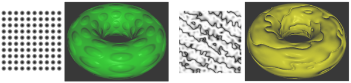
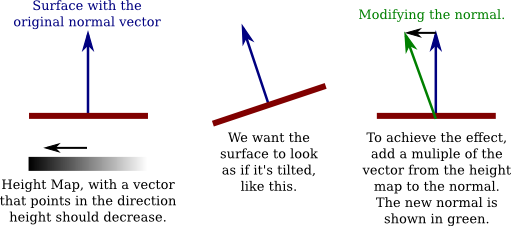

# 7.3 纹理

**Textures**

=== "中文"

    WebGL API 中大部分与纹理相关的功能在 [第6.4节](../c6/s4.md) 中已经介绍过了。在这一部分，我们将看一些使用纹理的示例和技术。

=== "英文"

    Most of the WebGL API for working with textures was already covered in [Section 6.4](../c6/s4.md). In this section, we look at several examples and techniques for using textures.

## 7.3.1 使用 glMatrix 进行纹理变换

**Texture Transforms with glMatrix**

=== "中文"

    在 [4.3.4小节](../c4/s3.md#434-纹理变换) 中，我们看到了如何在 OpenGL 中应用纹理变换。OpenGL 维护了一个纹理变换矩阵，可以操纵它来在采样纹理之前对纹理坐标进行缩放、旋转和平移。在 WebGL 中以相同的方式编程这些操作也很容易。我们需要在 JavaScript 端计算纹理变换矩阵。然后，将变换矩阵发送到着色器程序中的 uniform 矩阵变量，在那里它可以被应用到纹理坐标上。请注意，只要纹理变换是仿射的，它就可以在顶点着色器中应用，即使纹理是在片段着色器中采样的。也就是说，在顶点着色器中进行变换并在片段着色器中插值变换后的纹理坐标，将得到与在片段着色器中插值原始纹理坐标并应用变换到插值坐标相同的结果。

    由于我们使用 *glMatrix* 进行 3D 中的坐标变换，使用它进行纹理变换也是有意义的。如果我们使用 2D 纹理坐标，我们可以使用 *glMatrix* 中的 ***mat3*** 类在 JavaScript 端实现缩放、旋转和平移。我们需要的函数有：

    - `mat3.create()` — 返回一个新的 3x3 矩阵（表示为长度为 9 的数组）。新矩阵是单位矩阵。
    - `mat3.identity(A)` — 将 A 设置为单位矩阵，其中 *A* 是一个已经存在的 ***mat3***。
    - `mat3.translate(A,B,[dx,dy])` — 将矩阵 *B* 乘以表示 (dx,dy) 平移的矩阵，并将结果矩阵设置为 *A*。*A* 和 *B* 必须已经存在。
    - `mat3.scale(A,B,[sx,sy])` — 将 *B* 乘以表示 (sx,sy) 缩放的矩阵，并将结果矩阵设置为 A。
    - `mat3.rotate(A,B,angle)` — 将 *B* 乘以表示绕原点旋转 angle 弧度的矩阵，并将结果矩阵设置为 A。

    对于实现纹理变换，这些函数中的参数 A 和 B 将是纹理变换矩阵。例如，要将纹理坐标缩放 2 倍，我们可能会使用以下代码：

    ```js
    var textureTransform = mat3.create();
    mat3.scale( textureTransform, textureTransform, [2,2] );
    gl.uniformMatrix3fv( u_textureTransform, false, textureTransform );
    ```

    最后一行假设 *u_textureTransform* 是着色器程序中类型为 *mat3* 的 uniform 变量的位置。（并请记住，将纹理坐标缩放 2 倍将使其应用到的表面的纹理尺寸 **缩小**。）

    示例 WebGL 程序 [webgl/texture-transform.html](../../../en/source/webgl/texture-transform.html) 使用纹理变换来动画化纹理。在这个程序中，纹理坐标作为类型为 *vec2* 的属性 *a_texCoords* 输入到顶点着色器，并且纹理变换是一个名为 *textureTransform* 的 uniform 变量，类型为 *mat3*。在顶点着色器中使用 GLSL 命令计算变换后的纹理坐标：

    ```js
    vec3 texcoords = textureTransform * vec3(a_texCoords,1.0);
    v_texCoords = texcoords.xy;
    ```

    阅读源代码，了解所有这些是如何在一个完整程序的上下文中使用的。

=== "英文"

    In [Subsection 4.3.4](../c4/s3.md#434-纹理变换), we saw how to apply a texture transformation in OpenGL. OpenGL maintains a texture transform matrix that can be manipulated to apply scaling, rotation, and translation to texture coordinates before they are used to sample a texture. It is easy to program the same operations in WebGL. We need to compute the texture transform matrix on the JavaScript side. The transform matrix is then sent to a uniform matrix variable in the shader program, where it can be applied to the texture coordinates. Note that as long as the texture transformation is affine, it can be applied in the vertex shader, even though the texture is sampled in the fragment shader. That is, doing the transformation in the vertex shader and interpolating the transformed texture coordinates will give the same result as interpolating the original texture coordinates and applying the transformation to the interpolated coordinates in the fragment shader.

    Since we are using *glMatrix* for coordinate transformation in 3D, it makes sense to use it for texture transforms as well. If we use 2D texture coordinates, we can implement scaling, rotation, and translation on the JavaScript side using the ***mat3*** class from *glMatrix*. The functions that we need are

    - `mat3.create()` — Returns a new 3-by-3 matrix (represented as an array of length 9). The new matrix is the identity matrix.
    - `mat3.identity(A)` — Sets A to be the identity matrix, where *A* is an already-existing ***mat3***.
    - `mat3.translate(A,B,[dx,dy])` — Multiplies the matrix *B* by a matrix representing translation by *(dx,dy)*, and sets *A* to be the resulting matrix. *A* and *B* must already exist.
    - `mat3.scale(A,B,[sx,sy])` — Multiplies *B* by a matrix representing scaling by *(sx,sy)*, and sets A to be the resulting matrix.
    - `mat3.rotate(A,B,angle)` — Multiplies *B* by a matrix representing rotation by angle radians about the origin, and sets A to be the resulting matrix.

    For implementing texture transformations, the parameters A and B in these functions will be the texture transform matrix. For example, to apply a scaling by a factor of 2 to the texture coordinates, we might use the code:

    ```js
    var textureTransform = mat3.create();
    mat3.scale( textureTransform, textureTransform, [2,2] );
    gl.uniformMatrix3fv( u_textureTransform, false, textureTransform );
    ```

    The last line assumes that *u_textureTransform* is the location of a uniform variable of type *mat3* in the shader program. (And remember that scaling the texture coordinates by a factor of 2 will **shrink** the texture on the surfaces to which it is applied.)

    The sample WebGL program [webgl/texture-transform.html](../../../en/source/webgl/texture-transform.html) uses texture transformations to animate textures. In the program, texture coordinates are input into the vertex shader as an attribute named *a_texCoords* of type *vec2*, and the texture transformation is a uniform variable named *textureTransform* of type *mat3*. The transformed texture coordinates are computed in the vertex shader with the GLSL commands

    ```js
    vec3 texcoords = textureTransform * vec3(a_texCoords,1.0);
    v_texCoords = texcoords.xy;
    ```

    Read the source code to see how all this is used in the context of a complete program.

## 7.3.2 生成纹理坐标

**Generated Texture Coordinates**

=== "中文"

    纹理坐标通常作为属性变量提供给着色器程序。但是，当纹理坐标不可用时，可以在着色器程序中生成它们。虽然使用为正在渲染的对象定制的纹理坐标的结果通常看起来更好，但在某些情况下，使用生成的纹理坐标也是可以接受的。

    生成的纹理坐标应该从正在渲染的对象的对象坐标计算得出。也就是说，它们从原始顶点坐标计算得出，即在应用任何变换之前。然后，当对象被变换时，纹理也会随着对象一起变换，看起来就好像纹理附着在对象上。纹理坐标可以是对象坐标的几乎任何函数。如果使用仿射函数，通常也是如此，那么可以在顶点着色器中计算纹理坐标。否则，需要将对象坐标作为变化变量发送到片段着色器并在其中进行计算。

    生成纹理坐标的最简单想法就是简单地使用对象坐标系中的 x 和 y 坐标作为纹理坐标。如果顶点坐标作为属性变量 *a_coords* 的值给出，那就意味着使用 *a_coords.xy* 作为纹理坐标。这种映射的效果是从正 z 轴方向将纹理投影到表面上，垂直于 xy 平面。这种映射对于面向正 z 方向的多边形效果不错，但对于与 xy 平面对齐的多边形则效果不佳。下面是在立方体上的映射效果：

    

    纹理在立方体的正面上投影得很好。它在立方体的背面（在图像中不可见）上的效果也不错，除了是镜像反转的。在与 xy 平面完全对齐的另外四个面上，你只会得到来自纹理图像边框沿线的像素的颜色线。（在这个例子中，一个纹理图像的副本完全填满了立方体的正面。这不是自动发生的；你可能需要一个纹理变换来使纹理图像适应表面。）

    当然，我们可以用其他方向投影来映射立方体的其他面。但是如何决定使用哪个方向呢？假设我们想沿着坐标轴的方向投影。我们至少想从表面面向的方向投影。表面法线向量告诉我们那个方向。我们应该在法线向量幅度最大的方向投影。例如，如果法线向量是 (0.12, 0.85, 0.51)，那么我们应该从正 y 轴方向投影。而法线向量等于 (−0.4, 0.56, −0.72) 会告诉我们从负 z 轴方向投影。这种“立方体”生成的纹理坐标对立方体来说是完美的，对大多数对象看起来也相当不错，只是可能在投影方向变化的接缝处会有问题。这里，例如，技术被应用到一个茶壶上：

    

    当使用平面着色时，所有多边形的法线都指向同一方向，可以在顶点着色器中进行计算。使用平滑着色时，多边形的不同顶点的法线可能指向不同的方向。如果在不同顶点从不同方向投影纹理坐标并对结果进行插值，结果可能是一团糟。因此，在片段着色器中进行计算更安全。假设插值后的法线向量和对象坐标以名为 *v_normal* 和 *v_objCoords* 的变化变量提供给片段着色器。然后可以使用以下代码生成“立方体”纹理坐标：

    ```js
    if ( (abs(v_normal.x) > abs(v_normal.y)) && 
                                    (abs(v_normal.x) > abs(v_normal.z)) ) {
        // 沿 x 轴投影
        texcoords = (v_normal.x > 0.0) ? v_objCoords.yz : v_objCoords.zy;
    }
    else if ( (abs(v_normal.z) > abs(v_normal.x)) && 
                                    (abs(v_normal.z) > abs(v_normal.y)) ) {
        // 沿 z 轴投影
        texcoords = (v_normal.z > 0.0) ? v_objCoords.xy : v_objCoords.yx;
    }
    else {
        // 沿 y 轴投影
        texcoords = (v_normal.y > 0.0) ? v_objCoords.zx : v_objCoords.xz;
    }
    ```

    例如，沿 x 轴投影时，使用 *v_objCoords* 的 y 和 z 坐标作为纹理坐标。根据 x 的正方向或负方向投影，坐标被计算为 *v_objCoords.yz* 或 *v_objCoords.zy*。选择这两个坐标的顺序是为了使纹理图像直接投影到表面上，而不是镜像反转。

    你可以使用以下演示尝试生成纹理。演示显示了使用上述立方体生成纹理坐标的各种纹理和对象。你还可以尝试只将纹理坐标投影到 xy 或 zx 平面上，以及将纹理图像环绕圆柱体一次的圆柱投影。最后一个选项是使用眼睛坐标系中的 x 和 y 坐标作为纹理坐标。这个选项将纹理固定在屏幕上而不是对象上，所以纹理不会随着对象旋转。效果很有趣，但可能不是很有用。

    <iframe src="../../../en/demos/c7/generated-texcoords.html" width="680" height="480"></iframe>

=== "英文"

    Texture coordinates are typically provided to the shader program as an attribute variable. However, when texture coordinates are not available, it is possible to generate them in the shader program. While the results will not usually look as good as using texture coordinates that are customized for the object that is being rendered, they can be acceptable in some cases.

    Generated texture coordinates should usually be computed from the object coordinates of the object that is being rendered. That is, they are computed from the original vertex coordinates, before any transformation has been applied. Then, when the object is transformed, the texture will be transformed along with the object so that it will look like the texture is attached to the object. The texture coordinates could be almost any function of the object coordinates. If an affine function is used, as is usually the case, then the texture coordinates can be computed in the vertex shader. Otherwise, you need to send the object coordinates to the fragment shader in a varying variable and do the computation there.

    The simplest idea for generated texture coordinates is simply to use the x and y coordinates from the object coordinate system as the texture coordinates. If the vertex coordinates are given as the value of the attribute variable *a_coords*, that would mean using *a_coords.xy* as texture coordinates. This has the effect of projecting the texture onto the surface from the direction of the positive z-axis, perpendicular to the *xy*-plane. The mapping works OK for a polygon that is facing, more-or-less, in the direction of positive z, but it doesn't give good results for polygons that are edge-on to the xy-plane. Here's what the mapping looks like on a cube:

    

    The texture projects nicely onto the front face of the cube. It also works OK on the back face of the cube (not visible in the image), except that it is mirror-reversed. On the other four faces, which are exactly edge-on to the xy-plane, you just get lines of color that come from pixels along the border of the texture image. (In this example, one copy of the texture image exactly fills the front face of the cube. That doesn't happen automatically; you might need a texture transform to adapt the texture image to the surface.)

    Of course, we could project in other directions to map the texture to other faces of the cube. But how to decide which direction to use? Let's say that we want to project along the direction of one of the coordinate axes. We want to project, approximately at least, from the direction that the surface is facing. The normal vector to the surface tells us that direction. We should project in the direction where the normal vector has its greatest magnitude. For example, if the normal vector is (0.12, 0.85, 0.51), then we should project from the direction of the positive y-axis. And a normal vector equal to (−0.4, 0.56, −0.72) would tell us to project from the direction of the negative z-axis. This resulting "cubical" generated texture coordinates are perfect for a cube, and it looks pretty good on most objects, except that there can be a seam where the direction of projection changes. Here, for example, the technique is applied to a teapot:

    

    When using flat shading, so that all of the normals to a polygon point in the same direction, the computation can be done in the vertex shader. With smooth shading, normals at different vertices of a polygon can point in different directions. If you project texture coordinates from different directions at different vertices and interpolate the results, the result is likely to be a mess. So, doing the computation in the fragment shader is safer. Suppose that the interpolated normal vectors and object coordinates are provided to the fragment shader in varying variables named *v_normal* and *v_objCoords*. Then the following code can be used to generate "cubical" texture coordinates:

    ```js
    if ( (abs(v_normal.x) > abs(v_normal.y)) && 
                                    (abs(v_normal.x) > abs(v_normal.z)) ) {
        // project along the x-axis
        texcoords = (v_normal.x > 0.0) ? v_objCoords.yz : v_objCoords.zy;
    }
    else if ( (abs(v_normal.z) > abs(v_normal.x)) && 
                                    (abs(v_normal.z) > abs(v_normal.y)) ) {
        // project along the z-axis
        texcoords = (v_normal.z > 0.0) ? v_objCoords.xy : v_objCoords.yx;
    }
    else {
        // project along the y-axis
        texcoords = (v_normal.y > 0.0) ? v_objCoords.zx : v_objCoords.xz;
    }
    ```

    When projecting along the *x-axis*, for example, the y and z coordinates from *v_objCoords* are used as texture coordinates. The coordinates are computed as either *v_objCoords.yz* or *v_objCoords.zy*, depending on whether the projection is from the positive or the negative direction of x. The order of the two coordinates is chosen so that a texture image will be projected directly onto the surface, rather than mirror-reversed.

    You can experiment with generated textures using the following demo. The demo shows a variety of textures and objects using cubical generated texture coordinates, as discussed above. You can also try texture coordinates projected just onto the xy or zx plane, as well as a cylindrical projection that wraps a texture image once around a cylinder. A final option is to use the x and y coordinates from the eye coordinate system as texture coordinates. That option fixes the texture on the screen rather than on the object, so the texture doesn't rotate with the object. The effect is interesting, but probably not very useful.

    <iframe src="../../../en/demos/c7/generated-texcoords.html" width="680" height="480"></iframe>

## 7.3.3 程序纹理

**Procedural Textures**

=== "中文"

    到目前为止，我们的所有纹理都是图像纹理。在图像纹理中，颜色是通过基于一对纹理坐标采样图像来计算的。图像本质上定义了一个函数，它将纹理坐标作为输入，并返回作为输出的颜色。然而，除了在图像中查找值之外，还有定义此类函数的其他方式。**过程纹理**是由一个函数定义的，其值是计算出来的，而不是查找出来的。也就是说，纹理坐标被用作代码段的输入，其输出是纹理的相应颜色值。

    在 WebGL 中，过程纹理可以在片段着色器中定义。这个想法很简单：取一个表示一组纹理坐标的 *vec2*。然后，不是使用 *sampler2D* 来查找颜色，而是使用 *vec2* 作为一些数学计算的输入，该计算计算出一个表示颜色的 vec4。理论上任何计算都可以使用，只要 *vec4* 的分量在 0.0 到 1.0 的范围内。

    我们甚至可以将这个想法扩展到 3D 纹理。2D 纹理使用 *vec2* 作为纹理坐标。对于 3D 纹理坐标，我们使用 *vec3*。与将点映射到平面上的颜色不同，3D 纹理将空间中的点映射到颜色。可以有类似于图像纹理的 3D 纹理。也就是说，为 3D 网格中的每个点存储一个颜色值，并通过在网格中查找颜色来采样纹理。然而，一个 3D 颜色网格占用很多内存。另一方面，3D 过程纹理不使用内存资源，并且比 2D 过程纹理多使用很少的计算资源。

    那么，可以用过程纹理做什么呢？实际上，可以做很多事情。与过程纹理相关的理论和实践非常丰富。我们将看一些可能性。这里有一个使用四种不同过程纹理的环面。这些图像来自本小节末尾演示的示例：

    

    左边的环面使用了一个表示棋盘格图案的 2D 过程纹理。2D 纹理坐标通常作为着色器程序中顶点属性变量的值提供。棋盘格图案是规则的等大小彩色正方形网格，但与任何 2D 纹理一样，当图案映射到环面的曲面时，图案会被拉伸和扭曲。给定在变化变量 *v_texCoords* 中的纹理坐标，可以在片段着色器中按如下方式计算棋盘格纹理的颜色值：

    ```js
    vec4 color;
    float a = floor(v_texCoords.x * scale);
    float b = floor(v_texCoords.y * scale);
    if (mod(a+b, 2.0) > 0.5) {  // a+b 是奇数
        color = vec3(1.0, 0.5, 0.5, 1.0); // 粉红色
    }
    else {  // a+b 是偶数
        color = vec3(0.6, 0.6, 1.0, 1.0); // 浅蓝色
    }
    ```

    第二行和第三行中的 *scale* 表示用于适应被纹理化对象大小的纹理变换。（环面的纹理坐标范围从 0 到 1；没有缩放，棋盘格图案中只有一个正方形会被映射到环面。在图片中的环面，*scale* 是 8。）floor 函数计算小于或等于其参数的最大整数，所以 a 和 b 是整数。*mod(a+b,2.0)* 的值要么是 0.0，要么是 1.0，所以第四行中的测试检查 *a+b* 是偶数还是奇数。这里的想法是，当 a 或 b 增加或减少 1 时，*a+b* 将从偶数变为奇数，或从奇数变为偶数；这确保了图案中邻近的正方形将被不同颜色。

    插图中的第二个环面使用了 3D 棋盘格图案。3D 棋盘格由在所有三个方向上交替颜色的立方体网格组成。对于立方体的 3D 纹理坐标，我使用对象坐标。也就是说，一个点的 3D 纹理坐标与其在空间中的位置相同，在定义环面的对象坐标系中。效果就像从带有 3D 棋盘格图案的实心块中雕刻出环面一样，内外都着色。注意，你不会在环面的表面上看到彩色的正方形或矩形；你看到的是该表面与彩色立方体的交点。交点有各种各样的形状。这可能是这种特定 3D 纹理的缺点，但优点是没有纹理的拉伸和扭曲。计算 3D 棋盘格的代码与 2D 情况相同，只是使用三个对象坐标而不是两个纹理坐标。

    自然看起来的纹理通常有一些随机性元素。我们不能使用真正的随机性，否则每次绘制纹理时看起来都会不同。然而，可以在计算纹理的算法中加入某种伪随机性。但我们不希望纹理中的颜色看起来完全随机 - 图案中必须有一定的图案！许多自然看起来的过程纹理都是基于一种称为 **Perlin 噪声** 的伪随机性，以 Ken Perlin 命名，他在 1983 年发明了这个算法。上面的第三个环面使用了直接基于 Perlin 噪声的 3D 纹理。第四个环面上的 "大理石 " 纹理在计算中使用 Perlin 噪声作为组件。两种纹理都是 3D 的，但类似的 2D 版本也是可能的。（我不知道 Perlin 噪声的算法。我从 <https://github.com/ashima/webgl-noise> 复制了 GLSL 代码。该代码根据 MIT 风格的开源许可证发布，因此可以在任何项目中自由使用。）

    在示例程序中，通过一个函数 *snoise(v)* 计算 3D Perlin 噪声，其中 *v* 是一个 *vec3*，函数的输出是一个范围在 -1.0 到 1.0 之间的 *float*。这里是计算过程：

    ```js
    float value = snoise(scale*v_objCoords);
    value = 0.75 + value*0.25; // 映射到 0.5 到 1.0 的范围
    color = vec3(1.0,value,1.0);
    ```

    这里，*v_objCoords* 是一个包含正在纹理化点的 3D 对象坐标的变化变量，scale 是一个纹理变换，用于适应纹理到环面的大小。由于 *snoise()* 的输出在 -1.0 和 1.0 之间变化，value 从 0.5 变化到 1.0，纹理的颜色从淡紫色到白色。第三个环面上看到的颜色变化是 Perlin 噪声的特征。图案有些随机，但它有规则的、大小相似的特征。通过正确的缩放和着色，基本的 Perlin 噪声可以制成一个不错的云纹理。

    插图中第四个环面上的大理石纹理是通过在规则的、周期性图案中添加一些噪声来制作的。基本技术可以产生各种有用的纹理。起始点是一个变量的周期性函数，其值在 0.0 和 1.0 之间。要获得 2D 或 3D 中的周期性图案，函数的输入可以从纹理坐标计算得出。不同的函数可以产生非常不同的效果。这里显示的三种图案分别使用函数 *(1.0+sin(t))/2.0, abs(sin(t))* 和 *(t−floor(t))*：

    

    在第二张图像中，取 *sin(t)* 的绝对值比第一张图像中的普通 *sine* 函数产生更窄、更尖锐的暗带。这是用于插图中大理石纹理的函数。第三张图像中的尖锐不连续可能是一个有趣的视觉效果。

    要从一个变量的函数 *f(t)* 获得 2D 图案，我们可以使用一个 *vec2*，v 的函数，定义为 *f(a*v.x+b*v.y)*，其中 a 和 b 是常数。a 和 b 的值决定了图案中彩色带的方向和间距。对于 3D 图案，我们将使用 *f(a*v.x+b*v.y+c*v.z)*。

    要向图案添加噪声，将 Perlin 噪声函数添加到函数的输入中。对于 3D 图案，函数将变为

    ```js
    f( a*v.x + b*v.y + c*v.z + d*snoise(e*v) )
    ```

    新的常数 *d* 和 *e* 决定了图案扰动的大小和强度。作为一个例子，创建环面大理石纹理的代码是：

    ```js
    vec3 v = v_objCoords*scale;
    float t = (v.x + 2.0*v.y + 3.0*v.z);
    t += 1.5*snoise(v);
    float value =  abs(sin(t));
    color = vec3(sqrt(value));
    ```

    （最后添加的 *sqrt* 是为了使彩色带比没有它时更尖锐。）

    以下演示允许你将各种 3D 纹理应用到不同的对象上。演示中使用的过程纹理只是可能性的一小部分。

    <iframe src="../../../en/demos/c7/procedural-textures.html" width="680" height="480"></iframe>

=== "英文"

    Up until now, all of our textures have been image textures. With an image texture, a color is computed by sampling the image, based on a pair of texture coordinates. The image essentially defines a function that takes texture coordinates as input and returns a color as output. However, there are other ways to define such functions besides looking up values in an image. A **procedural texture** is defined by a function whose value is computed rather than looked up. That is, the texture coordinates are used as input to a code segment whose output is the corresponding color value for the texture.

    In WebGL, procedural textures can be defined in the fragment shader. The idea is simple: Take a *vec2* representing a set of texture coordinates. Then, instead of using a *sampler2D* to look up a color, use the *vec2* as input to some mathematical computation that computes a vec4 representing a color. In theory any computation could be used, as long as the components of the *vec4* are in the range 0.0 to 1.0.

    We can even extend the idea to 3D textures. 2D textures use a *vec2* as texture coordinates. For 3D texture coordinates, we use a *vec3*. Instead of mapping points on a plane to color, a 3D texture maps points in space to colors. It's possible to have 3D textures that are similar to image textures. That is, a color value is stored for each point in a 3D grid, and the texture is sampled by looking up colors in the grid. However, a 3D grid of colors takes up a lot of memory. On the other hand, 3D procedural textures use no memory resources and use very little more computational resources than 2D procedural textures.

    So, what can be done with procedural textures? In fact, quite a lot. There is a large body of theory and practice related to procedural textures. We will look at a few of the possibilities. Here's a torus, textured using four different procedural textures. The images are from the demo shown at the end of this subsection:

    

    The torus on the left uses a 2D procedural texture representing a checkerboard pattern. The 2D texture coordinates were provided, as usual, as values of a vertex attribute variable in the shader program. The checkerboard pattern is regular grid of equal-sized colored squares, but, as with any 2D texture, the pattern is stretched and distorted when it is mapped to the curved surface of the torus. Given texture coordinates in the varying variable *v_texCoords*, the color value for the checkerboard texture can be computed as follows in the fragment shader:

    ```js
    vec4 color;
    float a = floor(v_texCoords.x * scale);
    float b = floor(v_texCoords.y * scale);
    if (mod(a+b, 2.0) > 0.5) {  // a+b is odd
        color = vec3(1.0, 0.5, 0.5, 1.0); // pink
    }
    else {  // a+b is even
        color = vec3(0.6, 0.6, 1.0, 1.0); // light blue
    }
    ```

    The *scale* in the second and third lines represents a texture transformation that is used to adapt the size of the texture to the object that is being textured. (The texture coordinates for the torus range from 0 to 1; without the scaling, only one square in the checkerboard pattern would be mapped to the torus. For the torus in the picture, *scale* is 8.) The floor function computes the largest integer less than or equal to its parameter, so a and b are integers. The value of *mod(a+b,2.0)* is either 0.0 or 1.0, so the test in the fourth line tests whether *a+b* is even or odd. The idea here is that when either a or b increases or decreases by 1, *a+b* will change from even to odd or from odd to even; that ensures that neighboring squares in the pattern will be differently colored.

    The second torus in the illustration uses a 3D checkerboard pattern. The 3D pattern is made up of a grid of cubes that alternate in color in all three directions. For the 3D texture coordinates on the cube, I use object coordinates. That is, the 3D texture coordinates for a point are the same as its position in space, in the object coordinate system in which the torus is defined. The effect is like carving the torus out of a solid block that is colored, inside and out, with a 3D checkerboard pattern. Note that you don't see colored squares or rectangles on the surface of the torus; you see the intersections of that surface with colored cubes. The intersections have a wide variety of shapes. That might be a disadvantage for this particular 3D texture, but the advantage is that there is no stretching and distortion of the texture. The code for computing the 3D checkerboard is the same as for the 2D case, but using three object coordinates instead of two texture coordinates.

    Natural-looking textures often have some element of randomness. We can't use actual randomness, since then the texture would look different every time it is drawn. However, some sort of pseudo-randomness can be incorporated into the algorithm that computes a texture. But we don't want the colors in the texture to look completely random—there has to be some sort of pattern in the pattern! Many natural-looking procedural textures are based on a type of pseudo-randomness called **Perlin noise**, named after Ken Perlin who invented the algorithm in 1983. The third torus in the above illustration uses a 3D texture based directly on Perlin noise. The "marble" texture on the fourth torus uses Perlin noise as a component in the computation. Both textures are 3D, but similar 2D versions are also possible. (I don't know the algorithm for Perlin noise. I copied the GLSL code from <https://github.com/ashima/webgl-noise>. The code is published under an MIT-style open source license, so that it can be used freely in any project.)

    In the sample program, 3D Perlin noise is computed by a function *snoise(v)*, where *v* is a *vec3* and the output of the function is a *float* in the range −1.0 to 1.0. Here is the computation:

    ```js
    float value = snoise( scale*v_objCoords );
    value = 0.75 + value*0.25; // map to the range 0.5 to 1.0
    color = vec3(1.0,value,1.0);
    ```

    Here, *v_objCoords* is a varying variable containing the 3D object coordinates of the point that is being textured, and scale is a texture transformation that adapts the size of the texture to the torus. Since the output of *snoise()* varies between −1.0 and 1.0, value varies from 0.5 to 1.0, and the color for the texture ranges from pale magenta to white. The *color* variation that you see on the third torus is characteristic of Perlin noise. The pattern is somewhat random, but it has regular, similarly sized features. With the right scaling and coloration, basic Perlin noise can make a decent cloud texture.

    The marble texture on the fourth torus in the illustration is made by adding some noise to a regular, periodic pattern. The basic technique can produce a wide variety of useful textures. The starting point is a periodic function of one variable, with values between 0.0 and 1.0. To get a periodic pattern in 2D or 3D, the input to the function can be computed from the texture coordinates. Different functions can produce very different effects. The three patterns shown here use the functions *(1.0+sin(t))/2.0, abs(sin(t))* and *(t−floor(t))*, respectively:

    

    In the second image, taking the absolute value of *sin(t)* produces narrower, sharper dark bands than the plain *sine* function in the first image. This is the function that is used for the marble texture in the illustration. The sharp discontinuity in the third image can be an interesting visual effect.

    To get the 2D pattern from a function *f(t)* of one variable, we can use a function of a *vec2*, v, defined as *f(a\*v.x+b\*v.y)*, where a and b are constants. The values of a and b determine the orientation and spacing of the color bands in the pattern. For a 3D pattern, we would use *f(a\*v.x+b\*v.y+c\*v.z)*.

    To add noise to the pattern, add a Perlin noise function to the input of the function. For a 3D pattern, the function would become

    ```js
    f( a*v.x + b*v.y + c*v.z + d*snoise(e*v) )
    ```

    The new constants *d* and *e* determine the size and intensity of the perturbations to the pattern. As an example, the code that creates the marble texture for the torus is:

    ```js
    vec3 v = v_objCoords*scale;
    float t = (v.x + 2.0*v.y + 3.0*v.z);
    t += 1.5*snoise(v);
    float value =  abs(sin(t));
    color = vec3(sqrt(value));
    ```

    (The *sqrt* at the end was added to make the color bands even sharper than they would be without it.)

    The following demo lets you apply a variety of 3D textures to different objects. The procedural textures used in the demo are just a small sample of the possibilities.

    <iframe src="../../../en/demos/c7/procedural-textures.html" width="680" height="480"></iframe>

## 7.3.4 凹凸贴图

**Bumpmaps**

=== "中文"

    So far, the only textures that we have encountered have affected color. Whether they were image textures, environment maps, or procedural textures, their effect has been to vary the color on the surfaces to which they were applied. But, more generally, texture can refer to variation in any property. One example is **bumpmapping**, where the property that is modified by the texture is the normal vector to the surface. A normal vector determines how light is reflected by the surface, which is a major visual clue to the direction that the surface faces. Modifying the normal vectors has the effect of modifying the apparent orientation of the surface, as least with respect to the way it reflects light. It can add the appearance of roughness or "bumps" to the surface. The effect can be visually similar to changing the positions of points on the surface, but with bumpmapping the change in appearance is achieved without actually changing the surface geometry. The alternative approach of modifying the actual geometry, which is called "displacement mapping," can give better results but requires a lot more computational and memory resources.

    The typical way to do bumpmapping is with a height map. A height map, is a grayscale image in which the variation in color is used to specify the amount by which points on the surface are (or appear to be) displaced. A height map is mapped to a surface in the same way as an image texture, using texture coordinates that are supplied as an attribute variable or generated computationally. But instead of being used to modify the color of a pixel, the color value from the height map is used to modify the normal vector that goes into the lighting equation that computes the color of the pixel. A height map that is used in this way is also called a bump map. I'm not sure that my implementation of this idea is optimal, but it can produce pretty good results.

    Here are two examples. For each example, a bumpmapped torus is shown next to the height map that was applied to the torus:

    

    In the first example, the gray dots in the height map produce the appearance of bumps on the torus. The darker the color from the map, the greater apparent displacement of the point on the surface. The black centers of the dots map to the tops of the bumps. For the second example, the dark curves in the height map seem to produce deep grooves in the surface. As is usual for textures, the height maps have been stretched to cover the torus, which distorts the shape of the features from the map.

    To see how bumpmapping can be implemented, let's first imagine that we want to apply it to a one-dimensional "surface." Consider a normal vector to a point on the surface, and suppose that a height map texture is applied to the surface. Take a vector, shown in black in the following illustration, that points in the direction in which the height map grayscale value is decreasing.

    

    We want the surface to appear as if it is tilted, as shown in the middle of the illustration. (I'm assuming here that darker colors in the height map correspond to smaller heights.) Literally tilting the surface would change the direction of the normal vector. We can get the same change in the normal vector by adding some multiple of the vector from the height map to the original normal vector, as shown on the right above. Changing the number that is multiplied by the height map vector changes the degree of tilting of the surface. Increasing the multiplier gives a stronger bump effect. Using a negative multiple will tilt the surface in the opposite direction, which will transform "bumps" into "dimples," and vice versa. I will refer to the multiplier as the *bump strength*.

    Things get a lot more complicated for two-dimensional surfaces in 3D space. A 1D "surface" can only be tilted left or right. On a 2D surface, there are infinitely many directions to tilt the surface. Note that the vector that points in the direction of tilt points along the surface, not perpendicular to the surface. A vector that points along a surface is called a tangent vector to the surface. To do bump mapping, we need a tangent vector for each point on the surface. Tangent vectors will have to be provided, along with normal vectors, as part of the data for the surface. For my version of bumpmapping, the tangent vector that we need should be coordinated with the texture coordinates for the surface: The tangent vector should point in the direction in which the s coordinate in the texture coordinates is increasing.

    In fact, to properly account for variation in the height map, we need a second tangent vector. The second tangent vector is perpendicular both to the normal and to the first tangent vector. It is commonly called the "binormal" vector, and it can be computed from the normal and the tangent. (The binormal should point in the direction in which the t texture coordinate is increasing, but whether that can be exactly true will depend on the texture mapping. As long as it's not too far off, the result should be OK.)

    Now, to modify the normal vector, proceed as follows: Sample the height maps at two points, separated by a small difference in the s coordinate. Let a be the difference between the two values; a represents the rate at which the height value is changing in the direction of the tangent vector (which, remember, points in the s direction along the surface). Then sample the height map at two points separated by a small difference in the t coordinate, and let b be the difference between the two values, so that b represents the rate at which the height value is changing in the direction of the binormal vector. Let D be the vector a\*T + b\*B, where T is the tangent vector and B is the binormal. Then add D, or a multiple of D, to the original normal vector to produce the modified normal that will be used in the lighting equation. (If you know multivariable calculus, what we are doing here amounts to using approximations for directional derivatives and the gradient vector of a height function on the surface.)

    I have tried to explain the procedure in the following illustration. You need to visualize the situation in 3D, noting that the normal, tangent, and binormal vectors are perpendicular to each other. The white arrows on the left are actually multiples of the binormal and tangent vectors, with lengths given by the change in color between two pixels.

    

    The sample program [webgl/bumpmap.html](../../../en/source/webgl/bumpmap.html) demonstrates bumpmapping. The two bumpmapped toruses in the above illustration are from that program. When you run the program, pay attention to the specular highlights! They will help you to see how a bumpmap texture differs from an image texture. The effect might be more obvious if you change the "Diffuse Color" from white to some other color. The specular color is always white.

    (For this program, I had to add tangent vectors to my objects. I chose three objects—a cube, a cylinder, and a torus—for which tangent vectors were relatively easy to compute. But, honestly, it took me a while to get all the tangent vectors pointing in the correct directions.)

    The bumpmapping is implemented in the fragment shader in the sample program. The essential problem is how to modify the normal vector. Let's examine the GLSL code that does the work:

    ```js
    vec3 normal = normalize( v_normal );
    vec3 tangent = normalize( v_tangent );
    vec3 binormal = cross(normal,tangent);

    float bm0, bmUp, bmRight;  // Samples from the bumpmap at three texels.
    bm0 = texture2D( bumpmap, v_texCoords ).r; 
    bmUp = texture2D( bumpmap, v_texCoords + vec2(0.0, 1.0/bumpmapSize.y) ).r; 
    bmRight = texture2D( bumpmap, v_texCoords + vec2(1.0/bumpmapSize.x, 0.0) ).r;

    vec3 bumpVector = (bmRight - bm0)*tangent + (bmUp - bm0)*binormal;
    normal += bumpmapStrength*bumpVector;
    normal = normalize( normalMatrix*normal );
    ```

    The first three lines compute the normal, tangent, and binormal unit vectors. The normal and tangent come from varying variables whose values are interpolated from attribute variables, which were in turn input to the shader program from the JavaScript side. The binormal, which is perpendicular to both the normal and the tangent, is computed as the cross product of the normal and tangent ([Subsection 3.5.1](../c3/s5.md#351-向量和向量数学)).

    The next four lines get the values of the height map at the pixel that corresponds to the surface point that is being processed and at two neighboring pixels. *bm0* is the height map value at the current pixel, whose coordinates in the texture are given by the texture coordinates, *v_texCoords*. The value for *bm0* is the red color component from the bumpmap texture; since the texture is grayscale, all of its color components have the same value. bmUp is the value from the pixel above the current pixel in the texture; the coordinates are computed by adding *1.0/bumpmapSize.y* to the y-coordinate of the current pixel, where bumpmapSize is a uniform variable that gives the size of the texture image, in pixels. Since texture coordinates in the image run from 0.0 to 1.0, the difference in the y-coordinates of the two pixels is *1.0/bumpmapSize.y*. Similarly, bmRight is the height map value for the pixel to the right of the current pixel in the bumpmap texture. I should note that the minification filter for the bumpmap texture was set to *gl.NEAREST*, because we need to read the actual value from the texture, not a value averaged from several pixels, as would be returned by the default minification filter.

    The two vectors *(bmRight−bm0)\*tangent* and *(bmUp−bm0)\*binormal* are the two white vectors in the above illustration. Their sum is *bumpVector*. A multiple of that sum is added to the normal vector to give the modified normal vector. The multiplier, *bumpmapStrength*, is a uniform float variable.

    All of the calculations so far have been done in the object coordinate system. The resulting normal depends only on the original object coordinates, not on any transformation that has been applied. The normal vector still has to be transformed into eye coordinates before it can be used in the lighting equation. That transformation is done in the last line of code shown above.

=== "英文"

    So far, the only textures that we have encountered have affected color. Whether they were image textures, environment maps, or procedural textures, their effect has been to vary the color on the surfaces to which they were applied. But, more generally, texture can refer to variation in any property. One example is **bumpmapping**, where the property that is modified by the texture is the normal vector to the surface. A normal vector determines how light is reflected by the surface, which is a major visual clue to the direction that the surface faces. Modifying the normal vectors has the effect of modifying the apparent orientation of the surface, as least with respect to the way it reflects light. It can add the appearance of roughness or "bumps" to the surface. The effect can be visually similar to changing the positions of points on the surface, but with bumpmapping the change in appearance is achieved without actually changing the surface geometry. The alternative approach of modifying the actual geometry, which is called "displacement mapping," can give better results but requires a lot more computational and memory resources.

    The typical way to do bumpmapping is with a height map. A height map, is a grayscale image in which the variation in color is used to specify the amount by which points on the surface are (or appear to be) displaced. A height map is mapped to a surface in the same way as an image texture, using texture coordinates that are supplied as an attribute variable or generated computationally. But instead of being used to modify the color of a pixel, the color value from the height map is used to modify the normal vector that goes into the lighting equation that computes the color of the pixel. A height map that is used in this way is also called a bump map. I'm not sure that my implementation of this idea is optimal, but it can produce pretty good results.

    Here are two examples. For each example, a bumpmapped torus is shown next to the height map that was applied to the torus:

    

    In the first example, the gray dots in the height map produce the appearance of bumps on the torus. The darker the color from the map, the greater apparent displacement of the point on the surface. The black centers of the dots map to the tops of the bumps. For the second example, the dark curves in the height map seem to produce deep grooves in the surface. As is usual for textures, the height maps have been stretched to cover the torus, which distorts the shape of the features from the map.

    To see how bumpmapping can be implemented, let's first imagine that we want to apply it to a one-dimensional "surface." Consider a normal vector to a point on the surface, and suppose that a height map texture is applied to the surface. Take a vector, shown in black in the following illustration, that points in the direction in which the height map grayscale value is decreasing.

    

    We want the surface to appear as if it is tilted, as shown in the middle of the illustration. (I'm assuming here that darker colors in the height map correspond to smaller heights.) Literally tilting the surface would change the direction of the normal vector. We can get the same change in the normal vector by adding some multiple of the vector from the height map to the original normal vector, as shown on the right above. Changing the number that is multiplied by the height map vector changes the degree of tilting of the surface. Increasing the multiplier gives a stronger bump effect. Using a negative multiple will tilt the surface in the opposite direction, which will transform "bumps" into "dimples," and vice versa. I will refer to the multiplier as the *bump strength*.

    Things get a lot more complicated for two-dimensional surfaces in 3D space. A 1D "surface" can only be tilted left or right. On a 2D surface, there are infinitely many directions to tilt the surface. Note that the vector that points in the direction of tilt points along the surface, not perpendicular to the surface. A vector that points along a surface is called a tangent vector to the surface. To do bump mapping, we need a tangent vector for each point on the surface. Tangent vectors will have to be provided, along with normal vectors, as part of the data for the surface. For my version of bumpmapping, the tangent vector that we need should be coordinated with the texture coordinates for the surface: The tangent vector should point in the direction in which the s coordinate in the texture coordinates is increasing.

    In fact, to properly account for variation in the height map, we need a second tangent vector. The second tangent vector is perpendicular both to the normal and to the first tangent vector. It is commonly called the "binormal" vector, and it can be computed from the normal and the tangent. (The binormal should point in the direction in which the t texture coordinate is increasing, but whether that can be exactly true will depend on the texture mapping. As long as it's not too far off, the result should be OK.)

    Now, to modify the normal vector, proceed as follows: Sample the height maps at two points, separated by a small difference in the s coordinate. Let a be the difference between the two values; a represents the rate at which the height value is changing in the direction of the tangent vector (which, remember, points in the s direction along the surface). Then sample the height map at two points separated by a small difference in the t coordinate, and let b be the difference between the two values, so that b represents the rate at which the height value is changing in the direction of the binormal vector. Let D be the vector a\*T + b\*B, where T is the tangent vector and B is the binormal. Then add D, or a multiple of D, to the original normal vector to produce the modified normal that will be used in the lighting equation. (If you know multivariable calculus, what we are doing here amounts to using approximations for directional derivatives and the gradient vector of a height function on the surface.)

    I have tried to explain the procedure in the following illustration. You need to visualize the situation in 3D, noting that the normal, tangent, and binormal vectors are perpendicular to each other. The white arrows on the left are actually multiples of the binormal and tangent vectors, with lengths given by the change in color between two pixels.

    

    The sample program [webgl/bumpmap.html](../../../en/source/webgl/bumpmap.html) demonstrates bumpmapping. The two bumpmapped toruses in the above illustration are from that program. When you run the program, pay attention to the specular highlights! They will help you to see how a bumpmap texture differs from an image texture. The effect might be more obvious if you change the "Diffuse Color" from white to some other color. The specular color is always white.

    (For this program, I had to add tangent vectors to my objects. I chose three objects—a cube, a cylinder, and a torus—for which tangent vectors were relatively easy to compute. But, honestly, it took me a while to get all the tangent vectors pointing in the correct directions.)

    The bumpmapping is implemented in the fragment shader in the sample program. The essential problem is how to modify the normal vector. Let's examine the GLSL code that does the work:

    ```js
    vec3 normal = normalize( v_normal );
    vec3 tangent = normalize( v_tangent );
    vec3 binormal = cross(normal,tangent);

    float bm0, bmUp, bmRight;  // Samples from the bumpmap at three texels.
    bm0 = texture2D( bumpmap, v_texCoords ).r; 
    bmUp = texture2D( bumpmap, v_texCoords + vec2(0.0, 1.0/bumpmapSize.y) ).r; 
    bmRight = texture2D( bumpmap, v_texCoords + vec2(1.0/bumpmapSize.x, 0.0) ).r;

    vec3 bumpVector = (bmRight - bm0)*tangent + (bmUp - bm0)*binormal;
    normal += bumpmapStrength*bumpVector;
    normal = normalize( normalMatrix*normal );
    ```

    The first three lines compute the normal, tangent, and binormal unit vectors. The normal and tangent come from varying variables whose values are interpolated from attribute variables, which were in turn input to the shader program from the JavaScript side. The binormal, which is perpendicular to both the normal and the tangent, is computed as the cross product of the normal and tangent ([Subsection 3.5.1](../c3/s5.md#351-向量和向量数学)).

    The next four lines get the values of the height map at the pixel that corresponds to the surface point that is being processed and at two neighboring pixels. *bm0* is the height map value at the current pixel, whose coordinates in the texture are given by the texture coordinates, *v_texCoords*. The value for *bm0* is the red color component from the bumpmap texture; since the texture is grayscale, all of its color components have the same value. bmUp is the value from the pixel above the current pixel in the texture; the coordinates are computed by adding *1.0/bumpmapSize.y* to the y-coordinate of the current pixel, where bumpmapSize is a uniform variable that gives the size of the texture image, in pixels. Since texture coordinates in the image run from 0.0 to 1.0, the difference in the y-coordinates of the two pixels is *1.0/bumpmapSize.y*. Similarly, bmRight is the height map value for the pixel to the right of the current pixel in the bumpmap texture. I should note that the minification filter for the bumpmap texture was set to *gl.NEAREST*, because we need to read the actual value from the texture, not a value averaged from several pixels, as would be returned by the default minification filter.

    The two vectors *(bmRight−bm0)\*tangent* and *(bmUp−bm0)\*binormal* are the two white vectors in the above illustration. Their sum is *bumpVector*. A multiple of that sum is added to the normal vector to give the modified normal vector. The multiplier, *bumpmapStrength*, is a uniform float variable.

    All of the calculations so far have been done in the object coordinate system. The resulting normal depends only on the original object coordinates, not on any transformation that has been applied. The normal vector still has to be transformed into eye coordinates before it can be used in the lighting equation. That transformation is done in the last line of code shown above.

## 7.3.5 环境映射

**Environment Mapping**

=== "中文"

    [5.3.5小节](../c5/s3.md#535-反射和折射) 展示了如何在 *three.js* 中使用环境映射来使物体表面看起来反射了环境。环境映射使用立方体贴图纹理，实际上只是将立方体贴图纹理映射到表面上。它不会使物体反射其环境中的其他物体。我们可以通过添加一个天空盒——一个围绕场景的大立方体，将立方体贴图映射到其内部，来使它看起来好像物体反射了其环境。然而，物体只会看起来反射了天空盒。如果环境中有其他物体，它们不会出现在反射中。

    示例程序 [webgl/skybox-and-env-map.html](../../../en/source/webgl/skybox-and-env-map.html) 在 WebGL 中实现了环境映射。程序展示了一个完全反射的物体在天空盒内部。场景中没有使用光照；天空盒和物体的颜色直接从立方体贴图纹理中获取。物体看起来像一面完美的镜子。这不是使用环境贴图的唯一方式。例如，可以使用光照方程计算基本物体颜色——甚至可以使用图像纹理——并将环境贴图与基本颜色混合，以给人一种有光泽但不是完全反射的表面的的外观。然而，示例程序的要点只是展示如何在 WebGL 中使用天空盒和环境贴图。用于实现这一点的着色器程序实际上相当短。

    至于立方体贴图纹理本身，[6.4.4小节](../c6/s4.md#644-立方体贴图纹理) 展示了如何将立方体贴图纹理加载为六个单独的图像，以及如何在 GLSL 中使用 *samplerCube* 类型的变量访问该纹理。请记住，立方体贴图纹理是使用从原点指向立方体贴图纹理要采样的点的 3D 向量来采样的。

    渲染天空盒很容易：绘制一个以原点为中心的大立方体，包围场景和摄像机位置。在片段着色器中给像素上色，使用从原点穿过正在渲染的立方体上的点的向量来采样立方体贴图纹理，以便立方体上某点的颜色与立方体贴图中相应点的颜色相同。请注意，由于在旋转视图时应该将纹理附加到立方体上，因此使用立方体的对象坐标来采样纹理。

    在渲染天空盒的着色器程序中，顶点着色器只需要像通常一样计算 gl_Position，并将对象坐标作为变化变量传递给片段着色器。这是天空盒的顶点着色器源代码：

    ```js
    uniform mat4 projection;
    uniform mat4 modelview;
    attribute vec3 coords;
    varying vec3 v_objCoords;
    void main() {
        vec4 eyeCoords = modelview * vec4(coords,1.0);
        gl_Position = projection * eyeCoords;
        v_objCoords = coords;
    }
    ```

    片段着色器简单地使用对象坐标通过采样立方体贴图纹理来获取片段颜色：

    ```js
    precision mediump float;
    varying vec3 v_objCoords;
    uniform samplerCube skybox;
    void main() {
        gl_FragColor = textureCube(skybox, v_objCoords);
    }
    ```

    请注意，用于采样立方体贴图纹理的向量不必是单位向量；它只是必须指向正确的方向。

    ----

    要理解如何将立方体贴图纹理作为反射贴图应用到物体上，我们需要问自己，在物体上的某一点应该看到纹理中的哪个点？如果我们将纹理视为实际的环境，那么光线会从环境中来，击中物体，然后反射到观察者那里。我们只需要从观察者那里追踪那条光线回到物体，然后回到环境。反射光线的方向总是由法线向量决定的。考虑几何体的 2D 版本。你可以将其视为 3D 几何体的横截面：

    

    在这张插图中，虚线框代表立方体贴图纹理。（你真的应该将其视为在无限远处。）V 是从物体指向观察者的向量。N 是表面的法线向量。而 R 是 V 通过 N 的反射。R 指向立方体贴图中观察者在表面上某点可以看到的纹理元素；它是需要用来采样立方体贴图的向量。图片显示了表面上两个不同点的三个向量。在 GLSL 中，R 可以被计算为 *−reflect(V, N)*。

    如果同一个立方体贴图纹理也应用到天空盒上，它看起来就像物体反射了天空盒——但 **只有** 当没有对天空盒立方体应用变换时。原因是变换天空盒不会自动变换立方体贴图纹理。由于我们希望能够旋转视图，我们需要能够变换天空盒。我们希望反射物体看起来像是在反射变换后的天空盒位置，而不是原始位置。那种观察变换可以被视为对天空盒建模变换，以及场景中其他物体的变换。我们必须弄清楚如何使其适用于立方体贴图纹理。让我们思考一下在 2D 情况下，当我们将视图旋转 -30 度时会发生什么。这与将天空盒和物体旋转 30 度相同。在插图中，我将观察者画在与之前相同的位置，并旋转了场景。带有较淡虚线轮廓的正方形是天空盒。立方体贴图纹理没有移动：

    

    如果我们像以前一样计算 R 并用它来采样立方体贴图纹理，我们会得到纹理中的错误点。观察者应该看到的是 R 与天空盒相交的点，而不是 R 与纹理相交的点。正确的纹理点由向量 T 挑选出来。T 通过观察变换的逆变换 R 来计算。R 被观察变换旋转了；逆观察变换撤销了那个变换，将 T 放入与立方贴图相同的坐标系中。在这种情况下，由于 R 被旋转了 30 度，所以应用了 -30 度的旋转来计算 T。（这只是理解几何体的一种方式。如果你更愿意将立方体贴图视为与天空盒一起旋转，那么我们需要在采样纹理之前对纹理应用纹理变换——这也是说我们需要在采样纹理之前对 R 进行变换的另一种方式。）

    在示例程序中，用来表示物体的着色器程序与用来渲染天空盒的程序不同。顶点着色器非常典型。注意，模型视图变换可以包括除了应用于整个场景的观察变换之外，还应用于物体的建模变换。以下是源代码：

    ```js
    uniform mat4 projection;
    uniform mat4 modelview;
    attribute vec3 coords;
    attribute vec3 normal;
    varying vec3 v_eyeCoords;
    varying vec3 v_normal;
    void main() {
        vec4 eyeCoords = modelview * vec4(coords,1.0);
        gl_Position = projection * eyeCoords;
        v_eyeCoords = eyeCoords.xyz;
        v_normal = normalize(normal);
    }
    ```

    顶点着色器将眼睛坐标作为一个变化变量传递给片段着色器。在眼睛坐标中，观察者位于点 (0,0,0)，指向观察者的从表面到观察者的向量 V 就是 *−v_eyeCoords*。

    片段着色器的源代码实现了上述采样立方体贴图纹理的算法。由于我们正在做完美反射，片段的颜色直接来自纹理：

    ```js
    precision mediump float;
    varying vec3 vCoords;
    varying vec3 v_normal;
    varying vec3 v_eyeCoords;
    uniform samplerCube skybox;
    uniform mat3 normalMatrix;
    uniform mat3 inverseViewTransform;
    void main() {
        vec3 N = normalize(normalMatrix * v_normal);
        vec3 V = -v_eyeCoords;
        vec3 R = -reflect(V,N);
        vec3 T = inverseViewTransform * R;
        gl_FragColor = textureCube(skybox, T);
    }
    ```

    *inverseViewTransform* 是在 JavaScript 端从模型视图矩阵计算得出的，在应用了观察变换但尚未应用任何额外建模变换之后，使用以下命令：

    ```js
    mat3.fromMat4(inverseViewTransform, modelview);
    mat3.invert(inverseViewTransform,inverseViewTransform);
    ```

    我们需要一个 ***mat3*** 来变换一个向量。第一行丢弃了模型视图矩阵的平移部分，将结果放在 *inverseViewTransform* 中。平移不影响向量，但在这个程序中观察变换只是旋转，所以平移部分无论如何都是零。第二行将 *inverseViewTransform* 转换成它的逆矩阵。

=== "英文"

    [Subsection 5.3.5](../c5/s3.md#535-反射和折射) showed how to use environment mapping in *three.js* to make it look like the surface of an object reflects an environment. Environment mapping uses a cubemap texture, and it is really just a way of mapping a cubemap texture to the surface. It doesn't make the object reflect other objects in its environment. We can make it look as if the object is reflecting its environment by adding a skybox—a large cube surrounding the scene, with the cubemap mapped onto its interior. However, the object will only seem to be reflecting the skybox. And if there are other objects in the environment, they won't be part of the reflection.

    The sample program [webgl/skybox-and-env-map.html](../../../en/source/webgl/skybox-and-env-map.html) implements environment mapping in WebGL. The program shows a single fully reflective object inside a skybox. No lighting is used in the scene; the colors for both the skybox and the object are taken directly from the cubemap texture. The object looks like a perfect mirror. This is not the only way of using an environment map. For example, a basic object color could be computed using the lighting equation—perhaps even with an image texture—and the environment map could be blended with the basic color to give the appearance of a shiny but not fully reflective surface. However, the point of the sample program is just to show how to use a skybox and environment map in WebGL. The shader programs that are used to do that are actually quite short.

    As for the cubemap texture itself, [Subsection 6.4.4](../c6/s4.md#644-立方体贴图纹理) showed how to load a cubemap texture as six separate images and how to access that texture in GLSL using a variable of type *samplerCube*. Remember that a cubemap texture is sampled using a 3D vector that points from the origin towards the point on the cube where the texture is to be sampled.

    It's easy to render the skybox: Draw a large cube, centered at the origin, enclosing the scene and the camera position. To color a pixel in the fragment shader, sample the cubemap texture using a vector that points from the origin through the point on the cube that is being rendered, so that the color of a point on the cube is the same as the color of the corresponding point in the cubemap. Note that it is the cube's object coordinates that are used to sample the texture, since the texture should be attached to the cube when we rotate the view.

    In the shader program for rendering a skybox, the vertex shader just needs to compute gl_Position as usual and pass the object coordinates on to the fragment shader in a varying variable. Here is the vertex shader source code for the skybox:

    ```js
    uniform mat4 projection;
    uniform mat4 modelview;
    attribute vec3 coords;
    varying vec3 v_objCoords;
    void main() {
        vec4 eyeCoords = modelview * vec4(coords,1.0);
        gl_Position = projection * eyeCoords;
        v_objCoords = coords;
    }
    ```

    And the fragment shader simply uses the object coordinates to get the fragment color by sampling the cubemap texture:

    ```js
    precision mediump float;
    varying vec3 v_objCoords;
    uniform samplerCube skybox;
    void main() {
        gl_FragColor = textureCube(skybox, v_objCoords);
    }
    ```

    Note that the vector that is used to sample a cubemap texture does not have to be a unit vector; it just has to point in the correct direction.

    ----

    To understand how a cube map texture can be applied to an object as a reflection map, we have to ask what point from the texture should be visible at a point on the object? If we think of the texture as an actual environment, then a ray of light would come from the environment, hit the object, and be reflected towards the viewer. We just have to trace that light ray back from the viewer to the object and then to the environment. The direction in which the light ray is reflected is determined, as always, by the normal vector. Consider a 2D version of the geometry. You can think of this as a cross-section of the 3D geometry:

    

    In this illustration, the dotted box represents the cubemap texture. (You really should think of it as being at infinite distance.) V is a vector that points from the object towards the viewer. N is the normal vector to the surface. And R is the reflection of V through N. R points to the texel in the cubemap texture that is visible to the viewer at the point on the surface; it is the vector that is needed to sample the cubemap texture. The picture shows the three vectors at two different points on the surface. In GLSL, R can be computed as *−reflect(V, N)*.

    If the same cubemap texture is also applied to a skybox, it will look as if the object is reflecting the skybox—but **only** if no transformation has been applied to the skybox cube. The reason is that transforming the skybox does not automatically transform the cubemap texture. Since we want to be able to rotate the view, we need to be able to transform the skybox. And we want the reflected object to look like it is reflecting the skybox in its transformed position, not in its original position. That viewing transformation can be thought of as a modeling transformation on the skybox, as well as on other objects in the scene. We have to figure out how to make it apply to the cubemap texture. Let's think about what happens in the 2D case when we rotate the view by −30 degrees. That's the same as rotating the skybox and object by 30 degrees. In the illustration, I've drawn the viewer at the same position as before, and I have rotated the scene. The square with the fainter dotted outline is the skybox. The cubemap texture hasn't moved:

    

    If we compute R as before and use it to sample the cubemap texture, we get the wrong point in the texture. The viewer should see the point where R intersects the skybox, not the point where R intersects the texture. The correct point in the texture is picked out by the vector T. T is computed by transforming R by the inverse of the viewing transformation. R was rotated by the viewing transformation; the inverse viewing transformation undoes that transformation, putting T into the same coordinate system as the cube map. In this case, since R was rotated by 30 degrees, a rotation of −30 degrees is applied to compute T. (This is just one way to understand the geometry. If you prefer to think of the cubemap as rotating along with the skybox, then we need to apply a texture transformation to the texture—which is another way of saying that we need to transform R before using it to sample the texture.)

    In the sample program, the shader program that is used to represent the object is different from the one used to render the skybox. The vertex shader is very typical. Note that the modelview transformation can include modeling transforms that are applied to the object in addition to the viewing transform that is applied to the entire scene. Here is the source code:

    ```js
    uniform mat4 projection;
    uniform mat4 modelview;
    attribute vec3 coords;
    attribute vec3 normal;
    varying vec3 v_eyeCoords;
    varying vec3 v_normal;
    void main() {
        vec4 eyeCoords = modelview * vec4(coords,1.0);
        gl_Position = projection * eyeCoords;
        v_eyeCoords = eyeCoords.xyz;
        v_normal = normalize(normal);
    }
    ```

    The vertex shader passes eye coordinates to the fragment shader in a varying variable. In eye coordinates, the viewer is at the point (0,0,0), and the vector V that points from the surface to the viewer is simply *−v_eyeCoords*.

    The source code for the fragment shader implements the algorithm discussed above for sampling the cubemap texture. Since we are doing perfect reflection, the color for the fragment comes directly from the texture:

    ```js
    precision mediump float;
    varying vec3 vCoords;
    varying vec3 v_normal;
    varying vec3 v_eyeCoords;
    uniform samplerCube skybox;
    uniform mat3 normalMatrix;
    uniform mat3 inverseViewTransform;
    void main() {
        vec3 N = normalize(normalMatrix * v_normal);
        vec3 V = -v_eyeCoords;
        vec3 R = -reflect(V,N);
        vec3 T = inverseViewTransform * R;
        gl_FragColor = textureCube(skybox, T);
    }
    ```

    The *inverseViewTransform* is computed on the JavaScript side from the modelview matrix, after the viewing transform has been applied but before any addition modeling transformation is applied, using the commands

    ```js
    mat3.fromMat4(inverseViewTransform, modelview);
    mat3.invert(inverseViewTransform,inverseViewTransform);
    ```

    We need a ***mat3*** to transform a vector. The first line discards the translation part of the modelview matrix, putting the result in *inverseViewTransform*. Translation doesn't affect vectors, but the translation part is zero in any case since the viewing transformation in this program is just a rotation. The second line converts *inverseViewTransform* into its inverse.
