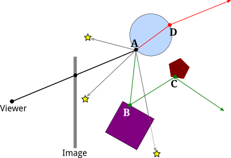

# 8.1 光线追踪

**Ray Tracing**

=== "中文"

    Ray tracing is probably the best known technique for higher quality graphics. The idea behind it is not complicated: To find out what you see when you look in a given direction, consider a ray of light that arrives at your location from that direction, and follow that light ray backwards to see where it came from. Or, as it is usually phrased, cast a ray from your location in a given direction, and see what it hits. That's what you see when you look in that direction. The operation of determining what is hit by a ray is called **ray casting**. It is fundamental to ray tracing and to other advanced graphics techniques.

=== "英文"

    Ray tracing is probably the best known technique for higher quality graphics. The idea behind it is not complicated: To find out what you see when you look in a given direction, consider a ray of light that arrives at your location from that direction, and follow that light ray backwards to see where it came from. Or, as it is usually phrased, cast a ray from your location in a given direction, and see what it hits. That's what you see when you look in that direction. The operation of determining what is hit by a ray is called **ray casting**. It is fundamental to ray tracing and to other advanced graphics techniques.

## 8.1.1 光线投射

**Ray Casting**

=== "中文"

    We have already seen ray casting used by objects of type ***THREE.RayCaster*** in the three.js API ([Subsection 5.3.2](../c5/s3.md#532-用户输入)). A ***Raycaster*** takes an initial point and a direction, given as a vector. The point and vector determine a ray, that is, a half-infinite line that extends from a starting point, in some direction, to infinity. The ***Raycaster*** can find all the intersections of the ray with a given set of objects in a three.js scene, sorted by order of distance from the rays's starting point. In this chapter, we are interested in the first intersection, the one that is closest to the starting point.

    To apply ray casting to rendering, let's say that we have a scene consisting of objects in three-dimensional space, using point lights and directional lights for illumination. We want to render an image of the scene from a given point of view. It's convenient to imagine the image as a kind of rectangular window through which the scene is being viewed. Given a point in the image, we need to know how to color that point. To compute a color for the point, we begin by casting a ray from the position of the viewer through the point and into the scene. We want to find the first intersection of that ray with an object in the scene:

    

    In this illustration, the scene contains several red spheres and two point lights. A ray is cast from the viewpoint (A) through a point (B) in the image. The ray intersects two of the spheres, but we are only interested in the intersection point (C) that is closest to the viewpoint. That's the point that is visible at B in the image.

    We need to compute the color that the viewer will see at point B. For that, just as in OpenGL, we need a normal vector at point C, and we need the material properties of the surface at C. That data has to be computable from the scene description. The visible color also depends on the light that is illuminating the surface. Consider a light source, and let L be the vector that points from C in the direction of the light. If the angle between L and the normal vector is greater than 90 degrees, then the light source lies behind the surface and so does not add any illumination. Otherwise, we can use ray casting again: Cast a ray from C in the direction L. If that ray hits an object before it gets to the light, then that object will block light from that source from reaching C. That's the case for Light 2 in the illustration: The ray from C in the direction of Light 2 intersects an object at point E before it gets to the light. On the other hand, the point C is illuminated by Light 1. A ray from a point on a surface in the direction of a light source is called a **shadow ray**, because it can be used to determine whether the surface point lies in the shadow of another object.

    With all this information, we can color point B in the image using the same lighting equation that is used in OpenGL ([Subsection 4.1.4](../c4/s1.md#414-opengl-11-光照方程)). Ray casting solves the hidden surface problem with no need for a depth buffer. And, as a bonus, we get shadows, which are hard to do in OpenGL!

    (If the ray from the viewpoint through B doesn't hit any objects in the scene, then B would be assigned a background color or a "sky" color that varies with different directions. Or maybe the entire scene is surrounded by a skybox, and a ray that doesn't hit any other object will hit the skybox.)

    Ray casting is conceptually simple, but implementation details can be tricky. Spheres are actually fairly easy. There is a formula for finding the intersections of a line with a sphere, and a normal vector at a point on a sphere has the same direction as the line from the center of the sphere to that point. Assuming that the sphere has a uniform material, we have all the data we need.

    However, surfaces are often given as triangular meshes, with properties specified only at the vertices of the triangles. Suppose that the intersection point found by our ray caster lies in one of those triangles. We will have to compute the properties of that intersection point by interpolating the property values that were specified at the vertices of the triangle.

    The interpolation algorithm typically uses something called **barycentric coordinates** on the triangle: If A, B, and C are the vertices of a triangle, and P is a point in the triangle, then P can be written uniquely in the form a\*A + b\*B + c\*C, where a, b, and c are numbers in the range zero to one, and a + b + c = 1. The coefficients a, b, and c are called the barycentric coordinates of the point P in the triangle. If some quantity has values V(A), V(B), and V(C) at the vertices of the triangle, then we can use the barycentric coordinates of P to get an interpolated value at P:

    ```js
    V(P) = a*V(A) + b*V(B) + c*V(C)
    ```

    The quantity might be, for example, diffuse color, texture coordinates, or a normal vector. (Of course, I'm still leaving out a lot of the math here—how to test whether a line intersects a triangle and how to find barycentric coordinates of the point of intersection. There are formulas, but conceptually, they wouldn't add much to the discussion.)

=== "英文"

    We have already seen ray casting used by objects of type ***THREE.RayCaster*** in the three.js API ([Subsection 5.3.2](../c5/s3.md#532-用户输入)). A ***Raycaster*** takes an initial point and a direction, given as a vector. The point and vector determine a ray, that is, a half-infinite line that extends from a starting point, in some direction, to infinity. The ***Raycaster*** can find all the intersections of the ray with a given set of objects in a three.js scene, sorted by order of distance from the rays's starting point. In this chapter, we are interested in the first intersection, the one that is closest to the starting point.

    To apply ray casting to rendering, let's say that we have a scene consisting of objects in three-dimensional space, using point lights and directional lights for illumination. We want to render an image of the scene from a given point of view. It's convenient to imagine the image as a kind of rectangular window through which the scene is being viewed. Given a point in the image, we need to know how to color that point. To compute a color for the point, we begin by casting a ray from the position of the viewer through the point and into the scene. We want to find the first intersection of that ray with an object in the scene:

    

    In this illustration, the scene contains several red spheres and two point lights. A ray is cast from the viewpoint (A) through a point (B) in the image. The ray intersects two of the spheres, but we are only interested in the intersection point (C) that is closest to the viewpoint. That's the point that is visible at B in the image.

    We need to compute the color that the viewer will see at point B. For that, just as in OpenGL, we need a normal vector at point C, and we need the material properties of the surface at C. That data has to be computable from the scene description. The visible color also depends on the light that is illuminating the surface. Consider a light source, and let L be the vector that points from C in the direction of the light. If the angle between L and the normal vector is greater than 90 degrees, then the light source lies behind the surface and so does not add any illumination. Otherwise, we can use ray casting again: Cast a ray from C in the direction L. If that ray hits an object before it gets to the light, then that object will block light from that source from reaching C. That's the case for Light 2 in the illustration: The ray from C in the direction of Light 2 intersects an object at point E before it gets to the light. On the other hand, the point C is illuminated by Light 1. A ray from a point on a surface in the direction of a light source is called a **shadow ray**, because it can be used to determine whether the surface point lies in the shadow of another object.

    With all this information, we can color point B in the image using the same lighting equation that is used in OpenGL ([Subsection 4.1.4](../c4/s1.md#414-opengl-11-光照方程)). Ray casting solves the hidden surface problem with no need for a depth buffer. And, as a bonus, we get shadows, which are hard to do in OpenGL!

    (If the ray from the viewpoint through B doesn't hit any objects in the scene, then B would be assigned a background color or a "sky" color that varies with different directions. Or maybe the entire scene is surrounded by a skybox, and a ray that doesn't hit any other object will hit the skybox.)

    Ray casting is conceptually simple, but implementation details can be tricky. Spheres are actually fairly easy. There is a formula for finding the intersections of a line with a sphere, and a normal vector at a point on a sphere has the same direction as the line from the center of the sphere to that point. Assuming that the sphere has a uniform material, we have all the data we need.

    However, surfaces are often given as triangular meshes, with properties specified only at the vertices of the triangles. Suppose that the intersection point found by our ray caster lies in one of those triangles. We will have to compute the properties of that intersection point by interpolating the property values that were specified at the vertices of the triangle.

    The interpolation algorithm typically uses something called **barycentric coordinates** on the triangle: If A, B, and C are the vertices of a triangle, and P is a point in the triangle, then P can be written uniquely in the form a\*A + b\*B + c\*C, where a, b, and c are numbers in the range zero to one, and a + b + c = 1. The coefficients a, b, and c are called the barycentric coordinates of the point P in the triangle. If some quantity has values V(A), V(B), and V(C) at the vertices of the triangle, then we can use the barycentric coordinates of P to get an interpolated value at P:

    ```js
    V(P) = a*V(A) + b*V(B) + c*V(C)
    ```

    The quantity might be, for example, diffuse color, texture coordinates, or a normal vector. (Of course, I'm still leaving out a lot of the math here—how to test whether a line intersects a triangle and how to find barycentric coordinates of the point of intersection. There are formulas, but conceptually, they wouldn't add much to the discussion.)

## 8.1.2 递归光线追踪

**Recursive Ray Tracing**

=== "中文"

    Basic ray casting can be used to compute OpenGL-style rendering and, with the addition of shadow rays, to implement shadows as well. More features can be implemented by casting a few more rays. The improved algorithm is called **ray tracing**.

    Consider specular reflection. In OpenGL, specular reflection can make an object look shiny in the sense that specular highlights can be seen where the object reflects light from a light source towards the viewer. But in reality, an object that has a mirror-like surface doesn't just reflect light sources; it also reflects other objects. If we are trying to compute a color for a point, A, on a mirror-like surface, we need to consider the contribution to that color from mirror-like reflection of other objects. To do that, we can cast a "reflected ray" from A. The direction of the reflected ray is determined by the normal vector to the surface at A and by the direction from A to the viewer. This illustration shows a 2D version. Think of it as a cross-section of the situation in 3D:

    

    Here, the reflected ray from point A hits the purple square at point B, and the viewer will see a reflection of point B at A. (Remember that in ray tracing, we follow the path of light rays *backwards* from the viewer, to find out where they came from.)

    To find out what the reflection of B looks like, we need to know the color of the ray that arrives at A from B. But finding a color for B is the same sort of problem as finding a color for A, and we should solve it in the same way: by applying the ray-tracing algorithm to B! That is, we use the material properties of the surface at B, we cast shadow rays from B towards light sources to determine how B is illuminated, and—if the purple square has a mirror-like surface—we cast a reflected ray from B to find out what it reflects. In the illustration, the reflected ray from B hits a pentagon at point C, so the square reflects an image of the pentagon, and the disk reflects an image of the square, including its reflection of the pentagon. Ray-tracing can handle multiple mirror-like reflections between objects in a scene!

    Because applying the ray-tracing algorithm at one point can involve applying the same algorithm at additional points, ray tracing is a recursive algorithm. To distinguish this from simple ray casting, ray tracing is often referred to as "recursive ray tracing."

    Ray tracing can be extended in a similar way to handle transparency or, more properly, translucency. When computing a color for a point on a translucent object, we need to take into account light that arrives at that point through the object. To do that, we can cast yet another ray from that point, this time into the object. When a light ray passes from one medium, such as air, into another medium, such as glass, the path of the light ray can bend. This bending is called refraction, and the ray that is cast through a translucent object is called the "refracted ray." The above illustration shows the refracted ray from point A passing through the object and emerging from the object at D. To find a color for that ray, we would need to find out what, if anything, it hits, and we would need to apply ray tracing recursively at the point of intersection.

    (The degree of bending of a light ray that passes from one medium to another depends on a property of the two media called the "index of refraction." More exactly, it depends on the ratio between the two indices of refraction. In practice, the index of refraction outside objects is often taken to be equal to one, so that the bending depends only on the index of refraction of an object. The index of refraction is another material property for translucent objects. It is often abbreviated **IOR**.)

    ----

    We should look at the computations in a little more detail. The goal is to compute a color for a point on an image. We cast a ray from the viewpoint through the image and into the scene, and determine the first intersection point of the ray with an object. The color of that point is computed by adding up the contributions from different sources.

    First, there is diffuse, specular, and possibly ambient reflection of light from various light sources. These contributions are based on the diffuse, specular, and ambient colors of the object, on the normal vector to the object, and on the properties of the light sources. Note that some color properties of the object, usually the ambient and diffuse colors, might come from a texture. The specular contribution can produce specular highlights, which are essentially the reflections of light sources. Shadow rays are used to determine which directional and point lights illuminate the object; aside from that, this part of the calculation is similar to OpenGL.

    Next, if the surface has mirror-like reflection, then a reflected ray is cast and ray tracing is applied recursively to find a color for that ray. The contribution from that ray is combined with other contributions to the color of the surface, depending on the strength of the mirror reflection. For a perfect mirror, the reflected ray contributes 100% of the color, but in general the contribution is less. Mirror reflectivity is a new material property. It is responsible for reflections of one object on the surface of another, while specular color is responsible for specular highlights.

    Finally, if the object is translucent, then a refracted ray is cast, and ray tracing is used to find its color. The contribution of that ray to the color of the object depends on the degree of transparency of the object, since some of the light can be absorbed rather than transmitted. The degree of transparency can depend on the wavelength of the light—as it does, for example, in colored glass.

    And, of course, all of these calculations need to be done three times, for the red, the green, and the blue components of the color.

    The ray tracing algorithm is recursive, and, as every programmer knows, recursion needs a base case. That is, there has to come a time when, instead of calling itself, the algorithm simply returns a value. A base case occurs whenever a casted ray does not intersect any objects. Another kind of base case can occur when it is determined that casting more rays cannot contribute any significant amount to the color of the image. For example, whenever a ray is reflected, some of that ray is absorbed rather than reflected, depending on the color of the object from which it is reflected. After reflecting many times, a ray would have very little color left to contribute to the final result. A ray can also lose energy because of attenuation of light with distance, and a ray-tracing algorithm might take that into account. In addition, a ray tracing algorithm should always be run with a maximum recursion depth, to put an absolute limit on the number of times the algorithm will call itself.

=== "英文"

    Basic ray casting can be used to compute OpenGL-style rendering and, with the addition of shadow rays, to implement shadows as well. More features can be implemented by casting a few more rays. The improved algorithm is called **ray tracing**.

    Consider specular reflection. In OpenGL, specular reflection can make an object look shiny in the sense that specular highlights can be seen where the object reflects light from a light source towards the viewer. But in reality, an object that has a mirror-like surface doesn't just reflect light sources; it also reflects other objects. If we are trying to compute a color for a point, A, on a mirror-like surface, we need to consider the contribution to that color from mirror-like reflection of other objects. To do that, we can cast a "reflected ray" from A. The direction of the reflected ray is determined by the normal vector to the surface at A and by the direction from A to the viewer. This illustration shows a 2D version. Think of it as a cross-section of the situation in 3D:

    

    Here, the reflected ray from point A hits the purple square at point B, and the viewer will see a reflection of point B at A. (Remember that in ray tracing, we follow the path of light rays *backwards* from the viewer, to find out where they came from.)

    To find out what the reflection of B looks like, we need to know the color of the ray that arrives at A from B. But finding a color for B is the same sort of problem as finding a color for A, and we should solve it in the same way: by applying the ray-tracing algorithm to B! That is, we use the material properties of the surface at B, we cast shadow rays from B towards light sources to determine how B is illuminated, and—if the purple square has a mirror-like surface—we cast a reflected ray from B to find out what it reflects. In the illustration, the reflected ray from B hits a pentagon at point C, so the square reflects an image of the pentagon, and the disk reflects an image of the square, including its reflection of the pentagon. Ray-tracing can handle multiple mirror-like reflections between objects in a scene!

    Because applying the ray-tracing algorithm at one point can involve applying the same algorithm at additional points, ray tracing is a recursive algorithm. To distinguish this from simple ray casting, ray tracing is often referred to as "recursive ray tracing."

    Ray tracing can be extended in a similar way to handle transparency or, more properly, translucency. When computing a color for a point on a translucent object, we need to take into account light that arrives at that point through the object. To do that, we can cast yet another ray from that point, this time into the object. When a light ray passes from one medium, such as air, into another medium, such as glass, the path of the light ray can bend. This bending is called refraction, and the ray that is cast through a translucent object is called the "refracted ray." The above illustration shows the refracted ray from point A passing through the object and emerging from the object at D. To find a color for that ray, we would need to find out what, if anything, it hits, and we would need to apply ray tracing recursively at the point of intersection.

    (The degree of bending of a light ray that passes from one medium to another depends on a property of the two media called the "index of refraction." More exactly, it depends on the ratio between the two indices of refraction. In practice, the index of refraction outside objects is often taken to be equal to one, so that the bending depends only on the index of refraction of an object. The index of refraction is another material property for translucent objects. It is often abbreviated **IOR**.)

    ----

    We should look at the computations in a little more detail. The goal is to compute a color for a point on an image. We cast a ray from the viewpoint through the image and into the scene, and determine the first intersection point of the ray with an object. The color of that point is computed by adding up the contributions from different sources.

    First, there is diffuse, specular, and possibly ambient reflection of light from various light sources. These contributions are based on the diffuse, specular, and ambient colors of the object, on the normal vector to the object, and on the properties of the light sources. Note that some color properties of the object, usually the ambient and diffuse colors, might come from a texture. The specular contribution can produce specular highlights, which are essentially the reflections of light sources. Shadow rays are used to determine which directional and point lights illuminate the object; aside from that, this part of the calculation is similar to OpenGL.

    Next, if the surface has mirror-like reflection, then a reflected ray is cast and ray tracing is applied recursively to find a color for that ray. The contribution from that ray is combined with other contributions to the color of the surface, depending on the strength of the mirror reflection. For a perfect mirror, the reflected ray contributes 100% of the color, but in general the contribution is less. Mirror reflectivity is a new material property. It is responsible for reflections of one object on the surface of another, while specular color is responsible for specular highlights.

    Finally, if the object is translucent, then a refracted ray is cast, and ray tracing is used to find its color. The contribution of that ray to the color of the object depends on the degree of transparency of the object, since some of the light can be absorbed rather than transmitted. The degree of transparency can depend on the wavelength of the light—as it does, for example, in colored glass.

    And, of course, all of these calculations need to be done three times, for the red, the green, and the blue components of the color.

    The ray tracing algorithm is recursive, and, as every programmer knows, recursion needs a base case. That is, there has to come a time when, instead of calling itself, the algorithm simply returns a value. A base case occurs whenever a casted ray does not intersect any objects. Another kind of base case can occur when it is determined that casting more rays cannot contribute any significant amount to the color of the image. For example, whenever a ray is reflected, some of that ray is absorbed rather than reflected, depending on the color of the object from which it is reflected. After reflecting many times, a ray would have very little color left to contribute to the final result. A ray can also lose energy because of attenuation of light with distance, and a ray-tracing algorithm might take that into account. In addition, a ray tracing algorithm should always be run with a maximum recursion depth, to put an absolute limit on the number of times the algorithm will call itself.

## 8.1.3 光线追踪的局限性

**Limitations of Ray Tracing**

=== "中文"

    Although ray tracing can produce very realistic images, there are some things that it can't do. For example, while ray tracing works well for point lights and directional lights, it can't handle area lights. An area light is one that has area. That is, it is an object that emits light from its entire surface area rather than from a single point. Of course, real lights are area lights. A fluorescent light emits light from the surface of a cylinder. A brightly lit window can be considered to be a kind of area light. Even a light bulb does not really radiate light from a single point. Ray tracing uses shadow rays to tell whether a light source illuminates an object. But a shadow ray is cast in only one direction, and can only hit one point on an area light. To implement area lights exactly, a different shadow ray would be needed for each point on the surface of the light.

    A ray tracer can handle area lights in an approximate way, by replacing the area light with a grid of point lights. It can then cast a shadow ray towards each point in the grid. Using more point lights in the grid will give a better approximation. Of course, casting all those shadow rays can add significantly to the computation time.

    Another problem with lighting in ray tracing is that it doesn't take into account illumination by reflected light. For example, light from a light source should reflect off a mirror, and the reflected light should illuminate other objects. Ray tracing uses shadow rays to tell whether a light source illuminates an object. But that won't work for reflected light, since the algorithm doesn't know where to aim the shadow ray—reflected light could come from any direction.

    This is not just a problem with mirrors. Any reflected light, even from diffuse reflection, should illuminate nearby objects. For example, light that is reflected diffusely from a green object should add a green tint to nearby objects. This effect is called "color bleeding." In reality, light can be reflected and re-reflected many times, contributing a bit of color to each object that it hits. As with area lights, approximate methods can be added to ray tracing to simulate this effect. For example, "photon mapping" adds a pre-processing phase to ray tracing which simulates the emission of a large number of light rays, or "photons," from light sources, and tracks their paths through the scene to see how they add color to the objects that they hit. The information from this "photon map" is then used during the ray tracing phase to produce more realistic colors.

    OpenGL uses ambient light as an approximation for light that has been reflected and re-reflected many times. Ambient light is assumed to illuminate every object equally. However, that is a poor approximation. A better approximation uses **ambient occlusion**, the idea that ambient light heading towards a surface can be blocked, or "occluded," by nearby objects. Like ambient light, ambient occlusion is not physically realistic, but in practice, it can make lighting look more realistic and objects look more three-dimensional. One technique for estimating ambient occlusion uses ray casting. We assume that the ambient light comes from the background of the scene. To estimate ambient occlusion at a point, cast a number of rays from that point in random directions, and count how many of those rays are blocked by geometry in the scene and how many reach the sky. The more rays that are blocked, the greater the degree of ambient occlusion at that point.

    Algorithms that attempt to take into account all of the interactions of light with objects in a scene are said to use global illumination. Approximate methods such as those mentioned above can be added on to ray tracing to increase its realism, at the cost of significantly increased complexity and a potentially large amount of extra computing. We begin to see why very realistic images can take so long to compute! In the next section we will look at a method that attempts to handle global illumination exactly.

=== "英文"

    Although ray tracing can produce very realistic images, there are some things that it can't do. For example, while ray tracing works well for point lights and directional lights, it can't handle area lights. An area light is one that has area. That is, it is an object that emits light from its entire surface area rather than from a single point. Of course, real lights are area lights. A fluorescent light emits light from the surface of a cylinder. A brightly lit window can be considered to be a kind of area light. Even a light bulb does not really radiate light from a single point. Ray tracing uses shadow rays to tell whether a light source illuminates an object. But a shadow ray is cast in only one direction, and can only hit one point on an area light. To implement area lights exactly, a different shadow ray would be needed for each point on the surface of the light.

    A ray tracer can handle area lights in an approximate way, by replacing the area light with a grid of point lights. It can then cast a shadow ray towards each point in the grid. Using more point lights in the grid will give a better approximation. Of course, casting all those shadow rays can add significantly to the computation time.

    Another problem with lighting in ray tracing is that it doesn't take into account illumination by reflected light. For example, light from a light source should reflect off a mirror, and the reflected light should illuminate other objects. Ray tracing uses shadow rays to tell whether a light source illuminates an object. But that won't work for reflected light, since the algorithm doesn't know where to aim the shadow ray—reflected light could come from any direction.

    This is not just a problem with mirrors. Any reflected light, even from diffuse reflection, should illuminate nearby objects. For example, light that is reflected diffusely from a green object should add a green tint to nearby objects. This effect is called "color bleeding." In reality, light can be reflected and re-reflected many times, contributing a bit of color to each object that it hits. As with area lights, approximate methods can be added to ray tracing to simulate this effect. For example, "photon mapping" adds a pre-processing phase to ray tracing which simulates the emission of a large number of light rays, or "photons," from light sources, and tracks their paths through the scene to see how they add color to the objects that they hit. The information from this "photon map" is then used during the ray tracing phase to produce more realistic colors.

    OpenGL uses ambient light as an approximation for light that has been reflected and re-reflected many times. Ambient light is assumed to illuminate every object equally. However, that is a poor approximation. A better approximation uses **ambient occlusion**, the idea that ambient light heading towards a surface can be blocked, or "occluded," by nearby objects. Like ambient light, ambient occlusion is not physically realistic, but in practice, it can make lighting look more realistic and objects look more three-dimensional. One technique for estimating ambient occlusion uses ray casting. We assume that the ambient light comes from the background of the scene. To estimate ambient occlusion at a point, cast a number of rays from that point in random directions, and count how many of those rays are blocked by geometry in the scene and how many reach the sky. The more rays that are blocked, the greater the degree of ambient occlusion at that point.

    Algorithms that attempt to take into account all of the interactions of light with objects in a scene are said to use global illumination. Approximate methods such as those mentioned above can be added on to ray tracing to increase its realism, at the cost of significantly increased complexity and a potentially large amount of extra computing. We begin to see why very realistic images can take so long to compute! In the next section we will look at a method that attempts to handle global illumination exactly.
