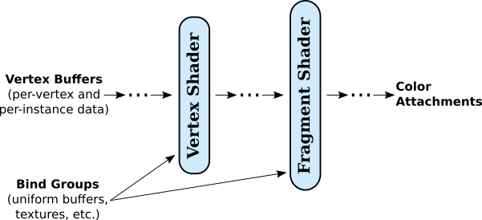

# 9.1 WebGPU 基础

**WebGPU Basics**

=== "中文"

    WebGPU is a new API for computer graphics on the Web. Where WebGL was based on OpenGL, WebGPU has been completely designed from scratch. It is similar to more modern computer graphics APIs such as Vulkan, Metal, and Direct3D. WebGPU is a very low-level API, which makes the programmer do more work but also offers more power and efficiency. On the other hand, you might find that WebGPU is a cleaner, more logical API than WebGL, which is filled with strange remnants of old OpenGL features.

    We begin the chapter with an overview of WebGPU. For now, we will stick to basic 2D graphics, with no transformations or lighting. Although I will make some references to WebGL, I will try to make the discussion accessible even for someone who has not already studied WebGL or OpenGL; however, if you are not familiar with those older APIs, you might need to refer to earlier sections of this book for background information.

    Our WebGPU examples will be programmed in JavaScript. A short introduction to JavaScript can be found in [Section 3](../a1/s3.md) of Appendix A. WebGPU makes extensive use of typed arrays such as ***Float32Array*** and of the notations for creating objects (using {...}) and arrays (using [...]). And it uses async functions and promises, advanced JavaScript features that are discussed in [Section 4](../a1/s4.md) of that appendix.

    The environment for a WebGPU application has two parts that I will call the JavaScript side and the GPU side. The JavaScript side is executed on the CPU (the Central Processing Unit of the computer), while WebGPU computational and rendering operations are executed on the GPU (Graphical Processing Unit). The CPU and GPU each have their own dedicated memory, but they also have some shared memory that can be used for sharing data and sending messages. Communication between the JavaScript side and the GPU side of the application is relatively slow and inefficient. A lot of the design of WebGPU, which can seem cumbersome and a little strange, can be explained by the need to manage that communication as efficiently as possible. Now, WebGPU can in fact be implemented in many ways on many different systems. It can even be emulated entirely in software with no physical GPU involved. But the design has to be efficient for all cases, and the case that you should keep in mind when trying to understand the design is one with separate CPU and GPU that have access to some shared memory.

    In this section we will mostly be looking at one sample program: [basic_webgpu_1.html](../../../en/source/webgpu/basic_webgpu_1.html), which simply draws a colored triangle. The source code for this example is extensively commented, and you are encouraged to read it. You can run it to test whether your browser supports WebGPU. Here is a demo version (with source code that does not include all the comments):

    <iframe src="../../../en/demos/c9/first-webgpu-demo.html" width="390" height="450"></iframe>

=== "英文"

    WebGPU is a new API for computer graphics on the Web. Where WebGL was based on OpenGL, WebGPU has been completely designed from scratch. It is similar to more modern computer graphics APIs such as Vulkan, Metal, and Direct3D. WebGPU is a very low-level API, which makes the programmer do more work but also offers more power and efficiency. On the other hand, you might find that WebGPU is a cleaner, more logical API than WebGL, which is filled with strange remnants of old OpenGL features.

    We begin the chapter with an overview of WebGPU. For now, we will stick to basic 2D graphics, with no transformations or lighting. Although I will make some references to WebGL, I will try to make the discussion accessible even for someone who has not already studied WebGL or OpenGL; however, if you are not familiar with those older APIs, you might need to refer to earlier sections of this book for background information.

    Our WebGPU examples will be programmed in JavaScript. A short introduction to JavaScript can be found in [Section 3](../a1/s3.md) of Appendix A. WebGPU makes extensive use of typed arrays such as ***Float32Array*** and of the notations for creating objects (using {...}) and arrays (using [...]). And it uses async functions and promises, advanced JavaScript features that are discussed in [Section 4](../a1/s4.md) of that appendix.

    The environment for a WebGPU application has two parts that I will call the JavaScript side and the GPU side. The JavaScript side is executed on the CPU (the Central Processing Unit of the computer), while WebGPU computational and rendering operations are executed on the GPU (Graphical Processing Unit). The CPU and GPU each have their own dedicated memory, but they also have some shared memory that can be used for sharing data and sending messages. Communication between the JavaScript side and the GPU side of the application is relatively slow and inefficient. A lot of the design of WebGPU, which can seem cumbersome and a little strange, can be explained by the need to manage that communication as efficiently as possible. Now, WebGPU can in fact be implemented in many ways on many different systems. It can even be emulated entirely in software with no physical GPU involved. But the design has to be efficient for all cases, and the case that you should keep in mind when trying to understand the design is one with separate CPU and GPU that have access to some shared memory.

    In this section we will mostly be looking at one sample program: [basic_webgpu_1.html](../../../en/source/webgpu/basic_webgpu_1.html), which simply draws a colored triangle. The source code for this example is extensively commented, and you are encouraged to read it. You can run it to test whether your browser supports WebGPU. Here is a demo version (with source code that does not include all the comments):

    <iframe src="../../../en/demos/c9/first-webgpu-demo.html" width="390" height="450"></iframe>

## 9.1.1 适配器、设备和画布

**Adapter, Device, and Canvas**

=== "中文"

    Any WebGPU application must begin by obtaining a WebGPU "device," which represents the programmer's interface to almost all WebGPU features. To produce visible graphics images on a web page, WebGPU renders to an HTML canvas element on the page. For that, the application will need a WebGPU context for the canvas. (WebGPU can do other things besides render to a canvas, but we will stick to that for now). The code for obtaining the device and context can be the same in any application:

    ```js
    async function initWebGPU() {

    if (!navigator.gpu) {
        throw Error("WebGPU not supported in this browser.");
    }
    let adapter = await navigator.gpu.requestAdapter();
    if (!adapter) {
        throw Error("WebGPU is supported, but couldn't get WebGPU adapter.");
    }

    device = await adapter.requestDevice();
    
    let canvas = document.getElementById("webgpuCanvas");
    context = canvas.getContext("webgpu");
    context.configure({
        device: device,
        format: navigator.gpu.getPreferredCanvasFormat(),
        alphaMode: "premultiplied" // (the alternative is "opaque")
    });
        .
        .
        .
    ```

    Here, device and context are global variables, navigator is a predefined variable representing the web browser, and the other variables, adapter and canvas, are probably not needed outside the initialization function. (If a reference to the canvas is needed, it is available as context.canvas.) The functions navigator.gpu.requestAdapter() and adapter.requestDevice() return promises. The function is declared as async because it uses await to wait for the results from those promises. (Async functions are used in the same way as other functions, except that sometimes you have to take into account that other parts of the program can in theory run while await is waiting for a result.)

    The only thing you might want to change in this initialization is the alphaMode for the context. The value "premultiplied" allows the alpha value of a pixel in the canvas to determine the degree of transparency of that pixel when the canvas is drawn on the web page. The alternative value, "opaque", means that the alpha value of a pixel is ignored, and the pixel is opaque.

    This initialization code does some error checking and can throw an error if a problem is encountered. Presumably, the program would catch that error elsewhere and report it to the user. However, as a WebGPU developer, you should be aware that WebGPU does extensive validity checks on programs and reports all errors and warnings to the web browser console. So, it is a good idea to keep the console open when testing your work.

=== "英文"

    Any WebGPU application must begin by obtaining a WebGPU "device," which represents the programmer's interface to almost all WebGPU features. To produce visible graphics images on a web page, WebGPU renders to an HTML canvas element on the page. For that, the application will need a WebGPU context for the canvas. (WebGPU can do other things besides render to a canvas, but we will stick to that for now). The code for obtaining the device and context can be the same in any application:

    ```js
    async function initWebGPU() {

    if (!navigator.gpu) {
        throw Error("WebGPU not supported in this browser.");
    }
    let adapter = await navigator.gpu.requestAdapter();
    if (!adapter) {
        throw Error("WebGPU is supported, but couldn't get WebGPU adapter.");
    }

    device = await adapter.requestDevice();
    
    let canvas = document.getElementById("webgpuCanvas");
    context = canvas.getContext("webgpu");
    context.configure({
        device: device,
        format: navigator.gpu.getPreferredCanvasFormat(),
        alphaMode: "premultiplied" // (the alternative is "opaque")
    });
        .
        .
        .
    ```

    Here, device and context are global variables, navigator is a predefined variable representing the web browser, and the other variables, adapter and canvas, are probably not needed outside the initialization function. (If a reference to the canvas is needed, it is available as context.canvas.) The functions navigator.gpu.requestAdapter() and adapter.requestDevice() return promises. The function is declared as async because it uses await to wait for the results from those promises. (Async functions are used in the same way as other functions, except that sometimes you have to take into account that other parts of the program can in theory run while await is waiting for a result.)

    The only thing you might want to change in this initialization is the alphaMode for the context. The value "premultiplied" allows the alpha value of a pixel in the canvas to determine the degree of transparency of that pixel when the canvas is drawn on the web page. The alternative value, "opaque", means that the alpha value of a pixel is ignored, and the pixel is opaque.

    This initialization code does some error checking and can throw an error if a problem is encountered. Presumably, the program would catch that error elsewhere and report it to the user. However, as a WebGPU developer, you should be aware that WebGPU does extensive validity checks on programs and reports all errors and warnings to the web browser console. So, it is a good idea to keep the console open when testing your work.

## 9.1.2 着色器模块

**Shader Module**

=== "中文"

    Like WebGL and OpenGL, WebGPU draws primitives (points, lines, and triangles) that are defined by vertices. The rendering process involves some computation for each vertex of a primitive, and some computation for each pixel (or "fragment") that is part of the primitive. A WebGPU programmer must define functions to specify those computations. Those functions are shaders. To render an image, a WebGPU program must provide a vertex shader main function and a fragment shader main function. In the documentation, those functions are referred to as the vertex shader entry point and the fragment shader entry point. Shader functions and supporting code for WebGPU are written in **WGSL**, the WebGPU Shader Language. Shader source code is given as an ordinary JavaScript string. The device.createShaderModule() method, in the WebGPU device object, is used to compile the source code, check it for syntax errors, and package it into a shader module that can then be used in a rendering pipeline:

    ```js
    shader = device.createShaderModule({
        code: shaderSource
    });
    ```

    The parameter here is an object that in this example has just one property, named code; shaderSource is the string that contains the shader source code; and the return value, shader, represents the compiled source code, which will be used later, when configuring the render pipeline. Syntax errors in the source code will not throw an exception. However, compilation errors and warnings will be reported in the web console. You should always check the console for WebGPU messages during development.

    ----

    We will look at WGSL in some detail in [Section 9.3](../c9/s3.md). WGSL is similar in many ways to GLSL, the shading language for WebGL, but its variable and function declarations are very different. I will give just a short discussion here, to help you understand the relationship between the JavaScript part and the WGSL part of a WebGPU application. Here is the short shader source code from our [first WebGPU example](../../../en/source/webgpu/basic_webgpu_1.html). It is defined (on the JavaScript side) as a template string, which can extend over multiple lines:

    ```js
    const shaderSource = `
    
    @group(0) @binding(0) var<uniform> color : vec3f;

    @vertex
    fn vertexMain( @location(0) coords : vec2f ) -> @builtin(position) vec4f {
        return vec4f( coords, 0, 1 );
    }
    
    @fragment
    fn fragmentMain() -> @location(0) vec4f {
        return vec4f( color, 1 ); 
    }
    `;
    ```

    The syntax for a function definition in WGSL is

    ```js
    fn function_name ( parameter_list ) -> return_type { . . . }
    ```

    The types used in this example—vec2f, vec3f, and vec4f—represent vectors of two, three, and four 32-bit floating point numbers. Variable declarations can have several forms. The one example in this code has the form

    ```js
    var<uniform> variable_name : type ;
    ```

    This declares a global variable in the "uniform address space," which will be discussed below. A variable in the uniform address space gets its value from the JavaScript side.

    The words beginning with "@" are annotations or modifiers. For example, @vertex means that the following function can be used as a vertex shader entry point, and @fragment means that the following function can be used as a fragment shader entry point. The @builtin(position) annotation says that the return value from vertexMain() gives the coordinates of the vertex in the standard WebGPU coordinate system. And @location(0), @group(0), and @binding(0) in this example are used to specify connections between data in the shader and data on the JavaScript side, as will be discussed below.

    The vertex and fragment shader functions that are used here are very simple. The vertex shader simply takes the (x,y) coordinates from its parameter, which comes from the JavaScript side, and adds z- and w-coordinates to get the final homogeneous coordinates for the vertex. The expression vec4f(coords,0,1) for the return value constructs a vec4f (a vector of four floats) from the four floating-point values in its parameter list. The fragment shader, which outputs an RGBA color for the pixel that it is processing, simple uses the three RGB components from the uniform color variable, which comes from the JavaScript side, and adds a 1 for the alpha component of the color.

=== "英文"

    Like WebGL and OpenGL, WebGPU draws primitives (points, lines, and triangles) that are defined by vertices. The rendering process involves some computation for each vertex of a primitive, and some computation for each pixel (or "fragment") that is part of the primitive. A WebGPU programmer must define functions to specify those computations. Those functions are shaders. To render an image, a WebGPU program must provide a vertex shader main function and a fragment shader main function. In the documentation, those functions are referred to as the vertex shader entry point and the fragment shader entry point. Shader functions and supporting code for WebGPU are written in **WGSL**, the WebGPU Shader Language. Shader source code is given as an ordinary JavaScript string. The device.createShaderModule() method, in the WebGPU device object, is used to compile the source code, check it for syntax errors, and package it into a shader module that can then be used in a rendering pipeline:

    ```js
    shader = device.createShaderModule({
        code: shaderSource
    });
    ```

    The parameter here is an object that in this example has just one property, named code; shaderSource is the string that contains the shader source code; and the return value, shader, represents the compiled source code, which will be used later, when configuring the render pipeline. Syntax errors in the source code will not throw an exception. However, compilation errors and warnings will be reported in the web console. You should always check the console for WebGPU messages during development.

    ----

    We will look at WGSL in some detail in [Section 9.3](../c9/s3.md). WGSL is similar in many ways to GLSL, the shading language for WebGL, but its variable and function declarations are very different. I will give just a short discussion here, to help you understand the relationship between the JavaScript part and the WGSL part of a WebGPU application. Here is the short shader source code from our [first WebGPU example](../../../en/source/webgpu/basic_webgpu_1.html). It is defined (on the JavaScript side) as a template string, which can extend over multiple lines:

    ```js
    const shaderSource = `
    
    @group(0) @binding(0) var<uniform> color : vec3f;

    @vertex
    fn vertexMain( @location(0) coords : vec2f ) -> @builtin(position) vec4f {
        return vec4f( coords, 0, 1 );
    }
    
    @fragment
    fn fragmentMain() -> @location(0) vec4f {
        return vec4f( color, 1 ); 
    }
    `;
    ```

    The syntax for a function definition in WGSL is

    ```js
    fn function_name ( parameter_list ) -> return_type { . . . }
    ```

    The types used in this example—vec2f, vec3f, and vec4f—represent vectors of two, three, and four 32-bit floating point numbers. Variable declarations can have several forms. The one example in this code has the form

    ```js
    var<uniform> variable_name : type ;
    ```

    This declares a global variable in the "uniform address space," which will be discussed below. A variable in the uniform address space gets its value from the JavaScript side.

    The words beginning with "@" are annotations or modifiers. For example, @vertex means that the following function can be used as a vertex shader entry point, and @fragment means that the following function can be used as a fragment shader entry point. The @builtin(position) annotation says that the return value from vertexMain() gives the coordinates of the vertex in the standard WebGPU coordinate system. And @location(0), @group(0), and @binding(0) in this example are used to specify connections between data in the shader and data on the JavaScript side, as will be discussed below.

    The vertex and fragment shader functions that are used here are very simple. The vertex shader simply takes the (x,y) coordinates from its parameter, which comes from the JavaScript side, and adds z- and w-coordinates to get the final homogeneous coordinates for the vertex. The expression vec4f(coords,0,1) for the return value constructs a vec4f (a vector of four floats) from the four floating-point values in its parameter list. The fragment shader, which outputs an RGBA color for the pixel that it is processing, simple uses the three RGB components from the uniform color variable, which comes from the JavaScript side, and adds a 1 for the alpha component of the color.

## 9.1.3 渲染管线

**Render Pipeline**

=== "中文"

    In WebGPU, an image is produced as the output of a series of processing stages that make up a "render pipeline." The vertex shader and fragment shader are programmable stages in the pipeline, but there are other fixed function stages that are built into WebGPU. Input to the pipeline comes from data structures in the GPU. If the data originates on the JavaScript side of the application, it must be copied to the GPU before it can be used in the pipeline. Here is an illustration of the general structure of a render pipeline:

    

    This diagram shows two types of input to the pipeline, **vertex buffers** and **bind groups**. Recall that when a primitive is drawn, the vertex shader is called once for each vertex in the primitive. Each invocation of the vertex shader can get different values for the parameters in the vertex shader entry point function. Those values come from vertex buffers. The buffers must be loaded with values for the parameters for every vertex. A fixed function stage of the pipeline, shown as the dots between the vertex buffers and the vertex shader, calls the vertex shader once for each vertex, pulling the appropriate set of parameter values for that vertex from the buffers. (Vertex buffers also hold data for instanced drawing, which will be covered in the [next section](../c9/s3.md)).

    The vertex shader outputs some values, which must include the coordinates of the vertex but can also include other values such as color, texture coordinates, and normal vector for the vertex. Intermediate stages of the pipeline between the vertex shader and the fragment shader process the values in various ways. For example, the coordinates of the vertices are used to determine which pixels lie in the primitive. Coordinates for the pixels are computed by interpolating the vertex coordinates. Values like color and texture coordinates are also generally interpolated to get different values for each pixel. All these values are available as inputs to the fragment shader, which will be called once for each pixel in the primitive with appropriate values for its parameters.

    Vertex buffers are special because of the way that they are used to supply vertex shader parameters. Other kinds of input are stored in the data structures called bind groups. Values from bind groups are made available to vertex and fragment shaders as global variables in the shader programs.

    The fragment shader can output several values. The destinations for those values lie outside the pipeline and are referred to as the "color attachments" for the pipeline. In the most common case, there is just one output that represents the color to be assigned to the pixel, and the associated color attachment is the image that is being rendered (or, rather, the block of memory that holds the color data for that image). Multiple outputs can be used for advanced applications such as deferred shading (see [Subsection 7.5.4](../c7/s5.md#754-延迟着色)).

    A WebGPU program is responsible for creating pipelines and providing many details of their configuration. (Fortunately, a lot of the detail can be handled by the tried-and-true method of cut-and-paste.) Let's look at the relatively simple example from our first sample program. The goal is to create a render pipeline as the final step in the following code excerpt. Before that, the program creates some objects to specify the pipeline configuration:

    ```js
    let vertexBufferLayout = [ // An array of vertex buffer specifications.
    { 
        attributes: [ { shaderLocation:0, offset:0, format: "float32x2" } ],
        arrayStride: 8, 
        stepMode: "vertex"
    }
    ];

    let uniformBindGroupLayout = device.createBindGroupLayout({
        entries: [ // An array of resource specifications.
        {
            binding: 0,
            visibility: GPUShaderStage.FRAGMENT,
            buffer: {
                type: "uniform"
            }
        }
        ]
    });
    
    let pipelineDescriptor = {
        vertex: { // Configuration for the vertex shader.
        module: shader, 
        entryPoint: "vertexMain", 
        buffers: vertexBufferLayout 
        },
        fragment: { // Configuration for the fragment shader.
        module: shader, 
        entryPoint: "fragmentMain", 
        targets: [{
            format: navigator.gpu.getPreferredCanvasFormat()
        }]
        },
        primitive: {
        topology: "triangle-list"
        },
        layout: device.createPipelineLayout({
        bindGroupLayouts: [uniformBindGroupLayout]
        })
    };
    
    pipeline = device.createRenderPipeline(pipelineDescriptor);
    ```

    (You can read the same code with more comments in the source code for the [program](../../../en/source/webgpu/basic_webgpu_1.html).)

    There is a lot going on here! The vertex and fragment properties of the pipeline descriptor describe the shaders that are used in the pipeline. The module property is the compiled shader module that contains the shader function. The entryPoint property gives the name used for the shader entry point function in the shader source code. The buffers and targets properties are concerned with inputs for the vertex shader function and outputs from the fragment shader function.

    The vertex buffer and bind group "layouts" specify what inputs will be required for the pipeline. They specify only the structure of the inputs. They basically create attachment points where actual input sources can be plugged in later. This allows one pipeline to draw different things by providing it with different inputs.

    Note the use of arrays throughout the specification. For example, a pipeline can be configured to use multiple vertex buffers for input. The vertex buffer layout is an array, in which each element of the array specifies one input buffer. The index of an element in the array is important, since it identifies the attachment point for the corresponding buffer. The index will be used later, when attaching an actual buffer.

    Similarly, a pipeline can take inputs from multiple bind groups. In this case, the index for a bind group comes from the bindGroupLayouts property in the pipelineDescriptor, and that index will be required when attaching an actual bind group to the pipeline. The index is also used in the shader program. For example, if you look back at the shader source code above, you'll see that the uniform variable declaration is annotated with @group(0). This means that the value for that variable will be found in the bind group at index 0 in the bindGroupLayouts array.

    Furthermore, each bind group can hold a list of resources, which are specified by the entries property of the bind group layout for that bind group. An entry can provide the value for a global variable in the shader. In this case, confusingly, it is not the index of the entry in the entries array that is important; instead, the entry has a binding property to identify it. In the sample program, the double annotation @group(0) @binding(0) on the uniform variable declaration says that the value for the variable comes specifically from the entry with binding number 0 in the bind group at index 0.

    The pipeline also has outputs, which come from the fragment shader entry point function, and the pipeline needs attachment points for the destinations of those outputs. The targets property in the pipelineDescriptor is an array with one entry for each attachment point. When the shader source code defines the fragment shader with fn fragmentMain() -> @location(0) vec4f, the annotation @location(0) on the output says that that output will be sent to color attachment number 0, corresponding to the element at index 0 in the targets array. The value for the format property in that element specifies that the output will be in the appropriate format for colors in a canvas. (The system will automatically translate the shader output, which uses a 32-bit float for each color component, into the canvas format, which uses an 8-bit unsigned integer for each component.)

    That leaves the primitive property of the pipelineDescriptor to be explained: It specifies the kind of geometric primitive that the pipeline can draw. The topology specifies the primitive type, which in this example is "triangle-list." That is, when the pipeline is executed, each group of three vertices will define a triangle. WebGPU has only five primitive types: "point-list", "line-list", "line-strip", "triangle-list", and "triangle-strip", corresponding to POINTS, LINES, LINE_STRIP, TRIANGLES, and TRIANGLE_STRIP in WebGL or OpenGL. This illustration shows how the same six vertices would be interpreted in each topology (except that outlines of triangles and endpoints of line segments would not be part of the actual output):

    

    (See [Subsection 3.1.1](../c3/s1.md#311--opengl基元) for more discussion of how primitives are rendered.)

    You don't have to create a pipeline every time you draw an image. A pipeline can be used any number of times. It can be used to draw different things by attaching different input sources. Drawing a single image might require several pipelines, each of which might be executed several times. It is common for programs to create pipelines during initialization and store them in global variables.

=== "英文"

    In WebGPU, an image is produced as the output of a series of processing stages that make up a "render pipeline." The vertex shader and fragment shader are programmable stages in the pipeline, but there are other fixed function stages that are built into WebGPU. Input to the pipeline comes from data structures in the GPU. If the data originates on the JavaScript side of the application, it must be copied to the GPU before it can be used in the pipeline. Here is an illustration of the general structure of a render pipeline:

    

    This diagram shows two types of input to the pipeline, **vertex buffers** and **bind groups**. Recall that when a primitive is drawn, the vertex shader is called once for each vertex in the primitive. Each invocation of the vertex shader can get different values for the parameters in the vertex shader entry point function. Those values come from vertex buffers. The buffers must be loaded with values for the parameters for every vertex. A fixed function stage of the pipeline, shown as the dots between the vertex buffers and the vertex shader, calls the vertex shader once for each vertex, pulling the appropriate set of parameter values for that vertex from the buffers. (Vertex buffers also hold data for instanced drawing, which will be covered in the [next section](../c9/s3.md)).

    The vertex shader outputs some values, which must include the coordinates of the vertex but can also include other values such as color, texture coordinates, and normal vector for the vertex. Intermediate stages of the pipeline between the vertex shader and the fragment shader process the values in various ways. For example, the coordinates of the vertices are used to determine which pixels lie in the primitive. Coordinates for the pixels are computed by interpolating the vertex coordinates. Values like color and texture coordinates are also generally interpolated to get different values for each pixel. All these values are available as inputs to the fragment shader, which will be called once for each pixel in the primitive with appropriate values for its parameters.

    Vertex buffers are special because of the way that they are used to supply vertex shader parameters. Other kinds of input are stored in the data structures called bind groups. Values from bind groups are made available to vertex and fragment shaders as global variables in the shader programs.

    The fragment shader can output several values. The destinations for those values lie outside the pipeline and are referred to as the "color attachments" for the pipeline. In the most common case, there is just one output that represents the color to be assigned to the pixel, and the associated color attachment is the image that is being rendered (or, rather, the block of memory that holds the color data for that image). Multiple outputs can be used for advanced applications such as deferred shading (see [Subsection 7.5.4](../c7/s5.md#754-延迟着色)).

    A WebGPU program is responsible for creating pipelines and providing many details of their configuration. (Fortunately, a lot of the detail can be handled by the tried-and-true method of cut-and-paste.) Let's look at the relatively simple example from our first sample program. The goal is to create a render pipeline as the final step in the following code excerpt. Before that, the program creates some objects to specify the pipeline configuration:

    ```js
    let vertexBufferLayout = [ // An array of vertex buffer specifications.
    { 
        attributes: [ { shaderLocation:0, offset:0, format: "float32x2" } ],
        arrayStride: 8, 
        stepMode: "vertex"
    }
    ];

    let uniformBindGroupLayout = device.createBindGroupLayout({
        entries: [ // An array of resource specifications.
        {
            binding: 0,
            visibility: GPUShaderStage.FRAGMENT,
            buffer: {
                type: "uniform"
            }
        }
        ]
    });
    
    let pipelineDescriptor = {
        vertex: { // Configuration for the vertex shader.
        module: shader, 
        entryPoint: "vertexMain", 
        buffers: vertexBufferLayout 
        },
        fragment: { // Configuration for the fragment shader.
        module: shader, 
        entryPoint: "fragmentMain", 
        targets: [{
            format: navigator.gpu.getPreferredCanvasFormat()
        }]
        },
        primitive: {
        topology: "triangle-list"
        },
        layout: device.createPipelineLayout({
        bindGroupLayouts: [uniformBindGroupLayout]
        })
    };
    
    pipeline = device.createRenderPipeline(pipelineDescriptor);
    ```

    (You can read the same code with more comments in the source code for the [program](../../../en/source/webgpu/basic_webgpu_1.html).)

    There is a lot going on here! The vertex and fragment properties of the pipeline descriptor describe the shaders that are used in the pipeline. The module property is the compiled shader module that contains the shader function. The entryPoint property gives the name used for the shader entry point function in the shader source code. The buffers and targets properties are concerned with inputs for the vertex shader function and outputs from the fragment shader function.

    The vertex buffer and bind group "layouts" specify what inputs will be required for the pipeline. They specify only the structure of the inputs. They basically create attachment points where actual input sources can be plugged in later. This allows one pipeline to draw different things by providing it with different inputs.

    Note the use of arrays throughout the specification. For example, a pipeline can be configured to use multiple vertex buffers for input. The vertex buffer layout is an array, in which each element of the array specifies one input buffer. The index of an element in the array is important, since it identifies the attachment point for the corresponding buffer. The index will be used later, when attaching an actual buffer.

    Similarly, a pipeline can take inputs from multiple bind groups. In this case, the index for a bind group comes from the bindGroupLayouts property in the pipelineDescriptor, and that index will be required when attaching an actual bind group to the pipeline. The index is also used in the shader program. For example, if you look back at the shader source code above, you'll see that the uniform variable declaration is annotated with @group(0). This means that the value for that variable will be found in the bind group at index 0 in the bindGroupLayouts array.

    Furthermore, each bind group can hold a list of resources, which are specified by the entries property of the bind group layout for that bind group. An entry can provide the value for a global variable in the shader. In this case, confusingly, it is not the index of the entry in the entries array that is important; instead, the entry has a binding property to identify it. In the sample program, the double annotation @group(0) @binding(0) on the uniform variable declaration says that the value for the variable comes specifically from the entry with binding number 0 in the bind group at index 0.

    The pipeline also has outputs, which come from the fragment shader entry point function, and the pipeline needs attachment points for the destinations of those outputs. The targets property in the pipelineDescriptor is an array with one entry for each attachment point. When the shader source code defines the fragment shader with fn fragmentMain() -> @location(0) vec4f, the annotation @location(0) on the output says that that output will be sent to color attachment number 0, corresponding to the element at index 0 in the targets array. The value for the format property in that element specifies that the output will be in the appropriate format for colors in a canvas. (The system will automatically translate the shader output, which uses a 32-bit float for each color component, into the canvas format, which uses an 8-bit unsigned integer for each component.)

    That leaves the primitive property of the pipelineDescriptor to be explained: It specifies the kind of geometric primitive that the pipeline can draw. The topology specifies the primitive type, which in this example is "triangle-list." That is, when the pipeline is executed, each group of three vertices will define a triangle. WebGPU has only five primitive types: "point-list", "line-list", "line-strip", "triangle-list", and "triangle-strip", corresponding to POINTS, LINES, LINE_STRIP, TRIANGLES, and TRIANGLE_STRIP in WebGL or OpenGL. This illustration shows how the same six vertices would be interpreted in each topology (except that outlines of triangles and endpoints of line segments would not be part of the actual output):

    

    (See [Subsection 3.1.1](../c3/s1.md#311--opengl基元) for more discussion of how primitives are rendered.)

    You don't have to create a pipeline every time you draw an image. A pipeline can be used any number of times. It can be used to draw different things by attaching different input sources. Drawing a single image might require several pipelines, each of which might be executed several times. It is common for programs to create pipelines during initialization and store them in global variables.

## 9.1.4 缓冲区

**Buffers**

=== "中文"

    Inputs to a pipeline come from vertex buffers and from general purpose buffers and other resources in bind groups. (The other possible resources relate to textures, which we will not encounter until [Section 9.5](../c3/s5.md)). You need to know how to create a buffer, fill it with data, and attach it to a pipeline.

    The function device.createBuffer() is used for creating buffers. It takes a parameter that specifies the size of the buffer in bytes and how the buffer will be used. For example, the sample program creates a vertex buffer with

    ```js
    vertexBuffer = device.createBuffer({
        size: vertexCoords.byteLength,
        usage: GPUBufferUsage.VERTEX | GPUBufferUsage.COPY_DST
    });
    ```

    The purpose of a vertex buffer is to hold inputs for a vertex shader on the GPU side of the program. The data will come from a typed array, such as a ***Float32Array***, or from a related JavaScript data type such as ***ArrayBuffer***. In this case, vertexCoords is a ***Float32Array*** that holds the xy-coordinates of the vertices of a triangle, and vertexCoords.byteLength gives the number of bytes in that array. (Alternatively, the size could be specified as 4\*vertexCoords.length or as the constant 24.)

    The usage property in this example says that the buffer is a vertex buffer and that it can be used as a destination for copying data. The value for the usage can be given as a usage constant such as GPUBufferUsage.VERTEX or by the bitwise OR of several such constants.

    The program also uses a buffer to hold the value for the uniform color variable in the shader. The color value consists of three four-byte floats, and the buffer can be created with

    ```js
    uniformBuffer = device.createBuffer({
    size: 3*4,
    usage: GPUBufferUsage.UNIFORM | GPUBufferUsage.COPY_DST
    });
    ```

    Only vertex buffers are attached directly to pipelines. Other buffers must be part of a bind group that is attached to the pipeline. The sample program creates a bind group to hold uniformBuffer:

    ```js
    uniformBindGroup = device.createBindGroup({
    layout: uniformBindGroupLayout,
    entries: [ 
        {
            binding: 0, // Corresponds to the binding 0 in the layout.
            resource: { buffer: uniformBuffer, offset: 0, size: 3*4 }
        }
    ]
    });
    ```

    Recall that uniformBindGroupLayout was created to specify the structure of the bind group. The bind group layout has entries that specify resources; a corresponding bind group has entries the provide the actual resources. The resource in this case is a buffer. The offset and size properties of the resource make it possible to use just a segment of a buffer; offset is the starting byte number of the segment, and size is the number of bytes in the segment.

    To be useful, a buffer must loaded with data. The buffer exists on the GPU side of the program. For data that originates on the JavaScript side, the function device.queue.writeBuffer() is the easiest way to copy the data into a GPU buffer. For example the function call

    device.queue.writeBuffer(vertexBuffer, 0, vertexCoords);
    copies the entire contents of the vertexCoords array into vertexBuffer, starting at byte number 0 in the buffer. It is possible to a copy a subarray of a typed array to any position in the buffer. The general form is

    ```js
    device.queue.writeBuffer(buffer,startByte,array,startIndex,count)
    ```

    where count gives the number of elements of array to be copied into buffer. (This is when the data source is a typed array; for other data sources, the starting position in the source and the size of the data to be copied are measured in bytes.)

    In the sample program, the buffers and bind group are created just once, during initialization. And vertexBuffer and uniformBuffer are global variables—vertexBuffer because it must be attached to the pipeline each time the pipeline is used to draw a triangle, and uniformBuffer so that the data stored in it can be changed. A new value is written to uniformBuffer every time the color of the triangle is to be changed. Similarly, uniformBindGroup is a global variable because it must be attached to the pipeline each time a triangle is drawn.

    ----

    It is interesting to think about why the `writeBuffer()` function is a method in the object device.queue. The queue in question is a queue of operations to be performed on the GPU. When `writeBuffer()` returns, it is not necessarily true that the data has been written to the buffer. However, the operation that does the copying has been added to the queue. What you are guaranteed is that the data will be copied to the buffer before it is needed by operations that come later in the queue. That can include drawing operations that use the buffer. It is also possible that the queue already contains operations that depend on the previous value in the buffer, so the new data can't be copied into the buffer until those operations have completed.

    When `device.queue.writeBuffer()` is called, it immediately copies the data into an intermediate "staging" buffer that exists in memory that is shared by the JavaScript and GPU sides. This means that you are free to reuse the array immediately; you don't have to wait for the data to be copied to its final destination. Instead of calling `writeBuffer()`, it's possible to do the work yourself—create a staging buffer, copy the data into the staging buffer, enqueue a command to copy the data from the staging buffer to the destination buffer—but `writeBuffer()` makes the process much easier.

=== "英文"

    Inputs to a pipeline come from vertex buffers and from general purpose buffers and other resources in bind groups. (The other possible resources relate to textures, which we will not encounter until [Section 9.5](../c3/s5.md)). You need to know how to create a buffer, fill it with data, and attach it to a pipeline.

    The function device.createBuffer() is used for creating buffers. It takes a parameter that specifies the size of the buffer in bytes and how the buffer will be used. For example, the sample program creates a vertex buffer with

    ```js
    vertexBuffer = device.createBuffer({
        size: vertexCoords.byteLength,
        usage: GPUBufferUsage.VERTEX | GPUBufferUsage.COPY_DST
    });
    ```

    The purpose of a vertex buffer is to hold inputs for a vertex shader on the GPU side of the program. The data will come from a typed array, such as a ***Float32Array***, or from a related JavaScript data type such as ***ArrayBuffer***. In this case, vertexCoords is a ***Float32Array*** that holds the xy-coordinates of the vertices of a triangle, and vertexCoords.byteLength gives the number of bytes in that array. (Alternatively, the size could be specified as 4\*vertexCoords.length or as the constant 24.)

    The usage property in this example says that the buffer is a vertex buffer and that it can be used as a destination for copying data. The value for the usage can be given as a usage constant such as GPUBufferUsage.VERTEX or by the bitwise OR of several such constants.

    The program also uses a buffer to hold the value for the uniform color variable in the shader. The color value consists of three four-byte floats, and the buffer can be created with

    ```js
    uniformBuffer = device.createBuffer({
    size: 3*4,
    usage: GPUBufferUsage.UNIFORM | GPUBufferUsage.COPY_DST
    });
    ```

    Only vertex buffers are attached directly to pipelines. Other buffers must be part of a bind group that is attached to the pipeline. The sample program creates a bind group to hold uniformBuffer:

    ```js
    uniformBindGroup = device.createBindGroup({
    layout: uniformBindGroupLayout,
    entries: [ 
        {
            binding: 0, // Corresponds to the binding 0 in the layout.
            resource: { buffer: uniformBuffer, offset: 0, size: 3*4 }
        }
    ]
    });
    ```

    Recall that uniformBindGroupLayout was created to specify the structure of the bind group. The bind group layout has entries that specify resources; a corresponding bind group has entries the provide the actual resources. The resource in this case is a buffer. The offset and size properties of the resource make it possible to use just a segment of a buffer; offset is the starting byte number of the segment, and size is the number of bytes in the segment.

    To be useful, a buffer must loaded with data. The buffer exists on the GPU side of the program. For data that originates on the JavaScript side, the function device.queue.writeBuffer() is the easiest way to copy the data into a GPU buffer. For example the function call

    device.queue.writeBuffer(vertexBuffer, 0, vertexCoords);
    copies the entire contents of the vertexCoords array into vertexBuffer, starting at byte number 0 in the buffer. It is possible to a copy a subarray of a typed array to any position in the buffer. The general form is

    ```js
    device.queue.writeBuffer(buffer,startByte,array,startIndex,count)
    ```

    where count gives the number of elements of array to be copied into buffer. (This is when the data source is a typed array; for other data sources, the starting position in the source and the size of the data to be copied are measured in bytes.)

    In the sample program, the buffers and bind group are created just once, during initialization. And vertexBuffer and uniformBuffer are global variables—vertexBuffer because it must be attached to the pipeline each time the pipeline is used to draw a triangle, and uniformBuffer so that the data stored in it can be changed. A new value is written to uniformBuffer every time the color of the triangle is to be changed. Similarly, uniformBindGroup is a global variable because it must be attached to the pipeline each time a triangle is drawn.

    ----

    It is interesting to think about why the `writeBuffer()` function is a method in the object device.queue. The queue in question is a queue of operations to be performed on the GPU. When `writeBuffer()` returns, it is not necessarily true that the data has been written to the buffer. However, the operation that does the copying has been added to the queue. What you are guaranteed is that the data will be copied to the buffer before it is needed by operations that come later in the queue. That can include drawing operations that use the buffer. It is also possible that the queue already contains operations that depend on the previous value in the buffer, so the new data can't be copied into the buffer until those operations have completed.

    When `device.queue.writeBuffer()` is called, it immediately copies the data into an intermediate "staging" buffer that exists in memory that is shared by the JavaScript and GPU sides. This means that you are free to reuse the array immediately; you don't have to wait for the data to be copied to its final destination. Instead of calling `writeBuffer()`, it's possible to do the work yourself—create a staging buffer, copy the data into the staging buffer, enqueue a command to copy the data from the staging buffer to the destination buffer—but `writeBuffer()` makes the process much easier.

## 9.1.5 绘图

**Drawing**

=== "中文"

    With the pipeline set up and the input buffers ready, it's time to actually draw the triangle! The drawing commands are specified on the JavaScript side but executed on the GPU side. A "command encoder" is used on the JavaScript side to create a list of commands in a form that can be added to the queue of commands for processing on the GPU. The command encoder is created by the WebGPU device:

    ```js
    let commandEncoder = device.createCommandEncoder();
    ```

    For drawing, we need to encode a "render pass," and for that, we need a render pass descriptor:

    ```js
    let renderPassDescriptor = {
    colorAttachments: [{
        clearValue: { r: 0.5, g: 0.5, b: 0.5, a: 1 },  // gray background
        loadOp: "clear", // Alternative is "load".
        storeOp: "store",  // Alternative is "discard".
        view: context.getCurrentTexture().createView()  // Draw to the canvas.
    }]
    };
    ```

    The colorAttachments property of the renderPassDescriptor corresponds to the output targets of the pipeline. Each element of the colorAttachments array specifies the destination for the corresponding element in the array of output targets. In this case, we want to draw to the canvas on the web page. The value for the loadOp property is "clear" if the canvas is to be filled with the clear color before drawing; it is "load" if you want to draw over the previous contents of the canvas. The clearValue gives the RGBA components of the clear color as floating point values in the range 0.0 to 1.0. The storeOp will almost always be "store". The view property specifies where the image will be drawn. In this case, the ultimate destination is the canvas, but the actual destination is a texture that will be copied to the canvas when the content of the web page is refreshed. The function context.getCurrentTexture() has to be called each time the canvas is redrawn, so we can't simply make a render pass descriptor and use it unchanged for every render.

    The drawing commands themselves are encoded by a render pass encoder, which is obtained from the command encoder. The pass encoder in our example assembles the resources required for the drawing (pipeline, vertex buffer, and bind group), and it issues the command that actually does the drawing. A call to passEncoder.end() terminates the render pass:

    ```js
    let passEncoder = commandEncoder.beginRenderPass(renderPassDescriptor);
    passEncoder.setPipeline(pipeline);            // Specify pipeline.
    passEncoder.setVertexBuffer(0,vertexBuffer);  // Attach vertex buffer.
    passEncoder.setBindGroup(0,uniformBindGroup); // Attach bind group.
    passEncoder.draw(3);                          // Generate vertices.
    passEncoder.end();
    ```

    The draw command in this case, passEncoder.draw(3), will simply generate three vertices when it is executed. Since the pipeline uses the "triangle-list" topology, those vertices form a triangle. The vertex shader function, which was specified as part of the pipeline, will be called three times, with inputs that are pulled from the vertex buffer. The outputs from the three invocations of the vertex shader specify the positions of the three vertices of a triangle. The fragment shader function is then called for each pixel in the triangle. The fragment shader gets the color for the pixel from the uniform buffer that is part of the bind group. All the set up that was done earlier in the program will finally be used to produce an image! This is a simple example. More generally, a render pass can involve other options, multiple draw commands, and other commands.

    You should note that all of this has not actually done any drawing! It has just encoded the commands that are needed to do the drawing, and has added them to the command encoder. The final step is to get the list of encoded commands from the command encoder and submit them to the GPU for execution:

    ```js
    let commandBuffer = commandEncoder.finish();
    device.queue.submit( [ commandBuffer ] );
    ```

    The parameter to `device.queue.submit()` is an array of command buffers, although in this case there is only one. (The command encoder cannot be reused; if you want to submit multiple command buffers, you will need to create a new command encoder for each one.)

    Note that commands are submitted to the device queue. The `submit()` function returns immediately after enqueueing the commands. They will be executed in a separate process on the GPU side of the application.

=== "英文"

    With the pipeline set up and the input buffers ready, it's time to actually draw the triangle! The drawing commands are specified on the JavaScript side but executed on the GPU side. A "command encoder" is used on the JavaScript side to create a list of commands in a form that can be added to the queue of commands for processing on the GPU. The command encoder is created by the WebGPU device:

    ```js
    let commandEncoder = device.createCommandEncoder();
    ```

    For drawing, we need to encode a "render pass," and for that, we need a render pass descriptor:

    ```js
    let renderPassDescriptor = {
    colorAttachments: [{
        clearValue: { r: 0.5, g: 0.5, b: 0.5, a: 1 },  // gray background
        loadOp: "clear", // Alternative is "load".
        storeOp: "store",  // Alternative is "discard".
        view: context.getCurrentTexture().createView()  // Draw to the canvas.
    }]
    };
    ```

    The colorAttachments property of the renderPassDescriptor corresponds to the output targets of the pipeline. Each element of the colorAttachments array specifies the destination for the corresponding element in the array of output targets. In this case, we want to draw to the canvas on the web page. The value for the loadOp property is "clear" if the canvas is to be filled with the clear color before drawing; it is "load" if you want to draw over the previous contents of the canvas. The clearValue gives the RGBA components of the clear color as floating point values in the range 0.0 to 1.0. The storeOp will almost always be "store". The view property specifies where the image will be drawn. In this case, the ultimate destination is the canvas, but the actual destination is a texture that will be copied to the canvas when the content of the web page is refreshed. The function context.getCurrentTexture() has to be called each time the canvas is redrawn, so we can't simply make a render pass descriptor and use it unchanged for every render.

    The drawing commands themselves are encoded by a render pass encoder, which is obtained from the command encoder. The pass encoder in our example assembles the resources required for the drawing (pipeline, vertex buffer, and bind group), and it issues the command that actually does the drawing. A call to passEncoder.end() terminates the render pass:

    ```js
    let passEncoder = commandEncoder.beginRenderPass(renderPassDescriptor);
    passEncoder.setPipeline(pipeline);            // Specify pipeline.
    passEncoder.setVertexBuffer(0,vertexBuffer);  // Attach vertex buffer.
    passEncoder.setBindGroup(0,uniformBindGroup); // Attach bind group.
    passEncoder.draw(3);                          // Generate vertices.
    passEncoder.end();
    ```

    The draw command in this case, passEncoder.draw(3), will simply generate three vertices when it is executed. Since the pipeline uses the "triangle-list" topology, those vertices form a triangle. The vertex shader function, which was specified as part of the pipeline, will be called three times, with inputs that are pulled from the vertex buffer. The outputs from the three invocations of the vertex shader specify the positions of the three vertices of a triangle. The fragment shader function is then called for each pixel in the triangle. The fragment shader gets the color for the pixel from the uniform buffer that is part of the bind group. All the set up that was done earlier in the program will finally be used to produce an image! This is a simple example. More generally, a render pass can involve other options, multiple draw commands, and other commands.

    You should note that all of this has not actually done any drawing! It has just encoded the commands that are needed to do the drawing, and has added them to the command encoder. The final step is to get the list of encoded commands from the command encoder and submit them to the GPU for execution:

    ```js
    let commandBuffer = commandEncoder.finish();
    device.queue.submit( [ commandBuffer ] );
    ```

    The parameter to `device.queue.submit()` is an array of command buffers, although in this case there is only one. (The command encoder cannot be reused; if you want to submit multiple command buffers, you will need to create a new command encoder for each one.)

    Note that commands are submitted to the device queue. The `submit()` function returns immediately after enqueueing the commands. They will be executed in a separate process on the GPU side of the application.

## 9.1.6 多个顶点输入

**Multiple Vertex Inputs**

=== "中文"

    Before ending this section, we look at two variations on our basic example: [basic_webgpu_2.html](../../../en/source/webgpu/basic_webgpu_2.html) and [basic_webgpu_3.html](../../../en/source/webgpu/basic_webgpu_3.html). Instead of drawing a solid colored triangle, these programs draw a triangle in which each vertex has a different color. The colors for the interior pixels are interpolated from the vertex colors. This is the standard "RGB triangle" example.

    

    Since each vertex has a different color, the color is a vertex attribute that has to be passed as a parameter to the vertex shader entry point. In the new examples, that function has two parameters, the 2D vertex coordinates and the vertex RGB color. Interpolated versions of these two values are used by the fragment shader, so the vertex shader also needs two outputs. Since a function can have only one return value, the two outputs have to be combined into a single data structure. In WGSL, as in GLSL, that data structure is a struct (see [Subsection 6.3.2](../c6/s3.md#632-数据结构)). Here is the shader source code that is used in both of the new examples:

    ```js
    struct VertexOutput {  // type for return value of vertex shader
    @builtin(position) position: vec4f,
    @location(0) color : vec3f  
    }

    @vertex
    fn vertexMain(
            @location(0) coords : vec2f, 
            @location(1) color : vec3f  
        ) -> VertexOutput {  
    var output: VertexOutput;  
    output.position = vec4f( coords, 0, 1 );
    output.color = color; 
    return output;
    }

    @fragment
    fn fragmentMain(@location(0) fragColor : vec3f) -> @location(0) vec4f {
    return vec4f(fragColor,1);
    }
    ```

    The fragColor parameter to the fragment shader function is the interpolated version of the color output from the vertex shader, even though the name is not the same. In fact, the names don't matter at all; the association between the two values is specified by the @location(0) modifier on both the vertex shader output, color, and the fragment shader parameter, fragColor. Note that the meaning of @location(0) here is very different from the @location(0) annotation on the vertex shader parameter, coords. (Recall that a @location annotation on a vertex shader parameter corresponds to a shaderLocation in the vertex buffer layout on the JavaScript side, and it specifies where the values for that parameter come from.)

    I will note again that even though the position output from the vertex shader is not used explicitly in the fragment shader function in this example, it is used implicitly. A vertex shader function is always required to have a @builtin(position) output.

    ----

    The JavaScript side of the application must now provide two inputs for the vertex shader function. In the first variation, the two inputs are provided in two separate vertex buffers, and the new vertex buffer layout reflects this, with two array elements corresponding to the two vertex buffers:

    ```js
    let vertexBufferLayout = [
    { // First vertex buffer, for coords (two 32-bit floats per vertex).
        attributes: [ { shaderLocation:0, offset:0, format: "float32x2" } ],
        arrayStride: 8,  // 8 bytes between values in the buffer
        stepMode: "vertex" 
    },
    { // Second vertex buffer, for colors (three 32-bit floats per vertex).
        attributes: [ { shaderLocation:1, offset:0, format: "float32x3" } ],
        arrayStride: 12,  // 12 bytes between values in the buffer
        stepMode: "vertex" 
    }
    ];
    ```

    The second variation does something more interesting: It uses just one vertex buffer that contains the values for both parameters. The values for the colors are interleaved with the values for the coordinates. Here is what the data looks like on the JavaScript side:

    ```js
    const vertexData = new Float32Array([
    /* coords */     /* color */
        -0.8, -0.6,      1, 0, 0,      // data for first vertex
        0.8, -0.6,       0, 1, 0,      // data for second vertex
        0.0, 0.7,        0, 0, 1       // data for third vertex
    ]);
    ```

    This array will be copied into the single vertex buffer. The vertex buffer layout reflects the layout of the data in the buffer:

    ```js
    let vertexBufferLayout = [
    {   // One vertex buffer, containing values for two attributes.
        attributes: [
            { shaderLocation:0, offset:0, format: "float32x2" },
            { shaderLocation:1, offset:8, format: "float32x3" }
            ],
        arrayStride: 20,
        stepMode: "vertex" 
    }
    ];
    ```

    Note that the data for each buffer takes up 20 bytes (five 4-byte floats). This becomes the arrayStride in the layout, which gives the distance, in bytes, from the values for one vertex to the values for the next vertex. The offset property for an attribute tells where to find the value for that attribute within the block of data for a given vertex: The offset for coords is 0 because it is found at the start of the data; the offset for color is 8 because it is found 8 bytes from the start of the data.

    There are other differences between our first example and the two new variations. I encourage you to look at the source code for the two new programs and read the comments. Only the new features of each program are commented.

=== "英文"

    Before ending this section, we look at two variations on our basic example: [basic_webgpu_2.html](../../../en/source/webgpu/basic_webgpu_2.html) and [basic_webgpu_3.html](../../../en/source/webgpu/basic_webgpu_3.html). Instead of drawing a solid colored triangle, these programs draw a triangle in which each vertex has a different color. The colors for the interior pixels are interpolated from the vertex colors. This is the standard "RGB triangle" example.

    

    Since each vertex has a different color, the color is a vertex attribute that has to be passed as a parameter to the vertex shader entry point. In the new examples, that function has two parameters, the 2D vertex coordinates and the vertex RGB color. Interpolated versions of these two values are used by the fragment shader, so the vertex shader also needs two outputs. Since a function can have only one return value, the two outputs have to be combined into a single data structure. In WGSL, as in GLSL, that data structure is a struct (see [Subsection 6.3.2](../c6/s3.md#632-数据结构)). Here is the shader source code that is used in both of the new examples:

    ```js
    struct VertexOutput {  // type for return value of vertex shader
    @builtin(position) position: vec4f,
    @location(0) color : vec3f  
    }

    @vertex
    fn vertexMain(
            @location(0) coords : vec2f, 
            @location(1) color : vec3f  
        ) -> VertexOutput {  
    var output: VertexOutput;  
    output.position = vec4f( coords, 0, 1 );
    output.color = color; 
    return output;
    }

    @fragment
    fn fragmentMain(@location(0) fragColor : vec3f) -> @location(0) vec4f {
    return vec4f(fragColor,1);
    }
    ```

    The fragColor parameter to the fragment shader function is the interpolated version of the color output from the vertex shader, even though the name is not the same. In fact, the names don't matter at all; the association between the two values is specified by the @location(0) modifier on both the vertex shader output, color, and the fragment shader parameter, fragColor. Note that the meaning of @location(0) here is very different from the @location(0) annotation on the vertex shader parameter, coords. (Recall that a @location annotation on a vertex shader parameter corresponds to a shaderLocation in the vertex buffer layout on the JavaScript side, and it specifies where the values for that parameter come from.)

    I will note again that even though the position output from the vertex shader is not used explicitly in the fragment shader function in this example, it is used implicitly. A vertex shader function is always required to have a @builtin(position) output.

    ----

    The JavaScript side of the application must now provide two inputs for the vertex shader function. In the first variation, the two inputs are provided in two separate vertex buffers, and the new vertex buffer layout reflects this, with two array elements corresponding to the two vertex buffers:

    ```js
    let vertexBufferLayout = [
    { // First vertex buffer, for coords (two 32-bit floats per vertex).
        attributes: [ { shaderLocation:0, offset:0, format: "float32x2" } ],
        arrayStride: 8,  // 8 bytes between values in the buffer
        stepMode: "vertex" 
    },
    { // Second vertex buffer, for colors (three 32-bit floats per vertex).
        attributes: [ { shaderLocation:1, offset:0, format: "float32x3" } ],
        arrayStride: 12,  // 12 bytes between values in the buffer
        stepMode: "vertex" 
    }
    ];
    ```

    The second variation does something more interesting: It uses just one vertex buffer that contains the values for both parameters. The values for the colors are interleaved with the values for the coordinates. Here is what the data looks like on the JavaScript side:

    ```js
    const vertexData = new Float32Array([
    /* coords */     /* color */
        -0.8, -0.6,      1, 0, 0,      // data for first vertex
        0.8, -0.6,       0, 1, 0,      // data for second vertex
        0.0, 0.7,        0, 0, 1       // data for third vertex
    ]);
    ```

    This array will be copied into the single vertex buffer. The vertex buffer layout reflects the layout of the data in the buffer:

    ```js
    let vertexBufferLayout = [
    {   // One vertex buffer, containing values for two attributes.
        attributes: [
            { shaderLocation:0, offset:0, format: "float32x2" },
            { shaderLocation:1, offset:8, format: "float32x3" }
            ],
        arrayStride: 20,
        stepMode: "vertex" 
    }
    ];
    ```

    Note that the data for each buffer takes up 20 bytes (five 4-byte floats). This becomes the arrayStride in the layout, which gives the distance, in bytes, from the values for one vertex to the values for the next vertex. The offset property for an attribute tells where to find the value for that attribute within the block of data for a given vertex: The offset for coords is 0 because it is found at the start of the data; the offset for color is 8 because it is found 8 bytes from the start of the data.

    There are other differences between our first example and the two new variations. I encourage you to look at the source code for the two new programs and read the comments. Only the new features of each program are commented.

## 9.1.7 自动绑定组布局

**Auto Bind Group Layout**

=== "中文"

    One final note. A bind group layout contains information about each binding in the group: what kind of resource the binding refers to and which shader stage it is used in. In general, that information can be deduced from the shader program. The full shader program is assembled when the pipeline is created, and the pipeline can automatically construct the bind group layouts that it uses. You can ask the pipeline to create the bind group layouts by setting the layout property of the pipeline descriptor to "auto":

    ```js
    pipelineDescriptor = {
        .
        .
        .
    layout: "auto"
    };
    pipeline = device.createRenderPipeline( pipelineDescriptor );
    ```

    You can then use the function pipeline.getBindGroupLayout(N), where N is the bind group number, to get the layout from the pipeline. The layout is needed to create the actual bind group:

    ```js
    bndGroup = device.createBindGroup({
    layout: pipeline.getBindGroupLayout(0),,
    entries: [ 
        .
        .
        .
    ```

    I will use auto bind group layout in most of my examples from now on, but I will occasionally specify the layout myself, to show what it looks like for various kinds of resources.

=== "英文"

    One final note. A bind group layout contains information about each binding in the group: what kind of resource the binding refers to and which shader stage it is used in. In general, that information can be deduced from the shader program. The full shader program is assembled when the pipeline is created, and the pipeline can automatically construct the bind group layouts that it uses. You can ask the pipeline to create the bind group layouts by setting the layout property of the pipeline descriptor to "auto":

    ```js
    pipelineDescriptor = {
        .
        .
        .
    layout: "auto"
    };
    pipeline = device.createRenderPipeline( pipelineDescriptor );
    ```

    You can then use the function pipeline.getBindGroupLayout(N), where N is the bind group number, to get the layout from the pipeline. The layout is needed to create the actual bind group:

    ```js
    bndGroup = device.createBindGroup({
    layout: pipeline.getBindGroupLayout(0),,
    entries: [ 
        .
        .
        .
    ```

    I will use auto bind group layout in most of my examples from now on, but I will occasionally specify the layout myself, to show what it looks like for various kinds of resources.
