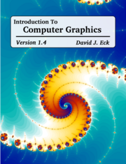

# 计算机图形学概论

版本 1.4，2023 年 8 月

作者：  [大卫·J·埃克](http://math.hws.edu/eck/)  ( <eck@hws.edu> )

----

欢迎阅读计算机图形学简介，这是一本免费的在线教科书，涵盖计算机图形学和计算机图形编程的基础知识。本书旨在用作一学期课程的教科书，该课程通常由计算机科学专业的本科生学习，并以至少两个学期的编程为先决条件。 1.4 版本添加了有关 WebGPU 的新章节。请参阅[前言](../cn/preface/)了解更多信息。

本书的网页包括实时交互式演示，需要现代网络浏览器，例如最新版本的 Chrome、Firefox、Safari 或 Edge。第 9 章示例需要支持 WebGPU 的浏览器。虽然本书主要是为在台式计算机上阅读而设计的，但大多数演示也应该适用于最新的移动设备，使用触摸屏而不是鼠标。

书中以这种风格显示或带下划线的 单词指的是术语表条目；单击该词可查看定义。

您可以下载此网站以在您自己的计算机上使用。还提供该教科书的 PDF 版本。下载链接可以在本页底部找到。

本书的网页包括实时交互式演示，需要现代网络浏览器，例如最新版本的 Chrome、Firefox、Safari 或 Edge。第 9 章示例需要支持 WebGPU 的浏览器。虽然本书主要是为在台式计算机上阅读而设计的，但大多数演示也应该适用于最新的移动设备，使用触摸屏而不是鼠标。

书中以这种风格显示或带下划线的 单词指的是术语表条目；单击该词可查看定义。

您可以下载此网站以在您自己的计算机上使用。还提供该教科书的 PDF 版本。下载链接可以在本页底部找到。

## 简短目录

- [完整目录](./contents-with-subsections/)
- [前言](./preface/)
- 第 1 章：[简介](./c1/index.md)
- 第 2 章：[二维图形](./c2/index.md)
- 第 3 章：[OpenGL 1.1：几何](./c3/index.md)
- 第 4 章：[OpenGL 1.1：灯光和材质](./c4/index.md)
- 第 5 章：[Three.js：3D 场景图 API](./c5/index.md)
- 第 6 章：[WebGL 简介](./c6/index.md)
- 第 7 章：[使用 WebGL 进行 3D 图形](./c7/index.md)
- 第 8 章：[超越基本 3D 图形](./c8/index.md)
- 第 9 章：[WebGPU 简介](./c9/index.md)
- 附录 A：[编程语言](./a1/index.md)
- 附录 B：[Blender：3D 建模程序](./a2/index.md)
- 附录 C：[用于 2D 图形的 Gimp 和 Inkscape](./a3/index.md)
- 附录 D：[示例程序的源代码](./source/index.md)
- 附录 E：[术语表](./glossary/index.md)
- [新闻](./news/index.md)

----

©2015–2023，大卫·J·埃克。本作品根据Creative Commons Attribution-Noncommercial-ShareAlike 4.0 License
获得许可。 （此许可允许您以未经修改的形式重新分发本书以用于非商业目的。它允许您出于非商业目的制作和分发修改版本，只要您包含原作者的归属，清楚地描述修改内容您制作并在与原始作品相同的许可下分发修改后的作品，作者可能会授予其用于其他用途的许可。有关完整的详细信息，请参阅许可 。） 本书的主页是： <http://math.hws.edu/graphicsbook/>

----

## 下载链接

- 完整网站下载：

    - <https://math.hws.edu/eck/cs424/downloads/graphicsbook-web-site.zip> — 此“zip”存档包含本教科书网站的完整副本。您可以在自己的网络服务器上发布网站的副本，也可以在自己的计算机上本地使用它。大小：26 兆字节。

- PDF下载：

    - <https://math.hws.edu/eck/cs424/downloads/graphicsbook-linked.pdf> — PDF 版本，包含用于导航的内部链接以及指向源代码文件和 PDF 中未包含的其他资源的外部链接。推荐用于屏幕阅读。 533 页。大小：6.0 兆字节。
    - <https://math.hws.edu/eck/cs424/downloads/graphicsbook.pdf> — 没有链接的 PDF 版本，更适合打印。 541 页。大小：5.6 兆字节。

## 印刷版

网站和链接的 PDF 是阅读本书的首选版本，但为了方便需要装订本的读者，我在按需发布网站lulu.com上提供了印刷版本。 （请注意，印刷版按 lulu.com 的成本出售，我不会从中赚取任何利润。）您可以通过此链接购买印刷版：<https://www.lulu.com/shop/david-eck/introduction-to-computer-graphics/paperback/product-1jzn2z5r.html>

----

- 1 August 2015, Version 1.0 released
- 28 January 2016, Version 1.1 released
- 6 January 2018, Version 1.2 released
- 1 August 2021, Version 1.3 released
- 20 December 2021, Version 1.3.1 released
- 1 August 2023, Version 1.4 released
